<figure class="cover">
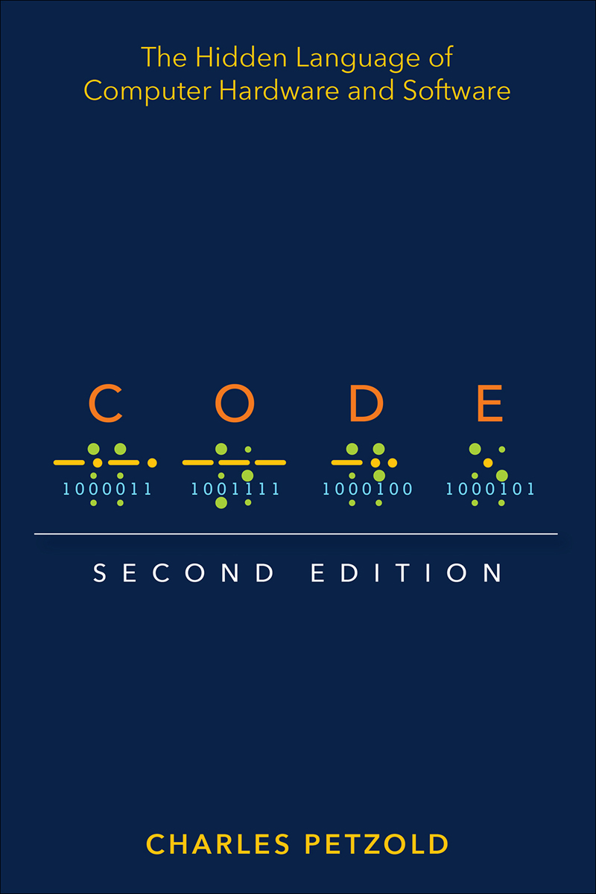
</figure>

# The Hidden Language of Computer Hardware and Software

<figure class="image">
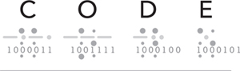
</figure>

Second Edition

Charles Petzold

**Code: The Hidden Language of Computer Hardware and Software: Second Edition**

Published with the authorization of Microsoft Corporation by: Pearson Education, Inc.

Copyright © 2023 by Charles Petzold.

All rights reserved. This publication is protected by copyright, and permission must be obtained from the publisher prior to any prohibited reproduction, storage in a retrieval system, or transmission in any form or by any means, electronic, mechanical, photocopying, recording, or likewise. For information regarding permissions, request forms, and the appropriate contacts within the Pearson Education Global Rights & Permissions Department, please visit [www.pearson.com/permissions](http://www.pearson.com/permissions).

No patent liability is assumed with respect to the use of the information contained herein. Although every precaution has been taken in the preparation of this book, the publisher and author assume no responsibility for errors or omissions. Nor is any liability assumed for damages resulting from the use of the information contained herein.

ISBN-13: 978-0-13-790910-0\
ISBN-10: 0-13-790910-1

Library of Congress Control Number: 2022939292

**`ScoutAutomatedPrintCode`**

Trademarks

Microsoft and the trademarks listed at <http://www.microsoft.com> on the "Trademarks" webpage are trademarks of the Microsoft group of companies. All other marks are property of their respective owners.

Warning and Disclaimer

Every effort has been made to make this book as complete and as accurate as possible, but no warranty or fitness is implied. The information provided is on an "as is" basis. The author, the publisher, and Microsoft Corporation shall have neither liability nor responsibility to any person or entity with respect to any loss or damages arising from the information contained in this book or from the use of the programs accompanying it.

Special Sales

For information about buying this title in bulk quantities, or for special sales opportunities (which may include electronic versions; custom cover designs; and content particular to your business, training goals, marketing focus, or branding interests), please contact our corporate sales department at <corpsales@pearsoned.com> or (800) 382-3419.

For government sales inquiries, please contact <governmentsales@pearsoned.com>.

For questions about sales outside the U.S., please contact <intlcs@pearson.com>.

## Contents

[About the Author](#about-the-author)


[Preface to the Second Edition](#preface-to-the-second-edition)


[Chapter One - Best Friends](#chapter-one---best-friends)


[Chapter Two - Codes and Combinations](#chapter-two---codes-and-combinations)


[Chapter Three - Braille and Binary Codes](#chapter-three---braille-and-binary-codes)


[Chapter Four - Anatomy of a Flashlight](#chapter-four---anatomy-of-a-flashlight)


[Chapter Five - Communicating Around Corners](#chapter-five---communicating-around-corners)


[Chapter Six - Logic with Switches](#chapter-six---logic-with-switches)


[Chapter Seven - Telegraphs and Relays](#chapter-seven---telegraphs-and-relays)


[Chapter Eight - Relays and Gates](#chapter-eight---relays-and-gates)


[Chapter Nine - Our Ten Digits](#chapter-nine---our-ten-digits)


[Chapter Ten - Alternative 10s](#chapter-ten---alternative-10s)


[Chapter Eleven - Bit by Bit by Bit](#chapter-eleven---bit-by-bit-by-bit)


[Chapter Twelve - Bytes and Hexadecimal](#chapter-twelve---bytes-and-hexadecimal)


[Chapter Thirteen - From ASCII to Unicode](#chapter-thirteen---from-ascii-to-unicode)


[Chapter Fourteen - Adding with Logic Gates](#chapter-fourteen---adding-with-logic-gates)


[Chapter Fifteen - Is This for Real?](#chapter-fifteen---is-this-for-real)


[Chapter Sixteen - But What About Subtraction?](#chapter-sixteen---but-what-about-subtraction)


[Chapter Seventeen - Feedback and Flip-Flops](#chapter-seventeen---feedback-and-flip-flops)


[Chapter Eighteen - Let's Build a Clock!](#chapter-eighteen---lets-build-a-clock)


[Chapter Nineteen - An Assemblage of Memory](#chapter-nineteen---an-assemblage-of-memory)


[Chapter Twenty - Automating Arithmetic](#chapter-twenty---automating-arithmetic)


[Chapter Twenty-One - The Arithmetic Logic Unit](#chapter-twenty-one---the-arithmetic-logic-unit)


[Chapter Twenty-Two - Registers and Busses](#chapter-twenty-two---registers-and-busses)


[Chapter Twenty-Three - CPU Control Signals](#chapter-twenty-three---cpu-control-signals)


[Chapter Twenty-Four - Loops, Jumps, and Calls](#chapter-twenty-four---loops-jumps-and-calls)


[Chapter Twenty-Five - Peripherals](#chapter-twenty-five---peripherals)


[Chapter Twenty-Six - The Operating System](#chapter-twenty-six---the-operating-system)


[Chapter Twenty-Seven - Coding](#chapter-twenty-seven---coding)


[Chapter Twenty-Eight - The World Brain](#chapter-twenty-eight---the-world-brain)


[Index](#index)


[Colophon](#colophon)


[Code Snippets](#code-snippets)


## About the Author

Charles Petzold is also the author of _The Annotated Turing: A Guided Tour through Alan Turing's Historic Paper on Computability and the Turing Machine_ (Wiley, 2008). He wrote a bunch of other books too, but they're mostly about programming applications for Microsoft Windows, and they're all obsolete now. He lives in New York City with his wife, historian and novelist Deirdre Sinnott, and two cats named Honey and Heidi. His website is [www.charlespetzold.com](http://www.charlespetzold.com).

<figure class="figure">

</figure>

## Preface to the Second Edition

The first edition of this book was published in September 1999. With much delight I realized that I had finally written a book that would never need revising! This was in stark contrast to my first book, which was about programming applications for Microsoft Windows. That one had already gone through five editions in just ten years. My second book on the OS/2 Presentation Manager (the what?) became obsolete much more quickly. But _Code_, I was certain, would last forever.

My original idea with _Code_ was to start with very simple concepts but slowly build to a very deep understanding of the workings of digital computers. Through this steady progression up the hill of knowledge, I would employ a minimum of metaphors, analogies, and silly illustrations, and instead use the language and symbols of the actual engineers who design and build computers. I also had a very clever trick up my sleeve: I would use ancient technologies to demonstrate universal principles under the assumption that these ancient technologies were already quite old and would never get older. It was as if I were writing a book about the internal combustion engine but based on the Ford Model T.

I still think that my approach was sound, but I was wrong in some of the details. As the years went by, the book started to show its age. Some of the cultural references became stale. Phones and fingers supplemented keyboards and mice. The internet certainly existed in 1999, but it was nothing like what it eventually became. Unicode---the text encoding that allows a uniform representation of all the world's languages as well as emojis---got less than a page in the first edition. And JavaScript, the programming language that has become pervasive on the web, wasn't mentioned at all.

Those problems would probably have been easy to fix, but there existed another aspect of the first edition that continued to bother me. I wanted to show the workings of an actual CPU---the central processing unit that forms the brain, heart, and soul of a computer---but the first edition didn't quite make it. I felt that I had gotten close to this crucial breakthrough but then I had given up. Readers didn't seem to complain, but to me it was a glaring flaw.

That deficiency has been corrected in this second edition. That's why it's some 70 pages longer. Yes, it's a longer journey, but if you come along with me through the pages of this second edition, we shall dive much deeper into the internals of the CPU. Whether this will be a more pleasurable experience for you or not, I do not know. If you feel like you're going to drown, please come up for air. But if you make it through [Chapter 24](#ch24.xhtml#ch24), you should feel quite proud, and you'll be pleased to know that the remainder of the book is a breeze.

### The Companion Website

<figure class="figure">

</figure>

The first edition of _Code_ used the color red in circuit diagrams to indicate the flow of electricity. The second edition does that as well, but the workings of these circuits are now also illustrated in a more graphically interactive way on a new website called [CodeHiddenLanguage.com](http://CodeHiddenLanguage.com).

{width="50" height="50"}

You'll be reminded of this website occasionally throughout the pages of this book, but we're also using a special icon, which you'll see in the margin of this paragraph. Hereafter, whenever you see that icon---usually accompanying a circuit diagram---you can explore the workings of the circuit on the website. (For those who crave the technical background, I programmed these web graphics in JavaScript using the HTML5 `canvas` element.)

The [CodeHiddenLanguage.com](http://CodeHiddenLanguage.com) website is entirely free to use. There is no paywall, and the only advertisement you'll see is for the book itself. In a few of the examples, the website uses cookies, but only to allow you to store some information on your computer. The website doesn't track you or do anything evil.

I will also be using the website for clarifications or corrections of material in the book.

### The People Responsible

The name of one of the people responsible for this book is on the cover; some others are no less indispensable but appear inside on the copyright and colophon pages.

In particular, I want to call out Executive Editor Haze Humbert, who approached me about the possibility of a second edition uncannily at precisely the right moment that I was ready to do it. I commenced work in January 2021, and she skillfully guided us through the ordeal, even as the book went several months past its deadline and when I needed some reassurance that I hadn't completely jumped the shark.

The project editor for the first edition was Kathleen Atkins, who also understood what I was trying to do and provided many pleasant hours of collaboration. My agent at that time was Claudette Moore, who also saw the value of such a book and convinced Microsoft Press to publish it.

The technical editor for the first edition was Jim Fuchs, who I remember catching a lot of embarrassing errors. For the second edition, technical reviewers Mark Seemann and Larry O'Brien also caught a few flubs and helped me make these pages better than they would have been otherwise.

I thought that I had figured out the difference between "compose" and "comprise" decades ago, but apparently I have not. Correcting errors like that was the invaluable contribution of copy editor Scout Festa. I have always relied on the kindness of copyeditors, who too often remain anonymous strangers but who battle indefatigably against imprecision and abuse of language.

Any errors that remain in this book are solely my responsibility.

I want to again thank my beta readers of the first edition: Sheryl Canter, Jan Eastlund, the late Peter Goldeman, Lynn Magalska, and Deirdre Sinnott (who later became my wife).

The numerous illustrations in the first edition were the work of the late Joel Panchot, who I understand was deservedly proud of his work on this book. Many of his illustrations remain, but the need for additional circuit diagrams inclined me to redo all the circuits for the sake of consistency. (More technical background: These illustrations were generated by a program I wrote in C# using the SkiaSharp graphics library to generate Scalable Vector Graphics files. Under the direction of Senior Content Producer Tracey Croom, the SVG files were converted into Encapsulated PostScript for setting up the pages using Adobe InDesign.)

### And Finally

I want to dedicate this book to the two most important women in my life.

My mother battled adversities that would have destroyed a lesser person. She provided a strong direction to my life without ever holding me back. We celebrated her 95th (and final) birthday during the writing of this book.

My wife, Deirdre Sinnott, has been essential and continues to make me proud of her achievements, her support, and her love.

And to the readers of the first edition, whose kind feedback has been extraordinarily gratifying.

_Charles Petzold_

_May 9, 2022_

## Pearson's Commitment to Diversity, Equity, and Inclusion

Pearson is dedicated to creating bias-free content that reflects the diversity of all learners. We embrace the many dimensions of diversity, including but not limited to race, ethnicity, gender, socioeconomic status, ability, age, sexual orientation, and religious or political beliefs.

Education is a powerful force for equity and change in our world. It has the potential to deliver opportunities that improve lives and enable economic mobility. As we work with authors to create content for every product and service, we acknowledge our responsibility to demonstrate inclusivity and incorporate diverse scholarship so that everyone can achieve their potential through learning. As the world's leading learning company, we have a duty to help drive change and live up to our purpose to help more people create a better life for themselves and to create a better world.

Our ambition is to purposefully contribute to a world where:

- Everyone has an equitable and lifelong opportunity to succeed through learning.

- Our educational products and services are inclusive and represent the rich diversity of learners.

- Our educational content accurately reflects the histories and experiences of the learners we serve.

- Our educational content prompts deeper discussions with learners and motivates them to expand their own learning (and worldview).

While we work hard to present unbiased content, we want to hear from you about any concerns or needs with this Pearson product so that we can investigate and address them.

- Please contact us with concerns about any potential bias at <https://www.pearson.com/report-bias.html>.

## Chapter One - Best Friends


You're 10 years old. Your best friend lives across the street. The windows of your bedrooms actually face each other. Every night, after your parents have declared bedtime at the usual indecently early hour, you still need to exchange thoughts, observations, secrets, gossip, jokes, and dreams. No one can blame you. The impulse to communicate is, after all, one of the most human of traits.

While the lights are still on in your bedrooms, you and your best friend can wave to each other from the windows and, using broad gestures and rudimentary body language, convey a thought or two. But more sophisticated exchanges seem difficult, and once the parents have decreed "Lights out!" stealthier solutions are necessary.

How to communicate? If you're lucky enough to have a cell phone at the age of 10, perhaps a secret call or silent texting might work. But what if your parents have a habit of confiscating cell phones at bedtime, and even shutting down the Wi-Fi? A bedroom without electronic communication is a very isolated room indeed.

What you and your best friend _do_ own, however, are flashlights. Everyone knows that flashlights were invented to let kids read books under the bed covers; flashlights also seem perfect for the job of communicating after dark. They're certainly quiet enough, and the light is highly directional and probably won't seep out under the bedroom door to alert your suspicious folks.

Can flashlights be made to speak? It's certainly worth a try. You learned how to write letters and words on paper in first grade, so transferring that knowledge to the flashlight seems reasonable. All you have to do is stand at your window and draw the letters with light. For an O, you turn on the flashlight, sweep a circle in the air, and turn off the switch. For an I, you make a vertical stroke. But, as you quickly discover, this method is a disaster. As you watch your friend's flashlight making swoops and lines in the air, you find that it's too hard to assemble the multiple strokes together in your head. These swirls and slashes of light are just not _precise_ enough.

Perhaps you once saw a movie in which a couple of sailors signaled to each other across the sea with blinking lights. In another movie, a spy wiggled a mirror to reflect the sunlight into a room where another spy lay captive. Maybe that's the solution. So you first devise a simple technique: Each letter of the alphabet corresponds to a series of flashlight blinks. An A is 1 blink, a B is 2 blinks, a C is 3 blinks, and so on to 26 blinks for Z. The word BAD is 2 blinks, 1 blink, and 4 blinks with little pauses between the letters so you won't mistake the 7 blinks for a G. You'll pause a bit longer between words.

This seems promising. The good news is that you no longer have to wave the flashlight in the air; all you need do is point and click. The bad news is that one of the first messages you try to send ("How are you?") turns out to require a grand total of 131 blinks of light! Moreover, you forgot about punctuation, so you don't know how many blinks correspond to a question mark.

But you're close. Surely, you think, somebody must have faced this problem before, and you're absolutely right. With a trip to the library or an internet search, you discover a marvelous invention known as Morse code. It's _exactly_ what you've been looking for, even though you must now relearn how to "write" all the letters of the alphabet.

Here's the difference: In the system you invented, every letter of the alphabet is a certain number of blinks, from 1 blink for A to 26 blinks for Z. In Morse code, you have two kinds of blinks---short blinks and long blinks. This makes Morse code more complicated, of course, but in actual use it turns out to be much more efficient. The sentence "How are you?" now requires only 32 blinks (some short, some long) rather than 131, and that's _including_ a code for the question mark.

When discussing how Morse code works, people don't talk about "short blinks" and "long blinks." Instead, they refer to "dots" and "dashes" because that's a convenient way of showing the codes on the printed page. In Morse code, every letter of the alphabet corresponds to a short series of dots and dashes, as you can see in the following table.

<figure class="image">

</figure>

Although Morse code has absolutely nothing to do with computers, becoming familiar with the nature of codes is an essential preliminary to achieving a deep understanding of the hidden languages and inner structures of computer hardware and software.

In this book, the word _code_ usually means a system for transferring information among people, between people and computers, or within computers themselves.

A code lets you communicate. Sometimes codes are secret, but most codes are not. Indeed, most codes must be well understood because they're the basis of human communication.

The sounds we make with our mouths to form words constitute a code that is intelligible to anyone who can hear our voices and understands the language that we speak. We call this code "the spoken word" or "speech."

Within deaf communities, various sign languages employ the hands and arms to form movements and gestures that convey individual letters of words or whole words and concepts. The two systems most common in North America are American Sign Language (ASL), which was developed in the early 19th century at the American School for the Deaf, and _Langue des signes Québécoise_ (LSQ), which is a variation of French sign language.

We use another code for words on paper or other media, called "the written word" or "text." Text can be written or keyed by hand and then printed in newspapers, magazines, and books or displayed digitally on a range of devices. In many languages, a strong correspondence exists between speech and text. In English, for example, letters and groups of letters correspond (more or less) to spoken sounds.

For people who are visually impaired, the written word can be replaced with Braille, which uses a system of raised dots that correspond to letters, groups of letters, and whole words. (I discuss Braille in more detail in [Chapter 3](#ch03.xhtml#ch03).)

When spoken words must be transcribed into text very quickly, stenography or shorthand is useful. In courts of law or for generating real-time closed captioning for televised news or sports programs, stenographers use a stenotype machine with a simplified keyboard incorporating its own codes corresponding to text.

We use a variety of different codes for communicating among ourselves because some codes are more convenient than others. The code of the spoken word can't be stored on paper, so the code of the written word is used instead. Silently exchanging information across a distance in the dark isn't possible with speech or paper. Hence, Morse code is a convenient alternative. A code is useful if it serves a purpose that no other code can.

As we shall see, various types of codes are also used in computers to store and communicate text, numbers, sounds, music, pictures, and movies, as well as instructions within the computer itself. Computers can't easily deal with human codes because computers can't precisely duplicate the ways in which human beings use their eyes, ears, mouths, and fingers. Teaching computers to speak is hard, and persuading them to understand speech is even harder.

But much progress has been made. Computers have now been enabled to capture, store, manipulate, and render many types of information used in human communication, including the visual (text and pictures), the aural (spoken words, sounds, and music), or a combination of both (animations and movies). All of these types of information require their own codes.

Even the table of Morse code you just saw is itself a code of sorts. The table shows that each letter is represented by a series of dots and dashes. Yet we can't actually send dots and dashes. When sending Morse code with a flashlight, the dots and dashes correspond to blinks.

Sending Morse code with a flashlight requires turning the flashlight switch on and off quickly for a dot, and somewhat longer for a dash. To send an A, for example, you turn the flashlight on and off quickly and then on and off not quite as quickly, followed by a pause before the next character. By convention, the length of a dash should be about three times that of a dot. The person on the receiving end sees the short blink and the long blink and knows that it's an A.

Pauses between the dots and dashes of Morse code are crucial. When you send an A, for example, the flashlight should be off between the dot and the dash for a period of time equal to about one dot. Letters in the same word are separated by longer pauses equal to about the length of one dash. For example, here's the Morse code for "hello," illustrating the pauses between the letters:

<figure class="image">

</figure>

Words are separated by an off period of about two dashes. Here's the code for "hi there":

<figure class="image">

</figure>

The lengths of time that the flashlight remains on and off aren't fixed. They're all relative to the length of a dot, which depends on how fast the flashlight switch can be triggered and also how quickly a Morse code sender can remember the code for a particular letter. A fast sender's dash might be the same length as a slow sender's dot. This little problem could make reading a Morse code message tough, but after a letter or two, the person on the receiving end can usually figure out what's a dot and what's a dash.

At first, the definition of Morse code---and by _definition_ I mean the correspondence of various sequences of dots and dashes to the letters of the alphabet---appears as random as the layout of a computer keyboard. On closer inspection, however, this is not entirely so. The simpler and shorter codes are assigned to the more frequently used letters of the alphabet, such as E and T. Scrabble players and _Wheel of Fortune_ fans might notice this right away. The less common letters, such as Q and Z (which get you 10 points in Scrabble and rarely appear in _Wheel of Fortune_ puzzles), have longer codes.

Almost everyone knows a little Morse code. Three dots, three dashes, and three dots represent SOS, the international distress signal. SOS isn't an abbreviation for anything---it's simply an easy-to-remember Morse code sequence. During the Second World War, the British Broadcasting Corporation prefaced some radio broadcasts with the beginning of Beethoven's Fifth Symphony---BAH, BAH, BAH, BAHMMMMM---which Beethoven didn't know at the time he composed the music would someday be the Morse code for V, for Victory.

One drawback of Morse code is that it doesn't differentiate between uppercase and lowercase letters. But in addition to representing letters, Morse code also includes codes for numbers by using a series of five dots and dashes:

<figure class="image">
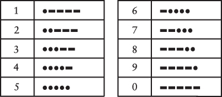
</figure>

These number codes, at least, are a little more orderly than the letter codes. Most punctuation marks use five, six, or seven dots and dashes:

<figure class="image">
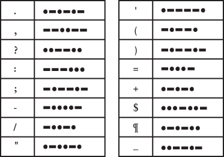
</figure>

Additional codes are defined for accented letters of some European languages and as shorthand sequences for special purposes. The SOS code is one such shorthand sequence: It's supposed to be sent continuously with only a one-dot pause between the three letters.

You'll find that it's much easier for you and your friend to send Morse code if you have a flashlight made specially for this purpose. In addition to the normal on-off slider switch, these flashlights also include a pushbutton switch that you simply press and release to turn the flashlight on and off. With some practice, you might be able to achieve a sending and receiving speed of 5 or 10 words per minute---still much slower than speech (which is somewhere in the 100-words-per-minute range), but surely adequate.

When finally you and your best friend memorize Morse code (for that's the only way you can become proficient at sending and receiving it), you can also use it vocally as a substitute for normal speech. For maximum speed, you pronounce a dot as _dih_ (or _dit_ for the last dot of a letter) and a dash as _dah_, for example _dih-dih-dih-dah_ for V. In the same way that Morse code reduces written language to dots and dashes, the spoken version of the code reduces speech to just two vowel sounds.

The key word here is _two_. Two types of blinks, two vowel sounds, two different anything, really, can with suitable combinations convey all types of information.

## Chapter Two - Codes and Combinations


Morse code was invented around 1837 by Samuel Finley Breese Morse (1791--1872), whom we shall meet more properly later in this book. It was further developed by others, most notably Alfred Vail (1807--1859), and it evolved into a couple of different versions. The system described in this book is more formally known as International Morse code.

The invention of Morse code goes hand in hand with the invention of the telegraph, which I'll also examine in more detail later in this book. Just as Morse code provides a good introduction to the nature of codes, the telegraph includes hardware that can mimic the workings of a computer.

Most people find Morse code easier to send than to receive. Even if you don't have Morse code memorized, you can simply use this table, which you saw in the previous chapter, conveniently arranged in alphabetical order:

<figure class="image">
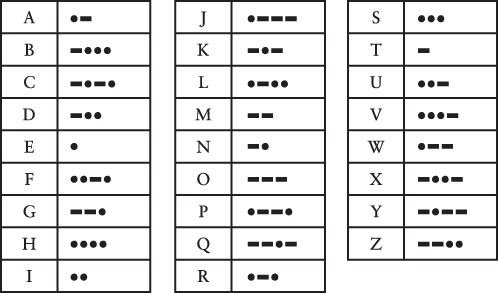
</figure>

Receiving Morse code and translating it back into words is considerably harder and more time consuming than sending because you must work backward to figure out the letter that corresponds to a particular coded sequence of dots and dashes. If you don't have the codes memorized and you receive a dash-dot-dash-dash, you have to scan through the table letter by letter before you finally discover that it's the letter Y.

The problem is that we have a table that provides this translation:

_Alphabetical letter_ → _Morse code dots and dashes_

But we don't have a table that lets us go backward:

_Morse code dots and dashes_ → _Letter of the alphabet_

In the early stages of learning Morse code, such a table would certainly be convenient. But it's not at all obvious how we could construct it. There's nothing in those dots and dashes that we can put into alphabetical order.

So let's forget about alphabetical order. Perhaps a better approach to organizing the codes might be to group them based on how many dots and dashes they have. For example, a Morse code sequence that contains just one dot or one dash can represent only two letters, which are E and T:

<figure class="image">
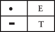
</figure>

A combination of exactly two dots or dashes provides four more letters---I, A, N, and M:

<figure class="image">
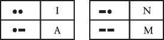
</figure>

A pattern of three dots or dashes gives us eight more letters:

<figure class="image">
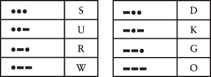
</figure>

And finally (if we want to stop this exercise before dealing with numbers and punctuation marks), sequences of four dots and dashes allow 16 more characters:

<figure class="image">
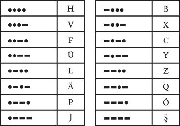
</figure>

Taken together, these four tables contain 2 plus 4 plus 8 plus 16 codes for a total of 30 letters, 4 more than are needed for the 26 letters of the Latin alphabet. For this reason, you'll notice that 4 of the codes in the last table are for accented letters: three with umlauts and one with a cedilla.

These four tables can certainly help when someone is sending you Morse code. After you receive a code for a particular letter, you know how many dots and dashes it has, and you can at least go to the right table to look it up. Each table is organized methodically starting with the all-dots code in the upper left and ending with the all-dashes code in the lower right.

Can you see a pattern in the _size_ of the four tables? Each table has twice as many codes as the table before it. This makes sense: Each table has all the codes in the previous table followed by a dot, and all the codes in the previous table followed by a dash.

We can summarize this interesting trend this way:

<figure class="image">
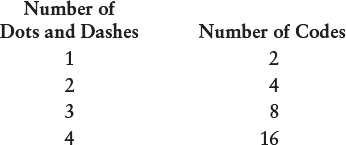
</figure>

Each of the four tables has twice as many codes as the table before it, so if the first table has 2 codes, the second table has 2 × 2 codes, and the third table has 2 × 2 × 2 codes. Here's another way to show that:

<figure class="image">
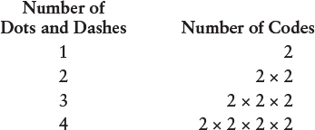
</figure>

Once we're dealing with a number multiplied by itself, we can start using exponents to show powers. For example, 2 × 2 × 2 × 2 can be written as 2^4^ (_2 to the 4th power_). The numbers 2, 4, 8, and 16 are all powers of 2 because you can calculate them by multiplying 2 by itself. The summary can also be shown like this:

<figure class="image">
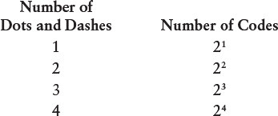
</figure>

This table has become very simple. The number of codes is simply 2 to the power of the number of dots and dashes:

$\text{number of codes} = 2^{\text{number of dots and dashes}}$

Powers of 2 tend to show up a lot in codes, and particularly in this book. You'll see another example in the next chapter.

To make the process of decoding Morse code even easier, you might want to draw something like this big treelike diagram shown here.

<figure class="image">
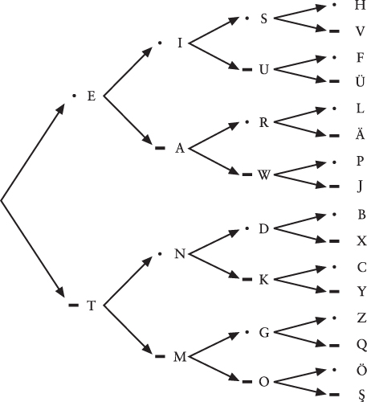
</figure>

This diagram shows the letters that result from each particular consecutive sequence of dots and dashes. To decode a particular sequence, follow the arrows from left to right. For example, suppose you want to know which letter corresponds to the code dot-dash-dot. Begin at the left and choose the dot; then continue moving right along the arrows and choose the dash and then another dot. The letter is R, shown next to the third dot.

If you think about it, constructing such a table was probably necessary for defining Morse code in the first place. First, it ensures that you don't make the silly mistake of using the same code for two different letters! Second, you're assured of using all the possible codes without making the sequences of dots and dashes unnecessarily long.

At the risk of extending this table beyond the limits of the printed page, we could continue it for codes of five dots and dashes. A sequence of exactly five dots and dashes gives us 32 (2 × 2 × 2 × 2 × 2, or 2^5^) additional codes. Normally that would be enough for the ten numbers and 16 punctuation symbols defined in Morse code, and indeed, the numbers are encoded with five dots and dashes. But many of the other codes that use a sequence of five dots and dashes represent accented letters rather than punctuation marks.

To include all the punctuation marks, the system must be expanded to six dots and dashes, which gives us 64 (2 × 2 × 2 × 2 × 2 × 2, or 2^6^) additional codes for a grand total of 2 + 4 + 8 + 16 + 32 + 64, or 126, characters. That's overkill for Morse code, which leaves many of these longer codes _undefined_, which used in this context refers to a code that doesn't stand for anything. If you were receiving Morse code and you got an undefined code, you could be pretty sure that somebody made a mistake.

Because we were clever enough to develop this little formula,

$\text{number of codes} = 2^{\text{number of dots and dashes}}$

we could continue figuring out how many codes we get from using longer sequences:

<figure class="image">
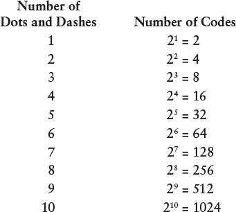
</figure>

Fortunately, we don't have to actually write out all the possible codes to determine how many there would be. All we have to do is multiply 2 by itself over and over again.

Morse code is said to be _binary_ (literally meaning _two by two_) because the components of the code consist of only two things---a dot and a dash. That's similar to a coin, which can land only on the head side or the tail side. Coins that are flipped ten times can have 1024 different sequences of heads and tails.

Combinations of binary objects (such as coins) and binary codes (such as Morse code) are always described by powers of two. Two is a very important number in this book.

## Chapter Three - Braille and Binary Codes


Samuel Morse wasn't the first person to successfully translate the letters of written language into an interpretable code. Nor was he the first person to be remembered more for the name of his code than for himself. That honor must go to a blind French teenager born some 18 years after Morse but who made his mark much more precociously. Little is known of his life, but what is known makes a compelling story.

Louis Braille was born in 1809 in Coupvray, France, just 25 miles east of Paris. His father was a harness maker. At the age of three---an age when young boys shouldn't be playing in their fathers' workshops---he accidentally stuck a pointed tool in his eye. The wound became infected, and the infection spread to his other eye, leaving him totally blind. Most people suffering such a fate in those days would have been doomed to a life of ignorance and poverty, but young Louis's intelligence and desire to learn were soon recognized. Through the intervention of the village priest and a schoolteacher, he first attended school in the village with the other children and then at the age of 10 was sent to the Royal Institution for Blind Youth in Paris.

<figure class="image">
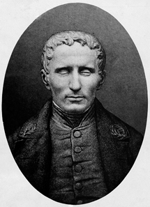
<p>ullstein bild Dtl/Getty Images</p>
</figure>

The major obstacle in the education of blind children is their inability to read printed books. Valentin Haüy (1745--1822), the founder of the Paris school, had invented a system of embossing letters on paper in a large rounded font that could be read by touch. But this system was very difficult to use, and only a few books had been produced using this method.

The sighted Haüy was stuck in a paradigm. To him, an A was an A was an A, and the letter A must look (or feel) like an A. (If given a flashlight to communicate, he might have tried drawing letters in the air, as we did before we discovered it didn't work very well.) Haüy probably didn't realize that a type of code quite different from embossed letters might be more appropriate for sightless people.

The origins of an alternative type of code came from an unexpected source. Charles Barbier, a captain of the French army, had by 1815 devised a system of writing later called _écriture nocturne_, or "night writing." This system used a pattern of raised dots on heavy paper and was intended for use by soldiers in passing notes to each other in the dark when quiet was necessary. The soldiers could poke these dots into the back of the paper using an awl-like stylus. The raised dots could then be read with the fingers.

Louis Braille became familiar with Barbier's system at the age of 12. He liked the use of raised dots, not only for the ease in reading with the fingers but also because it was easy to _write_. A student in the classroom equipped with paper and a stylus could actually take notes and read them back. Braille diligently worked to improve the system and within three years (at the age of 15) had come up with his own, the basics of which are still used today. For many years, the system was known only within the school, but it gradually made its way to the rest of the world. In 1835, Louis Braille contracted tuberculosis, which would eventually kill him shortly after his 43rd birthday, in 1852.

Today, various versions of the Braille system compete with audiobooks for providing blind people with access to the written word, but Braille remains an invaluable system and the only way to read for people who are both blind and deaf. In recent decades, Braille has become more familiar to the general public as elevators and automatic teller machines have used Braille to become more accessible.

What I'll do in this chapter is dissect the Braille code and show you how it works. You don't have to actually _learn_ Braille or memorize anything. The sole purpose of this exercise is to get some additional insight into the nature of codes.

In Braille, every symbol used in normal written language---specifically, letters, numbers, and punctuation marks---is encoded as one or more raised dots within a two-by-three cell. The dots of the cell are commonly numbered 1 through 6:

<figure class="image">
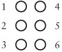
</figure>

Special typewriters were developed to emboss the Braille dots into the paper, and these days, computer-driven embossers do the job.

Because embossing in Braille just a couple of pages of this book would be prohibitively expensive, I've used a notation common for showing Braille on the printed page. In this notation, all six dots in the cell are shown. Large dots indicate the parts of the cell where the paper is raised. Small dots indicate the parts of the cell that are flat. For example, in the Braille character

<figure class="image">

</figure>

dots 1, 3, and 5 are raised and dots 2, 4, and 6 are not.

What should be interesting to us at this point is that the dots are _binary_. A particular dot is either flat or raised. That means we can apply what we've learned about Morse code and binary combinations to Braille. We know that there are six dots and that each dot can be either flat or raised, so the total number of combinations of six flat and raised dots is 2 × 2 × 2 × 2 × 2 × 2, or 2^6^, or 64.

Thus, the system of Braille is capable of representing 64 unique codes. Here they are---all 64 of them:

<figure class="image">

</figure>

It's not necessary for all 64 codes to be used in Braille, but 64 is definitely the upper limit imposed by the six-dot pattern.

To begin dissecting the code of Braille, let's look at the basic lowercase alphabet:

<figure class="image">
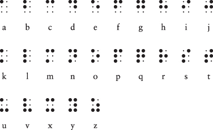
</figure>

For example, the phrase "you and me" in Braille looks like this:

<figure class="image">

</figure>

Notice that the cells for each letter within a word are separated by a little bit of space; a larger space (essentially a cell with no raised dots) is used between words.

This is the basis of Braille as Louis Braille devised it, or at least as it applies to the letters of the Latin alphabet. Louis Braille also devised codes for letters with accent marks, common in French. Notice that there's no code for _w_, which isn't used in classical French. (Don't worry. The letter will show up eventually.) At this point, only 25 of the 64 possible codes have been accounted for.

Upon close examination, you'll discover a pattern in the Braille codes for the 25 lowercase letters. The first row (letters _a_ through _j_) uses only the top four spots in the cell---dots 1, 2, 4, and 5. The second row (letters _k_ through _t_) duplicates the first row except that dot 3 is also raised. The third row (_u_ through _z_) is the same except that dots 3 and 6 are raised.

Louis Braille originally designed his system to be punched by hand. He knew this would likely not be very precise, so he cleverly defined the 25 lowercase letters in a way that reduces ambiguity. For example, of the 64 possible Braille codes, six have one raised dot. But only one of these is used for lowercase letters, specifically for the letter _a_. Four of the 64 codes have two adjacent vertical dots, but again only one is used, for the letter _b_. Three codes have two adjacent horizontal dots, but only one is used, for _c_.

What Louis Braille really defined is a collection of unique _shapes_ that could be shifted a little on the page and still mean the same thing. An _a_ is one raised dot, a _b_ is two vertically adjacent dots, a _c_ is two horizontally adjacent dots, and so on.

Codes are often susceptible to errors. An error that occurs as a code is written (for example, when a student of Braille marks dots in paper) is called an _encoding_ error. An error made reading the code is called a _decoding_ error. In addition, there can also be _transmission_ errors---for example, when a page containing Braille is damaged in some way.

More sophisticated codes often incorporate various types of built-in error correction. In this sense, Braille as originally defined by Louis Braille is a sophisticated coding system: It uses redundancy to allow a little imprecision in the punching and reading of the dots.

Since the days of Louis Braille, the Braille code has been expanded in various ways, including systems to notate mathematics and music. Currently the system used most often in published English text is called Grade 2 Braille. Grade 2 Braille uses many contractions in order to use less paper and to speed reading. For example, if letter codes appear by themselves, they stand for common words. The following three rows (including a "completed" third row) show these word codes:

<figure class="image">
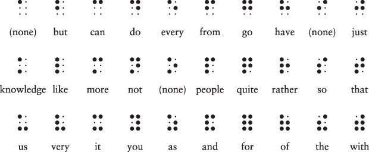
</figure>

Thus, the phrase "you and me" can be written in Grade 2 Braille as this:

<figure class="image">
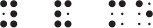
</figure>

So far, I've described 31 codes---the no-raised-dots space between words and the three rows of ten codes for letters and words. We're still not close to the 64 codes that are theoretically available. In Grade 2 Braille, as we shall see, nothing is wasted.

The codes for letters _a_ through _j_ can be combined with a raised dot 6. These are used mostly for contractions of letters within words and also include _w_ and another word abbreviation:

<figure class="image">
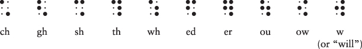
</figure>

For example, the word "about" can be written in Grade 2 Braille this way:

<figure class="image">

</figure>

The next step introduces some potential ambiguity absent in Louis Braille's original formulation. The codes for letters _a_ through _j_ can also be effectively lowered to use only dots 2, 3, 5, and 6. These codes represent some punctuation marks and contractions, depending on context:

<figure class="image">
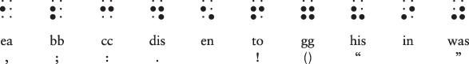
</figure>

The first four of these codes are the comma, semicolon, colon, and period. Notice that the same code is used for both left and right parentheses but that two different codes are used for open and closed quotation marks. Because these codes might be mistaken for the letters _a_ through _j_, they only make sense in a larger context amidst other letters.

We're up to 51 codes so far. The following six codes use various unused combinations of dots 3, 4, 5, and 6 to represent contractions and some additional punctuation:

<figure class="image">
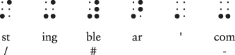
</figure>

The code for "ble" is very important because when it's not part of a word, it means that the codes that follow should be interpreted as numbers. These number codes are the same as those for letters _a_ through _j_:

<figure class="image">
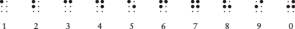
</figure>

Thus, this sequence of codes

<figure class="image">

</figure>

means the number 256.

If you've been keeping track, we need seven more codes to reach the maximum of 64. Here they are:

<figure class="image">

</figure>

The first (a raised dot 4) is used as an accent indicator. The others are used as prefixes for some contractions and also for some other purposes: When dots 4 and 6 are raised (the fifth code in this row), the code is a numeric decimal point or an emphasis indicator, depending on context. When dots 5 and 6 are raised (the sixth code), it's a letter indicator that counterbalances a number indicator.

And finally (if you've been wondering how Braille encodes capital letters) we have dot 6---the capital indicator. This indicates that the letter that follows is uppercase. For example, we can write the name of the original creator of this system as

<figure class="image">

</figure>

This sequence begins with a capital indicator, followed by the letter _l_, the contraction _ou_, the letters _i_ and _s_, a space, another capital indicator, and the letters _b_, _r_, _a_, _i_, _l_, _l_, and _e_. (In actual use, the name might be abbreviated even more by eliminating the last two letters, which aren't pronounced, or by spelling it "brl.")

In summary, we've seen how six binary elements (the dots) yield 64 possible codes and no more. It just so happens that many of these 64 codes perform double duty depending on their context. Of particular interest is the number indicator along with the letter indicator that undoes the number indicator. These codes alter the meaning of the codes that follow them---from letters to numbers and from numbers back to letters. Codes such as these are often called _precedence_, or _shift_, codes. They alter the meaning of all subsequent codes until the shift is undone.

A shift code is similar to holding down the Shift key on a computer keyboard, and it's so named because the equivalent key on old typewriters mechanically shifted the mechanism to type uppercase letters.

The Braille capital indicator means that the following letter (and only the following letter) should be uppercase rather than lowercase. A code such as this is known as an _escape_ code. Escape codes let you "escape" from the normal interpretation of a code and interpret it differently. Shift codes and escape codes are common when written languages are represented by binary codes, but they can introduce complexities because individual codes can't be interpreted on their own without knowing what codes came before.

As early as 1855, some advocates of Braille began expanding the system with another row of two dots. Eight-dot Braille has been used for some special purposes, such as music, stenography, and Japanese kanji characters. Because it increases the number of unique codes to 2^8^, or 256, it's also been convenient in some computer applications, allowing lowercase and uppercase letters, numbers, and punctuation to all have their own unique codes without the annoyances of shift and escape codes.

## Chapter Four - Anatomy of a Flashlight


Flashlights are useful for numerous tasks, of which reading under the covers and sending coded messages are only the two most obvious. The common household flashlight can also take center stage in an educational show-and-tell of the ubiquitous stuff known as electricity.

Electricity is an amazing phenomenon, managing to be pervasively useful while remaining largely mysterious, even to people who pretend to know how it works. Fortunately, we need to understand only a few basic concepts to comprehend how electricity is used inside computers.

The flashlight is certainly one of the simpler electrical appliances found in most homes. Disassemble a typical flashlight and you'll find that it consists of one or more batteries, a lightbulb, a switch, some metal pieces, and a case to hold everything together.

These days, most flashlights use light-emitting diodes (LEDs), but one advantage of more retro lightbulbs is that you can see inside the glass bulb:

<figure class="image">
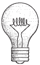
</figure>

This is known as an _incandescent_ lightbulb. Most Americans believe that the incandescent lightbulb was invented by Thomas Edison, while the British are quite certain that Joseph Swan was responsible. In truth, many other scientists and inventors made crucial strides before either Edison or Swan got involved.

Inside the bulb is a filament made of tungsten, which glows when electricity is applied. The bulb is filled with an inert gas to prevent the tungsten from burning up when it gets hot. The two ends of that filament are connected to thin wires that are attached to the tubular base of the lightbulb and to the tip at the bottom.

You can make your own no-frills flashlight by disposing of everything except the batteries and the lightbulb. You'll also need some short pieces of insulated wire (with the insulation stripped from the ends) and enough hands to hold everything together:

<figure class="image">
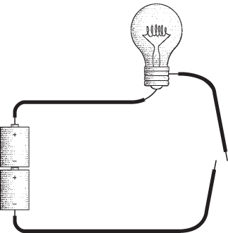
</figure>

Notice the two loose ends of the wires at the right of the diagram. That's our switch. Assuming that the batteries are good and the bulb isn't burned out, touching these loose ends together will turn on the light:

<figure class="image">
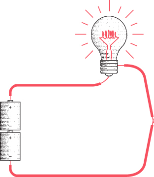
</figure>

This book uses the color red to indicate that electricity is flowing through the wires and lighting up the lightbulb.

What we've constructed here is a simple electrical circuit, and the first thing to notice is that a _circuit_ is a _circle_. The lightbulb will light up only if the path from the batteries to the wire to the bulb to the switch and back to the batteries is continuous. Any break in this circuit will cause the bulb to go out. The purpose of the switch is to control this process.

The circular nature of the electrical circuit suggests that something is moving around the circuit, perhaps like water flowing through pipes. The "water and pipes" analogy is quite common in explanations of how electricity works, but eventually it breaks down, as all analogies must. Electricity is like nothing else in this universe, and we must confront it on its own terms.

One approach to understanding the workings of electricity is called the _electron theory_, which explains electricity as the movement of electrons.

As we know, all matter---the stuff that we can see and feel (usually)---is made up of extremely small things called atoms. Every atom is composed of three types of particles; these are called neutrons, protons, and electrons. Sometimes an atom is depicted as a little solar system, with the neutrons and protons bound into a nucleus and the electrons spinning around the nucleus like planets around a sun, but that's an obsolete model.

The number of electrons in an atom is usually the same as the number of protons. But in certain circumstances, electrons can be dislodged from atoms. That's how electricity happens.

The words _electron_ and _electricity_ both derive from the ancient Greek word ηλεκτρον (_elektron_), which oddly is the Greek word for "amber," the glasslike hardened sap of trees. The reason for this unlikely derivation is that the ancient Greeks experimented with rubbing amber with wool, which produces something we now call _static_ electricity. Rubbing wool on amber causes the wool to pick up electrons from the amber. The wool winds up with more electrons than protons, and the amber ends up with fewer electrons than protons. In more modern experiments, carpeting picks up electrons from the soles of our shoes.

Protons and electrons have a characteristic called _charge_. Protons are said to have a positive (+) charge and electrons are said to have a negative (−) charge, but the symbols don't mean plus and minus in the arithmetical sense, or that protons have something that electrons don't. The + and − symbols indicate simply that protons and electrons are opposite in some way. This opposite characteristic manifests itself in how protons and electrons relate to each other.

Protons and electrons are happiest and most stable when they exist together in equal numbers. An imbalance of protons and electrons will attempt to correct itself. When the carpet picks up electrons from your shoes, eventually everything gets evened out when you touch something and feel a spark. That spark of static electricity is the movement of electrons by a rather circuitous route from the carpet through your body and back to your shoes.

Static electricity isn't limited to the little sparks produced by fingers touching doorknobs. During storms, the bottoms of clouds accumulate electrons while the tops of clouds lose electrons; eventually, the imbalance is evened out with a bolt of lightning. Lightning is a lot of electrons moving very quickly from one spot to another.

The electricity in the flashlight circuit is obviously much better mannered than a spark or a lightning bolt. The light burns steadily and continuously because the electrons aren't just jumping from one place to another. As one atom in the circuit loses an electron to another atom nearby, it grabs another electron from an adjacent atom, which grabs an electron from another adjacent atom, and so on. The electricity in the circuit is the passage of electrons from atom to atom.

This doesn't happen all by itself. We can't just wire up any old bunch of stuff and expect some electricity to happen. We need something to precipitate the movement of electrons around the circuit. Looking back at our diagram of the no-frills flashlight, we can safely assume that the thing that begins the movement of electricity is not the wires and not the lightbulb, so it's probably the batteries.

The batteries used in flashlights are usually cylindrical and labeled D, C, A, AA, or AAA depending on the size. The flat end of the battery is labeled with a minus sign (−); the other end has a little protrusion labeled with a plus sign (+).

Batteries generate electricity through a chemical reaction. The chemicals in batteries are chosen so that the reactions between them generate spare electrons on the side of the battery marked with a minus sign (called the negative terminal, or _anode_) and demand extra electrons on the other side of the battery (the positive terminal, or _cathode_). In this way, chemical energy is converted to electrical energy.

The batteries used in flashlights generate about 1.5 volts of electricity. I'll discuss what this means shortly.

The chemical reaction can't proceed unless there's some way that the extra electrons can be taken away from the negative terminal of the battery and delivered back to the positive terminal. This occurs with an electrical circuit that connects the two terminals. The electrons travel around this circuit in a counterclockwise direction:

<figure class="image">

</figure>

Electrons from the chemicals in the batteries might not so freely mingle with the electrons in the copper wires if not for a simple fact: All electrons, wherever they're found, are identical. There's nothing that distinguishes a copper electron from any other electron.

Notice that both batteries are facing the same direction. The positive end of the bottom battery takes electrons from the negative end of the top battery. It's as if the two batteries have been combined into one larger battery with a positive terminal at one end and a negative terminal at the other end. The combined battery is 3 volts rather than 1.5 volts.

If we turn one of the batteries upside down, the circuit won't work:

<figure class="image">
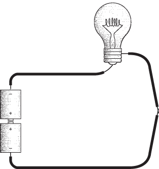
</figure>

The two positive ends of the battery need electrons for the chemical reactions, but there's no way electrons can get to them because they're attached to each other. If the two positive ends of the battery are connected, the two negative ends should be also:

<figure class="image">
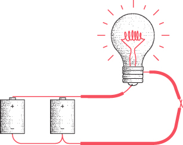
</figure>

This works. The batteries are said to be connected _in parallel_ rather than _in series_ as shown earlier. The combined voltage is 1.5 volts, which is the same as the voltage of each of the batteries. The light will probably still glow, but not as brightly as with two batteries in series. But the batteries will last twice as long.

We normally like to think of a battery as providing electricity to a circuit. But we've seen that we can also think of a circuit as providing a way for a battery's chemical reactions to take place. The circuit takes electrons away from the negative end of the battery and delivers them to the positive end of the battery. The reactions in the battery proceed until all the chemicals are exhausted, at which time you properly dispose of the battery or recharge it.

From the negative end of the battery to the positive end of the battery, the electrons flow through the wires and the lightbulb. But why do we need the wires? Can't the electricity just flow through the air? Well, yes and no. Yes, electricity can flow through air (particularly wet air), or else we wouldn't see lightning. But electricity doesn't flow through air very readily.

Some substances are significantly better than others for carrying electricity. The ability of an element to carry electricity is related to its subatomic structure. Electrons surround the nucleus in various levels, called shells. An atom that has just one electron in its outer shell can readily give up that electron, which is what's necessary to carry electricity. These substances are conducive to carrying electricity and thus are said to be _conductors_. The best conductors are copper, silver, and gold. It's no coincidence that these three elements are found in the same column of the periodic table. Copper is the most common substance for making wires.

The opposite of conductance is _resistance_. Some substances are more resistant to the passage of electricity than others, and these are known as _resistors_. If a substance has a very high resistance---meaning that it doesn't conduct electricity much at all---it's known as an _insulator_. Rubber and plastic are good insulators, which is why these substances are often used to coat wires. Cloth and wood are also good insulators, as is dry air. Just about anything will conduct electricity, however, if the voltage is high enough.

Copper has a very low resistance, but it still has _some_ resistance. The longer a wire, the higher its resistance. If you tried wiring a flashlight with wires that were miles long, the resistance in the wires would be so high that the flashlight wouldn't work.

The thicker a wire, the lower its resistance. This may be somewhat counterintuitive. You might imagine that a thick wire requires much more electricity to "fill it up." But actually the thickness of the wire makes available many more electrons to move through the wire.

I've mentioned voltage but haven't defined it. What does it mean when a battery has 1.5 volts? Actually, voltage---named after Count Alessandro Volta (1745--1827), who invented the first battery in 1800---is one of the more difficult concepts of elementary electricity. Voltage refers to a _potential_ for doing work. Voltage exists whether or not something is hooked up to a battery.

Consider a brick. Sitting on the floor, the brick has very little potential. Held in your hand four feet above the floor, the brick has more potential. All you need do to realize this potential is drop the brick. Held in your hand at the top of a tall building, the brick has much more potential. In all three cases, you're holding the brick and it's not doing anything, but the _potential_ is different.

A much easier concept in electricity is the notion of _current_. Current is related to the number of electrons actually zipping around the circuit. Current is measured in _amperes_, named after André-Marie Ampère (1775--1836), but often called just _amps_, as in "a 10-amp fuse." To get one amp of current, you need over 6 quintillion electrons flowing past a particular point per second. That's 6 followed by 18 zeros, or 6 billion billions.

The water-and-pipes analogy helps out here: Current is similar to the _amount_ of water flowing through a pipe. Voltage is similar to the water _pressure_. Resistance is similar to the width of a pipe---the smaller the pipe, the greater the resistance. So the more water pressure you have, the more water that flows through the pipe. The smaller the pipe, the less water that flows through it. The amount of water flowing through a pipe (the current) is directly proportional to the water pressure (the voltage) and inversely proportional to the skinniness of the pipe (the resistance).

In electricity, you can calculate how much current is flowing through a circuit if you know the voltage and the resistance. Resistance---the tendency of a substance to impede the flow of electrons---is measured in _ohms_, named after Georg Simon Ohm (1789--1854), who also proposed the famous Ohm's law. The law states

$\text{I} = \text{E}/\text{R}$

where I is traditionally used to represent current in amperes, E is used to represent voltage (it stands for _electromotive force_), and R is resistance.

For example, let's look at a battery that's just sitting around not connected to anything:

<figure class="image">
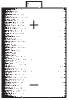
</figure>

The voltage, E, is 1.5. That's a potential for doing work. But because the positive and negative terminals are connected solely by air, the resistance (the symbol R) is very, very, very high, which means the current (I) equals 1.5 volts divided by a large number. This means that the current is just about zero.

Now let's connect the positive and negative terminals with a short piece of copper wire (and from here on, the insulation on the wires won't be shown):

<figure class="image">
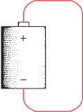
</figure>

This is known as a _short circuit_. The voltage is still 1.5, but the resistance is now very, very low. The current is 1.5 volts divided by a very small number. This means that the current will be very, very high. Lots and lots of electrons will be flowing through the wire. In reality, the actual current will be limited by the physical size of the battery. The battery will probably not be able to deliver such a high current, and the voltage will drop below 1.5 volts. If the battery is big enough, the wire will get hot because the electrical energy is being converted to heat. If the wire gets very hot, it will actually glow and might even melt.

Most circuits are somewhere between these two extremes. We can symbolize them like so:

<figure class="image">
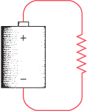
</figure>

The squiggly line is recognizable to electrical engineers as the symbol for a resistor. Here it means that the circuit has a resistance that is neither very low nor very high.

If a wire has a low resistance, it can get hot and start to glow. This is how an incandescent lightbulb works.

The filament commonly found in the incandescent bulbs in flashlights has a resistance of about 4 ohms. If the flashlight requires two batteries connected end to end, the current is 3 volts divided by 4 ohms, or 0.75 ampere, which can also be expressed as 750 milliamperes. This means that over 4.5 quintillion electrons are flowing through the lightbulb every second. The resistance of the filament causes the electrical energy to be converted into light and heat.

Another common measurement of electricity is the watt, named after James Watt (1736--1819), who is best known for his work on the steam engine. The watt is a measurement of power (P) and can be calculated as

$\text{P} = \text{E} \times \text{I}$

The 3 volts and 0.75 amp of our flashlight indicate that we're dealing with a 2.25-watt lightbulb. LEDs are generally replacing incandescent bulbs because they can deliver the same quantity of light with less heat and lower wattage. Electricity bills are based on watts, so lowering the wattage of lightbulbs saves both money and the environment.

We have now seemingly analyzed everything about the flashlight---the batteries, the wires, and the lightbulb. But we've forgotten the most important part!

Yes, the switch. The switch controls whether electricity is flowing in the circuit or not. When a switch allows electricity to flow, it is said to be _on_, or _closed_. An _off_, or _open_, switch doesn't allow electricity to flow. (The way we use the words _closed_ and _open_ for switches is opposite to the way we use them for a door. A closed door prevents anything from passing through it; a closed switch allows electricity to flow.)

Either the switch is closed or it's open. Either current flows or it doesn't. Either the lightbulb lights up or it doesn't.

Like the binary codes invented by Morse and Braille, this simple flashlight is either on or off. There's no in-between. This similarity between binary codes and simple electrical circuits is going to prove very useful in the chapters ahead.

## Chapter Five - Communicating Around Corners


You're 12 years old. One horrible day your best friend's family moves to another town. You email and text your friend now and then, but it's just not quite as thrilling as those late-night sessions with the flashlights blinking out Morse code. Your second-best friend, who lives in the house next door to yours, eventually becomes your new best friend. It's time to teach your new best friend some Morse code and get the late-night flashlights blinking again.

The problem is, your new best friend's bedroom window doesn't face your bedroom window. The houses are side by side, but the bedroom windows face the same direction. Unless you figure out a way to rig up a few mirrors outside, the flashlights are now inadequate for after-dark communication.

Or are they?

Maybe you have learned something about electricity by this time, so you decide to make your own flashlights out of batteries, lightbulbs, switches, and wires. In the first experiment, you wire up the batteries and switch in your bedroom. Two wires go out your window, hop across a fence, and go into your friend's bedroom, where they're connected to a lightbulb:

<figure class="image">
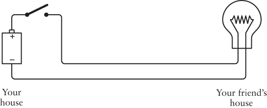
</figure>

From here on, the circuits will be portrayed more symbolically than realistically. Although I'm showing only one battery, you might actually be using two. In this and future diagrams, this will be an off (or open) switch:

<figure class="image">
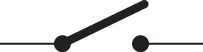
</figure>

And this will be the switch when it's on (or closed):

<figure class="image">

</figure>

The flashlight in this chapter works the same way as the one illustrated in the previous chapter, except that the wires connecting the components are now a bit longer. When you close the switch at your end, the light goes on at your friend's house:

<figure class="image">
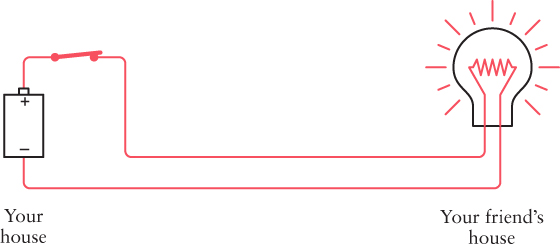
</figure>

Now you can send messages using Morse code.

Once you have one flashlight working, you can wire another long-distance flashlight so that your friend can send messages to you:

<figure class="image">
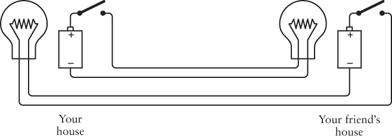
</figure>

Congratulations! You have just rigged up a bidirectional telegraph system. You'll notice that these are two identical circuits that are entirely independent of each other. In theory, you can be sending a message to your friend while your friend is sending a message to you, although it might be hard for your brain to read and send messages at the same time.

You also might be clever enough to discover that you don't need as many wires spanning the distance between the two houses. You can eliminate one of the four wires by wiring the configuration this way:

<figure class="image">
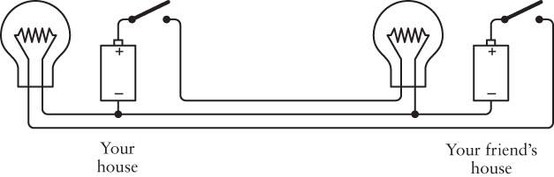
</figure>

In this book, wires that are connected to each other are symbolized by a little dot at the connection. This diagram has two such connections, one below the battery at your house and the other below the lightbulb at your friend's house.

Notice that the negative terminals of the two batteries are now connected. The two circular circuits (battery to switch to bulb to battery) still operate independently, even though they're now conjoined.

This connection between the two circuits is called a _common_. In this circuit the common extends between the two wire-connection dots, from the point where the leftmost lightbulb and battery are connected to the point where the rightmost lightbulb and battery are connected.

Let's take a closer look to assure ourselves that nothing funny is going on. First, when you close the switch on your side, the bulb in your friend's house lights up. The red wires show the flow of electricity in the circuit:

<figure class="image">
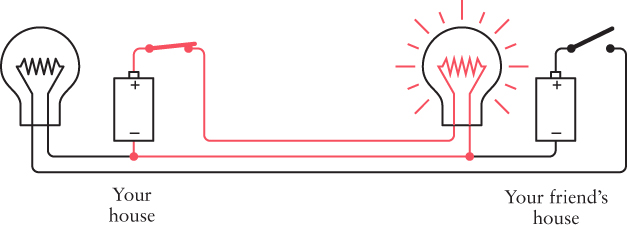
</figure>

No electricity flows in the other part of the circuit because there's no place for the electrons to go to complete a circuit.

When you're not sending but your friend is sending, the switch in your friend's house controls the lightbulb in your house. Once again, the red wires show how electricity flows in the circuit:

<figure class="image">
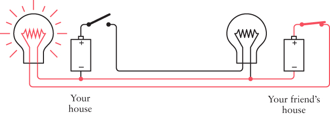
</figure>

When you and your friend both try to send at the same time, sometimes both switches are open, sometimes one switch is closed but the other is open, and sometimes both switches are closed. When both switches are closed, the flow of electricity in the circuit looks like this:

<figure class="image">
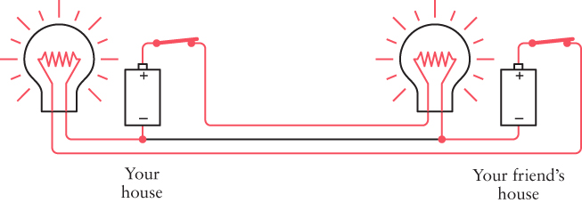
</figure>

Interestingly, no current flows through the common part of the circuit when both lightbulbs are lit.

By using a common to join two separate circuits into one circuit, we've reduced the electrical connection between the two houses from four wires to three wires and reduced our wire expenses by 25 percent.

If we had to string the wires for a very long distance, we might be tempted to reduce our wiring expenses even more by eliminating another wire. Unfortunately, this isn't feasible with 1.5-volt D cells and small lightbulbs. But if we were dealing with 100-volt batteries and much larger lightbulbs, it could certainly be done.

Here's the trick: Once you have established a common part of the circuit, you don't have to use wire for it. You can replace the wire with something else. And what you can replace it with is a giant sphere approximately 7900 miles in diameter made up of metal, rock, water, and organic material, most of which is dead. This giant sphere is known to us as Earth.

When I described good conductors in the previous chapter, I mentioned silver, copper, and gold, but not gravel and mulch. In truth, the earth isn't such a great conductor, although some kinds of earth (damp soil, for example) are better than others (such as dry sand). But one thing we learned about conductors is this: the larger the better. A very thick wire conducts much better than a very thin wire. That's where the earth excels. It's really, really, really big.

To use the earth as a conductor, you can't merely stick a little wire into the ground next to the tomato plants. You have to use something that maintains a substantial contact with the earth, and by that I mean a conductor with a large surface area. One good solution is a copper pole at least 8 feet long and ½ inch in diameter. That provides 150 square inches of contact with the earth. You can bury the pole into the ground with a sledgehammer and then connect a wire to it. Or, if the cold-water pipes in your home are made of copper and originate in the ground outside the house, you can connect a wire to the pipe.

An electrical contact with the earth is called an _earth_ in England and a _ground_ in America. A bit of confusion surrounds the word _ground_ because it's also often used to refer to a part of a circuit we've been calling the _common_. In this chapter, and until I indicate otherwise, a ground is a physical connection with the earth.

When people draw electrical circuits, they use this symbol to represent a ground:

<figure class="image">
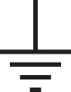
</figure>

Electricians use this symbol because they don't like to take the time to draw an 8-foot copper pole buried in the ground. A circuit connected to this is said to be "connected to ground" or "grounded" rather than the more verbose "connected to _the_ ground."

Let's see how this works. We began this chapter by looking at a one-way configuration like this:

<figure class="image">
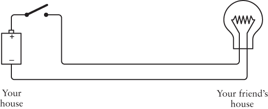
</figure>

If you were using high-voltage batteries and lightbulbs, you would need only one wire between your house and your friend's house because you could use the earth as one of the connectors:

<figure class="image">
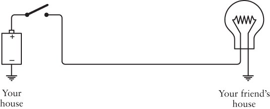
</figure>

When you turn the switch on, electricity flows like this:

<figure class="image">
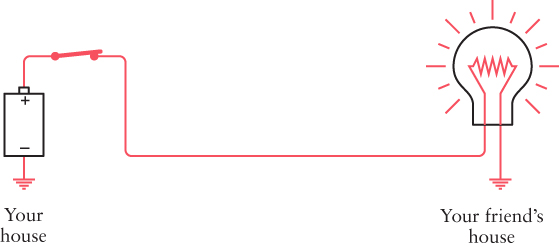
</figure>

The electrons come out of the earth at your friend's house, go through the lightbulb and wire, pass through the switch at your house, and then go into the positive terminal of the battery. Electrons from the negative terminal of the battery go into the earth.

You might also want to visualize electrons leaping from the 8-foot copper pole buried in the backyard of your house into the earth and then scurrying through the earth to get to the 8-foot copper pole buried in the backyard of your friend's house. But if you consider that the earth is performing this same function for many thousands of electrical circuits around the world, you might ask: How do the electrons know where to go? Well, obviously they don't. A different image of the earth seems much more appropriate.

Yes, the earth is a massive conductor of electricity, but it can also be viewed as both a source of electrons and a repository for electrons. _The earth is to electrons as an ocean is to drops of water_. The earth is a virtually limitless source of electrons and also a giant sea of electrons.

The earth, however, does have _some_ resistance. That's why we can't use the earth ground to reduce our wiring needs if we're playing around with 1.5-volt D cells and flashlight bulbs. The earth simply has too much resistance for low-voltage batteries.

You'll notice that the previous two diagrams include a battery with the negative terminal connected to the ground:

<figure class="image">

</figure>

I'm not going to draw this battery connected to the ground anymore. Instead, I'm going to use a shape like a capital letter V, which stands for _voltage_. A wire extending from a capital V is the same as a wire connected to the positive terminal of a battery whose negative terminal is connected to ground. The one-way lightbulb telegraph now looks like this:

<figure class="image">
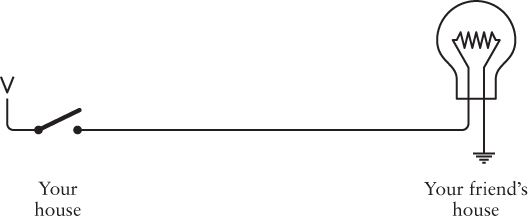
</figure>

The V stands for _voltage_, but in a sense, it could also stand for _vacuum_. You can think of the V as an electron vacuum cleaner and think of the ground as an ocean of electrons. The electron vacuum pulls the electrons from the earth through the circuit, doing work along the way (such as lighting a lightbulb).

The ground is sometimes also known as the point of _zero potential_. This means that no voltage is present. A voltage---as I explained earlier---is a potential for doing work, much as a brick suspended in the air is a potential source of energy. Zero potential is like a brick sitting on the ground---there's no place left for it to fall.

In [Chapter 4](#ch04.xhtml#ch04), one of the first things we noticed was that circuits are circles. Our new circuit doesn't look like a circle at all. It still is one, however. You could replace the V with a battery with the negative terminal connected to ground, and then you could draw a wire connecting all the places you see a ground symbol. You'd end up with the same diagram that we started with in this chapter.

So with the help of a couple of copper poles (or cold-water pipes), we can construct a two-way Morse code system with just two wires crossing the fence between your house and your friend's:

<figure class="image">
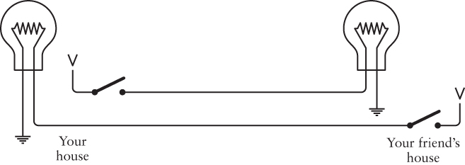
</figure>

This circuit is functionally the same as the configuration shown on pages [33](#ch05.xhtml#page_33) to [34](#ch05.xhtml#page_34), in which three wires crossed the fence between the houses, but it would only work with high-voltage batteries and lightbulbs.

In this chapter, we've taken an important step in the evolution of communications. Previously we had been able to communicate with Morse code but only in a straight line of sight and only as far as the beam from a flashlight would travel.

By using wires, not only have we constructed a system to communicate around corners beyond the line of sight, but we've freed ourselves of the limitation of distance. We can communicate over hundreds and thousands of miles just by stringing longer and longer wires.

Well, not exactly. Although copper is a very good conductor of electricity, it's not perfect. The longer the wires, the more resistance they have. The more resistance, the less current that flows. The less current, the dimmer the lightbulbs.

So how long exactly can we make the wires? That depends. Let's suppose you're using the original four-wire, bidirectional hookup without grounds and commons, and you're using flashlight batteries and lightbulbs. To keep your costs down, you may have initially purchased a roll of 100 feet of speaker wire, commonly used to connect speakers to high-end audio amplifiers. Speaker wire consists of a pair of two insulated wires conveniently stuck together, so it's a good choice for our telegraph system. If your bedroom and your friend's bedroom are less than 50 feet apart, this one roll of wire is all you need.

The thickness of wire is measured in _American Wire Gauge_, or _AWG_. The smaller the AWG number, the thicker the wire and also the less resistance it has. If you purchased 20-gauge speaker wire, the wire itself would have a diameter of about 0.032 inches and a resistance of about 10 ohms per 1000 feet, or 1 ohm for the 100-foot round-trip distance between the bedrooms.

That's not bad at all, but what if we strung the wire out for a mile? The total resistance of the wire would be more than 100 ohms. Recall from the last chapter that our lightbulb was only 4 ohms. From Ohm's law, we can easily calculate that the current through the circuit will no longer be 0.75 amp (3 volts divided by 4 ohms), but will now be less than 0.03 amp (3 volts divided by more than 100 ohms). Almost certainly, that won't be enough current to light the bulb.

Using thicker wire is a good solution, but that can be expensive. Ten-gauge wire is about 0.1 inch thick and has a resistance of only 1 ohm per 1000 feet, or 5 ohms per mile.

Another solution is to increase the voltage and use lightbulbs with a much higher resistance, such as the lightbulbs you use to light your home. The resistance of the wires will then affect the overall circuitry much less.

These are problems faced in the mid-19th century by the people who strung up the first telegraph systems across America and Europe. Regardless of the thickness of the wires and the high levels of voltage, telegraph wires simply couldn't be continued indefinitely. At most, the limit for a working system according to this scheme was a couple of hundred miles. That's nowhere close to spanning the thousands of miles between New York and California.

The solution to this problem---not for flashlights but for the clicking and clacking telegraphs of yesteryear---turns out to be a simple and humble device, but one from which entire computers can be built.

## Chapter Six - Logic with Switches


What is truth? Aristotle thought that logic had something to do with it. The collection of his teachings known as the _Organon_ (which dates from the fourth century BCE) is the earliest extensive writing on the subject of logic. To the ancient Greeks, logic was a means of analyzing language in the search for truth and thus was considered a form of philosophy. The basis of Aristotle's logic was the _syllogism_. The most famous syllogism (which isn't actually found in the works of Aristotle) is

_All men are mortal;_

_Socrates is a man;_

_Hence, Socrates is mortal._

In a syllogism, two premises are assumed to be correct, and from these a conclusion is deduced.

The mortality of Socrates might seem straightforward enough, but there are many varieties of syllogisms. For example, consider the following two premises, proposed by the 19th-century mathematician Charles Dodgson (also known as Lewis Carroll):

_All philosophers are logical;_

_An illogical man is always obstinate._

The conclusion---_Some obstinate persons are not philosophers_---isn't obvious at all. Notice the unexpected and disturbing appearance of the word _some_.

For over two thousand years, mathematicians wrestled with Aristotle's logic, attempting to corral it using mathematical symbols and operators. Prior to the 19th century, the only person to come close was Gottfried Wilhelm von Leibniz (1648--1716), who dabbled with logic early in life but then went on to other interests (such as independently inventing calculus at the same time as Isaac Newton).

And then came George Boole.

George Boole was born in England in 1815 into a world where the odds were certainly stacked against him. Because he was the son of a shoemaker and a former maid, Britain's rigid class structure would normally have prevented Boole from achieving anything much different from his ancestors. But aided by an inquisitive mind and his helpful father (who had strong interests in science, mathematics, and literature), young George gave himself the type of education that was normally the privilege of upper-class boys; his studies included Latin, Greek, and mathematics. As a result of his early papers on mathematics, in 1849 Boole was appointed the first Professor of Mathematics at Queen's College, Cork, in Ireland.

<figure class="image">
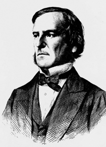
<p>Science &amp; Society Picture Library/Getty Images</p>
</figure>

Several mathematicians in the mid-1800s had been working on a mathematical definition of logic (most notably Augustus De Morgan), but it was Boole who had the real conceptual breakthrough, first in the short book _The Mathematical Analysis of Logic, Being an Essay Towards a Calculus of Deductive Reasoning_ (1847) and then in a much longer and more ambitious text, _An Investigation of the Laws of Thought on Which Are Founded the Mathematical Theories of Logic and Probabilities_ (1854), more conveniently referred to as _The Laws of Thought_. Boole died in 1864, at the age of 49, after hurrying to class in the rain and contracting pneumonia.

The title of Boole's 1854 book suggests an ambitious motivation: Boole believed that the human brain uses logic to think, so if we were to find a way to represent logic with mathematics, we would also have a mathematical description of how the brain works. But Boole's mathematics can be studied without necessarily buying in to his neuropsychology.

Boole invented a whole different kind of algebra that was eventually called Boolean algebra to distinguish it from conventional algebra.

In conventional algebra, letters are often used to stand for numbers. These are called _operands_, and they are combined in various ways with _operators_, most often + and ×. For example:

$\text{A} = 3 \times \left( \text{B} + 5 \right)$

When we do conventional algebra, we follow certain rules. These rules have probably become so ingrained in our practice that we no longer think of them as rules and might even forget their names. But rules indeed underlie all the workings of any form of mathematics.

The first rule is that addition and multiplication are _commutative_. That means we can switch around the symbols on each side of the operators:

$\begin{matrix}
{\text{A} + \text{B} = \text{B} + \text{A}} \\
{\text{A} \times \text{B} = \text{B} \times \text{A}}
\end{matrix}$

By contrast, subtraction and division are _not_ commutative.

Addition and multiplication are also _associative_, that is

$\begin{matrix}
{\text{A} + \left( \text{B} + \text{C} \right) = \left( \text{A} + \text{B} \right) + \text{C}} \\
{\text{A} \times \left( \text{B} \times \text{C} \right) = \left( \text{A} \times \text{B} \right) \times \text{C}}
\end{matrix}$

And finally, multiplication is said to be _distributive_ over addition:

$\text{A} \times \left( \text{B} + \text{C} \right) = \left( \text{A} \times \text{B} \right) + \left( \text{A} \times \text{C} \right)$

Another characteristic of conventional algebra is that it always deals with numbers, such as pounds of tofu or numbers of ducks or distances that a train travels or the seconds of a day.

It was Boole's genius to make algebra more abstract by divorcing it from concepts of number. In Boolean algebra, the operands refer not to numbers but instead to _classes_. A class is simply a group of things, similar to what in later times came to be known as a _set_.

Let's talk about cats. Cats can be either male or female. For convenience, we can use the letter M to refer to the class of male cats and F to refer to the class of female cats. Keep in mind that these two symbols do _not_ represent numbers of cats. The number of male and female cats can change by the minute as new cats are born and old cats (regrettably) pass away. The letters stand for classes of cats---cats with specific characteristics. Instead of referring to male cats, we can just say "M."

We can also use other letters to represent the color of the cats. For example, T can refer to the class of tan cats, B can be the class of black cats, W the class of white cats, and O the class of cats of all "other" colors---all cats not in the class T, B, or W.

Finally (at least as far as this example goes), cats can be either neutered or unneutered. Let's use the letter N to refer to the class of neutered cats and U for the class of unneutered cats.

In conventional (numeric) algebra, the operators + and × are used to indicate addition and multiplication. In Boolean algebra, the same + and × symbols are used, and here's where things might get confusing. Everybody knows how to add and multiply numbers in conventional algebra, but how do we add and multiply _classes?_

Well, we don't actually add and multiply in Boolean algebra. Instead, the + and × symbols mean something else entirely.

The + symbol in Boolean algebra means a _union_ of two classes. A union of two classes is everything in the first class combined with everything in the second class. For example, B + W represents the class of all cats that are either black or white.

The × symbol in Boolean algebra means an _intersection_ of two classes. An intersection of two classes is everything that is in _both_ the first class _and_ the second class. For example, F × T represents the class of all cats that are both female and tan. As in conventional algebra, we can write F × T as F·T or simply FT (which is what Boole preferred). You can think of the two letters as two adjectives strung together: "female tan" cats.

To avoid confusion between conventional algebra and Boolean algebra, sometimes the symbols ∪ and ∩ are used for union and intersection instead of + and ×. But part of Boole's liberating influence on mathematics was to make the use of familiar operators more abstract, so I've decided to stick with his decision not to introduce new symbols into his algebra.

The commutative, associative, and distributive rules all hold for Boolean algebra. What's more, in Boolean algebra the + operator is distributive over the × operator. This isn't true of conventional algebra:

$\text{W} + \left( \text{B} \times \text{F} \right) = \left( \text{W} + \text{B} \right) \times \left( \text{W} + \text{F} \right)$

The union of white cats and black female cats is the same as the intersection of two unions: the union of white cats and black cats, and the union of white cats and female cats. This is somewhat difficult to grasp, but it works.

Three more symbols are necessary to complete Boolean algebra. Two of these symbols might look like numbers, but they're really not because they're treated a little differently than numbers. The symbol 1 in Boolean algebra means "the universe"---that is, everything we're talking about. In this example, the symbol 1 means "the class of all cats." Thus,

$\text{M} + \text{F} = 1$

This means that the union of male cats and female cats is the class of all cats. Similarly, the union of tan cats and black cats and white cats and other colored cats is also the class of all cats:

$\text{T} + \text{B} + \text{W} + \text{O} = 1$

And you achieve the class of all cats this way, too:

$\text{N} + \text{U} = 1$

The 1 symbol can be used with a minus sign to indicate the universe _excluding_ something. For example,

$1 - \text{M}$

is the class of all cats except the male cats. The universe excluding all male cats is the same as the class of female cats:

${1 - \text{M}} = \text{F}$

The third symbol that we need is the 0 (zero), and in Boolean algebra the 0 means an empty class---a class of nothing. The empty class results when we take an intersection of two mutually exclusive classes---for example, cats that are both male and female:

$\text{F} \times \text{M} = 0$

Notice that the 1 and 0 symbols sometimes work the same way in Boolean algebra as in conventional algebra. For example, the intersection of all cats and female cats is the class of female cats:

$1 \times \text{F} = \text{F}$

The intersection of no cats and female cats is the class of no cats:

$0 \times \text{F} = 0$

The union of no cats and all female cats is the class of female cats:

$0 + \text{F} = \text{F}$

But sometimes the result doesn't look the same as in conventional algebra. For example, the union of all cats and female cats is the class of all cats:

$1 + \text{F} = 1$

This doesn't make much sense in conventional algebra.

Because F is the class of all female cats, and (1 − F) is the class of all cats that aren't female, the union of these two classes is 1:

$\text{F} + \left( 1 - \text{F} \right) = 1$

And the intersection of the two classes is 0:

$\text{F} \times \left( 1 - \text{F} \right) = 0$

Historically, this formulation represents an important concept in logic: It's called the _law of contradiction_, and it indicates that something can't be both itself and the opposite of itself.

Where Boolean algebra really looks different from conventional algebra is in a statement like this:

$\text{F} \times \text{F} = \text{F}$

The statement makes perfect sense in Boolean algebra: The intersection of female cats and female cats is still the class of female cats. But it sure wouldn't look quite right if F referred to a number. Boole considered

$\text{X}^{2} = \text{X}$

to be the single statement that differentiates his algebra from conventional algebra. Another Boolean statement that looks funny in terms of conventional algebra is this:

$\text{F} + \text{F} = \text{F}$

The union of female cats and female cats is still the class of female cats.

Boolean algebra provides a mathematical method for solving the syllogisms of Aristotle. Let's look at the first two-thirds of that famous syllogism again, but now using gender-neutral language:

_All persons are mortal;_

_Socrates is a person._

We'll use P to represent the class of all persons, M to represent the class of mortal things, and S to represent the class of Socrates. What does it mean to say that "all persons are mortal"? It means that the intersection of the class of all persons and the class of all mortal things is the class of all persons:

$\text{P} \times \text{M} = \text{P}$

It would be wrong to say that P × M = M, because the class of all mortal things includes cats, dogs, and elm trees.

Saying, "Socrates is a person" means that the intersection of the class containing Socrates (a very small class) and the class of all persons (a much larger class) is the class containing Socrates:

$\text{S} \times \text{P} = \text{S}$

Because we know from the first equation that P equals (P × M), we can substitute that into the second equation:

$\text{S} \times \left( \text{P} \times \text{M} \right) = \text{S}$

By the associative law, this is the same as

$\left( \text{S} \times \text{P} \right) \times \text{M} = \text{S}$

But we already know that (S × P) equals S, so we can simplify by using this substitution:

$\text{S} \times \text{M} = \text{S}$

And now we're finished. This formula tells us that the intersection of Socrates and the class of all mortal things is S, which means that Socrates is mortal. If we found instead that (S × M) equaled 0, we'd conclude that Socrates wasn't mortal. If we found that (S × M) equaled M, the conclusion would have to be that all mortals were Socrates!

Using Boolean algebra might seem like overkill for proving this obvious fact (particularly considering that Socrates demonstrated his mortality 2400 years ago), but Boolean algebra can also be used to determine whether something satisfies a certain set of criteria.

Perhaps one day you walk into a pet shop and say to the salesperson, "I want a male cat, neutered, either white or tan; or a female cat, neutered, any color but white; or I'll take any cat you have as long as it's black." And the salesperson says to you, "So you want a cat from the class of cats represented by the following expression:

$\left( \text{M} \times \text{N} \times \left( \text{W} + \text{T} \right) \right) + \left( \text{F} \times \text{N} \times \left( 1 - \text{W} \right) \right) + \text{B}$

Right?" And you say, "Yes! Exactly!"

In verifying that the salesperson is correct, you might want to represent the concepts of union and intersection using the words OR and AND. I'm capitalizing these words because the words normally represent concepts in English, but they can also represent operations in Boolean algebra. When you form a union of two classes, you're actually accepting things from the first class OR the second class. And when you form an intersection, you're accepting only those things in both the first class AND the second class. In addition, you can use the word NOT wherever you see a 1 followed by a minus sign. In summary,

- \+ (a union) can also mean OR.

- × (an intersection) can also mean AND.

- 1 − (the universe without something) means NOT.

So the expression can also be written like this:

$\left( \text{M AND N AND}\,\left( \text{W OR T} \right) \right)\text{~OR}\left( \text{F AND N AND}\left( \text{NOT W} \right) \right)\text{OR}\text{B}$

This is very nearly what you said. Notice how the parentheses clarify your intentions. You want a cat from one of three classes:

$\begin{matrix}
\begin{matrix}
\begin{matrix}
\left( \text{M AND N AND}\left( \text{W OR T} \right) \right) \\
\text{OR}
\end{matrix} \\
{\left( \text{F AND N AND}\left( \text{NOT W} \right) \right)}
\end{matrix} \\
\begin{matrix}
\begin{matrix}
\text{OR}
\end{matrix} \\
\text{B}
\end{matrix}
\end{matrix}$

With this formula written down, the salesperson can perform something called a _Boolean test_. This involves another variation of Boolean algebra, where the letters refer to _properties_ or _characteristics_ or _attributes_ of cats, and they can be assigned the numbers 0 or 1. The numeral 1 means Yes, True, this particular cat satisfies these criteria, while the numeral 0 means No, False, this cat doesn't satisfy these criteria.

First the salesperson brings out an unneutered tan male. Here's the expression of acceptable cats:

$\left( \text{M} \times \text{N} \times \left( \text{W} \times \text{T} \right) \right) + \left( \text{F} \times \text{N} \times \left( 1 - \text{W} \right) \right) + \text{B}$

And here's how it looks with 0s and 1s substituted:

$\left( 1 \times 0 \times (0 + 1) \right) + \left( 0 \times 0 \times (1 - 0) \right) + 0$

Notice that the only symbols assigned 1s are M and T because the cat is male and tan.

What we must do now is simplify this expression. If it simplifies to 1, the cat satisfies your criteria; if it simplifies to 0, the cat doesn't. While we're simplifying the expression, keep in mind that we're not really adding and multiplying, although generally we can pretend that we are. Most of the same rules apply when + means OR and × means AND. (Sometimes in modern texts the symbols ∧ and ∨ are used for AND and OR instead of × and +. But here's where the + and × signs perhaps ease the job, because the rules are similar to conventional algebra.)

When the × sign means AND, the possible results are

$\begin{matrix}
\begin{matrix}
\begin{matrix}
{0 \times 0 = 0} \\
{0 \times 1 = 0}
\end{matrix} \\
{1 \times 0 = 0}
\end{matrix} \\
{1 \times 1 = 1}
\end{matrix}$

In other words, the result is 1 only if both the left operand AND the right operand are 1. This operation works exactly the same way as regular multiplication, and it can be summarized in a little table. The operation is shown in the upper-left corner, and the possible combinations of operators are shown in the top row and the left column:

<figure class="image">

</figure>

When the + sign means OR, the possible results are

$\begin{matrix}
\begin{matrix}
\begin{matrix}
{0 + 0 = 0} \\
{0 + 1 = 1}
\end{matrix} \\
{1 + 0 = 1}
\end{matrix} \\
{1 + 1 = 1}
\end{matrix}$

The result is 1 if either the left operand OR the right operand is 1. This operation produces results very similar to those of regular addition, except that in this case 1 + 1 equals 1. (If a cat is tan or if a cat is tan means that it's tan.) The OR operation can be summarized in another little table:

<figure class="image">
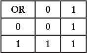
</figure>

We're ready to use these tables to calculate the result of the expression

$(1 \times 0 \times 1) + (0 \times 0 \times 1) + 0 = 0 + 0 + 0 = 0$

The result 0 means No, False, this kitty won't do.

Next the salesperson brings out a neutered white female. The original expression was

$\left( \text{M} \times \text{N} \times \left( \text{W} + \text{T} \right) \right) + \left( \text{F} \times \text{N} \times \left( 1 - \text{W} \right) \right) + \text{B}$

Substitute the 0s and 1s again:

$\left( 0 \times 1 \times (1 + 0) \right) + \left( 1 \times 1 \times (1 - 1) \right) + 0$

And simplify it:

${(0 \times 1 \times 1) + (1 \times 1 \times 0) + 0} = 0 + 0 + 0 = 0$

And another poor kitten must be rejected.

Next the salesperson brings out a neutered gray female. (Gray qualifies as an "other" color---not white or black or tan.) Here's the expression:

$\left( 0 \times 1 \times (0 + 0) \right) + \left( 1 \times 1 \times (1 - 0) \right) + 0$

Now simplify it:

${(0 \times 1 \times 0) + (1 \times 1 \times 1) + 0} = 0 + 1 + 0 = 1$

The final result 1 means Yes, True, a kitten has found a home. (And it was the cutest one too!)

Later that evening, when the kitten is curled up sleeping in your lap, you wonder whether you could have wired some switches and a lightbulb to help you determine whether particular kittens satisfied your criteria. (Yes, you are a strange kid.) Little do you realize that you're about to make a crucial conceptual breakthrough. You're about to perform some experiments that will unite the algebra of George Boole with electrical circuitry and thus make possible the design and construction of digital computers. But don't let that intimidate you.

To begin your experiment, you connect a lightbulb and battery as you would normally, but you use two switches instead of one:

{width="50" height="50"}

<figure class="image">
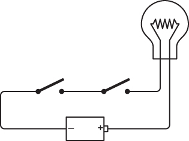
</figure>

The world icon in the outer margin indicates that an interactive version of the circuit is available on the website [CodeHiddenLanguage.com](http://CodeHiddenLanguage.com).

Switches connected in this way---one right after the other---are said to be wired _in series_. If you close the left switch, nothing happens:

<figure class="image">
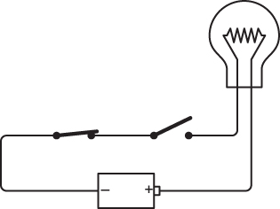
</figure>

Similarly, if you leave the left switch open and close the right switch, nothing happens. The lightbulb lights up only if both the left switch and the right switch are closed, as shown here:

<figure class="image">
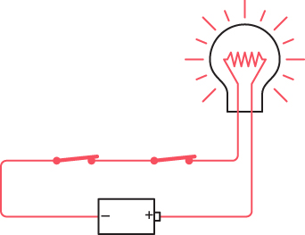
</figure>

The key word here is _and_. Both the left switch _and_ the right switch must be closed for the current to flow through the circuit.

This circuit is performing a little exercise in logic. In effect, the lightbulb is answering the question "Are both switches closed?" We can summarize the workings of this circuit in the following table:

<figure class="image">

</figure>

If you think of the switches and the lightbulb as Boolean operators, then these states can be assigned numbers of 0 and 1. A 0 can mean "switch is open" and a 1 can mean "switch is closed." A lightbulb has two states; a 0 can mean "lightbulb is not lit" and a 1 can mean "lightbulb is lit." Now let's simply rewrite the table:

<figure class="image">

</figure>

Notice that if we swap the left switch and the right switch, the results are the same. We really don't have to identify which switch is which. So the table can be rewritten to resemble the AND and OR tables that were shown earlier:

<figure class="image">

</figure>

And indeed, this is the _same_ as the AND table. Check it out:

<figure class="image">

</figure>

This simple circuit is actually performing an AND operation in Boolean algebra.

Now try connecting the two switches a little differently:

{width="50" height="50"}

<figure class="image">

</figure>

These switches are said to be connected _in parallel_. The difference between this and the preceding connection is that this lightbulb will light if you close the top switch:

<figure class="image">

</figure>

or close the bottom switch:

<figure class="image">

</figure>

or close both switches:

<figure class="image">

</figure>

The lightbulb lights if the top switch _or_ the bottom switch is closed. The key word here is _or_.

Again, the circuit is performing an exercise in logic. The lightbulb answers the question "Is either switch closed?" The following table summarizes how this circuit works:

<figure class="image">

</figure>

Again, using 0 to mean an open switch or an unlit lightbulb and 1 to mean a closed switch or a lit lightbulb, this table can be rewritten this way:

<figure class="image">

</figure>

Again, it doesn't matter if the two switches are swapped, so the table can also be rewritten like this:

<figure class="image">

</figure>

And you've already guessed that this is the same as the Boolean OR:

<figure class="image">

</figure>

This means that two switches in parallel are performing the equivalent of a Boolean OR operation.

When you originally entered the pet shop, you told the salesperson, "I want a male cat, neutered, either white or tan; or a female cat, neutered, any color but white; or I'll take any cat you have as long as it's black," and the salesperson developed this expression:

$\left( \text{M} \times \text{N} \times \left( \text{W} + \text{T} \right) \right) + {\left( \text{F} \times \text{N} \times \left( 1 - \text{W} \right) \right) +}\text{B}$

Now that you know that two switches wired in series perform a logical AND (which is represented by a × sign) and two switches in parallel perform a logical OR (which is represented by the + sign), you can wire up eight switches like so:

{width="50" height="50"}

<figure class="image">

</figure>

Each switch in this circuit is labeled with a letter---the same letters as in the Boolean expression. [W]{.overline} means NOT W and is an alternative way to write 1 − W. Indeed, if you go through the wiring diagram from left to right starting at the top and moving from top to bottom, you'll encounter the letters in the same order in which they appear in the expression. Each × sign in the expression corresponds to a point in the circuit where two switches (or groups of switches) are connected in series. Each + sign in the expression corresponds to a place in the circuit where two switches (or groups of switches) are connected in parallel.

As you'll recall, the salesperson first brought out an unneutered tan male. Close the appropriate switches:

<figure class="image">

</figure>

Although the M, T, and NOT [W]{.overline} switches are closed, we don't have a complete circuit to light up the lightbulb. Next the salesperson brought out a neutered white female:

<figure class="image">

</figure>

Again, the right switches aren't closed to complete a circuit. But finally, the salesperson brought out a neutered gray female:

<figure class="image">

</figure>

And that's enough to complete the circuit, light up the lightbulb, and indicate that the kitten satisfies all your criteria.

George Boole never wired such a circuit. He never had the thrill of seeing a Boolean expression realized in switches, wires, and lightbulbs. One obstacle, of course, was that the incandescent lightbulb wasn't invented until 15 years after Boole's death. But the telegraph had been invented ten years before the publication of Boole's _The Laws of Thought_, and an important part of the telegraph system was a simple device that could perform operations of logic with much more agility than mere switches could.

## Chapter Seven - Telegraphs and Relays


Samuel Finley Breese Morse was born in 1791 in Charlestown, Massachusetts, the town where the Battle of Bunker Hill was fought and which is now the northeast part of Boston. In the year of Morse's birth, the United States Constitution had been in effect just two years and George Washington was serving his first term as president. Catherine the Great ruled Russia. In France, the Revolution was still in progress, and Louis XVI and Marie Antoinette would be marched to the guillotine two years later. In 1791, Mozart completed _The Magic Flute_, his last opera, and died later that year at the age of 35, but the 20-year-old Beethoven was already being noticed.

Morse was educated at Yale and studied art in London. He became a successful portrait artist. His painting _General Lafayette_ (1825) hangs in New York's City Hall. Much more personal is his final painting: a portrait of his daughter Susan entitled _The Muse_, on display at the Metropolitan Museum of Art.

Morse was also an early photography buff. He learned how to make daguerreotype photographs from Louis Daguerre himself and created some of the first daguerreotypes in America. In 1840, he taught the process to the 17-year-old Mathew Brady, who with his colleagues would be responsible for creating the most memorable photographs of the Civil War, Abraham Lincoln, and Samuel Morse himself.

<figure class="image">

<p>ullstein bild Dtl/Getty Images</p>
</figure>

But these are just footnotes to an eclectic career. Samuel Morse is best remembered these days for his invention of the telegraph and the code that bears his name.

The instantaneous worldwide communication we've become accustomed to is a relatively recent development. In the early 1800s, you could communicate instantly and you could communicate over long distances, but you couldn't do both at the same time. Instantaneous communication was limited to as far as your voice could carry (no amplification available) or as far as the eye could see, aided perhaps by a telescope. Communication by letter over longer distances took time and involved horses, trains, or ships.

For decades prior to Morse's invention, many attempts were made to speed long-distance communication. Technically simple methods employed a relay system of men standing on hills waving flags in coded patterns known as _semaphore_. More complex solutions used large structures with movable arms but which did basically the same thing as men waving flags.

The idea of the telegraph (literally meaning "far writing") was certainly in the air in the early 1800s, and other inventors had taken a stab at it before Samuel Morse began experimenting in 1832. In principle, the idea behind an electrical telegraph was simple: You do something at one end of a wire that causes something to happen at the other end of the wire. This is exactly what we did in [Chapter 5](#ch05.xhtml#ch05) when we made a long-distance flashlight. However, Morse couldn't use a lightbulb as his signaling device because a practical one wouldn't be invented until 1879. Instead, Morse relied upon the phenomenon of _electromagnetism_.

The Danish physicist Hans Christian Ørsted is credited with the first systematic exploration of the relationship between electricity and magnetism. A paper he published in 1820 showed how an electrical current could deflect the magnetized needle of a compass. Thereafter, the phenomenon engaged the best minds of 19th century science, including Michael Faraday and James Clerk Maxwell, whose 1873 _Treatise on Electricity and Magnetism_ remains a classic of mathematical physics. But by that time, ingenious innovators such as Samuel Morse had long been using electromagnetism in their clever inventions. If you take an iron bar, wrap it with a couple of hundred turns of thin insulated wire, and then run a current through the wire, the iron bar becomes a magnet. It then attracts other pieces of iron and steel. Remove the current, and the iron bar loses its magnetism:

<figure class="image">

</figure>

This might look like a short circuit, but the wire wrapped around the iron bar is usually very thin, and there's enough of it to constitute sufficient electrical resistance.

The electromagnet is the foundation of the telegraph. Turning the switch on and off at one end causes the electromagnet to do something at the other end.

Morse's first telegraphs were actually more complex than the ones that later evolved. Morse felt that a telegraph system should actually write something on paper, or as computer users would later phrase it, "produce a hard copy." This wouldn't necessarily be words, of course, because that would be too complex. But _something_ should be written on paper, whether it be squiggles or dots and dashes. Notice that Morse was stuck in a paradigm that required paper and reading, much like Valentin Haüy's notion that books for blind people should use raised letters of the alphabet.

Although Samuel Morse notified the patent office in 1836 that he had invented a successful telegraph, it wasn't until 1843 that he was able to persuade Congress to fund a public demonstration of the device. The historic day was May 24, 1844, when a telegraph line rigged between Washington, D.C., and Baltimore, Maryland, successfully carried a biblical message from Numbers 23:23: "What hath God wrought!"---not a question but meaning "Look what God has done!"

The traditional telegraph "key" used for sending messages looks like this:

<figure class="image">

</figure>

Despite the fancy appearance, this is just a switch designed for maximum speed. The most comfortable way to use the key for long periods of time is to hold the handle between thumb, forefinger, and middle finger and tap it up and down. A short tap produces a Morse code dot, and a longer tap a Morse code dash.

At the other end of the wire was a receiver that was basically an electromagnet pulling a metal lever. Originally, the electromagnet controlled a pen. As the pen bounced up and down, it drew dots and dashes on paper from a roll that was slowly pulled by a wound-up spring. A person who could read Morse code would then transcribe the dots and dashes into letters and words.

Of course, we humans are a lazy species as well as an ingenious one, and telegraph operators soon discovered that they could transcribe the code simply by listening to the pen bounce up and down. The pen mechanism was eventually eliminated in favor of the traditional telegraph "sounder," which looked something like this:

<figure class="image">

</figure>

That bar at the top was normally held in the horizontal position by a weight or spring inside the vertical part at the left, but it could also pivot. When the telegraph key was pressed, the electromagnet pulled the pivotable bar down and it made a "click" noise. When the key was released, the bar sprang back to its normal position, making a "clack" noise. A fast "click-clack" was a dot; a slower "click...clack" was a dash.

The key, the sounder, a battery, and some wires can be connected just like the lightbulb telegraph in the preceding chapter:

<figure class="image">

</figure>

As we discovered, you don't need two wires connecting the two telegraph stations. One wire will suffice if the voltage is high enough and the earth provides the other half of the circuit.

As we did in [Chapter 5](#ch05.xhtml#ch05), we can replace the battery connected to the ground with a capital V. So the complete one-way setup looks something like this:

<figure class="image">

</figure>

Two-way communication simply requires another key and sounder. This is similar to what we did earlier.

The invention of the telegraph truly marks the beginning of modern communication. For the first time, people were able to communicate farther than the eye could see or the ear could hear and faster than a horse could gallop. That this invention used a binary code is all the more intriguing. In later forms of electrical and wireless communication, including the telephone, radio, and television, binary codes were abandoned, only to later make an appearance in computers, followed by many other binary codes in virtually all kinds of electronic media.

Morse's telegraph triumphed over other designs in part because it was tolerant of bad line conditions. If you strung a wire between a key and a sounder, it usually worked. Other telegraph systems were not quite as forgiving. But as I discussed in [Chapter 5](#ch05.xhtml#ch05), the longer a length of wire becomes, the more resistance it has to the flow of electricity. This was a major impediment to long-distance telegraphy. Although some telegraph lines used up to 300 volts and could work over a 300-mile length, wires couldn't be extended indefinitely.

One obvious solution is to have a relay system. Every couple of hundred miles or so, a person equipped with a sounder and a key could receive a message and resend it.

Now imagine that you have been hired by the telegraph company to be part of this relay system. They have put you in a little hut with a table and a chair somewhere between New York and California. A wire coming through the east window is connected to a sounder. Your telegraph key is connected to a battery and wire going out the west window. Your job is to receive messages originating in New York and to resend them, eventually to reach California. An identical configuration relays messages from California to New York.

At first, you prefer to receive an entire message before resending it. You write down the letters that correspond to the clicks of the sounder, and when the message is finished, you start sending it using your key. Eventually you get the knack of sending the message as you're hearing it without having to write the whole thing down. This saves time.

One day while resending a message, you look at the bar on the sounder bouncing up and down, and you look at your fingers bouncing the key up and down. You look at the sounder again, and at the key again, realize that the sounder is bouncing up and down the same way the key is bouncing up and down. So you go outside and pick up a little piece of wood and you use the wood and some string to physically connect the sounder and the key:

<figure class="image">

</figure>

Now it works by itself, and you can take the rest of the afternoon off and go fishing.

It's an interesting fantasy, but in reality Samuel Morse had understood the concept of this device early on. The device we've invented is called a _repeater_, or a _relay_. A relay is like a sounder in that an incoming current is used to power an electromagnet that pulls down a metal lever. The lever, however, is used as part of a switch connecting a battery to an outgoing wire. In this way, a weak incoming current is "amplified" to make a stronger outgoing current.

Drawn rather schematically, the relay looks like this:

<figure class="image">

</figure>

When an incoming current triggers the electromagnet, it pulls down a pivoting or flexible metal bar that acts like a switch to turn on an outgoing current:

<figure class="image">

</figure>

The words _In_ and _Out_ are descriptive of the way that the telegraph line comes through one window of your hut and leaves through the opposite window, but they can also serve as convenient abbreviations for _input_ and _output_. These are electrical _signals_. The signal labeled _In_ causes a change in the signal labeled _Out_. It's a cause and effect.

The relay is a remarkable device. It's a switch, surely, but a switch that's turned on and off not by human hands but by an electrical current. You could do amazing things with such devices. You could actually assemble much of a computer with them.

Yes, this relay thing is much too sweet an invention to leave sitting around the telegraphy museum. Let's grab one and stash it inside our jacket and walk quickly past the guards. An idea is brewing in our minds.

## Chapter Eight - Relays and Gates


Reduced to its essentials, a computer is a synthesis of Boolean algebra and electricity. The crucial components that embody this melding of math and hardware are known as _logic gates_. These gates are not unlike the familiar gates through which water or people pass. Logic gates perform simple operations in Boolean logic by blocking or letting through the flow of electrical current.

You'll recall that in [Chapter 6](#ch06.xhtml#ch06) you entered a pet shop and boldly announced, "I want a male cat, neutered, either white or tan; or a female cat, neutered, any color but white; or I'll take any cat you have as long as it's black." These criteria are summarized by the following Boolean expression:

$\left( \text{M} \times \text{N} \times \left( \text{W} + \text{T} \right) \right) + {\left( \text{F} \times \text{N} \times \left( 1 - \text{W} \right) \right) +}\text{B}$

This expression can be interactively realized in a circuit made up of switches, a battery, and a lightbulb:

<figure class="image">

</figure>

Such a circuit is sometimes called a _network_, except that nowadays that word is used much more often to refer to connected computers rather than to an assemblage of mere switches.

The circuit contains a combination of switches, some wired in series and some wired in parallel. Switches wired in series perform logical AND operations, symbolized in the Boolean expression with a × sign. Switches wired in parallel perform a logical OR operation corresponding to the + sign. Because this circuit is equivalent to a Boolean expression, if the Boolean expression can be simplified, the circuit can be as well.

Here's the expression that indicates the characteristics you want in a cat:

$\left( \text{M} \times \text{N} \times \left( \text{W} + \text{T} \right) \right) + {\left( \text{F} \times \text{N} \times \left( 1 - \text{W} \right) \right) +}\text{B}$

Let's try to simplify it. Using the commutative law, you can reorder the variables that are combined with the AND (×) signs and rewrite the expression this way:

$\left( \text{N} \times \text{M} \times \left( \text{W} + \text{T} \right) \right) + {\left( \text{N} \times \text{F} \times \left( 1 - \text{W} \right) \right) +}\text{B}$

In an attempt to clarify what I'm going to do here, I'll define two new symbols named X and Y:

$\begin{matrix}
{\text{X} = \text{M} \times \left( \text{W} + \text{T} \right)} \\
{\text{Y} = \text{F} \times \left( 1 - \text{W} \right)}
\end{matrix}$

Now the expression for the cat that you want can be written like this:

$\left( \text{N} \times \text{X} \right) + \left( \text{N} \times \text{Y} \right) + \text{B}$

After we're finished, we can put the X and Y expressions back in.

Notice that the N variable appears twice in the expression. Using the distributive law, the expression can be rewritten like this, with only one N:

$\left( \text{N} \times \left( \text{X} + \text{Y} \right) \right) + \text{B}$

Now let's put the X and Y expressions back in:

$\left( \text{N} \times \left( \left( \text{M} \times \left( \text{W} + \text{T} \right) \right. \right. \right) + \left( \text{F} \times {\left( 1 - \text{W} \right)))} \right) + \text{B}$

Due to the plethora of parentheses, this expression hardly looks simplified. But it has one less variable, which means one switch can be eliminated. Here's the revised version:

<figure class="image">

</figure>

Indeed, it's probably easier to see that this network is equivalent to the earlier one than to verify that the expressions are the same!

But there are still too many switches in this network. There are separate switches for Male and Female, and only one should be required, perhaps on (or closed) for Female and off (or open) for Male. Similarly, there are separate switches for White and Not White.

Let's make a control panel right now for choosing a cat. The control panel is simply five switches (much like the on/off switches you have on your walls for controlling your lights) and a lightbulb mounted in a panel:

<figure class="image">

</figure>

The switches are on (closed) when they're up, and off (open) when they're down. The first switch lets you select Female or Male; the second is Neutered or Unneutered. There are three switches for selecting color: Black, White, and Tan. Only one of these should be on at any time, or none of them to select an Other-colored cat.

In computer terminology, the panel of switches constitutes an _input device_. Input is information that controls how a circuit behaves, in this case describing the characteristics of an ideal kitty. The _output device_ is the lightbulb. This bulb lights up if the switches describe a satisfactory cat. The switches shown in the control panel are set for a female unneutered black cat. This satisfies your criteria, so the lightbulb is lit.

Now all we have to do is design a circuit that makes this control panel work.

In the previous chapter, you saw how devices called relays were crucial to the workings of the telegraph system. Over long distances, the wires connecting telegraph stations had a very high resistance. Some method was needed to receive a weak signal and resend an identical strong signal. The relay did this by using an electromagnet to control a switch, in effect, _amplifying_ a weak signal to create a strong signal.

At this moment, we're not interested in using the relay to amplify a weak signal. We're interested only in the idea of a relay being a switch that can be controlled by electricity rather than by fingers. Although relays were originally designed for telegraphs, they eventually became part of the switching circuits used in the vast network of the telephone system, and this is how their versatility became more apparent to imaginative electrical engineers.

Like switches, relays can be connected in series and in parallel as logic gates to perform simple tasks in logic. When I say that these logic gates perform _simple_ tasks in logic, I mean as simple as possible. Relays have an advantage over switches in that relays can be switched on and off by other relays rather than by fingers. This means that logic gates can be combined to perform more complex tasks, such as simple functions in arithmetic and, eventually, the workings of entire computers.

The discovery that relays could be used for performing Boolean operations is generally credited to computer pioneer Claude Elwood Shannon (1916--2001), whose famous 1938 M.I.T. master's thesis was entitled "A Symbolic Analysis of Relay and Switching Circuits," but a similar equivalence had been described a couple of years earlier by Japanese electrical engineer Akira Nakashima.

You can wire a relay with a switch, a lightbulb, and a couple of batteries like this:

<figure class="image">

</figure>

The switch at the left is open, and the lightbulb is off. When you close the switch, the battery at the left causes current to flow through the many turns of wire around the iron bar. The iron bar becomes magnetic and pulls down a flexible or pivoting metal contact that connects the circuit to turn on the lightbulb:

<figure class="image">

</figure>

When the electromagnet pulls the metal contact, the relay is said to be _triggered_. When the switch is turned off, the iron bar stops being magnetic, and the metal contact returns to its normal position.

This seems like a rather indirect route to light the bulb, and indeed it is. If we were interested only in lighting the bulb, we could dispense with the relay entirely. But we're not interested in lighting bulbs. We have a much more ambitious goal.

I'll be using relays a lot in this chapter (and then hardly at all after the logic gates have been built), so I want to simplify the diagram. We can eliminate some of the wires by using a ground and a capital V (for _voltage_) to represent the battery, as was done in [Chapters 5](#ch05.xhtml#ch05) and [7](#ch07.xhtml#ch07). In this case, the grounds simply represent a common connection; they don't need to be connected to the physical earth. Now the relay looks like this:

<figure class="image">

</figure>

When the switch is closed, a current flows between V and ground through the coils of the electromagnet. This causes the electromagnet to pull the flexible metal contact. That connects the circuit between V, the lightbulb, and ground. The bulb lights up:

<figure class="image">

</figure>

These diagrams of the relay show two voltage sources and two grounds, but in all the diagrams in this chapter, all the V's can be connected to one another, and all the grounds can be connected to one another.

More abstractly, the relay can be shown without the switch and lightbulb but labeled with _inputs_ and _outputs_:

<figure class="image">

</figure>

If a current is flowing through the input (for example, if a switch connects the input to V), the electromagnet is triggered, and the output has a voltage.

The input of a relay need not be a switch, and the output of a relay need not be a lightbulb. The output of one relay can be connected to the input of another relay, for example, like this:

<figure class="image">

</figure>

These relays are said to be _cascaded_. When you turn the switch on, the first relay is triggered, which then provides a voltage to the second relay. The second relay is triggered, and the light goes on:

<figure class="image">

</figure>

Connecting relays is the key to building logic gates.

Just as two switches can be connected in series, two relays can be connected in series:

{width="50" height="50"}

<figure class="image">

</figure>

Now there are two switches on two relays. The output of the top relay supplies a voltage to the second relay. As you can see, when both switches are open, the lightbulb isn't lit. We can try closing the top switch:

<figure class="image">

</figure>

Still the lightbulb doesn't light, because the bottom switch is still open and that relay isn't triggered. We can try opening the top switch and closing the bottom switch:

<figure class="image">

</figure>

The lightbulb is still not lit. The current can't reach the lightbulb because the first relay isn't triggered. The only way to get the bulb to light up is to close both switches:

<figure class="image">

</figure>

Now both relays are triggered, and current can flow between V, the lightbulb, and ground.

Like the two switches wired in series that you saw in [Chapter 6](#ch06.xhtml#ch06), these two relays are performing a little exercise in logic. The bulb lights up only if both relays are triggered. These two relays wired in series are known as an _AND gate_ because it is performing a Boolean AND operation.

To avoid excessive drawing, electrical engineers have a special symbol for an AND gate. That symbol looks like this:

<figure class="image">

</figure>

This is the first of six basic logic gates. The AND gate has two inputs and one output. You'll often see the AND gate drawn with the inputs at the left and the output at the right. That's because people who are accustomed to reading from left to right prefer reading electrical diagrams from left to right. But the AND gate can just as well be drawn with the inputs at the top, the right, or the bottom.

The previous diagram with two relays connected in series is symbolized more succinctly like this:

<figure class="image">

</figure>

Notice that this symbol for the AND gate not only takes the place of two relays wired in series, but it also implies that the top relay is connected to a voltage and that both relays are connected to ground. Again, the lightbulb lights up only if both the top switch _and_ the bottom switch are closed. That's why it's called an _AND_ gate.

If we think of the absence of a voltage as a 0, and the presence of a voltage as a 1, the output of the AND gate is dependent on inputs like this:

<figure class="image">

</figure>

As with the two switches wired in series, the AND gate can also be described in this little table:

<figure class="image">

</figure>

The inputs of the AND gate don't necessarily have to be connected to switches, and the output doesn't necessarily have to be connected to a lightbulb. The output of one AND gate can be an input to a second AND gate, like this:

<figure class="image">

</figure>

This bulb will light up only if all three switches are closed. Only if the top two switches are closed will the output of the first AND gate output a voltage, and only if the third switch is also closed will the second AND gate output a voltage.

This configuration can also be expressed by this symbol:

<figure class="image">

</figure>

It's called a 3-input AND gate. The output is 1 only if all the inputs are 1. You can also create AND gates with many more inputs.

The next logic gate requires two relays that are wired in parallel, like this:

{width="50" height="50"}

<figure class="image">

</figure>

Notice that the outputs of the two relays are connected to each other. This connected output then provides power for the lightbulb. Either one of the two relays is enough to light the bulb. For example, if we close the top switch, the bulb lights up. The bulb is getting power from the top relay:

<figure class="image">

</figure>

Similarly, if we leave the top switch open but close the bottom switch, the bulb lights up:

<figure class="image">

</figure>

The bulb also lights if both switches are closed:

<figure class="image">

</figure>

We've made a circuit in which the bulb lights up if the top switch _or_ the bottom switch is closed. The key word here is _or_, so this is called the _OR gate_. Electrical engineers use a symbol for the OR gate that looks like this:

<figure class="image">

</figure>

It's somewhat similar to the symbol for the AND gate except that the input side is rounded, much like the O in OR. (That might help you to remember which is which.)

The output of the OR gate supplies a voltage if either of the two inputs has a voltage. Again, if we say that the absence of a voltage is 0 and the presence of a voltage is 1, the OR gate has four possible states:

<figure class="image">

</figure>

The output of the OR gate can be summarized the same way as the AND gate:

<figure class="image">

</figure>

OR gates can also have more than two inputs. The output of such a gate is 1 if any of the inputs are 1; the output is 0 only if all the outputs are 0.

The relays that I've been showing you here are called _double-throw_ relays. At rest, the pivoting metal bar at the top is touching one contact, and when the electromagnet pulls it, it hits another contact. The lower contact is called the _normally open_ output. That's the one we've been using, but we could just as well use the upper contact, called _normally closed_. When we use this upper contact, the output of the relay is reversed. The lightbulb is on when the input switch is open:

<figure class="image">

</figure>

When the input switch is closed, the bulb goes out:

<figure class="image">

</figure>

A single relay wired in this way is called an _inverter_. It's represented by a special symbol that looks like this:

<figure class="image">

</figure>

It's called an inverter because it inverts 0 (no voltage) to 1 (voltage) and vice versa:

<figure class="image">

</figure>

This is a realization of the Boolean NOT operator.

Sometimes when people see the top inverter here, they ask, "How can there be a voltage at the output if there's no voltage at the input? Where does that voltage come from?" Keep in mind that the inverter is actually a relay that is connected to a voltage.

With the inverter, the AND gate, and the OR gate, we can start wiring the control panel to automate a choice of the ideal kitty. Here it is again:

<figure class="image">

</figure>

Let's begin with the switches. The first switch is closed for female and open for male. Thus we can generate two signals that we'll call F and M, like this:

<figure class="image">

</figure>

When F is 1, M will be 0, and vice versa. Similarly, the second switch is closed for a neutered cat and open for an unneutered cat:

<figure class="image">

</figure>

The other three switches select the color: black, white, or tan. Here are all three wired to a voltage:

<figure class="image">

</figure>

Some simple rules govern how you can connect gates and inverters: The output of one gate (or inverter) can be the input to one or more other gates (or inverters). But do not connect the outputs of two or more gates (or inverters) to one another.

The simplified version of the cat-selection expression was

$\left( \text{N} \times \left( \left( \text{M} \times \left( \text{W} + \text{T} \right) \right. \right. \right) + \left( \text{F} \times {\left( 1 - \text{W} \right)))} \right) + \text{B}$

For every + sign in this expression, there must be an OR gate in the circuit. For every × sign, there must be an AND gate.

{width="50" height="50"}

<figure class="image">

</figure>

The symbols down the left side of the circuit diagram are in the same order as they appear in the expression. These signals come from the previous three illustrations. Notice the use of another inverter for the (1 − W) part of the expression.

Now you might say, "That's a heck of a lot of relays," and yes, that's true. There are two relays in every AND gate and OR gate, and one relay for each inverter. But I'm afraid you'll be seeing a lot more relays in the chapters ahead. Just be thankful you don't actually have to buy them and wire them at home. (Unless you want to.)

I mentioned earlier that there are six standard logic gates. You've already seen three, and now it's time for the others. The first two use the normally closed output of the relay that is used for the inverter. This output has a voltage present when the relay is untriggered. For example, in this configuration the output from one relay supplies power to a second relay. With both inputs off, the lightbulb is on:

{width="50" height="50"}

<figure class="image">

</figure>

If the top switch is closed, the bulb goes off:

<figure class="image">

</figure>

The light goes off because power is no longer being supplied to the second relay. Similarly, if the top switch is open but the bottom switch is closed, the light is also off:

<figure class="image">

</figure>

And if both switches are closed, the lightbulb is off:

<figure class="image">

</figure>

This behavior is precisely the opposite of what happens with the OR gate. It's called _NOT OR_ or, more concisely, _NOR_. This is the symbol for the NOR gate:

<figure class="image">

</figure>

It's the same as the symbol for the OR except with a little circle at the output. The circle means _invert_. The NOR is the same as an OR gate followed by an inverter.

<figure class="image">

</figure>

The output of the NOR gate is shown in the following table:

<figure class="image">

</figure>

This table shows results opposite those of the OR gate, which are 1 if either of the two inputs is 1 and 0 only if both inputs are 0.

Yet another way to wire two relays is shown here:

{width="50" height="50"}

<figure class="image">

</figure>

In this case, the two outputs are connected, which is similar to the OR configuration but using the other contacts. The lightbulb is on when both switches are open.

The lightbulb remains on when only the top switch is closed because the bulb can get power from the bottom relay:

<figure class="image">

</figure>

Similarly, the lightbulb remains on when only the bottom switch is closed because it gets power from the top relay:

<figure class="image">

</figure>

Only when both switches are closed does the lightbulb go off:

<figure class="image">

</figure>

This behavior is exactly opposite that of the AND gate. This is called _NOT AND_ or, more concisely, _NAND_. Unlike NOR, the word NAND was coined specifically to describe this type of logic. The word dates from 1958.

The NAND gate is drawn just like the AND gate but with a circle at the output, meaning the output is the inverse of the AND gate:

<figure class="image">

</figure>

The NAND gate has the following behavior:

<figure class="image">

</figure>

You'll recall that the output of the AND gate is 1 only if both inputs are 1; otherwise, the output is 0. The output of the NAND gate is opposite that.

At this point, we've looked at four different ways of wiring relays that have two inputs and one output. Each configuration behaves in a slightly different way. To avoid drawing and redrawing the relays, we've called them logic gates and decided to use the same symbols to represent them that are used by electrical engineers. The output of the particular logic gate depends on the input, which is summarized here:

{width="50" height="50"}

<figure class="image">

</figure>

The inverter looks like this:

<figure class="image">

</figure>

It inverts a signal from 0 to 1 or from 1 to 0.

Completing this array of tools is just a regular old relay:

<figure class="image">

</figure>

This is called a _buffer_, and this is the symbol for it:

<figure class="image">

</figure>

It's the same symbol as the inverter but without the little circle. The buffer is remarkable for not doing much. The output of the buffer is the same as the input:

<figure class="image">

</figure>

But you can use a buffer when an input signal is weak. You'll recall that this was the reason relays were invented for the telegraph many years ago. In real-life logic circuits, sometimes one output must serve as many inputs. This is known as _fan out_, and it can result in a lessening of the power available to each output. Buffers can help boost that power. Or a buffer can be used to slightly delay a signal. This works because the relay requires a little time---some fraction of a second---to be triggered.

From here on in this book, you'll see very few drawings of relays. Instead, the circuits that follow will be built from buffers, inverters, the four basic two-input logic gates, and more sophisticated circuits built from these logic gates. All these other components are made from relays, of course, but we don't actually have to look at the relays anymore.

Toward the beginning of this chapter, a little control panel was shown that let you select an ideal kitten. It had switches for black, white, and tan cats, but it omitted a switch for other colors---any cat that is not black or white or tan. But that's a signal that can be created using three inverters and a three-input AND gate:

<figure class="image">

</figure>

Three inputs are inverted and become inputs to an AND gate. Only when B, W, and T are all 0 will all the inputs to the AND gate be 1, causing the output to be 1.

Sometimes a configuration like that is drawn without the inverters:

<figure class="image">

</figure>

Notice the little circles at the input to the AND gate. Those little circles mean that the signals are inverted at that point---a 0 (no voltage) becomes a 1 (voltage) and vice versa.

If you had to choose just one logic gate from the six that I've shown you, make it either a NAND or a NOR. You can use a NAND or a NOR to create all the other logic gates. For example, here's how to combine the inputs of a NAND gate to create an inverter:

<figure class="image">

</figure>

You can use that inverter on the output of another NAND gate to make an AND gate. At first, it doesn't seem possible that you can make an OR gate from a NAND gate, but you can. That's because an AND gate with all its inputs inverted does exactly the same thing as a NOR gate:

{width="50" height="50"}

<figure class="image">

</figure>

The output is 1 only if both inputs are 0.

Similarly, an OR gate with the two inputs inverted is equivalent to a NAND gate:

<figure class="image">

</figure>

The output is 0 only if both inputs are 1.

These two pairs of equivalent circuits represent an electrical implementation of _De Morgan's laws_. Augustus De Morgan was another Victorian mathematician, nine years older than George Boole, whose book _Formal Logic_ was published in 1847, the very same day (the story goes) as Boole's _The Mathematical Analysis of Logic_. Indeed, Boole had been inspired to investigate logic by a very public feud that was being waged between De Morgan and another British mathematician involving accusations of plagiarism. (De Morgan has been exonerated by history.) Very early on, De Morgan recognized the importance of Boole's insights. He unselfishly encouraged Boole and helped him along the way and is today sadly almost forgotten except for his famous laws.

De Morgan's laws are most concisely expressed this way:

$\begin{matrix}
{\overline{\text{A}} \times \overline{\text{B}} = \overline{A + B}} \\
{\overline{\text{A}} + \overline{\text{B}} = \overline{A \times B}}
\end{matrix}$

A and B are two Boolean operands. The bars on top indicate an inversion. In the first expression, A and B are inverted and then combined with the Boolean AND operator. This is the same as combining the two operands with the Boolean OR operator and then inverting the result (which is the NOR). It also works in English: If it's not raining _and_ it's not snowing, then it's not raining _or_ snowing.

In the second expression, the two operands are inverted and then combined with the Boolean OR operator. This is the same as combining the operands with the Boolean AND operator and then inverting (which is the NAND). If I'm not big _or_ I'm not strong, then I'm not big _and_ strong. De Morgan's laws are an important tool for simplifying Boolean expressions and, hence, for simplifying circuits. Historically, this was what Claude Shannon's paper really meant for electrical engineers. But obsessively simplifying circuits won't be a major concern in this book. It's preferable to get things working rather than to get things working as simply as possible.

The next major project is nothing less than a digital adding machine implemented entirely with logic gates. But that project will need to be deferred for several chapters while we go back to elementary school and learn to count.

## Chapter Nine - Our Ten Digits


The idea that language is merely a code seems readily acceptable. Many of us at least attempted to learn a foreign language in high school, so we're willing to acknowledge that the animal we call a cat in English can also be a _gato_, _chat_, _Katze_, _кошка_, or _γάτα_.

Numbers, however, seem less culturally malleable. Regardless of the language we speak and the way we pronounce the numbers, just about everybody we're likely to come in contact with on this planet writes them the same way:

1   2   3   4   5   6   7   8   9   10

Isn't mathematics called "the universal language" for a reason?

Numbers are certainly the most abstract codes we deal with on a regular basis. When we see the number

3

we don't immediately need to relate it to anything. We might visualize 3 apples or 3 of something else, but we'd be just as comfortable learning from context that the number refers to a child's birthday, a television channel, a hockey score, the number of cups of flour in a cake recipe, or the month of March. Because our numbers are so abstract to begin with, it's more difficult for us to understand that this number of apples

<figure class="image">

</figure>

doesn't necessarily have to be denoted by the symbol

3

Much of this chapter and the next will be devoted to persuading ourselves that this many apples

<figure class="image">

</figure>

can also be indicated by writing

11

Once we've reached that point, it will be possible to begin representing numbers in electrical circuits and eventually in computers. But the better we understand how our familiar numbers work, the more prepared we'll be to make that leap.

From the time our species first began counting, we've used our fingers to help. Most civilizations have consequently based their number systems around ten. The only significant exceptions are a few number systems built around five, or 20, or 60, which are all closely related to ten. (The ancient Babylonian number system based on 60 persists in our reckoning of the time in seconds and minutes.) There is nothing inherently special about our number system apart from its relationship to the physiology of the human hand. Had our species developed with eight or twelve fingers, our ways of counting would be a little different. It's no coincidence that the word _digit_ can refer to fingers or toes as well as to numbers or that the words _five_ and _fist_ have similar roots.

In that sense, using a _base-ten_, or _decimal_ (from the Latin for _ten_), number system is completely arbitrary. Yet we endow numbers based on ten with an almost magical significance and give them special names. Ten years is a decade; ten decades is a century; ten centuries is a millennium. A thousand thousands is a million; a thousand millions is a billion. These numbers are all powers of ten:

$\begin{array}{l}
{10^{1} = 10} \\
{10^{2} = 100} \\
{10^{3} = 1000\left( \text{thousand} \right)} \\
{10^{4} = 10,000} \\
{10^{5} = 100,000} \\
{10^{6} = 1,000,000\left( \text{million} \right)} \\
{10^{7} = 10,000,000} \\
{10^{8} = 100,000,000} \\
{10^{9} = 1,000,000,000\left( \text{billion} \right)}
\end{array}$

Most historians believe that numbers were originally invented to count things, such as people, possessions, and transactions in commerce. For example, if someone owned four ducks, that might be recorded with drawings of four ducks:

<figure class="image">

</figure>

Eventually the person whose job it was to draw the ducks thought, "Why do I have to draw four ducks? Why can't I draw one duck and indicate that there are four of them with, I don't know, a scratch mark or something?"

<figure class="image">

</figure>

And then there came the day when someone had 27 ducks, and the scratch marks got ridiculous:

<figure class="image">

</figure>

Someone said, "There's got to be a better way," and a number system was born.

Of all the early number systems, only Roman numerals are still in common use. You find them on the faces of clocks and watches, used for dates on monuments and statues, for some chapter and page numbering in books, for some items in an outline, and---most annoyingly---for the copyright notice in movies: The question "What year was this picture made?" can often be answered only if one is quick enough to decipher MCMLIII as the tail end of the credits goes by.

Twenty-seven ducks in Roman numerals is:

<figure class="image">

</figure>

The concept here is easy enough: The X stands for ten scratch marks and the V stands for five scratch marks.

The symbols of Roman numerals that survive today are:

I  V  X  L  C  D  M

The I is a one. This could be derived from a scratch mark or a single raised finger. The V, which is possibly a symbol for a hand, stands for five. Two V's make an X, which stands for ten. The L is a fifty. The letter C comes from the word _centum_, which is Latin for a hundred. D is five hundred. Finally, M comes from the Latin word _mille_, or a thousand. With a thousand left-right paces, you'll walk about a mile.

Although we might not agree, for a long time Roman numerals were considered to be easy to add and subtract, and that's why they survived so long in Europe for bookkeeping. Indeed, when adding two Roman numerals, you simply combine all the symbols from both numbers and then simplify the result using just a few rules: Five I's make a V, two V's make an X, five X's make an L, and so forth.

But multiplying and dividing Roman numerals is difficult. Many other early number systems (such as that of the ancient Greeks) are similarly inadequate for working with numbers in a sophisticated manner. The ancient Greeks developed an extraordinary geometry that is still taught virtually unchanged in high schools today, but they aren't known for their algebra.

The number system we use today is known as the Hindu-Arabic or Indo-Arabic. It is of Indian origin but was brought to Europe by Arab mathematicians. Of particular renown is the Persian mathematician Muhammed ibn Musa al-Khwarizmi (from whose name we have derived the word _algorithm_) who wrote a book on algebra around 820 CE that used the Hindu system of counting. A Latin translation dates from about 1145 CE and was influential in hastening the transition throughout Europe from Roman numerals to our present Hindu-Arabic system.

The Hindu-Arabic number system differs from previous number systems in three ways:

- The Hindu-Arabic number system is said to be _positional_, which means that a particular digit represents a different quantity depending on where it is found in the number. _Where_ digits appear in a number is actually more significant than the digits themselves! Both 100 and 1,000,000 have only a single 1 in them, yet we all know that a million is much larger than a hundred.

- Virtually all early number systems have something that the Hindu-Arabic system does _not_ have, and that's a special symbol for the number ten. In our number system, there's _no_ special symbol for ten.

- On the other hand, virtually all of the early number systems are missing something that the Hindu-Arabic system has, and which turns out to be much more important than a symbol for ten. And that's the zero.

Yes, the zero. The lowly zero is without a doubt one of the most important inventions in the history of numbers and mathematics. It supports positional notation because it allows us to immediately see the difference between 25 and 205 and 250. The zero also eases many mathematical operations that are awkward in nonpositional systems, particularly multiplication and division.

The whole structure of Hindu-Arabic numbers is revealed in the way we pronounce them. Take 4825, for instance. We say "four thousand, eight hundred, twenty-five." That means

four thousands\
eight hundreds\
two tens and\
five.

Or we can write the components like this:

$4825 = 4000 + 800 + 20 + 5$

Or breaking it down even further, we can write the number this way:

$\begin{array}{rcl}
{4825 = 4} & \times & {1000 +} \\
8 & \times & {100 +} \\
2 & \times & {10 +} \\
5 & \times & 1
\end{array}$

Or, using powers of ten, the number can be written like this:

$\begin{array}{rcl}
{4825 = 4} & \times & {10^{3} +} \\
8 & \times & {10^{2} +} \\
2 & \times & {10^{1} +} \\
5 & \times & 10^{0}
\end{array}$

Remember that any number to the 0 power equals 1.

Each position in a multidigit number has a particular meaning. The seven boxes shown here let us represent any number from 0 through 9,999,999:

<figure class="image">

</figure>

Since each position corresponds to a power of ten, a special symbol for ten isn't required, because ten is represented by setting the 1 in a different position and using 0 as a placeholder.

What's also really nice is that fractional quantities shown as digits to the right of a decimal point follow this same pattern. The number 42,705.684 is

$\begin{array}{rcl}
4 & \times & {10,000 +} \\
2 & \times & {1000 +} \\
7 & \times & {100 +} \\
0 & \times & {10 +} \\
5 & \times & {1 +} \\
6 & \div & {10 +} \\
8 & \div & {100 +} \\
4 & \div & 1000
\end{array}$

Notice that the last three lines use division rather than multiplication. This number can also be written without any division, like this:

$\begin{array}{rcl}
4 & \times & {10,000 +} \\
2 & \times & {1000 +} \\
7 & \times & {100 +} \\
0 & \times & {10 +} \\
5 & \times & {1 +} \\
6 & \times & {0.1 +} \\
8 & \times & {0.01 +} \\
4 & \times & 0.001
\end{array}$

Or, using powers of ten, the number is

$\begin{array}{rcl}
4 & \times & {10^{4} +} \\
2 & \times & {10^{3} +} \\
7 & \times & {10^{2} +} \\
0 & \times & {10^{1} +} \\
5 & \times & {10^{0} +} \\
6 & \times & {10^{- 1} +} \\
8 & \times & {10^{- 2} +} \\
4 & \times & 10^{- 3}
\end{array}$

Notice that the exponents go down to zero and then become negative numbers. Our number system is so familiar to us that we don't often recognize the elegance of its underlying structure.

We know that 3 plus 4 equals 7. Similarly, 30 plus 40 equals 70, 300 plus 400 equals 700, and 3000 plus 4000 equals 7000. This is the beauty of the Hindu-Arabic system. When you add decimal numbers of any length, you follow a procedure that breaks down the problem into steps. Each step involves nothing more complicated than adding pairs of single-digit numbers. That's why a long time ago someone forced you to memorize an addition table:

<figure class="image">

</figure>

Find the two numbers you wish to add in the top row and the left column. Follow down and across to get the sum. For example, 4 plus 6 equals 10.

Similarly, when you need to multiply two decimal numbers, you follow a somewhat more complicated procedure but still one that breaks down the problem so that you need do nothing more complex than adding or multiplying single-digit decimal numbers. Your early schooling probably also entailed memorizing a multiplication table:

<figure class="image">

</figure>

What's best about the positional system of notation is not how well it works, but how well it works for counting systems _not_ based on ten. Our number system isn't necessarily appropriate for everyone. One big problem with our base-ten system of numbers is that it doesn't have any relevance for cartoon characters. Most cartoon characters have only four fingers on each hand (or paw), so they prefer a number system that's based on eight.

Interestingly enough, much of what we know about decimal numbering can be applied to a number system more appropriate for our friends in cartoons.

## Chapter Ten - Alternative 10s


Ten is an exceptionally important number to us humans. Ten is the number of fingers and toes most of us have, and we certainly prefer to have all ten of each. Because our fingers are convenient for counting, we humans have developed an entire number system that's based on the number ten.

<figure class="image">

</figure>

As I discussed in the previous chapter, our conventional number system is called _base ten_, or _decimal_. Decimal numbers seem so natural to us that it's difficult at first to conceive of alternatives. Indeed, when we see _10_, we can't help but think that it refers to this many ducks:

<figure class="image">

</figure>

But the only reason that the numeral 10 refers to this many ducks is that this many ducks is the same as the number of fingers we have. If human beings had a different number of fingers, the way we counted would be different, and 10 would mean something else. That same numeral 10 could refer to this many ducks:

<figure class="image">

</figure>

Or this many ducks:

<figure class="image">

</figure>

Or even this many ducks:

<figure class="image">

</figure>

When we get to the point where 10 means just two ducks, we'll be ready to examine how switches, wires, and lightbulbs can represent numbers, and how relays and logic gates (and by extension, computers) can manipulate numbers.

What if human beings had only four fingers on each hand, like cartoon characters? We probably never would have thought to develop a number system based on ten. Instead, we would have considered it normal and natural and sensible and inevitable and incontrovertible and undeniably proper to base our number system on eight. This is called an _octal_ number system, or _base eight_.

If our number system were organized around eight rather than ten, we wouldn't need the symbol that looks like this:

9

Show this symbol to any cartoon character and you'll get the response, "What's that? What's it for?" And if you think about it a moment, we also wouldn't need the symbol that looks like this:

8

In the decimal number system, there's no special symbol for ten, so in the octal number system there's no special symbol for eight.

The way we count in the decimal number system is 0, 1, 2, 3, 4, 5, 6, 7, 8, 9, and then 10. The way we count in the octal number system is 0, 1, 2, 3, 4, 5, 6, 7, and then what? We've run out of symbols. The only thing that makes sense is 10, and that's correct. In octal, the next number after 7 is 10. But this 10 doesn't mean the number of fingers that humans have. In octal, 10 refers to the number of fingers that cartoon characters have.

<figure class="image">

</figure>

We can continue counting on our four-toed feet:

<figure class="image">

</figure>

When you're working with number systems other than decimal, you can avoid some confusion if you pronounce a numeral like 10 as _one zero_. Similarly, 13 is pronounced _one three_, and 20 is pronounced _two zero_. To be more precise and _really_ avoid ambiguity, you can say _one three base eight_ or _two zero octal_.

Even though we've run out of fingers and toes, we can still continue counting in octal. It's basically the same as counting in decimal except that we skip every number that has an 8 or a 9 in it:

0, 1, 2, 3, 4, 5, 6, 7, 10, 11, 12, 13, 14, 15, 16, 17, 20, 21, 22, 23, 24, 25, 26, 27, 30, 31, 32, 33, 34, 35, 36, 37, 40, 41, 42, 43, 44, 45, 46, 47, 50, 51, 52, 53, 54, 55, 56, 57, 60, 61, 62, 63, 64, 65, 66, 67, 70, 71, 72, 73, 74, 75, 76, 77, 100...

That last number is pronounced _one zero zero_. It's the number of fingers that cartoon characters have, multiplied by itself.

Nearly a lifetime of familiarity with decimal numbers has conditioned us to expect that certain sequences of digits correspond to specific quantities in the real world. Counting in a different number system is like entering a whole different world. Here are some examples of octal numbers:

1.  The number of dwarfs that Snow White meets is 7, as in decimal.

2.  The number of fingers that cartoon characters have is 10.

3.  The number of symphonies that Beethoven wrote is 11.

4.  The number of fingers that humans have is 12.

5.  The number of months in a year is 14.

If you find yourself mentally converting these octal numbers into decimal, that's great. It's a good exercise. For a two-digit octal number that begins with 1, the decimal equivalent is 8 plus the second digit. The number of months in octal is 14, so in decimal it's 8 plus 4, or 12. Let's continue:

1.  A baker's dozen is 15.

2.  The number of days in a fortnight is 16.

3.  The "sweet" birthday celebration is 20.

4.  The number of hours in a day is 30.

5.  The number of letters in the Latin alphabet is 32.

When a two-digit octal number begins with something other than 1, then the conversion to decimal is a little different: You need to multiply the first digit by 8 and then add the second digit. The number of letters in the alphabet is 32 in octal, so in decimal it's 3 times 8 (or 24) plus 2, which equals 26.

1.  The number of fluid ounces in a quart is 40.

2.  The number of cards in a deck is 4 times 15, or 64.

3.  The number of squares on a chessboard is 10 times 10, or 100.

In decimal, the number of squares on a chessboard is 8 times 8, or 64.

1.  The number of yards in an American football field is 144.

2.  The number of starting women singles players at Wimbledon is 200.

3.  The number of characters in 8-dot Braille is 400.

This list contains several nice round octal numbers such as 100 and 200 and 400. The term _nice round number_ commonly means a number that has some zeros at the end. Two zeros on the end of a decimal number means that the number is a multiple of 100, which is 10 times 10. With octal numbers, two zeros on the end means that the number is also a multiple of 100, but that's 100 in octal, which is 64 in decimal. The number of starting women singles players at Wimbledon is 128 in decimal, and the number of characters in 8-dot Braille is 256.

The first three chapters of this book explored how binary codes involve powers of two. The number of Morse codes possible with four dots and dashes is 2 to the 4th power, or 16. The number of codes in 6-dot Braille is 2 to the 6th power, or 64. Eight-dot Braille increases the number to 2 to the 8th power, or 256. Anytime we multiply a power of two by another power of two, the result is also a power of two.

The following table shows the first 12 powers of two with the decimal and octal representations:

<figure class="image">

</figure>

Because eight is a power of two, the Octal column shows a lot of nice round numbers and therefore suggests a closer relationship to binary codes than is possible with decimal numbers.

The octal system isn't different from the decimal system in any structural way. It just differs in details. For example, each position in an octal number is a digit that's multiplied by a power of eight:

<figure class="image">

</figure>

Thus, an octal number such as 3725 can be broken down like so:

$3725 = 3000 + 700 + 20 + 5$

This number can also be expressed as the individual digits multiplied by octal powers of eight:

$\begin{array}{rcl}
{3725 = 3} & \times & {1000 +} \\
7 & \times & {100 +} \\
2 & \times & {10 +} \\
5 & \times & 1
\end{array}$

Here's another way of showing it:

$\begin{array}{rcl}
{3725 = 3} & \times & {8^{3} +} \\
7 & \times & {8^{2} +} \\
2 & \times & {8^{1} +} \\
5 & \times & 8^{0}
\end{array}$

If you work out this calculation in decimal, you'll get 2005. This is how you can convert octal numbers to decimal numbers.

You can add and multiply octal numbers the same way you add and multiply decimal numbers. The only real difference is that you use different tables for adding and multiplying the individual digits. Here's the addition table for octal numbers:

<figure class="image">

</figure>

For example, 5 + 7 = 14. Longer octal numbers can be added the same way as decimal numbers. Here's a little exercise that looks just like a decimal addition except the numbers are octal. Use the table above to add each column of digits:

$\begin{array}{r}
135 \\
\underset{¯}{\begin{array}{r}
{+ 643}
\end{array}}
\end{array}$

Each column of digits adds up to a number greater than octal 7, so each column has a carry to the next column. The result is 1000.

Similarly, 2 times 2 is still 4 in octal. But 3 times 3 isn't 9. How could it be? Instead, 3 times 3 is 11. You can see the entire octal multiplication table here:

<figure class="image">

</figure>

This table shows that 4 × 6 equals 30, which is 24 in decimal.

Octal is as valid a number system as decimal. But let's go further. Now that we've developed a numbering system for cartoon characters, let's develop something that's appropriate for lobsters. Lobsters don't have fingers exactly, but lobsters of the _Homarus americanus_ species do have pincers at the ends of their two long front legs. An appropriate number system for lobsters is the _quaternary_ system, or base four:

<figure class="image">

</figure>

Counting in quaternary goes like this: 0, 1, 2, 3, 10, 11, 12, 13, 20, 21, 22, 23, 30, 31, 32, 33, 100, 101, 102, 103, 110, 111, 112, 113, 120, and so forth.

I'm not going to spend much time with the quaternary system, because we'll be moving on shortly to something much more important. But you can see here how each position in a quaternary number corresponds this time to a power of _four_:

<figure class="image">

</figure>

The quaternary number 31232 can be written like this:

$\begin{array}{rcl}
{31232 = 3} & \times & {10000 +} \\
1 & \times & {1000 +} \\
2 & \times & {100 +} \\
3 & \times & {10 +} \\
2 & \times & 1
\end{array}$

Each digit is multiplied by a power of four:

$\begin{array}{rcl}
{31232 = 3} & \times & {4^{4} +} \\
1 & \times & {4^{3} +} \\
2 & \times & {4^{2} +} \\
3 & \times & {4^{1} +} \\
2 & \times & 4^{0}
\end{array}$

If you do the calculations in decimal, you'll find that 31232 in octal is the same as 878 in decimal.

Now we're going to make another leap, and this one is extreme. Suppose we were dolphins and must resort to using our two flippers for counting. This is the number system known as base two, or _binary_ (from the Latin for _two by two_). It seems likely that we'd have only two digits, and these two digits would be 0 and 1.

You've already seen how 1 and 0 can be used in Boolean algebra to represent True or False, Yes or No, Good Kitty or Not-Quite-Good-Enough Kitty. You can also use these same two digits for counting.

Now, 0 and 1 aren't a whole lot to work with, and it takes some practice to get accustomed to binary numbers. The big problem is that you run out of digits very quickly. For example, here's how a dolphin counts using its flippers:

<figure class="image">

</figure>

Yes, in binary the next number after 1 is 10. This is startling, but it shouldn't really be a surprise. No matter what number system we use, whenever we run out of single digits, the first two-digit number is always 10. In binary we count like this:

0, 1, 10, 11, 100, 101, 110, 111, 1000, 1001, 1010, 1011, 1100,\
1101, 1110, 1111, 10000, 10001...

These numbers might look large, but they're really not. It's more accurate to say that binary numbers get _long_ very quickly rather than large:

1.  The number of heads that humans have is 1.

2.  The number of flippers on a dolphin is 10.

3.  The number of teaspoons in a tablespoon is 11.

4.  The number of sides to a square is 100.

5.  The number of fingers on one human hand is 101.

6.  The number of legs on an insect is 110.

7.  The number of days in a week is 111.

8.  The number of musicians in an octet is 1000.

9.  The number of innings in a baseball game is 1001.

10. The number of gallons in a cowboy hat is 1010.

and so forth.

In a multidigit binary number, the positions of the digits correspond to powers of two:

<figure class="image">

</figure>

So anytime we have a binary number composed of a 1 followed by all zeros, that number is a power of two, and the power is the same as the number of zeros. Here's our expanded table of the powers of two demonstrating this rule:

<figure class="image">

</figure>

Suppose we encounter the binary number 101101011010. This can be written as:

$\begin{array}{rcl}
{101101011010 = 1} & \times & {100000000000 +} \\
0 & \times & {10000000000 +} \\
1 & \times & {1000000000 +} \\
1 & \times & {100000000 +} \\
0 & \times & {10000000 +} \\
1 & \times & {1000000 +} \\
0 & \times & {100000 +} \\
1 & \times & {10000 +} \\
1 & \times & {1000 +} \\
0 & \times & {100 +} \\
1 & \times & {10 +} \\
0 & \times & 1
\end{array}$

The same number can be written in this simpler way using powers of two:

$\begin{array}{rcc}
{101101011010 = 1} & \times & {2^{11} +} \\
0 & \times & {2^{10} +} \\
1 & \times & {2^{9} +} \\
1 & \times & {2^{8} +} \\
0 & \times & {2^{7} +} \\
1 & \times & {2^{6} +} \\
0 & \times & {2^{5} +} \\
1 & \times & {2^{4} +} \\
1 & \times & {2^{3} +} \\
0 & \times & {2^{2} +} \\
1 & \times & {2^{1} +} \\
0 & \times & 2^{0}
\end{array}$

If you just add up the parts in decimal, you get 2048 + 512 + 256 + 64 + 16 + 8 + 2, which is 2906, and that's the decimal equivalent of the binary number.

To convert binary numbers to decimal more concisely, you might prefer to use a template I've prepared:

<figure class="image">

</figure>

This template allows you to convert numbers up to eight binary digits in length, but it could easily be extended. To use it, put the binary digits in the eight boxes at the top, one digit to a box. Perform the eight multiplications and put the products in the eight lower boxes. Add these eight boxes for the final result. This example shows how to find the decimal equivalent of 10010110:

<figure class="image">

</figure>

Converting from decimal to binary isn't quite as straightforward, but here's a template that lets you convert decimal numbers from 0 through 255 to binary:

<figure class="image">

</figure>

The conversion is trickier than it might appear. First, put the entire decimal number (less than or equal to 255) in the box in the upper-left corner:

<figure class="image">

</figure>

Divide that number by 128 but only to the point where you get a quotient and a remainder: 150 divided by 128 is 1 with a remainder of 22. Put the quotient in the first box on the bottom and the remainder in the next box on top:

<figure class="image">

</figure>

Now divide 22 by 64, but again, only the first step: Because 22 is less than 64, the quotient is 0 with a remainder of 22. Put the 0 in the second box on the bottom and move the remainder to the next box on the top:

<figure class="image">

</figure>

Proceed through the template in the same way. Each quotient will be either 0 or 1, so when you're finished, the boxes at the bottom display a sequence of binary digits:

<figure class="image">

</figure>

The binary equivalent of 150 is 10010110.

These conversions between decimal and binary numbers are certainly awkward, so if you ever need to perform them for real, you'll be pleased to know that both the Windows and the macOS calculator apps have Programmer modes that can do them for you.

The use of binary numbers was not universal in early digital computers. Some of the very first computers were designed and built to use familiar decimal numbers. The Analytical Engine that English mathematician Charles Babbage (1791--1871) designed beginning in the 1830s stored decimal numbers using the positioning of geared wheels. (Unfortunately, he wasn't able to actually build this machine.) Some of the early working digital computers, such as the Harvard Mark I (first operational in 1944) and the ENIAC (1946), were also built to work with decimal numbers. Some IBM computers manufactured into the 1960s also had architectures based on decimal numbers.

But more than anything else, it's been binary encodings that have characterized the digital revolution. The simplicity of binary numbers is perhaps most clearly evident in the basic operations of addition and multiplication. This is the part you're _really_ going to like. Imagine how quickly you could have mastered addition if the only thing you had to memorize was this:

<figure class="image">

</figure>

Let's use this table to add two binary numbers:

$\frac{\begin{array}{r}
1100101 \\
{+ 0110110}
\end{array}}{10011011}$

Starting at the rightmost column: 1 plus 0 equals 1. Second column from right: 0 plus 1 equals 1. Third column: 1 plus 1 equals 0, carry the 1. Fourth column: the carried 1 plus 0 plus 0 equals 1. Fifth column: 0 plus 1 equals 1. Sixth column: 1 plus 1 equals 0, carry the 1. Seventh column: The carried 1 plus 1 plus 0 equals 10.

The multiplication table is even simpler than the addition table because it can be entirely derived by using two of the very basic rules of multiplication: Multiplying anything by 0 is 0, and multiplying any number by 1 has no effect on the number.

<figure class="image">

</figure>

Here's a multiplication of decimal thirteen (1101 in binary) by decimal eleven (1011 in binary). I'm not going to show all the steps, but it's the same process as decimal multiplication:

$\frac{\begin{array}{r}
1101 \\
{\phantom{00} \times 1011}
\end{array}}{\begin{matrix}
{\phantom{0000}1101} \\
\begin{matrix}
\begin{matrix}
{\phantom{00}1101} \\
0000
\end{matrix} \\
\frac{\begin{matrix}
1101
\end{matrix}\phantom{00}}{\phantom{0}10001111}
\end{matrix}
\end{matrix}}$

The result in decimal is 143.

People who work with binary numbers often write them with leading zeros (that is, zeros to the left of the first 1)---for example, 0011 rather than just 11. This doesn't change the value of the number at all; it's just for cosmetic purposes. For example, here are the first 16 binary numbers with their decimal equivalents:

<figure class="image">

</figure>

Let's pause to study this list of binary numbers for a moment. Consider each of the four vertical columns of zeros and ones, and notice how the digits alternate going down the column:

- The rightmost digit alternates between 0 and 1.

- The next digit from the right alternates between two 0s and two 1s.

- The next digit alternates between four 0s and four 1s.

- The next digit alternates between eight 0s and eight 1s.

This is _very_ methodical, wouldn't you say? Indeed, this is so methodical that it's possible to create a circuit that can generate sequences of binary numbers automatically. That's coming up in [Chapter 17](#ch17.xhtml#ch17).

Moreover, you can easily write the next 16 binary numbers by just repeating the first 16 and putting a 1 in front:

<figure class="image">

</figure>

Here's another way of looking at it: When you count in binary, the rightmost digit (also called the _least significant_ digit) alternates between 0 and 1. Every time it changes from a 1 to a 0, the digit second to the left (that is, the next most significant digit) also changes, either from 0 to 1 or from 1 to 0. More generally, every time a binary digit changes from a 1 to a 0, the next most significant digit also changes, either from a 0 to a 1 or from a 1 to a 0.

Binary numbers can get very long very quickly. For example, twelve million in binary is 101101110001101100000000. One way to express binary numbers more concisely is to show them in octal. This works well because every three binary digits corresponds to one octal digit:

<figure class="image">

</figure>

Take that long binary number for twelve million, for example, and separate it into groups of three starting at the right:

$\begin{matrix}
101 & 101 & 110 & 001 & 101 & 100 & 000 & 000
\end{matrix}$

Each group of three binary digits corresponds to an octal digit:

$\begin{matrix}
\underset{︸}{\begin{matrix}
101
\end{matrix}} & \underset{︸}{\begin{matrix}
101
\end{matrix}} & \underset{︸}{\begin{matrix}
110
\end{matrix}} & \underset{︸}{\begin{matrix}
001
\end{matrix}} & \underset{︸}{\begin{matrix}
101
\end{matrix}} & \underset{︸}{\begin{matrix}
100
\end{matrix}} & \underset{︸}{\begin{matrix}
000
\end{matrix}} & \underset{︸}{000} \\
5 & 5 & 6 & 1 & 5 & 4 & 0 & 0
\end{matrix}$

Twelve million in decimal is 55615400 in octal. In [Chapter 12](#ch12.xhtml#ch12), you'll see an even more concise way of expressing binary numbers.

By reducing our number system to just the binary digits 0 and 1, we've gone as far as we can go. We can't get any simpler without resorting to primitive scratch marks. But what's most important is that binary numbers allow arithmetic and electricity to be united. Switches, wires, and lightbulbs can all represent the binary digits 0 and 1, and with the addition of logic gates, these numbers can be manipulated. This is why binary numbers have a whole _lot_ to do with computers.

You've just seen a little table that shows the correspondence between three-digit binary numbers and their octal equivalents. Using switches, lightbulbs, and logic gates, you can build a circuit that performs this conversion for you:

{width="50" height="50"}

<figure class="image">

</figure>

This circuit undoubtedly looks terribly forbidding at first glance, rather like a nightmare assemblage of intersecting highways in a foreign city where all the traffic signs are unreadable. But it's actually quite methodical. Little dots indicate when wires are connected to each other. Otherwise, the wires are not connected and just overlap.

The circuit begins at the top with three switches to represent a three-digit binary numbers. These switches are closed for 1 and open for 0. This example shows how the binary number 100 is represented. At the bottom are eight lightbulbs labeled 0 through 7. Just one of them lights up depending on what switches are closed:.

It's probably easier to understand the circuit from the bottom up: Each of the eight lightbulbs at the bottom is powered by a three-input AND gate. The output of the AND gate is 1 only if all three inputs are 1. The three inputs to each of the AND gates correspond to the three switches, sometimes directly and sometimes with the signal inverted by the three inverters directly under the switches. Recall that if the input to an inverter is 0, the output is 1, and if the input is 1, the output is 0.

The three switches at the top are shown closed, open, and open, which denotes the binary number 100. If you trace through the red lines, the most significant digit of 1 is one of the inputs to the AND gate associated with octal number 4. The next digit (the switch in the center) is inverted before it becomes an input to that same AND gate. The least significant digit (the switch at the right) is also inverted before it becomes the third input to that AND gate. Thus, the AND gate associated with the octal digit 4 has all three inputs set to 1, and that's why the output is 1.

Similarly, each of the other seven AND gates has as input a different combination of the signals from the switches or the inverted signals.

This little device is called a _3-to-8 decoder_. The name implies that a three-digit binary number is a _code_ that represents one of eight possibilities.

Another circuit, called an _8-to-3 encoder_, performs the opposite task. For this job, let's create a different type of switch that allows selecting one of eight positions. In real life, you could make something like this switch with thumb tacks or nails and a piece of metal cut from a can:

{width="50" height="50"}

<figure class="image">

</figure>

Each of the binary digits at the bottom is displayed using a lightbulb driven by a four-input OR gate. The output of the OR gate is 1 if _any_ of the four inputs is 1. When the switch at top selects the octal digit 6, the first and second OR gates have an input of 1, which sets the output of these OR gates to 1, showing the binary digits 110. Notice that the 0 position of the switch at the top left is not connected to anything. That's because the octal number 0 is the binary number 000, so no lightbulb needs to be lit.

Sometime around 1947, the American mathematician John Wilder Tukey (1915--2000) realized that the phrase _binary digit_ was likely to assume a much greater importance in the years ahead as computers became more prevalent. He decided to coin a new, shorter word to replace the unwieldy five syllables of _binary digit_. He considered _bigit_ and _binit_ but settled instead on the short, simple, elegant, and perfectly lovely word _bit_.

## Chapter Eleven - Bit by Bit by Bit


A story dating from at least the 1950s tells of a man traveling home after a stint in a distant prison. He doesn't know if he'll be welcomed back, so he requests a sign in the form of some cloth tied around a branch of a tree. In one version of the story, the man is traveling by train to his family, and he hopes to see a white ribbon on an apple tree. In another, he's traveling by bus to his wife, and he's looking for a yellow handkerchief on an oak tree. In both versions of the story, the man arrives to see the tree covered with hundreds of these banners, leaving no doubt of his welcome.

The story was popularized in 1973 with the hit song "Tie a Yellow Ribbon Round the Ole Oak Tree," and since then, displaying a yellow ribbon has also become a custom when family members or loved ones are away at war.

The man who requested that yellow ribbon wasn't asking for elaborate explanations or extended discussion. He didn't want any ifs, ands, or buts. Despite the complex feelings and emotional histories that would have been at play, all the man really wanted was a simple yes or no. He wanted a yellow ribbon to mean "Yes, even though you messed up big time and you've been in prison for three years, I still want you back with me under my roof." And he wanted the absence of a yellow ribbon to mean "Don't even _think_ about stopping here."

These are two clear-cut, mutually exclusive alternatives. Equally effective as the yellow ribbon (but perhaps more awkward to put into song lyrics) would be a traffic sign in the front yard: perhaps "Merge" or "Wrong Way."

Or a sign hung on the door: "Open" or "Closed."

Or a flashlight in the window, turned on or off.

You can choose from lots of ways to say yes or no if that's all you need to say. You don't need a sentence to say yes or no; you don't need a word, and you don't even need a letter. All you need is a _bit_, and by that I mean all you need is a 0 or a 1.

As you discovered in the two previous chapters, there's nothing all that special about the decimal number system that we normally use for counting. It's pretty clear that we base our number system on ten because that's the number of fingers we have. We could just as reasonably base our number system on eight (if we were cartoon characters) or four (if we were lobsters) or even two (if we were dolphins).

There's nothing special about the decimal number system, but there _is_ something special about binary, because binary is the _simplest_ number system possible. There are only two binary digits---0 and 1. If we want something simpler than binary, we'll have to get rid of the 1, and then we'll be left with just a 0, and we can't do much of anything with just that.

The word _bit_, coined to mean _binary digit_, is surely one of the loveliest words invented in connection with computers. Of course, the word has the normal meaning, "a small portion, degree, or amount," and that normal meaning is perfect because one binary digit is a very small quantity indeed.

Sometimes when a word is invented, it also assumes a new meaning. That's certainly true in this case. Beyond the _binary digits_ used by dolphins for counting, the bit has come to be regarded in the computer age as _the basic building block of information_.

Now that's a bold statement, and of course, bits aren't the only things that convey information. Letters and words and Morse code and Braille and decimal digits convey information as well. The thing about the bit is that it conveys very _little_ information. A bit of information is the tiniest amount of information possible, even if that information is as important as the yellow ribbon. Anything less than a bit is no information at all. But because a bit represents the smallest amount of information possible, more complex information can be conveyed with multiple bits.

"Listen, my children, and you shall hear / Of the midnight ride of Paul Revere," wrote Henry Wadsworth Longfellow, and while he might not have been historically accurate when describing how Paul Revere alerted the American colonies that the British had invaded, he did provide a thought-provoking example of the use of bits to communicate important information:

_He said to his friend "If the British march_

_By land or sea from the town to-night,_

_Hang a lantern aloft in the belfry arch_

_Of the North Church tower as a signal light---_

_One, if by land, and two, if by sea..."_

To summarize, Paul Revere's friend has two lanterns. If the British are invading by land, he will put just one lantern in the church tower. If the British are coming by sea, he will put both lanterns in the church tower.

However, Longfellow isn't explicitly mentioning all the possibilities. He left unspoken a _third_ possibility, which is that the British aren't invading just yet. Longfellow implies that this circumstance will be conveyed by the _absence_ of lanterns in the church tower.

Let's assume that the two lanterns are actually permanent fixtures in the church tower. Normally they aren't lit:

<figure class="image">

</figure>

This means that the British aren't yet invading. If one of the lanterns is lit,

<figure class="image">

</figure>

or

<figure class="image">

</figure>

the British are coming by land. If both lanterns are lit,

<figure class="image">

</figure>

the British are coming by sea.

Each lantern is a bit and can be represented by a 0 or 1. The story of the yellow ribbon demonstrates that only one bit is necessary to convey one of two possibilities. If Paul Revere needed only to be alerted that the British were invading and not where they were coming from, one lantern would have sufficed. The lantern would have been lit for an invasion and unlit for another evening of peace.

Conveying one of three possibilities requires another lantern. Once that second lantern is present, however, the two bits allow communicating one of four possibilities:

00 = The British aren't invading tonight.\
01 = They're coming by land.\
10 = They're coming by land.\
11 = They're coming by sea.

What Paul Revere did by sticking to just three possibilities was actually quite sophisticated. In the lingo of communication theory, he used _redundancy_ to offset the effect of _noise_. The word _noise_ is used in communication theory to refer to anything that interferes with communication. A bad mobile connection is an obvious example of noise that interferes with a phone communication. Communication over the phone is usually successful even in the presence of noise because spoken language is heavily redundant. We don't need to hear every syllable of every word in order to understand what's being said.

In the case of the lanterns in the church tower, noise can refer to the darkness of the night and the distance of Paul Revere from the tower, both of which might prevent him from distinguishing one lantern from the other. Here's the crucial passage in Longfellow's poem:

_And lo! As he looks, on the belfry's height_

_A glimmer, and then a gleam of light!_

_He springs to the saddle, the bridle he turns,_

_But lingers and gazes, till full on his sight_

_A second lamp in the belfry burns!_

It certainly doesn't sound as if Paul Revere was in a position to figure out exactly which one of the two lanterns was first lit.

The essential concept here is that _information represents a choice among two or more possibilities_. When we talk to another person, every word we speak is a choice among all the words in the dictionary. If we numbered all the words in the dictionary from 1 through 351,482, we could just as accurately carry on conversations using the numbers rather than words. (Of course, both participants would need dictionaries in which the words are numbered identically, as well as plenty of patience.)

The flip side of this is that _any information that can be reduced to a choice among two or more possibilities can be expressed using bits_. Needless to say, there are plenty of forms of human communication that do _not_ represent choices among discrete possibilities and that are also vital to our existence. This is why people don't form romantic relationships with computers. (Let's hope not, anyway.) If you can't express something in words, pictures, or sounds, you're not going to be able to encode the information in bits. Nor would you want to.

For over a decade toward the end of the 20th century, the film critics Gene Siskel and Robert Ebert demonstrated a use of bits in the TV program they hosted, called _At the Movies_. After delivering their more detailed movie reviews they would issue a final verdict with a thumbs-up or a thumbs-down.

If those two thumbs are bits, they can represent four possibilities:

00 = They both hated it.\
01 = Siskel hated it; Ebert loved it.\
10 = Siskel loved it; Ebert hated it.\
11 = They both loved it.

The first bit is the Siskel bit, which is 0 if Siskel hated the movie and 1 if he liked it. Similarly, the second bit is the Ebert bit.

So back in the day of _At the Movies_, if your friend asked you, "What was the verdict from Siskel and Ebert about that new movie _Impolite Encounter?_" instead of answering, "Siskel gave it a thumbs-up and Ebert gave it a thumbs-down" or even "Siskel liked it; Ebert didn't," you could have simply said, "One zero," or if you converted to quaternary, "Two." As long as your friend knew which was the Siskel bit and which was the Ebert bit, and that a 1 bit meant thumbs-up and a 0 bit meant thumbs-down, your answer would be perfectly understandable. But you and your friend have to know the code.

We could have declared initially that a 1 bit meant a thumbs-down and a 0 bit meant a thumbs-up. That might seem counterintuitive. Naturally, we like to think of a 1 bit as representing something affirmative and a 0 bit as the opposite, but it's really just an arbitrary assignment. The only requirement is that everyone who uses the code must know what the 0 and 1 bits mean.

The meaning of a particular bit or collection of bits is always understood contextually. The meaning of a yellow ribbon around a particular oak tree is probably known only to the person who put it there and the person who's supposed to see it. Change the color, the tree, or the date, and it's just a meaningless scrap of cloth. Similarly, to get some useful information out of Siskel and Ebert's hand gestures, at the very least we need to know what movie is under discussion.

If while watching _At the Movies_ you maintained a list of the films and how Siskel and Ebert voted with their thumbs, you could have added another bit to the mix to include your own opinion. Adding this third bit increases the number of different possibilities to eight:

000 = Siskel hated it; Ebert hated it; I hated it.\
001 = Siskel hated it; Ebert hated it; I loved it.\
010 = Siskel hated it; Ebert loved it; I hated it.\
011 = Siskel hated it; Ebert loved it; I loved it.\
100 = Siskel loved it; Ebert hated it; I hated it.\
101 = Siskel loved it; Ebert hated it; I loved it.\
110 = Siskel loved it; Ebert loved it; I hated it.\
111 = Siskel loved it; Ebert loved it; I loved it.

One bonus of using bits to represent this information is that we know that we've accounted for all the possibilities. We know there can be eight and only eight possibilities and no more or fewer. With 3 bits, we can count only from zero to seven. There are no more three-digit binary numbers. As you discovered toward the end of the previous chapter, these three-digit binary numbers can also be expressed as octal numbers 0 through 7.

Whenever we talk about bits, we often talk about a certain _number_ of bits. The more bits we have, the greater the number of different possibilities we can convey.

It's the same situation with decimal numbers, of course. For example, how many telephone area codes are there? The area code is three decimal digits long, and if all the combinations of three digits are used (which they aren't, but we'll ignore that), there are 10^3^, or 1000, codes, ranging from 000 through 999. How many seven-digit phone numbers are possible within the 212 area code? That's 10^7^, or 10,000,000. How many phone numbers can you have with a 212 area code and a 260 prefix? That's 10^4^, or 10,000.

Similarly, in binary the number of possible codes is always equal to 2 to the power of the number of bits:

<figure class="image">

</figure>

Every additional bit doubles the number of codes.

If you know how many codes you need, how can you calculate how many bits you need? In other words, how do you go backward in the preceding table?

The math you need is the _base-two logarithm_. The logarithm is the opposite of the power. We know that 2 to the 7th power equals 128. The base-two logarithm of 128 equals 7. To use more mathematical notation, this statement

$2^{7} = 128$

is equivalent to this statement:

${\log}_{2}128 = 7$

So if the base-two logarithm of 128 is 7 and the base-two logarithm of 256 is 8, then what's the base-two logarithm of numbers in between 128 and 256---for example, 200? It's actually about 7.64, but we really don't have to know that. If we needed to represent 200 different things with bits, we'd need 8 bits, just as when Paul Revere needed two lanterns to convey one of three possibilities. Going strictly by the mathematics, the number of bits required for Paul Revere's three possibilities is the base-two logarithm of 3, or about 1.6, but in a practical sense, he needed 2.

Bits are often hidden from casual observation deep within our electronic appliances. We can't see the bits encoded inside our computers, or streaming through the wires of our networks, or in the electromagnetic waves surrounding Wi-Fi hubs and cell towers. But sometimes the bits are in clear view.

Such was the case on February 18, 2021, when the _Perseverance_ rover landed on Mars. The parachute seen in a photograph from the rover was assembled from 320 orange and white strips of fabric arranged in four concentric circles:

<figure class="image">

</figure>

It didn't take long for Twitter users to decode the pattern. The key is to divide the strips of fabric into groups of seven containing both orange and white. These groups of seven strips are always separated by three white strips. The areas consisting of consecutive orange strips are ignored. In this diagram, each group of seven strips is surrounded by a heavy black line:

<figure class="image">

</figure>

Each of these groups is a binary number with a white strip representing 0 and an orange strip representing 1. Right above the inner circle is the first group. Going clockwise, these seven strips encode the binary number 0000100, or decimal 4. The 4th letter of the alphabet is D. The next one going clockwise is 0000001, or decimal 1. That's an A. Next is 0010010, or decimal 18. The 18th letter of the alphabet is R. Next is 00000101, or decimal 5, which is an E. The first word is DARE.

Now jump to the next outer level. The bits are 0001101, or decimal 13, the letter M. When you finish, you'll spell out three words, a phrase that originated with Teddy Roosevelt and that has become the unofficial motto of the NASA Jet Propulsion Laboratory.

<figure class="image">

</figure>

Around the outer circle are some encoded numbers as well, revealing the latitude and longitude of the Jet Propulsion Laboratory: 34°11′58″N 118°10′31″W. With the simple coding system used here, there's nothing that distinguishes letters and numbers. The numbers 10 and 11 that are part of the geographic coordinates could be the letters J and K. Only the context tells us that they're numbers.

Perhaps the most common visual display of binary digits is the ubiquitous Universal Product Code (UPC), that little barcode symbol that appears on virtually every packaged item that we purchase. The UPC is one of dozens of barcodes used for various purposes. If you have the printed version of this book, you'll see on the back cover another type of barcode that encodes the book's International Standard Book Number, or ISBN.

Although the UPC inspired some paranoia when it was first introduced, it's really an innocent little thing, invented for the purpose of automating retail checkout and inventory, which it does fairly successfully. Prior to the UPC, it wasn't possible for supermarket registers to provide an itemized sales receipt. Now it's commonplace.

Of interest to us here is that the UPC is a binary code, although it might not seem like one at first. It might be interesting to decode the UPC and examine how it works.

In its most common form, the UPC is a collection of 30 vertical black bars of various widths, divided by gaps of various widths, along with some digits. For example, this is the UPC that appears on the 10¾-ounce can of Campbell's Chicken Noodle Soup:

<figure class="image">

</figure>

That same UPC appeared in the first edition of this book. It hasn't changed in over 20 years!

We're tempted to try to visually interpret the UPC in terms of thin bars and black bars, narrow gaps and wide gaps, and indeed, that's one way to look at it. The black bars in the UPC can have four different widths, with the thicker bars being two, three, or four times the width of the thinnest bar. Similarly, the wider gaps between the bars are two, three, or four times the width of the thinnest gap.

But another way to look at the UPC is as a series of bits. Keep in mind that the whole barcode symbol isn't exactly what the scanner "sees" at the checkout counter. The scanner doesn't try to interpret the numbers printed at the bottom, for example, because that would require a more sophisticated computing technique, known as _optical character recognition_, or OCR. Instead, the scanner sees just a thin slice of this whole block. The UPC is as large as it is to give the checkout person something to aim the scanner at. The slice that the scanner sees can be represented like this:

<figure class="image">

</figure>

This looks almost like Morse code, doesn't it? In fact, the original invention of scannable barcodes was partially inspired by Morse code.

As the computer scans this information from left to right, it assigns a 1 bit to the first black bar it encounters and a 0 bit to the next white gap. The subsequent gaps and bars are read as a series of 1, 2, 3, or 4 bits in a row, depending on the width of the gap or the bar. The correspondence of the scanned barcode to bits is simply:

<figure class="image">

</figure>

So the entire UPC is simply a series of 95 bits. In this particular example, the bits can be grouped as follows:

<figure class="image">

</figure>

The first 3 bits are always 101. This is known as the _left-hand guard pattern_, and it allows the computer-scanning device to get oriented. From the guard pattern, the scanner can determine the width of the bars and gaps that correspond to single bits. Otherwise, the UPC would have to be a specific size on all packages.

The left-hand guard pattern is followed by six groups of 7 bits each. You'll see shortly how each of these is a code for a numeric digit 0 through 9. A 5-bit center guard pattern follows. The presence of this fixed pattern (always 01010) is a form of built-in error checking. If the computer scanner doesn't find the center guard pattern where it's supposed to be, it won't acknowledge that it has interpreted the UPC. This center guard pattern is one of several precautions against a code that has been tampered with or badly printed.

The center guard pattern is followed by another six groups of 7 bits each, which are then followed by a right-hand guard pattern, which is always 101. This guard pattern at the end allows the UPC code to be scanned backward (that is, right to left) as well as forward.

So the entire UPC encodes 12 numeric digits. The left side of the UPC encodes six digits, each requiring 7 bits. You can use the following table to decode these bits:

<figure class="image">

</figure>

Notice that each 7-bit code begins with a 0 and ends with a 1. If the scanner encounters a 7-bit code on the left side that begins with a 1 or ends with a 0, it knows either that it hasn't correctly read the UPC code or that the code has been tampered with. Notice also that each code has only two groups of consecutive 1 bits. This implies that each digit corresponds to two vertical bars in the UPC code.

Examine these codes more closely, and you'll discover that they all have an odd number of 1 bits. This is another form of error and consistency checking, known as _parity_. A group of bits has _even parity_ if it has an even number of 1 bits and _odd parity_ if it has an odd number of 1 bits. Thus, all of these codes have odd parity.

To interpret the six 7-bit codes on the right side of the UPC, use the following table:

<figure class="image">

</figure>

These codes are the opposites or _complements_ of the earlier codes: Wherever a 0 appeared is now a 1, and vice versa. These codes always begin with a 1 and end with a 0. In addition, they have an even number of 1 bits, which is even parity.

So now we're equipped to decipher the UPC. Using the two preceding tables, we can determine that the 12 decimal digits encoded in the 10¾-ounce can of Campbell's Chicken Noodle Soup are

$\begin{matrix}
\begin{matrix}
\begin{matrix}
0 & 51000
\end{matrix} & 01251
\end{matrix} & 7
\end{matrix}$

This is _very_ disappointing. As you can see, these are precisely the same numbers that are conveniently printed at the bottom of the UPC. (This makes a lot of sense: If the scanner can't read the code for some reason, the person at the register can manually enter the numbers. Indeed, you've undoubtedly seen this happen.) We didn't have to go through all that work to decode the numbers, and moreover, we haven't come close to revealing any secret information. Yet there isn't anything left in the UPC to decode. Those 30 vertical lines resolve to just 12 digits.

Of the 12 decimal digits, the first (a 0 in this case) is known as the _number system character_. A 0 means that this is a regular UPC code. If the UPC appeared on variable-weight grocery items such as meat or produce, the code would be a 2. Coupons are coded with a 5.

The next five digits make up the manufacturer code. In this case, 51000 is the code for the Campbell Soup Company. All Campbell products have this code. The five digits that follow (01251) are the code for a particular product of that company---in this case, the code for a 10 ¾-ounce can of Chicken Noodle Soup. This product code has meaning only when combined with the manufacturer's code. Another company's chicken noodle soup might have a different product code, and a product code of 01251 might mean something totally different from another manufacturer.

Contrary to popular belief, the UPC doesn't include the price of the item. That information has to be retrieved from the computer that the store uses in conjunction with the checkout scanners.

The final digit (a 7 in this case) is called the _modulo check character_. This character enables yet another form of error checking. You can try it out: Assign each of the first 11 digits (0 51000 01251 in our example) a letter:

$\begin{matrix}
\begin{matrix}
\text{A} & \text{BCDEF}
\end{matrix} & \text{GHIJK}
\end{matrix}$

Now calculate the following:

$3 \times \left( \text{A} + \text{C} + \text{E} + \text{G} + \text{I} + \text{K} \right) + \left( \text{B} + \text{D} + \text{F} + \text{H} + \text{J} \right)$

and subtract that from the next highest multiple of 10. In the case of Campbell's Chicken Noodle Soup, we have

$3 \times (0 + 1 + 0 + 0 + 2 + 1) + (5 + 0 + 0 + 1 + 5) = 3 \times 4 + 11 = 23$

The next highest multiple of 10 is 30, so

$30 - 23 = 7$

and that's the modulo check character printed and encoded in the UPC. This is a form of redundancy. If the computer controlling the scanner doesn't calculate the same modulo check character as the one encoded in the UPC, the computer won't accept the UPC as valid.

Normally, only 4 bits would be required to specify a decimal digit from 0 through 9. The UPC uses 7 bits per digit. Overall, the UPC uses 95 bits to encode only 11 useful decimal digits. Actually, the UPC includes blank space (equivalent to nine 0 bits) at both the left and right sides of the guard pattern. That means the entire UPC requires 113 bits to encode 11 decimal digits, or over 10 bits per decimal digit!

Part of this overkill is necessary for error checking, as we've seen. A product code such as this wouldn't be very useful if it could be easily altered by a customer wielding a felt-tip pen.

The UPC also benefits by being readable in both directions. If the first digits that the scanning device decodes have even parity (that is, an even number of 1 bits in each 7-bit code), the scanner knows that it's interpreting the UPC code from right to left. The computer system then uses this table to decode the right-side digits:

<figure class="image">

</figure>

And this table for the left-side digits:

<figure class="image">

</figure>

These 7-bit codes are all different from the codes read when the UPC is scanned from left to right. There's no ambiguity.

One way to cram more information in a scannable code is to move to two dimensions. Instead of a string of thick and thin bars and spaces, create a grid of black and white squares.

The most common two-dimensional barcode is probably the Quick Response (QR) code, first developed in Japan in 1994 and now used for a variety of purposes.

Creating your own QR code is free and easy. Several websites exist for that very purpose. Software is also readily available that can scan and decode QR codes through a camera on a mobile device. Dedicated QR scanners are available for industrial purposes, such as tracking shipments or taking inventory in warehouses.

Here's a QR code that encodes the URL of the website for this book, [CodeHiddenLanguage.com](http://CodeHiddenLanguage.com):

<figure class="image">

</figure>

If you have an app on your mobile device that can read QR codes, you can point it at that image and go to the website.

QR codes consist of a grid of squares that are called _modules_ in the official QR specification. This particular QR code has 25 modules horizontally and vertically, which is a size called Version 2. Forty different sizes of QR codes are supported; Version 40 has 177 modules horizontally and vertically.

If each little block is interpreted as a bit---0 for white and 1 for black---a grid of this size potentially encodes 25 times 25, or 625 bits. But the real storage capability is about a third of that. Much of the information is devoted to a mathematically complex and sophisticated scheme of error correction. This protects the QR code from tampering and can also aid in recovering data that might be missing from a damaged code. I will not be discussing QR code error correction.

Mostly obviously, the QR code also contains several fixed patterns that assist the QR scanner in properly orienting the grid. In the following image, the fixed patterns are shown in black and white, and everything else is shown in gray:

<figure class="image">

</figure>

The three large squares at the corners are known as _finder patterns_; the smaller square toward the lower right is known as an _alignment pattern_. These assist the QR code reader in properly orienting the code and compensating for any distortion. The horizontal and vertical sequences of alternating black and white cells near the top and at the left are called _timing patterns_ and are used for determining the number of cells in the QR code. In addition, the QR code must be entirely surrounded by a quiet zone, which is a white border four times as wide as a cell.

Programs that create a QR code have several options, including different systems of error correction. Information required for a QR code reader to perform this error correction (and other tasks) is encoded in 15 bits called _format information_. These 15 bits appear twice in the QR code. Here are those 15 bits labeled 0 through 14 on the right and bottom of the upper-left finder pattern, and repeated below the upper-right finder pattern and to the right of the lower-left finder pattern:

<figure class="image">

</figure>

Bits are sometimes labeled with numbers like this to indicate how they constitute a longer value. The bit labeled 0 is the least significant bit and appears at the far right of the number. The bit labeled 14 is the most significant bit and appears at the left. If white cells are 0 bits and black cells are 1 bits, here is that complete 15-bit number:

$111001011110011$

Why is bit 0 the least significant bit? Because it occupies the position in the full number corresponding to 2 to the zero power. (See the top of [page 109](#ch10.xhtml#page_109) if you need a reminder of how bits compose a number.)

The actual numeric value of this 15-bit number is not important, because it consolidates three pieces of information. The two most significant bits indicate one of four error-correction levels. The ten least significant bits specify a 10-bit BCH code used for error correction. (BCH stands for the inventors of this type of code: Bose, Chaudhuri, and Hocquenghem. But I promised I wouldn't discuss the QR code error correction!)

In between the 2-bit error-correction level and the 10-bit BCH code are three bits that are _not_ used for error correction. I've highlighted those three bits in bold:

$111001011110011$

It turns out that QR code readers work best when there are approximately an equal number of black and white squares. With some encoded information, this will not be the case. The program that creates the QR code is responsible for selecting a _mask pattern_ that evens out the number of black and white squares. This mask pattern is applied to the QR code to flip selected cells from white or black, or black to white, and hence the bits that they represent from 0 to 1 and from 1 to 0.

The documentation of the QR code defines eight different mask patterns that can be specified by the eight 3-bit sequences 000, 001, 010, 011, 100, 101, 110, and 111. The value in the QR code that we're examining is 100, and that corresponds to a mask pattern consisting of a series of horizontal lines alternating every other row:

<figure class="image">

</figure>

Every cell in the original QR code that corresponds to a white area in this mask remains unchanged. Every cell that corresponds to a black area must be flipped from white to black, or from black to white. Notice that the mask avoids altering the fixed areas and the QR information area. Here's what happens when this mask is applied to the original QR code:

<figure class="image">

</figure>

The mask doesn't change the fixed and information areas. Otherwise, if you compare this image with the original QR code, you'll see that the top row is reversed in color, the second row is the same, the third row is reversed, and so on.

Now we're ready to start digging into the actual data. Begin with the four bits in the lower-right corner. In the following image, those cells are numbered 0 through 3, where 3 is the most significant bit and 0 is the least significant bit:

<figure class="image">

</figure>

These four bits are known as the _data type_ indicator, and they indicate what kind of data is encoded in the QR code. Here are a few of the possible values:

<figure class="image">

</figure>

The value for this QR code is 0100, meaning that the data consists of 8-bit values that encode text.

The next item is stored in the eight cells above the data type indicator. These eight bits are numbered 0 through 7 in this illustration:

<figure class="image">

</figure>

This value is 00011010, which is 26 in decimal. That's the number of characters encoded in the QR code.

The order of these characters is systematic but weird. The characters begin right above the character count. Each character usually---though not always---occupies an area that is two cells wide and four cells tall, and the characters wind through the grid like this:

<figure class="image">

</figure>

Not all characters occupy areas that are two cells wide and four cells tall. Fortunately, the official QR specification is quite precise about how the bits are oriented when the area is not rectangular. In this next image, the cells for each of the 26 characters are outlined in red, and the cells are numbered 0 through 7, where 0 denotes the least significant bit and 7 the most significant bit:

<figure class="image">

</figure>

The QR specification indicates that text is encoded in the QR code using 8-bit values defined in a standard known as ISO/IEC 8859. That's a fancy term for a variation of the American Standard Code for Information Interchange (ASCII), which I'll be discussing in more detail in [Chapter 13](#ch13.xhtml#ch13).

The first character is 01110111, which is the ASCII code for _w_. The next character up is the same. The next character extends to the left, but it is also another _w_. Now proceed down the next two pairs of columns. The next character is 00101110, which is the period, then 01000011, the uppercase C followed by 01101111, _o_. The next character straddles the next pair of rows. It's 01100100: _d_. The next character begins below the alignment pattern and continues above it. The ASCII code is 01100101, which is _e_. Continue in this way to spell out [www.CodeHiddenLanguage.com](http://www.CodeHiddenLanguage.com).

That's it. Most of what's left in the QR code is devoted to error correction.

Codes such as the UPC and QR certainly look forbidding at first glance, and people might be forgiven for assuming that they encode secret (and perhaps devious) information. But in order for these codes to be widely used, they must be well documented and publicly available. The more that they're used, the more potentially valuable they become as another extension of our vast array of communication media.

Bits are everywhere, but toward the end of my discussion of the QR code, I referred to "8-bit values." There's a special word for 8-bit values. You may have heard of it.

## Chapter Twelve - Bytes and Hexadecimal


Individual bits can make big statements: yes or no, true or false, pass or fail. But most commonly, multiple bits are grouped together to represent numbers and, from there, all kinds of data, including text, sound, music, pictures, and movies. A circuit that adds two bits together is interesting, but a circuit that adds multiple bits is on its way to becoming part of an actual computer.

For convenience in moving and manipulating bits, computer systems often group a certain number of bits into a quantity called a _word_. The length or size of this word---meaning the number of bits that compose the word---becomes crucial to the architecture of the computer because all the computer's data moves in groups of either one word or multiple words.

Some early computer systems used word lengths that were multiples of 6 bits, such as 12, 18, or 24 bits. These word lengths have a very special appeal for the simple reason that the values are easily represented with octal numbers. As you'll recall, the octal digits are 0, 1, 2, 3, 4, 5, 6, and 7, which correspond to 3-bit values, as shown in this table:

<figure class="image">

</figure>

A 6-bit word can be represented by precisely two octal digits, and the other word sizes of 12, 18, and 24 bits are just multiples of that. A 24-bit word requires eight octal digits.

But the computer industry went in a slightly different direction. Once the importance of binary numbers was recognized, it must have seemed almost perverse to work with word sizes, such as 6, 12, 18, or 24, that are _not_ powers of two and are instead multiples of three.

Enter the byte.

The word _byte_ originated at IBM, probably around 1956. It had its origins in the word _bite_ but was spelled with a _y_ so that nobody would mistake the word for _bit_. Initially, a byte meant simply the number of bits in a particular data path. But by the mid-1960s, in connection with the development of IBM's large complex of business computers called the System/360, the word byte came to mean a group of 8 bits.

That stuck; 8 bits to a byte is now a universal measurement of digital data.

As an 8-bit quantity, a byte can take on values from 00000000 through 11111111, which can represent decimal numbers from 0 through 255, or one of 2^8^, or 256, different things. It turns out that 8 is quite a nice bite size of bits, not too small and not too large. The byte is right, in more ways than one. As you'll see in the chapters ahead, a byte is ideal for storing text because many written languages around the world can be represented with fewer than 256 characters. And where 1 byte is inadequate (for representing, for example, the ideographs of Chinese, Japanese, and Korean), 2 bytes---which allow the representation of 2^16^, or 65,536, things---usually works just fine. A byte is also ideal for representing gray shades in black-and-white photographs because the human eye can differentiate approximately 256 shades of gray. For color on video displays, 3 bytes work well to represent the color's red, green, and blue components.

The personal computer revolution began in the late 1970s and early 1980s with 8-bit computers. Subsequent technical advances doubled the number of bits used within the computer: from 16-bit to 32-bit to 64-bit---2 bytes, 4 bytes, and 8 bytes, respectively. For some special purposes, 128-bit and 256-bit computers also exist.

Half a byte---that is, 4 bits---is sometimes referred to as a _nibble_ (and is sometimes spelled _nybble_), but this word doesn't come up in conversation nearly as often as _byte_.

Because bytes show up a lot in the internals of computers, it's convenient to be able to refer to their values more succinctly than as a string of binary digits. You can certainly use octal for this purpose: For the byte 10110110, for example, you can divide the bits into groups of three starting at the right and then convert each of these groups to octal using the table shown above:

<figure class="image">

</figure>

The octal number 266 is more succinct than 10110110, but there's a basic incompatibility between bytes and octal: Eight doesn't divide equally by three, which means that the octal representation of a 16-bit number

<figure class="image">

</figure>

isn't the same as the octal representations of the 2 bytes that compose the 16-bit number:

<figure class="image">

</figure>

In order for the representations of multibyte values to be consistent with the representations of the individual bytes, we need a number system in which each byte is divided into an equal number of bits.

We could divide each byte into four values of 2 bits each. That would be the base four, or quaternary, system described in [Chapter 10](#ch10.xhtml#ch10). But that's probably not as succinct as we'd like.

Or we could divide the byte into two values of 4 bits each. This would require using the number system known as base 16.

_Base 16_. Now that's something we haven't looked at yet, and for good reason. The base 16 number system is called _hexadecimal_, and even the word itself is a mess. Most words that begin with the _hexa_ prefix (such as hexagon or hexapod or hexameter) refer to six of something. Hexadecimal is supposed to mean _sixteen, or six plus decimal_. And even though I have been instructed to make the text of this book conform to the online _Microsoft Style Guide_, which clearly states, "Don't abbreviate as _hex_," everyone always does and I might sometimes also.

The name of the number system isn't hexadecimal's only peculiarity. In decimal, we count like this:

$\begin{matrix}
0 & 1 & 2 & 3 & 4 & 5 & 6 & 7 & 8 & 9 & 10 & \begin{matrix}
\begin{matrix}
11
\end{matrix} & {12\ldots}
\end{matrix}
\end{matrix}$

In octal, we no longer need digits 8 and 9:

$\begin{matrix}
0 & 1 & 2 & 3 & 4 & 5 & 6 & 7 & 10 & 11 & {12\ldots}
\end{matrix}$

But hexadecimal is different because it requires _more_ digits than does decimal. Counting in hexadecimal goes something like this:

$\begin{matrix}
0 & 1 & 2 & 3 & 4 & 5 & 6 & 7 & 8 & 9 & \text{need} & \text{some} & \text{more} & \text{number} & \text{symbols} & \text{here} & 10 & 11 & 12
\end{matrix}$

where 10 (pronounced _one-zero_) is actually 16 in decimal. But what do we use for those six missing symbols? Where do they come from? They weren't handed down to us in tradition like the rest of our number symbols, so the rational thing to do is make up six new symbols, for example:

<figure class="image">

</figure>

Unlike the symbols used for most of our numbers, these have the benefit of being easy to remember and identify with the actual quantities they represent. There's a 10-gallon cowboy hat, an American football (11 players on a team), a dozen donuts, a black cat (associated with unlucky 13), a full moon that occurs about a fortnight (14 days) after the new moon, and a dagger that reminds us of the assassination of Julius Caesar on the ides (the 15th day) of March.

But no. Unfortunately (or perhaps, much to your relief), we really aren't going to be using footballs and donuts to write hexadecimal numbers. It could have been done that way, but it wasn't. Instead, the hexadecimal notation in common use ensures that everybody gets really confused and stays that way. Those six missing hexadecimal digits are instead represented by the first six letters of the Latin alphabet, like this:

$\begin{matrix}
0 & 1 & 2 & 3 & 4 & 5 & 6 & 7 & 8 & 9 & \text{A} & \text{B} & \text{C} & \text{D} & \text{E} & \text{F} & 10 & 11 & {12\ldots}
\end{matrix}$

The following table shows the conversion between binary, hexadecimal, and decimal:

<figure class="image">

</figure>

It's not pleasant using letters to represent numbers (and the confusion increases when numbers are used to represent letters), but hexadecimal is here to stay. It exists for one reason and one reason only: to represent the values of bytes as succinctly as reasonably possible, and that it does quite well.

Each byte is 8 bits, or two hexadecimal digits ranging from 00 to FF. The byte 10110110 is the hexadecimal number B6, and the byte 01010111 is the hexadecimal number 57.

Now B6 is obviously hexadecimal because of the letter, but 57 could be a decimal number. To avoid confusion, we need some way to easily differentiate decimal and hexadecimal numbers. Such a way exists. In fact, there are about 20 different ways to denote hexadecimal numbers in different programming languages and environments. In this book, I'll be using a lowercase _h_ following the number, like B6h or 57h.

Here's a table of a few representative 1-byte hexadecimal numbers and their decimal equivalents:

<figure class="image">

</figure>

Like binary numbers, hexadecimal numbers are often written with leading zeros to make clear that we're working with a specific number of digits. For longer binary numbers, every four binary digits correspond to a hexadecimal digit. A 16-bit value is 2 bytes and four hexadecimal digits. A 32-bit value is 4 bytes and eight hexadecimal digits.

With the widespread use of hexadecimal, it has become common to write long binary numbers with dashes or spaces every four digits. For example, the binary number 0010010001101000101011001110 is a little less frightening when written as 0010 0100 0110 1000 1010 1100 1110 or 0010-0100-0110-1000-1010-1100-1110, and the correspondence with hexadecimal digits becomes clearer:

$\begin{matrix}
\underset{︸}{\begin{matrix}
0010
\end{matrix}} & \underset{︸}{\begin{matrix}
0100
\end{matrix}} & \underset{︸}{\begin{matrix}
0110
\end{matrix}} & \underset{︸}{\begin{matrix}
1000
\end{matrix}} & \underset{︸}{\begin{matrix}
1010
\end{matrix}} & \underset{︸}{\begin{matrix}
1100
\end{matrix}} & \underset{︸}{\begin{matrix}
1110
\end{matrix}} \\
2 & 4 & 6 & 8 & \text{A} & \text{C} & \text{E}
\end{matrix}$

That's the seven-digit hexadecimal number 2468ACE, which is all the even hexadecimal digits in a row. (When cheerleaders chant "2 4 6 8 A C E! Work for that Comp Sci degree!" you know your college is perhaps a little too nerdy.)

If you've done any work with HTML, the Hypertext Markup Language used in webpages on the internet, you might already be familiar with one common use of hexadecimal. Each colored dot (or _pixel_) on your computer screen is a combination of three additive primary colors: red, green, and blue, referred to as an _RGB_ color. The intensity or brightness of each of those three components is given by a byte value, which means that 3 bytes are required to specify a particular color. Often on HTML pages, the color of something is indicated with a six-digit hexadecimal value preceded by a pound sign. For example, the red shade used in the illustrations in this book is the color value #E74536, which means a red value of E7h, a green value of 45h, and a blue value of 36h. This color can alternatively be specified on HTML pages with the equivalent decimal values, like this: rgb (231, 69, 54).

Knowing that 3 bytes are required to specify the color of each pixel on the computer screen, it's possible to do a little arithmetic and derive some other information: If your computer screen contains 1920 pixels horizontally and 1080 pixels vertically (the standard high-definition television dimensions), then the total number of bytes required to store the image for that display is 1920 times 1080 times 3 bytes, or 6,220,800 bytes.

Each primary color can range from 0 to 255, which means that the total number of combinations can result in 256 times 256 times 256 unique colors, or 16,777,216. In hexadecimal that number is 100h times 100h times 100h, or 1000000h.

In a hexadecimal number, the positions of each digit correspond to powers of 16:

<figure class="image">

</figure>

The hexadecimal number 9A48Ch is

$\begin{array}{rcl}
{9\text{A}48\text{Ch} = 9} & \times & {10000\text{h} +} \\
\text{A} & \times & {1000\text{h} +} \\
4 & \times & {100\text{h} +} \\
8 & \times & {10\text{h} +} \\
\text{C} & \times & {1\text{h}}
\end{array}$

This can be written using powers of 16:

$\begin{array}{rcl}
{9\text{A}48\text{Ch} = 9} & \times & {16^{4} +} \\
\text{A} & \times & {16^{3} +} \\
4 & \times & {16^{2} +} \\
8 & \times & {16^{1} +} \\
\text{C} & \times & 16^{0}
\end{array}$

Or using the decimal equivalents of those powers:

$\begin{array}{rcl}
{9\text{A}48\text{Ch} = 9} & \times & {65,536 +} \\
\text{A} & \times & {4096 +} \\
4 & \times & {256 +} \\
8 & \times & {16 +} \\
\text{C} & \times & 1
\end{array}$

Notice that there's no ambiguity in writing the single digits of the number (9, A, 4, 8, and C) without indicating the number base. A 9 by itself is a 9 whether it's decimal or hexadecimal. And an A is obviously hexadecimal---equivalent to 10 in decimal.

Converting all the digits to decimal lets us actually do the calculation:

$\begin{array}{rcl}
{9\text{A}48\text{Ch} = 9} & \times & {65,536 +} \\
10 & \times & {4096 +} \\
4 & \times & {256 +} \\
8 & \times & {16 +} \\
12 & \times & 1
\end{array}$

And the answer is 631,948. This is how hexadecimal numbers are converted to decimal.

Here's a template for converting any four-digit hexadecimal number to decimal:

<figure class="image">

</figure>

For example, here's the conversion of 79ACh. Keep in mind that the hexadecimal digits A and C are decimal 10 and 12, respectively:

<figure class="image">

</figure>

Converting decimal numbers to hexadecimal generally requires divisions. If the number is 255 or smaller, you know that it can be represented by 1 byte, which is two hexadecimal digits. To calculate those two digits, divide the number by 16 to get the quotient and the remainder. For example, for the decimal number 182, divide it by 16 to get 11 (which is a B in hexadecimal) with a remainder of 6. The hexadecimal equivalent is B6h.

If the decimal number you want to convert is smaller than 65,536, the hexadecimal equivalent will have four digits or fewer. Here's a template for converting such a number to hexadecimal:

<figure class="image">

</figure>

You start by putting the entire decimal number in the box in the upper-left corner:

<figure class="image">

</figure>

Divide that number by 4096, but only to get a quotient and remainder. The quotient goes in the first box on the bottom, and the remainder goes in the next box on top:

<figure class="image">

</figure>

Now divide that remainder by 256, but only to get a quotient of 9 and a new remainder of 172. Continue the process:

<figure class="image">

</figure>

The decimal numbers 10 and 12 correspond to hexadecimal A and C, so the result is 79ACh.

Another approach to converting decimal numbers through 65,535 to hexadecimal involves first separating the number into 2 bytes by dividing by 256. Then for each byte, divide by 16. Here's a template for doing it:

<figure class="image">

</figure>

Start at the top. With each division, the quotient goes in the box to the left, and the remainder goes in the box to the right. For example, here's the conversion of 51,966:

<figure class="image">

</figure>

The hexadecimal digits are 12, 10, 15, and 14, or CAFE, which looks more like a word than a number! (And if you go there, you may prefer to order your coffee 56,495.)

As for every other number base, there's an addition table associated with hexadecimal:

<figure class="image">

</figure>

You can use the table and normal carry rules to add hexadecimal numbers:

$\frac{\begin{array}{r}
{4\text{A}3378\text{E}2} \\
{+ 877\text{AB}982}
\end{array}}{\phantom{0}\text{D}1\text{AE}3264}$

If you prefer not to do these calculations by hand, both the Windows and macOS calculator apps have a Programmer mode that lets you do arithmetic in binary, octal, and hexadecimal, and convert between these number systems.

Or you can build the 8-bit binary adder in [Chapter 14](#ch14.xhtml#ch14).

## Chapter Thirteen - From ASCII to Unicode


Every time we tap on a tablet or poke on our phones or sit down at a laptop or desktop computer, we're dealing with text. We're either reading text, typing text, or cutting and pasting text from one place to another---from webpages to word processors, from email to social networks, from quips we see online to friends that we message.

None of this would be possible without a standardized way to represent text characters in computer bits and bytes. Character encoding is easily the most vital computer standard. This standard is crucial for the ability of modern communication to transcend the differences between computer systems and applications, between hardware and software manufacturers, and even between national boundaries.

Yet the representation of text on computers can still sometimes fail. In early 2021 as I began revising this chapter, I received an email from a web-hosting provider with the subject line

1.  **We’ve received your payment, thanks.**

You've undoubtedly seen such oddities yourself, and they seem bizarre, but by the end of this chapter, you'll know exactly how such a thing can happen.

This book began with a discussion of two systems for representing text with binary codes. Morse code might not seem like a pure binary code at first because it involves short dots and longer dashes with various lengths of pauses between the dots and dashes. But recall that everything in Morse code is a multiple of the length of a dot: A dash is three times the length of a dot, pauses between letters are the length of a dash, and pauses between words are the length of two dashes. If a dot is a single 1 bit, then a dash is three 1 bits in a row, while pauses are strings of 0 bits. Here are the words "HI THERE" in Morse code with the equivalent binary digits:

<figure class="image">

</figure>

Morse code is categorized as a _variable bit-length_ code because different characters require a different number of bits.

Braille is much simpler in this regard. Each character is represented by an array of six dots, and each dot can be either raised or not raised. Braille is unmistakably a 6-bit code, which means that each character can be represented by a 6-bit value. One little catch is that additional Braille characters are necessary to represent numbers and uppercase letters. You might recall that numbers in Braille require a _shift_ code---a Braille character that changes the meaning of subsequent characters.

Shift codes also show up in another early binary code, invented in connection with a printing telegraph in the 1870s. This was the work of Émile Baudot, an officer in the French Telegraph Service, and the code is still known by his name. Baudot code was used into the 1960s---for example, by Western Union for sending and receiving text messages called _telegrams_. You might even today hear a computer old-timer refer to transmission speeds of binary data as _baud rates_.

The Baudot code was often used in the _teletypewriter_, a device that has a keyboard that looks something like a typewriter, except that it has only 30 keys and a spacebar. The keys are switches that cause a binary code to be generated and sent down the teletypewriter's output cable, one bit after the other. Teletypewriters also contain a printing mechanism. Codes coming through the teletypewriter's input cable trigger electromagnets that print characters on paper.

Baudot is a 5-bit code, so there are only 32 possible codes, in hexadecimal ranging from 00h through 1Fh. Here's how these 32 available codes correspond to the letters of the alphabet:

<figure class="image">

</figure>

Code 00h isn't assigned to anything. Of the remaining 31 codes, 26 are assigned to letters of the alphabet, and the other five are indicated by italicized words or phrases in the table.

Code 04h is the Space code, which is used for the space separating words. Codes 02h and 08h are labeled Carriage Return and Line Feed. This terminology comes from typewriters: When you're typing on a typewriter and you reach the end of a line, you push a lever or button that does two things. First, it causes the carriage with the paper to be moved to the right (or the printing mechanism to be moved to the left) so that the next line begins at the left side of the paper. That's a carriage return. Second, the typewriter rolls the carriage so that the next line is underneath the line you just finished. That's the line feed. In Baudot, separate codes represent these two actions, and a Baudot teletypewriter printer responds to them when printing.

Where are the numbers and punctuation marks in the Baudot system? That's the purpose of code 1Bh, identified in the table as Figure Shift. After the Figure Shift code, all subsequent codes are interpreted as numbers or punctuation marks until the Letter Shift code (1Fh) causes them to revert to the letters. Here are the codes for the numbers and punctuation:

<figure class="image">

</figure>

That table shows how these codes were used in the United States. Outside the US, codes 05h, 0Bh, and 16h were often used for the accented letters of some European languages. The _Bell_ code is supposed to ring an audible bell on the teletypewriter. The "Who Are You?" code activates a mechanism for a teletypewriter to identify itself.

Like Morse code, Baudot doesn't differentiate between uppercase and lowercase. The sentence

```prec
I SPENT $25 TODAY.
```

is represented by the following stream of hexadecimal data:

    I      S  P  E  N  T       $  2  5       T  O  D  A  Y     .

0C 04 14 0D 10 06 01 04 1B 16 19 01 1F 04 01 03 12 18 15 1B 07 02 08

Notice the three shift codes: 1Bh right before the dollar sign, 1Fh after the number, and 1Bh again before the final period. The line concludes with codes for the carriage return and line feed.

Unfortunately, if you sent this stream of data to a teletypewriter printer twice in a row, it would come out like this:

```prec
I SPENT $25 TODAY.
8 '03,5 $25 TODAY.
```

What happened? The last shift code the printer received before the second line was a Figure Shift code, so the codes at the beginning of the second line are interpreted as numbers until the next Letter Shift code.

Problems like this are the typically nasty results of using shift codes. When the time came to replace Baudot with something more modern and versatile, it was considered preferable to avoid shift codes and to define separate codes for lowercase and uppercase letters.

How many bits do you need for such a code? If you focus just on English and begin adding up the characters, you'll need 52 codes just for the uppercase and lowercase letters in the Latin alphabet, and ten codes for the digits 0 through 9. You're up to 62 already. Throw in a few punctuation marks, and that's more than 64, which is the limit for 6 bits. But there's now some leeway before exceeding 128 characters, which would then require 8 bits.

So the answer is: 7. You need 7 bits to represent all the characters that normally occur in English text without shift codes.

What replaced Baudot was a 7-bit code called the _American Standard Code for Information Interchange_, abbreviated ASCII, and referred to with the unlikely pronunciation of \[\'askē\]. It was formalized in 1967 and remains the single most important standard in the entire computer industry. With one big exception (which I'll describe soon), whenever you encounter text on a computer, you can be sure that ASCII is involved in some way.

As a 7-bit code, ASCII uses binary codes 0000000 through 1111111, which are hexadecimal codes 00h through 7Fh. You're going to see all 128 ASCII codes shortly, but I want to divide the codes into four groups of 32 each and then skip the first 32 codes initially because these codes are conceptually a bit more difficult than the others. The second group of 32 codes includes punctuation and the ten numeric digits. This table shows the hexadecimal codes from 20h to 3Fh, and the characters that correspond to those codes:

<figure class="image">

</figure>

Notice that 20h is the space character that divides words and sentences.

The next 32 codes include the uppercase letters and some additional punctuation. Aside from the @ sign and the underscore, these punctuation symbols aren't normally found on typewriters, but they've come to be standard on computer keyboards.

<figure class="image">

</figure>

The next 32 characters include all the lowercase letters and some additional punctuation, again not often found on typewriters but standard on computer keyboards:

<figure class="image">

</figure>

Notice that this table is missing the last character corresponding to code 7Fh. You'll see it shortly.

The text string

_Hello, you!_

can be represented in ASCII using the hexadecimal codes

$\begin{matrix}
\text{H} & \text{e} & \text{l} & \text{l} & \text{o} & , & & \text{y} & \text{o} & \text{u} & ! \\
48 & 65 & {6\text{C}} & {6\text{C}} & {6\text{F}} & {2\text{C}} & 20 & 79 & {6\text{F}} & 75 & 21
\end{matrix}$

Notice the comma (code 2Ch), the space (code 20h), and the exclamation point (code 21h), as well as the codes for the letters. Here's another short sentence:

_I am 12 years old._

And its ASCII representation:

$\begin{matrix}
\text{I} & & \text{a} & \text{m} & & 1 & 2 & & \text{y} & \text{e} & \text{a} & \text{r} & \text{s} & & \text{o} & \text{l} & \text{d} & . \\
49 & 20 & 61 & {6\text{D}} & 20 & 31 & 32 & 20 & 79 & 65 & 61 & 72 & 73 & 20 & {6\text{F}} & {6\text{C}} & 64 & {2\text{E}}
\end{matrix}$

Notice that the number 12 in this sentence is represented by the hexadecimal numbers 31h and 32h, which are the ASCII codes for the digits 1 and 2. When the number 12 is part of a text stream, it should _not_ be represented by the hexadecimal codes 01h and 02h, or the hexadecimal code 0Ch. These codes all mean something else in ASCII.

A particular uppercase letter in ASCII differs from its lowercase counterpart by 20h. This fact makes it quite easy for computer programs to convert between uppercase and lowercase letters: Just add 20h to the code for an uppercase letter to convert to lowercase, and subtract 20h to convert lowercase to uppercase. (But you don't even need to add. Only a single bit needs be changed to convert between uppercase and lowercase. You'll see techniques to do jobs like that later in this book.)

The 95 ASCII codes you've just seen are said to refer to _graphic characters_ because they have a visual representation. ASCII also includes 33 _control characters_ that have no visual representation but instead perform certain functions. For the sake of completeness, here are the 33 ASCII control characters, but don't worry if they seem mostly incomprehensible. At the time that ASCII was developed, it was intended mostly for teletypewriters, and many of these codes are currently quite obscure.

<figure class="image">

</figure>

The idea here is that control characters can be intermixed with graphic characters to do some rudimentary formatting of the text. This is easiest to understand if you think of a device---such as a teletypewriter or a simple printer---that types characters on a page in response to a stream of ASCII codes. The device's printing head normally responds to character codes by printing a character and moving one space to the right. The most important control characters alter this behavior.

For example, consider the hexadecimal character string

$\begin{matrix}
41 & 09 & 42 & 09 & 43 & 09
\end{matrix}$

The 09 character is a Horizontal Tabulation code, or _Tab_ for short. If you think of all the horizontal character positions on the printer page as being numbered starting with 0, the _Tab_ code usually means to print the next character at the next horizontal position that's a multiple of 8, like this:

```prec
A       B       C
```

This is a handy way to keep text lined up in columns.

Even today, some computer printers respond to a Form Feed code (OCh) by ejecting the current page and starting a new page.

The Backspace code can be used for printing composite characters on some old printers. For example, suppose the computer controlling the teletypewriter wanted to display a lowercase _e_ with a grave accent mark, like so: _è_. This could be achieved by using the hexadecimal codes 65 08 60.

By far the most important control codes are Carriage Return and Line Feed, which have the same meaning as the similar Baudot codes. On some older computer printers, the Carriage Return code moved the printing head to the left side of the page on the same line, and the Line Feed code moved the printing head one line down. Both codes were generally required to go to a new line. A Carriage Return could be used by itself to print over an existing line, and a Line Feed could be used by itself to skip to the next line without moving to the left margin.

Text, pictures, music, and video can all be stored on the computer in the form of _files_, which are collections of bytes identified by a name. These filenames often consist of a descriptive name indicating the contents of the file, and an extension, usually three or four letters indicating the type of the file. Files consisting of ASCII characters often have the filename extension _txt_ for "text." ASCII doesn't include codes for italicized text, or boldface, or various fonts and font sizes. All that fancy stuff is characteristic of what's called _formatted text_ or _rich text_. ASCII is for _plain text_. On a Windows desktop computer, the Notepad program can create plain-text files; under macOS, the TextEdit program does the same (although that is not its default behavior). Both these programs allow you to choose a font and font size, but that's only for viewing the text. That information is not stored with the text itself.

Both Notepad and TextEdit respond to the Enter or Return key by ending the current line and moving to the beginning of the next line. But these programs also perform _word wrapping_: As you type and come to the rightmost edge of the window, the program will automatically continue your typing on the next line, and the continued text really becomes part of a paragraph rather than individual lines. You press the Enter or Return key to mark the end of that paragraph and begin a new paragraph.

When you press the Enter or Return key, the Windows Notepad inserts hexadecimal code 0Dh and 0Ah into the file---the Carriage Return and Line Feed characters. The macOS TextEdit inserts just a 0Ah, the Line Feed. What's now called the Classic Mac OS (which existed from 1984 to 2001) inserted just 0Dh, the Carriage Return. This inconsistency continues to cause problems when a file created on one system is read on another system. In recent years, programmers have worked to reduce those problems, but it's still quite shocking---shameful, even---that there is still no computer industry standard for denoting the end of lines or paragraphs in a plain-text file.

Soon after its introduction, ASCII became the dominant standard for text in the computing world, but not within IBM. In connection with the System/360, IBM developed its own character code, known as the _Extended BCD Interchange Code_, or EBCDIC, which was an 8-bit extension of an earlier 6-bit code known as BCDIC, which was derived from codes used on IBM punch cards. This style of punch card---capable of storing 80 characters of text---was introduced by IBM in 1928 and used for over 50 years.

<figure class="image">

</figure>

The black rectangles are holes punched in the card. Punch cards have a practical problem that affects how they are used to represent characters: If too many holes are punched in the card, it can lose its structural integrity, tear apart, and jam up a machine.

A character is encoded on a punch card by a combination of one or more rectangular holes punched in a single column. The character itself is often printed near the top of the card. The lower ten rows are called _digit rows_ and identified by number: the 0-row, the 1-row, and so on through the 9-row. These are remnants of computer systems that worked directly with decimal numbers. The two unnumbered rows near the top are _zone rows_ and are called the 11-row and 12-row, which is the one at the very top. There is no 10-row.

EBCDIC character codes are combinations of the zone punches and digit punches. The EBCDIC codes for the ten digits are F0h through F9h. The EBCDIC codes for the uppercase letters are in three groups, from C1h to C9h, from D1h to D9h, and from E2h to E9h. EBCDIC codes for lowercase letters are also in three groups, from 81h to 89h, from 91h to 99h, and from A2h to A9h.

In ASCII, all the uppercase and lowercase letters are in continuous sequences. This makes it convenient to alphabetically sort ASCII data. EBCDIC, however, has gaps in the sequences of the letters, making sorting more complex. Fortunately, at this time EBCDIC is mostly a historical curiosity rather than something you'll likely encounter in your personal or professional life.

At the time that ASCII was being developed, memory was very expensive. Some people felt that to conserve memory, ASCII should be a 6-bit code using a shift character to differentiate between lowercase and uppercase letters. Once that idea was rejected, others believed that ASCII should be an 8-bit code because it was considered more likely that computers would have 8-bit architectures than they would 7-bit architectures. Of course, 8-bit bytes are now the standard, and although ASCII is technically a 7-bit code, it's almost universally stored as 8-bit values.

The equivalence of bytes and ASCII characters is certainly convenient because we can get a rough sense of how much computer memory a particular text document requires simply by counting the characters. For example, Herman Melville's _Moby-Dick; or, The Whale_ is about 1.25 million characters and therefore occupies 1.25 million bytes of computer storage. From this information, an approximate word count can also be derived: The average word is considered to be five characters in length, and counting the space that appears between words, _Moby-Dick_ is therefore about 200 thousand words in length.

A plain-text file of _Moby-Dick_ can be downloaded from the Project Gutenberg website (gutenberg.org) along with many other works of classic literature in the public domain. Although Project Gutenberg pioneered the availability of books in plain text, it also makes available these same books in a couple of e-book formats as well as in HTML (Hypertext Markup Language).

As the format used for webpages throughout the internet, HTML is definitely the most popular rich-text format. HTML adds fancy formatting to plain text by using snippets of _markup_ or _tags_. But what's interesting is that HTML uses normal ASCII characters for markup, so an HTML file is also a normal plain-text file. When viewed as plain text, HTML looks like this:

This is some \<b\>bold\</b\> text, and this is some \<i\>italic\</i\> text.

The angle brackets are just ASCII codes 3Ch and 3Eh. But when interpreted as HTML, a web browser can display that text like this:

This is some **bold** text, and this is some _italic_ text.

It's the same text but just rendered in different ways.

ASCII is certainly the most important standard in the computer industry, but even from the beginning the deficiencies were obvious. The big problem is that the American Standard Code for Information Interchange is just too darn American! Indeed, ASCII is hardly suitable even for other nations whose principal language is English. ASCII includes a dollar sign, but where is the British pound sign? Where it fails badly is in dealing with the accented letters used in many Western European languages, to say nothing of the non-Latin alphabets used in Europe, including Greek, Arabic, Hebrew, and Cyrillic, or the Brahmi scripts of India and Southeast Asia, including Devanagari, Bengali, Thai, and Tibetan. And how can a 7-bit code possibly handle the _tens of thousands_ of ideographs of Chinese, Japanese, and Korean and the ten thousand--odd Hangul syllables of Korean?

Including all the world's languages in ASCII would have been much too ambitious a goal in the 1960s, but the needs of some other nations were kept in mind, although only with rudimentary solutions. According to the published ASCII standard, ten ASCII codes (40h, 5Bh, 5Ch, 5Dh, 5Eh, 60h, 7Bh, 7Ch, 7Dh, and 7Eh) are available to be redefined for national uses. In addition, the number sign (#) can be replaced by the British pound sign (£), and the dollar sign (\$) can be replaced by a generalized currency sign (\$). Obviously, replacing symbols makes sense only when everyone involved in using a particular text document containing these redefined codes knows about the change.

Because many computer systems store characters as 8-bit values, it's possible to devise something called an _extended ASCII character set_ that contains 256 characters rather than just 128. In such a character set, the first 128 codes, with hexadecimal values 00h through 7Fh, are defined just as they are in ASCII, but the next 128 codes (80h through FFh) can be whatever you want. This technique was used to define additional character codes to accommodate accented letters and non-Latin alphabets. Unfortunately, ASCII was extended _many_ times in many _different_ ways.

When Microsoft Windows was first released, it supported an extension of ASCII that Microsoft called the ANSI character set, although it had not actually been approved by the American National Standards Institute. The additional characters for codes A0h through FFh are mostly useful symbols and accented letters commonly found in European languages. In this table, the high-order nibble of the hexadecimal character code is shown in the top row; the low-order nibble is shown in the left column:

<figure class="image">

</figure>

The character for code A0h is defined as a _no-break space_. Usually when a computer program formats text into lines and paragraphs, it breaks each line at a space character, which is ASCII code 20h. Code A0h is supposed to be displayed as a space but can't be used for breaking a line. A no-break space might be used in a date such as February 2 so that February doesn't appear on one line and 2 on the next line.

Code ADh is defined as a _soft hyphen_. This is a hyphen used to separate syllables in the middle of words. It appears on the printed page only when it's necessary to break a word between two lines.

The ANSI character set became popular because it was part of Windows, but it was just one of many _different_ extensions of ASCII defined over the decades. To keep them straight, they accumulated numbers and other identifiers. The Windows ANSI character set became an International Standards Organization standard known as ISO-8859-1, or Latin Alphabet No. 1. When this character set was itself extended to include characters for codes 80h through 9Fh, it became known as Windows-1252:

<figure class="image">

</figure>

The number 1252 is called a _code page_ identifier, a term that originated at IBM to differentiate different versions of EBCDIC. Various code pages were associated with countries requiring their own accented characters and even entire alphabets, such as Greek, Cyrillic, and Arabic. To properly render character data, it was necessary to know what code page was involved. This became most crucial on the internet, where information at the top of an HTML file (known as the _header_) indicates the code page used to create the webpage.

ASCII was also extended in more radical ways to encode the ideographs of Chinese, Japanese, and Korean. In one popular encoding---called Shift-JIS (Japanese Industrial Standard)---codes 81h through 9Fh actually represent the initial byte of a 2-byte character code. In this way, Shift-JIS allows for the encoding of about 6000 additional characters. Unfortunately, Shift-JIS isn't the only system that uses this technique. Three other standard _double-byte character sets_ (DBCS) became popular in Asia.

The existence of multiple incompatible double-byte character sets is only one of their problems. Another problem is that some characters---specifically, the normal ASCII characters---are represented by 1-byte codes, while the thousands of ideographs are represented by 2-byte codes. This makes it difficult to work with such character sets.

If you think this sounds like a mess, you're not alone, so can somebody _please_ come up with a solution?

Under the assumption that it's preferable to have just one unambiguous character encoding system that's suitable for all the world's languages, several major computer companies got together in 1988 and began developing an alternative to ASCII known as _Unicode_. Whereas ASCII is a 7-bit code, Unicode is a 16-bit code. (Or at least that was the original idea.) In its original conception, each and every character in Unicode would require 2 bytes, with character codes ranging from 0000h through FFFFh to represent 65,536 different characters. That was considered sufficient for all the world's languages that are likely to be used in computer communication, with room for expansion.

Unicode didn't start from scratch. The first 128 characters of Unicode---codes 0000h through 007Fh---are the same as the ASCII characters. Also, Unicode codes 00A0h through 00FFh are the same as the Latin Alphabet No. 1 extension of ASCII that I described earlier. Other worldwide standards are also incorporated into Unicode.

Although a Unicode code is just a hexadecimal value, the standard way of indicating it is by prefacing the value with a capital U and a plus sign. Here are a few representative Unicode characters:

<figure class="image">

</figure>

Many more can be found on the website run by the Unicode Consortium, unicode.org, which offers a fascinating tour of the richness of the world's written languages and symbology. Scroll down to the bottom of the home page and click Code Charts for a portal into images of more characters than you ever believed possible.

But moving from an 8-bit character code to a 16-bit code raises problems of its own: Different computers read 16-bit values in different ways. For example, consider these two bytes:

$\begin{matrix}
{20\text{h}} & \text{ACh}
\end{matrix}$

Some computers would read that sequence as the 16-bit value 20ACh, the Unicode code for the Euro sign. These computers are referred to as _big-endian_ machines, meaning that the most significant byte (the big end) is first. Other computers are _little-endian_ machines. (The terminology comes from _Gulliver's Travels_, wherein Jonathan Swift describes a conflict about which side of a soft-boiled egg to break.) Little-endian machines read that value as AC20h, which in Unicode is the character 갠 in the Korean Hangul alphabet.

To get around this problem, Unicode defines a special character called the byte order mark, or BOM, which is U+FEFF. This is supposed to be placed at the beginning of a file of 16-bit Unicode values. If the first two bytes in the file are FEh and FFh, the file is in big-endian order. If they're FFh and FEh, the file is in little-endian order.

By the mid-1990s, just as Unicode was starting to catch on, it became necessary to go beyond 16 bits to include scripts that have become extinct but are still necessary to represent for historic reasons and to include numerous new symbols. Some of these new symbols were those popular and delightful characters known as _emojis_.

At the time of this writing (the year 2021), Unicode has been expanded to become a 21-bit code with values ranging through U+10FFFF, potentially supporting over 1 million different characters. Here are a just a few of the characters that couldn't be accommodated with a 16-bit code:

<figure class="image">

</figure>

Including emojis in Unicode might seem frivolous, but only if you believe that it's acceptable for an emoji entered in a text message to show up as something completely different on the recipient's phone. Misunderstandings could result, and relationships could suffer!

Of course, people's needs regarding Unicode are different. Particularly when rendering ideographs of Asian languages, it's necessary to make extensive use of Unicode. Other documents and webpages have more modest needs. Many can do just fine with plain old ASCII. For that reason, several different methods have been defined for storing and transmitting Unicode text. These are called Unicode transformation formats, or UTFs.

The most straightforward of the Unicode transformation formats is UTF-32. All Unicode characters are defined as 32-bit values. The 4 bytes required for each character can be specified in either little-endian order or big-endian order.

The drawback of UTF-32 is that it uses lots of space. A plain-text file containing the text of _Moby-Dick_ would increase in size from 1.25 million bytes in ASCII to 5 million bytes in Unicode. And considering that Unicode uses only 21 of the 32 bits, 11 bits are wasted for each character.

One compromise is UTF-16. With this format, most Unicode characters are defined with 2 bytes, but characters with codes above U+FFFF are defined with 4 bytes. An area in the original Unicode specification from U+D800 through U+DFFF was left unassigned for this purpose.

The most important Unicode transformation format is UTF-8, which is now used extensively throughout the internet. A recent statistic indicates that 97% of all webpages now use UTF-8. That's about as much of a universal standard as you can want. Project Gutenberg's plain-text files are all UTF-8. Windows Notepad and macOS TextEdit save files in UTF-8 by default.

UTF-8 is a compromise between flexibility and concision. The biggest advantage of UTF-8 is that it's backward compatible with ASCII. This means that a file consisting solely of 7-bit ASCII codes stored as bytes is automatically a UTF-8 file.

To make this compatibility possible, all other Unicode characters are stored with 2, 3, or 4 bytes, depending upon their value. The following table summarizes how UTF-8 works:

<figure class="image">

</figure>

For the ranges of codes shown in the first column, each character is uniquely identified with a number of bits shown in the second column. These bits are then prefaced with 1s and 0s, as shown in the third column, to form a sequence of bytes. The numbers of _x_'s in the third column is the same as the count in the second column.

The first row of the table indicates that if the character is from the original collection of 7-bit ASCII codes, the UTF-8 encoding of that character is a 0 bit followed by those 7 bits, which is the same as the ASCII code itself.

Characters with Unicode values of U+0080 and greater require 2 or more bytes. For example, the British pound sign (£) is Unicode U+00A3. Because this value is between U+0080 and U+07FF, the second row of the table indicates that it's encoded in UTF-8 with 2 bytes. For values in this range, only the least significant 11 bits need to be used to derive the 2-byte encoding, as shown here:

<figure class="image">

</figure>

The Unicode value of 00A3 is shown at the top of this diagram. Each of the four hex digits corresponds to the 4-bit value shown directly under the digit. We know that the value is 07FFh or less, which means that the most significant 5 bits will be 0 and they can be ignored. The next 5 bits are prefaced with 110 (as shown at the bottom of the illustration) to form the byte C2h. The least significant 6 bits are prefaced with 10 to form the byte A3h.

Thus, in UTF-8 the two bytes C2h and A3h represent the British £ sign. It seems a shame to require 2 bytes to encode what is essentially just 1 byte of information, but it's necessary for the rest of UTF-8 to work.

Here's another example. The Hebrew letter א (alef) is U+05D0 in Unicode. Again, that value is between U+0080 and U+07FF, so the second row of the table is used. It's the same process as the £ character:

<figure class="image">

</figure>

The first 5 bits of the value 05D0h can be ignored; the next 5 bits are prefaced with 110, and the least significant 6 bits are prefaced with 10 to form the UTF-8 bytes D7h and 90h.

Regardless of how unlikely the image might be, the Cat Face with Tears of Joy emoji is represented by Unicode U+1F639, which means that UTF-8 represents it as a sequence of 4 bytes. This diagram shows how those 4 bytes are assembled from the 21 bits of the original code:

<figure class="image">

</figure>

By representing characters using a varying number of bytes, UTF-8 spoils some of the purity and beauty of Unicode. In the past, schemes like this used in connection with ASCII caused problems and confusion. UTF-8 isn't entirely immune from problems, but it has been defined very intelligently. When a UTF-8 file is decoded, every byte can be identified quite precisely:

- If the byte begins with a zero, that's simply a 7-bit ASCII character code.

- If the byte begins with 10, it's part of a sequence of bytes representing a multibyte character code, but it's not the first byte in that sequence.

- Otherwise, the byte begins with at least two 1 bits, and it's the first byte of a multibyte character code. The total number of bytes for this character code is indicated by the number of 1 bits that this first byte begins with before the first 0 bit. This can be two, three, or four.

Let's try one more UTF-8 conversion: The Right Single Quotation Mark character is U+2019. This requires consulting the third row of the table because the value is between U+0800 and U+FFFF. The UTF-8 representation is 3 bytes:

<figure class="image">

</figure>

All the bits of the original Unicode number are necessary to form the 3 bytes. The first 4 bits are prefaced with 1110, the next 6 bits with 10, and the least significant 6 bits also with 10. The result is the 3-byte sequence of E2h, 80h, and 99h.

Now it's possible to see the problem with the email that I mentioned at the beginning of this chapter with the subject line

**We⯙ve received your payment, thanks.**

The first word is obviously "We've" but the contraction uses not the old-fashioned ASCII apostrophe (ASCII 27h or Unicode U+0027) but the fancier Unicode Right Single Quotation Mark, which as we've just seen is encoded in UTF-8 with the three bytes E2h, 80h, and 99h.

So far, no problem. But the HTML file in this email indicated that it was using the character set "windows-1252." It should have said "utf-8" because that's how the text was encoded. But because this HTML file indicated "windows-1252," my email program used the Windows-1252 character set to interpret these three bytes. Check back in the table of the Windows-1252 codes on [page 162](#ch13.xhtml#page_162) to confirm for yourself that the three bytes E2h, 80h, and 99h do indeed map to the characters â, ¯, and ™, precisely the characters in the email.

Mystery solved.

By extending computing to become a universal and multicultural experience, Unicode has been an enormously important standard. But like anything else, it doesn't work unless it's used correctly.

## Chapter Fourteen - Adding with Logic Gates


Addition is the most basic of arithmetic operations, so if we want to build a computer (and that is my not-so-hidden agenda in this book), we must first know how to build something that adds two numbers together. When you come right down to it, addition is just about the _only_ thing that computers do. If we can build something that adds, we're well on our way to building something that uses addition to also subtract, multiply, divide, calculate mortgage payments, guide rockets to Mars, play chess, and use social media to share our latest dance moves, kitchen feats, or pet antics.

The adding machine that we'll build in this chapter will be big, clunky, slow, and noisy, at least compared to the calculators and computers of modern life. What's most interesting is that we're going to build this adding machine entirely out of simple electrical devices that we've learned about in previous chapters---switches, lightbulbs, wires, a battery, and relays that have been prewired into various logic gates. These components were all available prior to the 20th century. And what's really nice is that we don't have to actually build anything in our living rooms; instead, we can build this adding machine on paper and in our minds.

This adding machine will work entirely with binary numbers and will lack some modern amenities. You won't be able to use a keyboard to type in the numbers you want to add; instead you'll use a row of switches. Rather than a numeric display to show the results, this adding machine will have a row of lightbulbs.

But this machine will definitely add two numbers together, and it will do so in a way that's very much like the way that computers add numbers.

Adding binary numbers is a lot like adding decimal numbers. When you want to add two decimal numbers such as 245 and 673, you break the problem into simpler steps. Each step requires only that you add a pair of decimal digits. In this example, you begin with 5 plus 3. The problem goes a lot faster if you memorized an addition table sometime during your life.

The big advantage of binary numbers over decimal is the simplicity of the addition table:

<figure class="image">

</figure>

If you actually grew up with a community of dolphins and memorized this table in dolphin school, you might have squeaked and whistled aloud:

_0 plus 0 equals 0._

_0 plus 1 equals 1._

_1 plus 0 equals 1._

_1 plus 1 equals 0, carry the 1._

You can rewrite the addition table with leading zeros so that each result is a 2-bit value:

<figure class="image">

</figure>

Viewed like this, adding a pair of binary numbers results in two bits, which are called the _sum_ bit and the _carry_ bit (as in "1 plus 1 equals 0, _carry_ the 1"). Now we can divide the binary addition table into two tables, the first one for the sum bit:

<figure class="image">

</figure>

And the second one for the carry bit:

<figure class="image">

</figure>

It's convenient to look at binary addition in this way because our adding machine will do sums and carries separately. Building a binary adding machine requires that we design a circuit that performs these operations. Working solely in binary simplifies the problem immensely because all the parts of a circuit---switches, lightbulbs, and wires---can be binary digits.

As in decimal addition, we add two binary numbers column by column, beginning with the least significant bit in the rightmost column:

$\frac{\begin{matrix}
01100101 \\
{+ 10110110}
\end{matrix}}{100011011}$

Notice that when we add the third column from the right, a 1 is carried over to the next column. This happens again in the sixth, seventh, and eighth columns from the right.

What size binary numbers do we want to add? Since we're building our adding machine only in our minds, we could build one to add very long numbers. But let's be reasonable and decide to add binary numbers up to 8 bits long, or 1 byte. That is, we want to add binary numbers that can range from 00000000 to 11111111. Those values range from hexadecimal 00h to FFh, or decimal 0 to 255. The sum of two 8-bit numbers can be as high as 510 in decimal, or 1FEh in hexadecimal, or 111111110 in binary.

The control panel for our binary adding machine can look like this:

<figure class="image">

</figure>

This panel has two rows of eight switches. This collection of switches is the input device, and we'll use it to "key in" the two 8-bit numbers. In this input device, a switch is off (down) for 0 and on (up) for 1, just like the wall switches in your home. As usual, the least significant bit is on the right, and the most significant bit is on the left. The output device at the bottom is a row of nine lightbulbs. These bulbs will indicate the answer. An unlit bulb is a 0, and a lit bulb is a 1. Nine bulbs are needed because the sum of the two 8-bit numbers can be a 9-bit number. That bulb on the far left will light up only if the sum is greater than decimal 255.

The rest of the adding machine will consist of logic gates wired together in various ways. The switches will trigger the relays in the logic gates, which will then turn on the correct lights. For example, if we want to add 01100101 and 10110110 (the two numbers shown in the preceding example), we throw the appropriate switches as shown here:

<figure class="image">

</figure>

The bulbs light up to indicate the answer of 100011011. (Well, let's hope so, anyway. We haven't built it yet!)

I mentioned in a previous chapter that I'll be using lots of relays in this book. The 8-bit adding machine we're building in this chapter requires no fewer than 144 relays---18 for each of the eight pairs of bits we're adding together. If I showed you the completed circuit in its entirety, you'd definitely freak. There's no way that anyone could make sense of 144 relays wired together in strange ways. Instead, I'll approach this problem in simpler incremental steps.

Maybe you saw right away a connection between logic gates and binary addition when you looked at the table of the carry bit that results from adding two 1-bit numbers together:

<figure class="image">

</figure>

You might have realized that this was identical to the logical operation known as AND, and the output of an AND gate shown in [Chapter 8](#ch08.xhtml#ch08):

<figure class="image">

</figure>

Or like this if the two inputs are labeled:

<figure class="image">

</figure>

Rather than draw a bunch of relays, electrical engineers symbolize an AND gate like this:

<figure class="image">

</figure>

The inputs at the left are labeled A and B for the two bits being added. The AND gate output at the right is the carry bit for the addition of these two binary digits.

Aha! We're definitely making progress. A somewhat more difficult task is persuading some relays to behave like this:

<figure class="image">

</figure>

This is the other half of the problem in adding a pair of binary digits. The sum bit turns out to be not quite as straightforward as the carry bit, but we'll get there.

The first thing to realize is that the OR logical operation is close to what we want except for the case in the lower-right corner:

<figure class="image">

</figure>

You might recall from [Chapter 8](#ch08.xhtml#ch08) that the OR gate is symbolized like this:

<figure class="image">

</figure>

Also similar to what we want is the NAND (or Not AND) logical operation, which has an output the opposite of the AND gate. This is the same as the sum of two one-bit numbers except for the case in the upper-left corner:

<figure class="image">

</figure>

Here's how the NAND gate is represented:

<figure class="image">

</figure>

It's the same as an AND gate except with a little circle on the right symbolizing that the output is the opposite of the AND.

Let's connect both an OR gate and a NAND gate to the same inputs. As usual, the small dots show where wires are connected; otherwise, they just overlap:

<figure class="image">

</figure>

The following table summarizes the outputs of these OR and NAND gates and compares that to what we want for the adding machine:

<figure class="image">

</figure>

Notice that what we want is 1 only if the output from the OR gate _and_ the NAND gate are both 1. This suggests that these two outputs can be an input to an AND gate:

{width="50" height="50"}

<figure class="image">

</figure>

Notice that there are still only two inputs and one output in this entire circuit. The two inputs go into both the OR gate and the NAND gate. The outputs from the OR and NAND gates go into the AND gate, and that gives us exactly what we want:

<figure class="image">

</figure>

There's actually a name for what this circuit does. It's called the _Exclusive OR gate_ or, more briefly, the XOR gate. Some people pronounce it "eks or" and others spell it out: X O R. It's called the Exclusive OR gate because the output is 1 if the A input is 1 _or_ the B input is 1, but not both. So instead of drawing an OR gate, a NAND gate, and an AND gate as shown earlier, we can use the symbol that electrical engineers use for the XOR gate:

<figure class="image">

</figure>

It looks very much like the OR gate except that it has another curved line at the input side. The behavior of the XOR gate is shown here:

<figure class="image">

</figure>

The XOR gate is the final logic gate I'll describe in detail in this book. (Yet another gate sometimes shows up in electrical engineering. It's called the _coincidence gate_ or _equivalence gate_ because the output is 1 only if the two inputs are the same. The coincidence gate has an output opposite the XOR gate, so its symbol is the same as that of the XOR gate but with a little circle at the output end.)

Let's review what we know so far. Adding two binary numbers produces a sum bit and a carry bit:

<figure class="image">

</figure>

You can use the following two logic gates to get these results:

<figure class="image">

</figure>

The sum of two binary numbers is given by the output of an XOR gate, and the carry bit is given by the output of an AND gate. So we can combine an AND gate and an XOR gate to add two binary digits called A and B:

{width="50" height="50"}

<figure class="image">

</figure>

Keep in mind that this is more complex than it looks! The XOR gate is actually a combination of an OR gate, a NAND gate, and an AND gate, and each of those gates consists of two relays. But it becomes easier to understand if a lot of the details are hidden. This process is sometimes called _encapsulation_: A complex assemblage of stuff is hidden away in a simpler package. At any time we can unwrap that package if we want to see all the details, but it's not necessary.

Here's another encapsulation: Instead of drawing and redrawing an AND gate and an XOR gate, you can simply represent the entire circuit with a box like this, called a _half adder_:

<figure class="image">

</figure>

The S and CO labels stand for Sum and Carry Out. Sometimes a box like this is called a _black box_. A particular combination of inputs results in particular outputs, but the implementation is hidden. But since we know what goes on inside the half adder, it's more correctly termed a _clear box_.

This box is labeled _Half Adder_ for a reason. Certainly it adds two binary digits and gives you a sum bit and a carry bit. But for binary numbers greater than 1 bit, the half adder is inadequate for anything except adding the two least significant bits. It fails to add in a possible carry bit from a previous 1-bit addition. For example, suppose we're adding two binary numbers like these:

$\frac{\begin{matrix}
1111 \\
{+ 1111}
\end{matrix}}{11110}$

We can use the half adder only for the addition of the rightmost column: 1 plus 1 equals 0, carry the 1. For the second column from the right, we really need to add _three_ binary numbers because of the carry. And that goes for all subsequent columns. Each subsequent addition of two binary numbers must include the carry bit from the previous column.

To add three binary numbers, we need two half adders and an OR gate, wired this way:

{width="50" height="50"}

<figure class="image">

</figure>

It might not be quite clear why this works. Begin with the A and B inputs to the first half adder at the left. The output is a sum and a carry. That sum must be added to the carry from the previous column, called a Carry In. That Carry In and the Sum from the first half adder are inputs to the second half adder. The sum from the second half adder is the final sum. The two Carry Outs from the half adders are inputs to an OR gate. You might think another half adder is called for here, and that would certainly work. But if you go through all the possibilities, you'll find that the Carry Outs from the two half adders are never _both_ equal to 1. The OR gate is sufficient for adding them because the OR gate is the same as the XOR gate if the inputs are never both 1.

Instead of drawing and redrawing that diagram, we can just call it a _full adder_:

<figure class="image">

</figure>

The following table summarizes all the possible combinations of inputs to the full adder and the resultant outputs:

<figure class="image">

</figure>

I said early on in this chapter that we would need 144 relays for our binary adder. Here's how I figured that out: Each AND, OR, and NAND gate requires two relays. So an XOR gate comprises six relays. A half adder is an XOR gate and an AND gate, so a half adder requires eight relays. Each full adder is two half adders and an OR gate, or 18 relays. We need eight full adders for our 8-bit adding machine. That's 144 relays.

Recall our original control panel with the switches and lightbulbs:

<figure class="image">

</figure>

We can now start wiring these switches and lightbulbs to eight full adders.

Start with the least significant bit: First connect the two rightmost switches and the rightmost lightbulb to a full adder:

<figure class="image">

</figure>

When you begin adding two binary numbers, the first rightmost column of digits that you add is different. It's different because every subsequent column might include a carry bit from the previous column. The first column doesn't include a carry bit, which is why the carry input to the full adder is connected to ground. That means a 0 bit. The addition of the first pair of binary digits could, of course, _result_ in a carry bit. That carry output is an input to the next column.

For the next two digits and the next lightbulb, you use a full adder wired this way:

<figure class="image">

</figure>

The carry output from the first full adder is an input to this second full adder. Each subsequent column of digits is wired the same way. Each carry output from one column is a carry input to the next column.

Finally the eighth and last pair of switches (those at the far left of the control panel) are wired to the last full adder:

<figure class="image">

</figure>

Here the final carry output goes to the ninth lightbulb.

We're done.

Here's another way to look at this assemblage of eight full adders, with each Carry Out serving as input to the next Carry In:

{width="50" height="50"}

<figure class="image">

</figure>

The order of these full adders is the same as the order of the switches and lightbulbs on the control panel: The least significant bit is on the right, and the most significant bit is on the left, just as numbers are normally written. Notice how each Carry Out circles around to become the Carry In for the next significant bit. The first Carry In is set to ground (to mean a 0 bit), while the final Carry Out lights up a ninth bulb.

Here's the complete 8-bit adder encapsulated in one box. The inputs are labeled A~0~ through A~7~ and B~0~ through B~7~. The outputs are labeled S~0~ through S~7~ (for sum):

<figure class="image">

</figure>

This is a common way to label the separate bits of a multibit number. The bits A~0~, B~0~, and S~0~ are the _least significant_, or rightmost, bits. The bits A~7~, B~7~, and S~7~ are the _most significant_, or leftmost, bits. For example, here's how these subscripted letters would apply to the binary number 01101001:

<figure class="image">

</figure>

The subscripts start at 0 and get higher for more significant digits because they correspond to the exponents of powers of two:

<figure class="image">

</figure>

If you multiply each power of two by the digit below it and add them all up, you'll get the decimal equivalent of 01101001, which is 64 + 32 + 8 + 1, or 105.

Another way an 8-bit adder might be drawn is like this:

<figure class="image">

</figure>

The double-line arrows have an 8 inside to indicate that each represents a group of eight separate signals. These are 1-byte _data paths_. They are also labeled A~7~ \...A~0~, B~7~ \...B~0~, and S~7~ \...S~0~ to indicate 8-bit numbers.

Once you build one 8-bit adder, you can build another. It then becomes easy to _cascade_ them to add two 16-bit numbers:

<figure class="image">

</figure>

The two 16-bit input values are separated into two bytes, called _low byte_ and _high byte_. The Carry Out of the adder on the right is connected to the Carry In of the adder on the left. The adder on the left has as input the most significant eight digits of the two numbers to be added and creates as output the most significant eight digits of the result.

And now you might ask, "Is this _really_ the way that computers add numbers together?"

Excellent question!

## Chapter Fifteen - Is This for Real?


In the previous chapter, you saw how you can wire relays together to make a 1-bit adder and then combine eight of them to add two bytes together. You even saw how those 8-bit adders could be cascaded to add even larger numbers, and you may have wondered, Is this really how computers add numbers?

Well, yes and no. One big difference is that computers today are no longer made from relays. But they were at one time.

In November 1937, a researcher at Bell Labs named George Stibitz (1904--1995) took home a couple of relays used in telephone switching circuits. On his kitchen table, he combined these relays with batteries, two lightbulbs, and two switches he made from strips of metal cut from tin cans. It was a 1-bit adder, just as you saw in the previous chapter. Stibitz later called it the "Model K" because he constructed it on his kitchen table.

The Model K adder was what would later be called a "proof of concept" that demonstrated that relays could perform arithmetic. Bell Labs authorized a project to continue this work, and by 1940, the Complex Number Computer was in operation. It consisted of somewhat over 400 relays and was dedicated to multiplying complex numbers, which are numbers consisting of both a real and an imaginary part. (Imaginary numbers are square roots of negative numbers and are useful in scientific and engineering applications.) Multiplying two complex numbers requires four separate multiplications and two additions. The Complex Number Computer could handle complex numbers with real and imaginary parts of up to eight decimal digits. It took about a minute to perform this multiplication.

This was not the first relay-based computer. Chronologically, the first one was constructed by Conrad Zuse (1910--1995), who as an engineering student in 1935 began building a machine in his parents' apartment in Berlin. His first machine, called the Z1, didn't use relays but simulated the function of relays entirely mechanically. His Z2 machine did use relays and could be programmed with holes punched in old 35mm movie film.

Meanwhile, around 1937, Harvard graduate student Howard Aiken (1900--1973) needed some way to perform lots of repetitive calculations. This led to a collaboration between Harvard and IBM that resulted in the Automated Sequence Controlled Calculator (ASCC), eventually known as the Harvard Mark I, completed in 1943. In operation, the clicking of the relays in this machine produced a very distinctive sound that to one person sounded "like a roomful of ladies knitting." The Mark II was the largest relay-based machine, using 13,000 relays. The Harvard Computation Laboratory, headed by Aiken, taught the first classes in computer science.

These relay-based computers---also called _electromechanical_ computers because they combined electricity and mechanical devices---were the first working digital computers.

The word _digital_ to describe these computers was coined by George Stibitz in 1942 to distinguish them from _analog_ computers, which had been in common use for several decades.

One of the great analog computers was the Differential Analyzer constructed by MIT professor Vannevar Bush (1890--1974) and his students between 1927 and 1932. This machine used rotating disks, axles, and gears to solve differential equations, which are equations involving calculus. The solution to a differential equation is not a number but a function, and the Differential Analyzer would print a graph of this function on paper.

Analog computers can be traced back further into history with the Tide-Predicting Machine designed by physicist William Thomson (1824--1907), later known as Lord Kelvin. In the 1860s, Thomson conceived a way to analyze the rise and fall of tides, and to break down the patterns into a series of sine curves of various frequencies and amplitudes. In Thomson's words, the object of his Tide-Predicting Machine was "to substitute brass for brain in the great mechanical labour of calculating the elementary constituents of the whole tidal rise and fall." In other words, it used wheels, gears, and pullies to add the component sine curves and print the result on a roll of paper, showing the rise and fall of tides in the future.

Both the Differential Analyzer and Tide-Predicting Machine were capable of printing graphs, but what's interesting is that they did this without calculating the numbers that define the graph! This is a characteristic of analog computers.

At least as early as 1879, William Thomson knew the difference between analog and digital computers, but he used different terms. Instruments like his tide predictor he called "continuous calculating machines" to differentiate them from "purely arithmetical" machines such as "the grand but partially realized conceptions of calculating machines by Babbage."

Thomson is referring to the famous work of English mathematician Charles Babbage (1791--1871). In retrospect, Babbage is historically anomalous in that he attempted to build a digital computer long before even analog computers were common!

At the time of Babbage (and for long afterward) a _computer_ was a person who calculated numbers for hire. Tables of logarithms were frequently used to simplify multiplication, and tables of trigonometric functions were essential for nautical navigation and other purposes. If you wanted to publish a new set of mathematical tables, you would hire a bunch of computers, set them working, and then assemble the results. Errors could creep in at any stage of this process, of course, from the initial calculation to setting up the type to print the final pages.

<figure class="image">

<p>Bettmann/Getty Images</p>
</figure>

Charles Babbage was a very meticulous person who experienced much distress upon encountering errors in mathematical tables. Beginning about 1820 he had an idea that he could build an engine that would construct these tables automatically, even to the point of setting up the type for printing.

Babbage's first machine was called the Difference Engine, so named because it would perform a specific job related to the creation of mathematical tables. It was well known that constructing a table of logarithms doesn't require calculating the logarithm for each and every value. Instead, logarithms could be calculated for select values, and then numbers in between could be calculated by interpolation, using what were called _differences_ in relatively simple calculations.

Babbage designed his Difference Engine to calculate these differences. It used gears to represent decimal digits, and would have been capable of addition and subtraction. But despite some funding from the British government, it was never completed, and Babbage abandoned the Difference Engine in 1833.

By that time, Babbage had an even better idea, for a machine that he called the Analytical Engine. Through repeated design and redesign (with a few small models and parts actually built), it consumed Babbage off and on until his death. The Analytical Engine is the closest thing to a digital computer that the 19th century has to offer. In Babbage's design, it has a _store_ (comparable to our concept of memory) and a _mill_, which performs the arithmetic. Multiplication could be handled by repeated addition, and division by repeated subtraction.

What's most intriguing about the Analytical Engine is that it could be programmed using cards punched with holes. Babbage got this idea from the innovative automated looms developed by Joseph Marie Jacquard (1752--1834). The Jacquard loom (circa 1801) used cardboard sheets with punched holes to control the weaving of patterns in silk. Jacquard's own tour de force was a self-portrait in black and white silk that required about 10,000 cards.

Babbage never left us with a comprehensive, coherent description of what he was trying to do with his Analytical Engine. He was much more eloquent when writing a mathematical justification of miracles or composing a diatribe condemning street musicians.

It was up to Augusta Ada Byron, Countess of Lovelace (1815--1852), to compensate for Babbage's lapse. She was the only legitimate daughter of the poet Lord Byron but was steered into mathematics by her mother to counteract what was perceived as a dangerous poetical temperament that Ada might have inherited from her father. Lady Lovelace studied with logician Augustus de Morgan (who has previously made an appearance in [Chapters 6](#ch06.xhtml#ch06) and [8](#ch08.xhtml#ch08) of this book) and was fascinated by Babbage's machine.

When the opportunity came to translate an Italian article about the Analytical Engine, Ada Lovelace took on the job. Her translation was published in 1843, but she added a series of notes that expanded the article to three times its original length. One of these notes contained a sample set of instructions for Babbage's machine, therefore positioning Lovelace not quite as the first computer programmer (that would be Babbage himself), but as the first person who _published_ a computer program.

<figure class="image">

<p>Hulton Archive/Stringer/Getty Images</p>
</figure>

Those of us who have subsequently published tutorial computer programs in magazines and books can consider ourselves children of Ada.

To Ada Lovelace we owe perhaps the most poetical of descriptions of Babbage's machine when she wrote "We may say that the Analytical Engine _weaves algebraical patterns_ just as the Jacquard-loom weaves flowers and leaves."

Lovelace also had a precociously visionary view of computing going beyond the mere calculation of numbers. Anything that could be expressed in numbers was a possible subject for the Analytical Engine:

1.  Supposing, for instance, that the fundamental relations of pitched sounds in the science of harmony and of musical composition were susceptible of such expression and adaptations, the engine might compose elaborate and scientific pieces of music of any degree of complexity or extent.

Considering that Babbage and Samuel Morse were almost exact contemporaries, and that Babbage also knew the work of George Boole, it's unfortunate that he didn't make the crucial connection between telegraph relays and mathematical logic. It was only in the 1930s that clever engineers began building computers from relays. The Harvard Mark I was the first computer to print mathematical tables, finally realizing Babbage's dream over a hundred years later.

From the first digital computers in the 1930s to the present day, the entire history of computing can be summed up with three trends: _smaller_, _faster_, _cheaper_.

Relays are not the best devices for constructing a computer. Because relays are mechanical and work by bending pieces of metal, they can break after an extended workout. A relay can also fail because of a piece of dirt or stray paper stuck between the contacts. In one famous incident in 1947, a moth was extracted from a relay in the Harvard Mark II computer. Grace Murray Hopper (1906--1992), who had joined Aiken's staff in 1944 and who would later become quite renowned in the field of computer programming languages, taped the moth to the computer logbook with the note "First actual case of bug being found."

A possible replacement for the relay is the vacuum tube (called a "valve" by the British), which was developed by John Ambrose Fleming (1849--1945) and Lee de Forest (1873--1961) in connection with radio. By the 1940s, vacuum tubes had long been used to amplify telephones, and virtually every home had a console radio set filled with glowing tubes that amplified radio signals to make them audible. Vacuum tubes can also be wired---much like relays---into AND, OR, NAND, and NOR gates.

It doesn't matter whether logic gates are built from relays or vacuum tubes. Logic gates can always be assembled into adders and other complex components.

Vacuum tubes had their own problems, though. They were expensive, required a lot of electricity, and generated a lot of heat. The bigger drawback was that they eventually burned out. This was a fact of life that people lived with. Those who owned tube radios were accustomed to replacing tubes periodically. The telephone system was designed with a lot of redundancy, so the loss of a tube now and then was no big deal. (No one expects the telephone system to work flawlessly anyway.) When a tube burns out in a computer, however, it might not be immediately detected. Moreover, a computer uses so _many_ vacuum tubes that statistically they might be burning out every few minutes.

The big advantage of using vacuum tubes over relays was speed. At its very best, a relay only manages to switch in about a thousandth of a second, or 1 millisecond. A tube can switch in about a millionth of a second---one _microsecond_. Interestingly, the speed issue wasn't a major consideration in early computer development, because overall computing speed was linked to the speed that the machine could read a program from a paper or film tape. As long as computers were built in this way, it didn't matter how much faster vacuum tubes were than relays.

Beginning in the early 1940s, vacuum tubes began supplanting relays in new computers. By 1945, the transition was complete. While relay machines were known as electromechanical computers, vacuum tubes were the basis of the first _electronic_ computers.

At the Moore School of Electrical Engineering (University of Pennsylvania), J. Presper Eckert (1919--1995) and John Mauchly (1907--1980) designed the ENIAC (Electronic Numerical Integrator and Computer). It used 18,000 vacuum tubes and was completed in late 1945. In sheer tonnage (about 30), the ENIAC was the largest computer that was ever (and probably will ever be) made. Eckert and Mauchly's attempt to patent the computer was, however, thwarted by a competing claim by John V. Atanasoff (1903--1995), who earlier designed an electronic computer that never worked quite right.

The ENIAC attracted the interest of mathematician John von Neumann (1903--1957). Since 1930, the Hungarian-born von Neumann (whose last name is pronounced _noy mahn_) had been living in the United States. A flamboyant man who had a reputation for doing complex arithmetic in his head, von Neumann was a mathematics professor at the Princeton Institute for Advanced Study, and he did research in everything from quantum mechanics to the application of game theory to economics.

<figure class="image">

<p>Bettmann/Getty Images</p>
</figure>

Von Neumann helped design the successor to the ENIAC, the EDVAC (Electronic Discrete Variable Automatic Computer). Particularly in the 1946 paper "Preliminary Discussion of the Logical Design of an Electronic Computing Instrument," coauthored with Arthur W. Burks and Herman H. Goldstine, he described several features of a computer that made the EDVAC a considerable advance over the ENIAC. The ENIAC used decimal numbers, but the designers of the EDVAC felt that the computer should use binary numbers internally. The computer should also have as much memory as possible, and this memory should be used for storing both program code and data as the program was being executed. (Again, this wasn't the case with the ENIAC. Programming the ENIAC was a matter of throwing switches and plugging in cables.) This design came to be known as the _stored-program concept_. These design decisions were such an important evolutionary step that today we speak of _von Neumann architecture_ in computers.

In 1948, the Eckert-Mauchly Computer Corporation (later part of Remington Rand) began work on what would become the first commercially available computer---the Universal Automatic Computer, or UNIVAC. It was completed in 1951, and the first one was delivered to the Bureau of the Census. The UNIVAC made its prime-time network debut on CBS, when it was used to predict the results of the 1952 presidential election. Anchorman Walter Cronkite referred to it as an "electronic brain." Also in 1952, IBM announced the company's first commercial computer system, the 701.

And thus began a long history of corporate and governmental computing. However interesting that history might be, we're going to pursue another historical track---a track that shrank the cost and size of computers and brought them into the home, and which began with an almost unnoticed electronics breakthrough in 1947.

Bell Telephone Laboratories came about when American Telephone and Telegraph officially separated their scientific and technical research divisions from the rest of their business, creating the subsidiary on January 1, 1925. The primary purpose of Bell Labs was to develop technologies for improving the telephone system. That mandate was fortunately vague enough to encompass all sorts of things, but one obvious perennial goal within the telephone system was the undistorted amplification of voice signals transmitted over wires.

A considerable amount of research and engineering went into improving vacuum tubes, but on December 16, 1947, two physicists at Bell Labs, John Bardeen (1908--1991) and Walter Brattain (1902--1987), wired a different type of amplifier. This new amplifier was constructed from a slab of germanium---an element known as a _semiconductor_---and a strip of gold foil. They demonstrated it to their boss, William Shockley (1910--1989), a week later. It was the first _transistor_, a device that some people have called the most important invention of the twentieth century.

The transistor didn't come out of the blue. Eight years earlier, on December 29, 1939, Shockley had written in his notebook, "It has today occurred to me that an amplifier using semiconductors rather than vacuum is in principle possible." And after that first transistor was demonstrated, many years followed in perfecting it. It wasn't until 1956 that Shockley, Bardeen, and Brattain were awarded the Nobel Prize in physics "for their researches on semiconductors and their discovery of the transistor effect."

Earlier in this book, I talked about conductors and insulators. Conductors are so called because they're very conducive to the passage of electricity. Copper, silver, and gold are the best conductors, and it's no coincidence that all three are found in the same column of the periodic table of the elements.

The elements germanium and silicon (as well as some compounds) are called _semiconductors_, not because they conduct half as well as conductors, but because their conductance can be manipulated in various ways. Semiconductors have four electrons in the outermost shell, which is half the maximum number that the outer shell can have. In a pure semiconductor, the atoms form very stable bonds with each other and have a crystalline structure similar to the diamond. Such materials aren't good conductors.

But semiconductors can be _doped_, which means that they're combined with certain impurities. One type of impurity adds extra electrons to those needed for the bond between the atoms. These are called _N-type semiconductors_ (N for _negative_). Another type of impurity results in a _P-type semiconductor_.

Semiconductors can be made into amplifiers by sandwiching a P-type semiconductor between two N-type semiconductors. This is known as an NPN transistor, and the three pieces are known as the _collector_, the _base_, and the _emitter_.

Here's a schematic diagram of an NPN transistor:

<figure class="image">

</figure>

A small voltage on the base can control a much larger voltage passing from the collector to the emitter. If there's no voltage on the base, it effectively turns off the transistor.

Transistors are usually packaged in little metal cans about a quarter-inch in diameter with three wires poking out:

<figure class="image">

</figure>

The transistor inaugurated _solid-state_ electronics, which means that transistors don't require vacuums and are built from solids, specifically semiconductors and most commonly silicon. Besides being much smaller than vacuum tubes, transistors require much less power, generate much less heat, and last longer. Carrying around a tube radio in your pocket was inconceivable. But a transistor radio could be powered by a small battery, and unlike tubes, it wouldn't get hot. Carrying a transistor radio in your pocket became possible for some lucky people opening presents on Christmas morning in 1954. Those first pocket radios used transistors made by Texas Instruments, an important company of the semiconductor revolution.

However, the very first commercial applications of the transistor were hearing aids. In commemorating the heritage of Alexander Graham Bell in his lifelong work with deaf people, AT&T allowed hearing aid manufacturers to use transistor technology without paying any royalties.

The first transistor television debuted in 1960, and today tube appliances have almost disappeared. (Not entirely, however. Some audiophiles and electric guitarists continue to prefer the sound of tube amplifiers to their transistor counterparts.)

In 1956, Shockley left Bell Labs to form Shockley Semiconductor Laboratories. He moved to Palo Alto, California, where he had grown up. His was the first such company to locate in that area. In time, other semiconductor and computer companies set up business there, and the area south of San Francisco is now informally known as Silicon Valley.

Vacuum tubes were originally developed for amplification, but they could also be used for switches in logic gates. The same goes for the transistor. Here's a transistor-based AND gate structured much like the relay version:

<figure class="image">

</figure>

Only when both the A input and the B input are voltages will both transistors conduct current and hence make the output a voltage. The resistor prevents a short circuit when this happens.

Wiring two transistors as you see here creates an OR gate. The collectors of both transistors are connected to the voltage supply and the emitters are connected:

<figure class="image">

</figure>

Everything we learned about constructing logic gates and other components from relays is valid for transistors. Relays, tubes, and transistors were all initially developed primarily for purposes of amplification but can be connected in similar ways to make logic gates out of which computers can be built. The first transistor computers were built in 1956, and within a few years tubes had been abandoned for the design of new computers.

Transistors certainly make computers more reliable, smaller, and less power hungry, but they don't necessarily make computers any simpler to construct. The transistor lets you fit more logic gates in a smaller space, but you still have to worry about all the _interconnections_ of these components. It's just as difficult wiring transistors to make logic gates as it is wiring relays and vacuum tubes.

As you've already discovered, however, certain combinations of transistors show up repeatedly. Pairs of transistors are almost always wired as gates. Gates are often wired into adders, or into decoders or encoders such as you saw at the end of [Chapter 10](#ch10.xhtml#ch10). In [Chapter 17](#ch17.xhtml#ch17), you'll soon see a crucially important configuration of logic gates called the _flip-flop_, which has the ability to store bits, and a _counter_ that counts in binary numbers. Assembling these circuits would be much easier if the transistors were prewired in common configurations.

This idea seems to have been proposed first by British physicist Geoffrey Dummer (1909--2002) in a speech in May 1952. "I would like to take a peep into the future," he said.

1.  With the advent of the transistor and the work in semiconductors generally, it seems now possible to envisage electronic equipment in a solid block with no connecting wires. The block may consist of layers of insulating, conducting, rectifying and amplifying materials, the electrical functions being connected directly by cutting out areas of the various layers.

A working product, however, would have to wait a few years.

Without knowing about the Dummer prediction, in July 1958 it occurred to Jack Kilby (1923--2005) of Texas Instruments that multiple transistors as well as resistors and other electrical components could be made from a single piece of silicon. Six months later, in January 1959, basically the same idea occurred to Robert Noyce (1927--1990). Noyce had originally worked for Shockley Semiconductor Laboratories, but in 1957 he and seven other scientists had left and started Fairchild Semiconductor Corporation.

In the history of technology, simultaneous invention is more common than one might suspect. Although Kilby had invented the device six months before Noyce, and Texas Instruments had applied for a patent before Fairchild, Noyce was issued a patent first. Legal battles ensued, and only after a decade were they finally settled to everyone's satisfaction. Although they never worked together, Kilby and Noyce are today regarded as the coinventors of the _integrated circuit_, or _IC_, commonly called the _chip_.

Integrated circuits are manufactured through a complex process that involves layering thin wafers of silicon that are precisely doped and etched in different areas to form microscopic components. Although it's expensive to develop a new integrated circuit, they benefit from mass production---the more you make, the cheaper they become.

The actual silicon chip is thin and delicate, so it must be securely packaged, both to protect the chip and to provide some way for the components in the chip to be connected to other chips. Early integrated circuits were packaged in a couple of different ways, but the most common is the rectangular plastic _dual inline package_ (or DIP), with 14, 16, or as many as 40 pins protruding from the side:

<figure class="image">

</figure>

This is a 16-pin chip. If you hold the chip so the little indentation is at the left (as shown), the pins are numbered 1 through 16 beginning at the lower left and circling around the right side to end with pin 16 at the upper left. The pins on each side are exactly {width="23" height="17"} inch apart.

Throughout the 1960s, the space program and the arms race fueled the early integrated circuits market. On the civilian side, the first commercial product that contained an integrated circuit was a hearing aid sold by Zenith in 1964. In 1971, Texas Instruments began selling the first pocket calculator, and Pulsar the first digital watch. (Obviously the IC in a digital watch is packaged much differently from the example just shown.) Many other products that incorporated integrated circuits in their design followed.

In 1965, Gordon E. Moore (then at Fairchild and later a cofounder of Intel Corporation) noticed that technology was improving in such a way that the number of transistors that could fit on a single chip had doubled every year since 1959. He predicted that this trend would continue. The actual trend was a little slower, so Moore's law (as it was eventually called) was modified to predict a doubling of transistors on a chip every 18 months. This is still an astonishingly fast rate of progress and reveals why home computers always seem to become outdated in just a few short years. Moore's law seems to have broken down in the second decade of the 21st century, but reality is still coming close to the prediction.

Several different technologies were used to fabricate the components that make up integrated circuits. Each of these technologies is sometimes called a _family_ of ICs. By the mid-1970s, two families were prevalent: TTL (pronounced _tee tee ell_) and CMOS (_see moss_).

TTL stands for _transistor-transistor logic_. These chips were preferred by those for whom speed was a primary consideration. CMOS (complementary metal-oxide-semiconductor) chips used less power and were more tolerant of variations in voltages, but they weren't as fast as TTL.

If in the mid-1970s you were a digital design engineer (which meant that you designed larger circuits from ICs), a permanent fixture on your desk would be a 1¼-inch-thick book first published in 1973 by Texas Instruments called _The TTL Data Book for Design Engineers_. This is a complete reference to the 7400 (_seventy-four hundred_) series of TTL integrated circuits sold by Texas Instruments and several other companies, so called because each IC in this family is identified by a number beginning with the digits 74.

Every integrated circuit in the 7400 series consists of logic gates that are prewired in a particular configuration. Some chips provide simple prewired gates that you can use to create larger components; other chips provide common components.

The first IC in the 7400 series is number 7400 itself, which is described in the _TTL Data Book_ as "Quadruple 2-Input Positive-NAND Gates." What this means is that this particular integrated circuit contains four 2-input NAND gates. They're called _positive_ NAND gates because a 5-volt input (or thereabouts) corresponds to logical 1 and a zero voltage corresponds to 0. This is a 14-pin chip, and a little diagram in the data book shows how the pins correspond to the inputs and outputs:

<figure class="image">

</figure>

This diagram is a top view of the chip (pins on the bottom) with the little indentation (shown on [page 193](#ch15.xhtml#page_193)) at the left.

Pin 14 is labeled V~CC~ and is equivalent to the V symbol that I've been using to indicate a voltage. Pin 7 is labeled GND for _ground_. Every integrated circuit that you use in a particular circuit must be connected to a common 5-volt power supply and a common ground. Each of the four NAND gates in the 7400 chip has two inputs and one output. They work independently of each other.

One important fact to know about a particular integrated circuit is the _propagation time_---the time it takes for a change in the inputs to be reflected in the output.

Propagation times for chips are generally measured in _nanoseconds_, abbreviated nsec. A nanosecond is a _very_ short period of time. One thousandth of a second is a millisecond. One millionth of a second is a microsecond. One billionth of a second is a nanosecond. The propagation time for the NAND gates in the 7400 chip is guaranteed to be less than 22 nanoseconds. That's 0.000000022 seconds, or 22 billionths of a second.

If you can't get the feel of a nanosecond, you're not alone. But if you're holding this book 1 foot away from your face, a nanosecond is the time it takes the light to travel from the page to your eyes.

Yet the nanosecond is what makes computers possible. Each step the computer takes is a very simple basic operation, and the only reason anything substantial gets done in a computer is that these operations occur very quickly. To quote Robert Noyce, "After you become reconciled to the nanosecond, computer operations are conceptually fairly simple."

Let's continue perusing the _TTL Data Book for Design Engineers_. You will see a lot of familiar little items in this book: The 7402 chip contains four 2-input NOR gates, the 7404 has six inverters, the 7408 has four 2-input AND gates, the 7432 has four 2-input OR gates, and the 7430 is an 8-input NAND gate:

<figure class="image">

</figure>

The abbreviation _NC_ means _no connection_.

Moving right along in the _TTL Data Book_, you'll discover that the 7483 chip is a 4-bit binary full adder, 74151 is an 8-line-to-1-line data selector, and the 74154 is a 4-line-to-16-line decoder.

So now you know how I came up with all the various components I've been showing you in this book. I stole them from the _TTL Data Book for Design Engineers_.

One of the interesting chips you'll encounter in that book is the 74182, called a look-ahead carry generator. This is intended to be used with another chip, the 74181, that performs addition and other arithmetic operations. As you saw when an 8-bit adder was built in [Chapter 14](#ch14.xhtml#ch14), each bit of the binary adder depends on the carry from the previous bit. This is known as a _ripple carry_. The bigger the numbers you want to add, the slower you'll get the result.

A look-ahead carry generator is designed to ameliorate this trend by providing circuitry specifically for calculating a carry bit in less time than the adder itself could. This special circuitry requires more logic gates, of course, but it speeds up the total addition time. Sometimes a circuit can be improved by redesigning it so that logic gates can be removed, but it is very often the case that a circuit can be speeded up by adding more logic gates to handle specific problems.

Logic gates aren't metaphors or imaginary objects. They are very real. Logic gates and adders were once built out of relays, and then relays were replaced by vacuum tubes, and vacuum tubes were replaced by transistors, and transistors were replaced by integrated circuits. But the underlying concepts remained exactly the same.

## Chapter Sixteen - But What About Subtraction?


After you've convinced yourself that relays, tubes, or transistors can indeed be wired together to add binary numbers, you might ask, "But what about subtraction?" Rest assured that you're not making a nuisance of yourself by asking questions like this; you're actually being quite perceptive. Addition and subtraction complement each other in some ways, but the mechanics of the two operations are quite different. An addition marches consistently from the rightmost column of digits to the leftmost column. Each carry from one column is added to the next column. But we don't _carry_ in subtraction; instead, we _borrow_, and that involves an intrinsically different mechanism---a messy back-and-forth kind of thing.

For example, let's look at a typical borrow-laden subtraction problem:

$\frac{\begin{matrix}
253 \\
{- 176}
\end{matrix}}{???}$

If you're like me, as soon as you look at that rightmost column and see that 6 is greater than 3, you say Yuck. You need to borrow from the next column to the left, and that column needs a borrow as well. I won't go through the gory details, but if you do it correctly (or you've made the same mistakes I have), you'll get an answer of 77:

$\frac{\begin{matrix}
253 \\
{- 176}
\end{matrix}}{\phantom{00}77}$

Now how are we ever going to persuade a bunch of logic gates to go through the perverse logic necessary to get that result?

Well, we're not going to try. Instead, we're going to use a little technique that lets us subtract _without_ borrowing. This might look like a trick at first, but it is a crucial first step for understanding how negative numbers are stored in computers.

You were probably told early on in your education that subtraction is the same as the addition of a negative number. In one sense, this is useless information because it doesn't make subtraction any easier. But it does mean that we can rewrite that subtraction as a positive number added to a negative number:

$- 176 + 253 =$

Now I want to throw another couple of numbers in there---one positive and one negative---so that we're adding a series of four numbers:

$1000 - 176 + 253 - 1000 =$

We're adding 1000 and then subtracting 1000, so it shouldn't make any difference to the result. We know that 1000 is 999 plus 1, so instead of starting with 1000, we can start with 999 and then add 1 in later. The string of numbers gets even longer, but it's still equivalent:

$999 - 176 + 253 + 1 - 1000 =$

This is certainly a lot of clutter, but let's start working on this from left to right. The first step is a subtraction: 999 minus 176. Amazingly enough, you don't need to borrow! It's easy to calculate that 999 minus 176 is 823:

$823 + 253 + 1 - 1000 =$

Subtracting a number from a string of 9s results in a number called the _nines' complement_. The nines' complement of 176 is 823. And it works in reverse: The nines' complement of 823 is 176. What's nice is this: No matter what the number is, calculating the nines' complement _never requires a borrow_.

The next two steps just involve addition. First add 253 to 823 to get the result 1076:

$1076 + 1 - 1000 =$

Then add 1 and subtract 1000:

$1077 - 1000 = 77$

And it's the same answer as before but accomplished without a single nasty borrow.

Now this is important: When using the nines' complement to simplify subtraction, you need to know how many digits you're dealing with. If one or both numbers had four digits, you'll need to calculate the nines' complement using 9999 and then subtract 10000 at the end.

But what if you're subtracting a bigger number from a smaller number? For example, the subtraction problem could be

$\frac{\begin{matrix}
\begin{matrix}
176 \\
{- 253}
\end{matrix}
\end{matrix}}{???}$

Normally, you would look at this and say, "Hmmm. I see that a bigger number is subtracted from a smaller number, so I have to switch the two numbers around, perform the subtraction, and remember that the result is really a negative number." You might be able to switch them around in your head and write the answer this way:

$\frac{\begin{matrix}
\begin{matrix}
176 \\
{- 253}
\end{matrix}
\end{matrix}}{\phantom{0} - 77}$

Doing this calculation without borrowing is a little different from the earlier example, but begin by switching the two numbers around, adding 999 at the beginning, and subtracting 999 at the end:

$999 - 253 + 176 - 999 =$

You begin as you did before, by subtracting the 253 from 999 to get the nines' complement:

$746 + 176 - 999 =$

Now add the nines' complement to 176:

$922 - 999 =$

At this point in the earlier problem, you were able to add 1 and subtract 1000 to get the final result, but that strategy isn't going to work well here. Instead, we are left with a positive 922 and a negative 999. If that were a negative 922 and a positive 999, you could just take the nines' complement of 922. That would be 77. But because we switched the signs to perform this nines' complement, the answer is really --77. It's not quite as straightforward as the first example, but again, no borrowing was required.

This same technique can also be used with binary numbers, and it's actually simpler than with decimal numbers. Let's see how it works.

The original subtraction problem was

$\frac{\begin{matrix}
253 \\
{- 176}
\end{matrix}}{\phantom{0}???}$

When these numbers are converted to binary, the problem becomes

$\frac{\begin{matrix}
{\phantom{0}11111101} \\
{- \phantom{0}10110000}
\end{matrix}}{\phantom{00}????????}$

I'm going to first switch these numbers so the problem becomes a positive number added to a negative number. The decimal equivalents are shown underneath the binary numbers:

$\begin{matrix}
{- 10110000} & + & 11111101 & = \\
{- 176} & + & 253 & = 
\end{matrix}$

Now let's add 11111111 (which equals 255 in decimal) at the beginning and later add 00000001 (just 1 in decimal) and subtract 100000000 (which equals 256):

$\begin{matrix}
11111111 & - & 10110000 & + & 11111101 & + & 00000001 & - & 100000000 & = \\
255 & - & 176 & + & 253 & + & 1 & - & 256 & = 
\end{matrix}$

In binary, that first subtraction requires no carries because the number is being subtracted from 11111111:

$\begin{matrix}
\underset{︸}{\begin{matrix}
{11111111 - 10110000}
\end{matrix}} & + & 11111101 & + & 00000001 & - & 100000000 & = \\
01001111 & + & 11111101 & + & 00000001 & - & 100000000 & = 
\end{matrix}$

When a decimal number is subtracted from a string of nines, the result is called the nines' complement. With binary numbers, subtracting something from a string of ones is called the _ones' complement_. But notice that we don't really have to do a subtraction to calculate the ones' complement. Look at these two numbers. The ones' complement of 10110000 is 01001111, and the ones' complement of 01001111 is 10110000:

$\begin{matrix}
1 & 0 & 1 & 1 & 0 & 0 & 0 & 0 \\
0 & 1 & 0 & 0 & 1 & 1 & 1 & 1
\end{matrix}$

The bits are just inverted: Every 0 bit in a number becomes a 1 bit in the ones' complement, and every 1 bit becomes a 0 bit. That's why the ones' complement is often called the _inverse_. (At this point, you might recall from [Chapter 8](#ch08.xhtml#ch08) that we built a logic gate called an inverter that changed a 0 to a 1 and a 1 to a 0.)

The problem is now:

$\begin{matrix}
01001111 & + & 11111101 & + & 00000001 & - & 100000000 & = \\
79 & + & 253 & + & 1 & - & 256 & = 
\end{matrix}$

Now add the first two numbers:

$\begin{matrix}
\underset{︸}{\begin{matrix}
{01001111 + 11111101}
\end{matrix}} & + & 00000001 & - & 100000000 & = \\
101001100 & + & 00000001 & - & 100000000 & = 
\end{matrix}$

The result is a 9-bit number, but that's OK. Now the problem has been reduced to this:

$\begin{matrix}
101001100 & + & 000000001 & - & 100000000 & = \\
332 & + & 1 & - & 256 & = 
\end{matrix}$

Adding the 1 is trivial:

$\begin{matrix}
101001101 & - & 100000000 & = \\
333 & - & 256 & = 
\end{matrix}$

And now all that's left is to subtract the binary equivalent of 256, which merely gets rid of the leftmost bit:

$\begin{matrix}
01001101 \\
77
\end{matrix}$

And that final result, you'll be pleased to know, is the same answer that we got when doing the problem in decimal.

Let's try it again with the two numbers reversed. In decimal, the subtraction problem is

$\frac{\begin{matrix}
{\phantom{0}176} \\
{- \phantom{0}253}
\end{matrix}}{\phantom{00}???}$

In binary it looks like this:

$\frac{\begin{matrix}
{\phantom{0}10110000} \\
{- \phantom{0}11111101}
\end{matrix}}{\phantom{00}????????}$

Similarly to how this was done with the decimal numbers, let's switch the order of those numbers. We'll add 11111111 at the beginning and subtract 11111111 at the end:

$\begin{matrix}
11111111 & - & 11111101 & + & 10110000 & - & 11111111 & = \\
255 & - & 253 & + & 176 & - & 255 & = 
\end{matrix}$

The first step is to find the ones' complement of 11111101:

$\begin{matrix}
\underset{︸}{\begin{matrix}
{11111111 - 11111101}
\end{matrix}} & + & 10110000 & - & 11111111 & = \\
00000010 & + & 10110000 & - & 11111111 & = 
\end{matrix}$

Add that to the next number:

$\begin{matrix}
10110010 & - & 11111111 & = \\
178 & - & 255 & = 
\end{matrix}$

Now 11111111 must be subtracted from that result in some way. When subtracting a smaller number from a larger number, you accomplish this task by adding 1 and subtracting 100000000. But you can't subtract this way without borrowing. So instead, let's subtract this result from 11111111:

$\begin{matrix}
11111111 & - & 10110010 & = & 01001101 \\
255 & - & 178 & = & 77
\end{matrix}$

Again, this strategy really means that we're just inverting all the bits to get the result. The answer again is the binary equivalent 77, but for this problem, the answer is really −77.

This little quirk that we encounter when subtracting a larger number from a smaller number is a whisper to us that we're not quite there. We haven't quite solved this problem.

Regardless, we now have all the knowledge we need to modify the adding machine developed in [Chapter 14](#ch14.xhtml#ch14) so that it can perform subtraction as well as addition. So that this doesn't become _too_ complex, this new adding and subtracting machine will perform subtractions only when the result is a positive number.

The core of the adding machine was an 8-bit adder assembled from logic gates:

<figure class="image">

</figure>

As you probably recall, the inputs A0 through A7 and B0 through B7 were connected to switches that indicated two 8-bit values to be added. The Carry In input was connected to ground, equivalent to a 0 bit. The S0 through S7 outputs were connected to eight lightbulbs that displayed the result of the addition. Because the addition could result in a 9-bit value, the Carry Out output was also connected to a ninth lightbulb.

The control panel looked like this:

<figure class="image">

</figure>

In this diagram, the switches are set to add 183 (or 10110111) and 22 (00010110), producing the result of 205, or 11001101 as shown in the row of lightbulbs.

The new control panel for adding and subtracting two 8-bit numbers is just slightly modified. Instead of the big plus sign, it includes an extra switch to indicate whether we want to add or subtract.

<figure class="image">

</figure>

You turn this switch off for addition and on for subtraction, as labeled.

Another difference is that only the rightmost eight lightbulbs are used to display results. The ninth lightbulb is now labeled "Overflow." This is a term encountered in computer programming in several different contexts, and it almost always indicates a problem. We've set up this control panel to add two 8-bit numbers, and in many cases the result will be 8 bits as well. But if the result is 9 bits in length, that's an overflow. The result is flowing over what we've allocated to display it. The overflow can also occur in subtraction if we happen to subtract a larger number from a smaller number. The Overflow light means that the result is negative, but we haven't adequately accommodated the display of that negative result.

The major addition to the adding machine is some circuitry that calculates a ones' complement of an 8-bit number. Recall that the ones' complement is equivalent to inverting bits, so a circuit to calculate the ones' complement of an 8-bit number might look as simple as eight inverters:

<figure class="image">

</figure>

The problem with this circuit is that it _always_ inverts the bits that enter into it. We're trying to create a machine that does both addition _and_ subtraction, so the circuitry needs to invert the bits only if a subtraction is being performed. A better circuit looks like this:

<figure class="image">

</figure>

A single signal, labeled _Invert,_ is input to each of eight XOR (exclusive OR) gates. Recall that the XOR exhibits the following behavior:

<figure class="image">

</figure>

If the Invert signal is 0, the eight outputs of the XOR gates are the same as the eight inputs. For example, if 01100001 is input, then 01100001 is output. If the Invert signal is 1, the eight input signals are inverted. If 01100001 is input, 10011110 is output.

Let's package these eight XOR gates in a box labeled _Ones' Complement_:

<figure class="image">

</figure>

The Ones' Complement box, the 8-Bit Adder box, and a final exclusive OR gate can now be wired together like this:

{width="50" height="50"}

<figure class="image">

</figure>

Notice the wire labeled _Subtract_ at the upper-right corner. This comes from the Add/Subtract switch. This signal is 0 if an addition is to be performed and 1 for subtraction. For an addition, the Invert signal to the Ones' Complement circuit is 0, and the circuit has no effect. The CI input is also 0. It's the same as a simple addition circuit.

But for a subtraction, the B inputs (the second row of switches in the control panel) are all inverted by the Ones' Complement circuit before entering the adder. Also for a subtraction, you add 1 to the result of the addition by setting the CI (Carry In) input of the adder to 1.

The _Subtract_ signal and the CO (Carry Out) output of the adder also go into an XOR gate that's used to light up the Overflow lamp. If the Subtract signal is 0 (which means an addition is being performed), the lightbulb will be lit if the CO output of the adder is 1. This means that the result of the addition is greater than 255.

If a subtraction is being performed and if the B number is smaller than the A number, it's normal that the CO output from the adder is 1. This represents the 100000000 that must be subtracted in the final step. For subtractions, the Overflow lamp is lit only if the CO output from the adder is 0. This means that we're trying to subtract a larger number from a smaller number. The machine shown earlier isn't designed to display negative numbers.

By now you must surely be glad you asked, "But what about subtraction?"

I've been talking about negative numbers in this chapter, but I haven't yet indicated what negative binary numbers look like. You might assume that the traditional negative sign is used with binary just as it is in decimal. For example, −77 is written in binary as −1001101. You can certainly do that, but one of the goals in using binary numbers is to represent _everything_ using 0s and 1s---even tiny symbols such as the negative sign.

Of course, you could simply use another bit for the negative sign. You could make that extra bit a 1 for a negative number and a 0 for a positive number, and let everything else be the same. This would work, but it doesn't go quite far enough. There's actually another solution that has become standard for representing negative numbers in computers. The major reason it's become standard is that it provides a hassle-free method for adding negative and positive numbers together. The biggest drawback is that you must decide ahead of time how many digits are required for all the numbers you might encounter.

Think about this for a moment: The advantage of writing positive and negative numbers the way we normally do is that they can go on forever. We imagine 0 as the middle of an infinite stream of positive numbers going off in one direction and an infinite stream of negative numbers going off in another:

$\begin{matrix}
{\cdot \cdot \cdot} & {- 1,000,000 - 999,999} & {\cdot \cdot \cdot} & {- 3 - 2 - 1} & 0 & 1 & 2 & 3 & {\cdot \cdot \cdot} & {999,999} & {1,000,000 \cdot \cdot \cdot}
\end{matrix}$

But suppose we don't need an infinite number of numbers. Suppose we know at the outset that every number we come across will be within a particular range.

Let's consider a checking account, which is one place people sometimes see negative numbers. Assume that you never have as much as \$500 in the checking account and that the bank has given you a no-bounce checking limit of \$500. This means that the balance in your checking account is always a number somewhere between \$499 and −\$500. Also assume that you never deposit as much as \$500, you never write a check for more than \$500, and you deal only in dollars and don't care about cents.

This set of conditions means that the range of numbers you deal with in using your checking account is −500 through 499. That's a total of 1000 numbers. This restriction implies that you can use just three decimal digits and no negative sign to represent _all_ the numbers you need. The trick is that you really don't need positive numbers ranging from 500 through 999. That's because you've already established that the maximum positive number you need is 499. So the three-digit numbers from 500 through 999 can actually represent negative numbers. Here's how it works:

1.  To mean --500, use 500.

2.  To mean --499, use 501.

3.  To mean --498, use 502.

4.  (and so forth)

5.  To mean --2, use 998.

6.  To mean --1, use 999.

7.  To mean 0, use 000.

8.  To mean 1, use 001.

9.  To mean 2, use 002.

10. (and so forth)

11. To mean 497, use 497.

12. To mean 498, use 498.

13. To mean 499, use 499.

In other words, every three-digit number that begins with a 5, 6, 7, 8, or 9 is actually a negative number. Instead of negative and positive numbers extending in two directions from zero, like this:

$\begin{matrix}
{- 500} & {- 499} & {- 498} & {\cdot \cdot \cdot} & {- 4 - 3 - 2 - 1} & 0 & 1 & 2 & 3 & 4 & {\cdot \cdot \cdot} & \begin{matrix}
497 & \begin{matrix}
498 & 499
\end{matrix}
\end{matrix}
\end{matrix}$

They can be written this way:

$\begin{matrix}
500 & 501 & 502 & {\cdot \cdot \cdot} & 996 & 997 & 998 & 999 & 000 & 001 & 002 & 003 & 004 & {\cdot \cdot \cdot} & 497 & 498 & 499
\end{matrix}$

Notice that this forms a circle of sorts. The lowest negative number (500) looks as if it continues from the highest positive number (499). And the number 999 (which is actually −1) is one less than zero. Adding 1 to 999, you'd normally get 1000. But since we're only dealing with three digits, it's actually 000.

This type of notation is called _ten's complement_. To convert a three-digit negative number to ten's complement, subtract it from 999 and add 1. In other words, the ten's complement is the nines' complement plus one. For example, to write −255 in ten's complement, subtract it from 999 to get 744 and then add 1 to get 745.

When using ten's complement, you don't subtract numbers at all. Everything is addition.

Suppose you have a checking account balance of \$143. You write a check for \$78. Normally you do the calculation of your new balance like this:

$\frac{\begin{matrix}
143 \\
{- \phantom{0}78}
\end{matrix}}{\phantom{00}65}$

It's a subtraction involving two carries. But in ten's complement, −78 is written as 999 − 078 + 1, or 922, so it's just:

$\frac{\begin{matrix}
143 \\
{+\phantom{0}922}
\end{matrix}}{\phantom{00}1065}$

Ignore the overflow and the result is again \$65. If you then write a check for \$150, you have to add −150, which in ten's complement equals 850:

$\frac{\begin{matrix}
65 \\
{+ \phantom{0}850}
\end{matrix}}{\phantom{00}915}$

The result begins with a 9, so it's a negative number equal to --\$85.

The equivalent system in binary is called _two's complement_, and it's the standard way of representing positive and negative numbers in computers.

Let's assume that we're working with bytes, so everything is represented by 8-bit numbers. These range from 00000000 to 11111111. Up until now we've thought of these numbers as corresponding to decimal numbers 0 through 255. But if you also want to express negative numbers, every 8-bit number that begins with a 1 will actually represent a negative number, as shown in the following table:

<figure class="image">

</figure>

The range of numbers that you can represent is now limited to −128 through +127. The most significant (leftmost) bit is known as the _sign bit_. The sign bit is 1 for negative numbers and 0 for positive numbers.

To calculate the two's complement, first calculate the ones' complement and then add 1. This is equivalent to inverting all the digits and adding 1. For example, the decimal number 125 is 01111101. To express −125 in two's complement, first invert the digits of 01111101 to get 10000010, and then add 1 to get 10000011. You can verify the result using the preceding table. To go backward, do the same thing---invert all the bits and add 1.

The big advantage of this system is that positive and negative numbers can be expressed without using negative signs. Perhaps an even bigger advantage is that it lets us freely add positive and negative numbers using only the rules of addition. For example, let's add the binary equivalents of −127 and 124. Using the preceding table as a cheat sheet, this is simply

$\frac{\begin{matrix}
{\phantom{000}10000001} \\
{+ \phantom{0}01111100}
\end{matrix}}{\phantom{00}11111101}$

The result is equivalent to −3 in decimal.

What you need to watch out for here is overflow. That's when the result of an addition is greater than 127. For example, suppose you add 125 to itself:

$\frac{\begin{matrix}
{\phantom{000}01111101} \\
{+ \phantom{0}01111101}
\end{matrix}}{\phantom{00}11111010}$

Because the high bit of the sum is set to 1, the result must be interpreted as a negative number, specifically the binary equivalent of −6. Obviously adding two positive numbers cannot make a negative number, but this is exactly what happens. It's peculiar and obviously incorrect.

Something similar happens when −125 is added to itself:

$\frac{\begin{matrix}
{\phantom{000}10000011} \\
{+ \phantom{0}10000011}
\end{matrix}}{\phantom{00}100000110}$

This also indicates a problem: We decided at the outset that we're restricting ourselves to 8-bit numbers, so the leftmost digit of the result must be ignored. The rightmost 8 bits are equivalent to 6, which is a positive number.

In general, the result of an addition involving positive and negative two's complement numbers is invalid if the sign bits of the two operands are the same, but the sign bit of the result is different. The result is always valid when adding a positive number and a negative number, because the result is always in the range --128 to 127.

Here's a modified adding machine for adding two 8-bit two's complement numbers:

{width="50" height="50"}

<figure class="image">

</figure>

The 8-bit adder is familiar by now. A few gates have been added to detect overflow. Keep in mind that the most significant bits represent the sign of the number: 1 if negative and 0 if positive. On the input side, these sign bits are A~7~ and B~7~. The sign bit on the sum is S~7~. Notice that the sign bit of the sum is inverted before it's used in the AND gate and the NOR gate.

The AND gate detects an overflow condition for negative numbers. If the sign bits of the A and B inputs are both 1 (indicating two negative numbers) and the sign bit of the Sum is 0 (indicating a positive result), obviously something's gone wrong. The sum of the two negative numbers is so negative it can't fit in the 8 bits that we've allocated for it.

The NOR gate detects overflow for positive numbers. If the A and B sign bits are both 0 and the sign bit of the Sum is 1, that means that two positive numbers totaled to something so big that it's represented as a negative number! The three inputs to the NOR gate will all be 0, and the output of the NOR gate will be 1, indicating overflow.

At the outset of this chapter, binary numbers were fairly simple. They corresponded in a very direct way to decimal numbers. An 8-bit binary number could range from 0 to 255. Such binary numbers are called _unsigned_ because they're always positive.

Two's complement allows us to work with _signed_ binary numbers. These can be positive or negative. For 8-bit values, they can range from --128 to 127. It's the same number of numbers (256) but a different range.

The formal mathematical term for what we've been working with here is _integer_---a number that can be positive or negative, but which has no fractional parts. In real life, 8-bit integers are often inadequate for many jobs, and programmers instead use 16-bit integers (which require 2 bytes per number) or 32-bit integers (4 bytes), or even 64-bit integers (8 bytes).

In each case, these can be either signed or unsigned. The following table summarizes the range of decimal values that are possible with these integer sizes:

<figure class="image">

</figure>

The ranges are based on powers of 2. For example, 16 bits allow representing 2 to the 16th power, or 65,536, different numbers. Those numbers can range from 0 through 65,535, or from --32,768 through 32,767.

Nothing about the numbers themselves will tell you whether they're signed or unsigned. For example, suppose someone says, "I have an 8-bit binary number, and the value is 10110110. What's the decimal equivalent?" You must first inquire, "Is that a signed or an unsigned number? It could be −74 or 182."

Bits are just 0s and 1s. They don't tell you anything _about_ themselves. That information must come from the context in which they're used.

## Chapter Seventeen - Feedback and Flip-Flops


Everybody knows that electricity can make things move. A brief glance around the average home reveals electric motors in appliances as diverse as clocks, fans, food processors, and anything that spins a disk. Electricity also controls the vibrations of loudspeakers, headphones, and earbuds, bringing forth music and speech from our many devices. And even if that's not an electric car sitting outside, an electric motor is still responsible for starting up antique fossil-fuel engines.

But perhaps the simplest and most elegant way that electricity makes things move is illustrated by a class of devices that are quickly disappearing as electronic counterparts replace them. I refer to those marvelously retro electric buzzers and bells.

Consider a relay wired like this with a switch and battery:

{width="50" height="50"}

<figure class="image">

</figure>

If this looks a little odd to you, you're not imagining things. We haven't seen a relay wired quite like this yet. Usually a relay is wired so that the input is separate from the output. Here it's all one big circle.

If you close the switch, a circuit is completed:

<figure class="image">

</figure>

The completed circuit causes the electromagnet to pull down the flexible contact:

<figure class="image">

</figure>

But when the contact changes position, the circuit is no longer complete, so the electromagnet loses its magnetism, and the flexible contact flips back up:

<figure class="image">

</figure>

But that completes the circuit again. As long as the switch is closed, the metal contact goes back and forth---alternately closing the circuit and opening it---most likely making a repetitive (and possibly annoying) sound. If the contact makes a rasping sound, it's a buzzer. If you attach a hammer to it and provide a metal gong, you'll have the makings of an electric bell.

You can choose from a couple of ways to wire this relay to make a buzzer. Here's another way to do it using the conventional voltage and ground symbols:

<figure class="image">

</figure>

Drawn this way, you might recognize the inverter from [Chapter 8](#ch08.xhtml#ch08) on [page 79](#ch08.xhtml#page_79). The circuit can be drawn more simply this way:

<figure class="image">

</figure>

As you'll recall, the output of an inverter is 1 if the input is 0, and 0 if the input is 1. Closing the switch on this circuit causes the relay or transistor in the inverter to alternately open and close. You can also wire the inverter without a switch so that it goes continuously:

<figure class="image">

</figure>

This drawing might seem to be illustrating a logical contradiction because the output of an inverter is supposed to be opposite the input, but here the output _is_ the input! Keep in mind, however, that regardless if the inverter is built from a relay, a vacuum tube, or a transistor, it always requires a little bit of time to change from one state to another. Even if the input is the same as the output, the output will soon change, becoming the inverse of the input, which, of course, changes the input, and so forth and so on.

What is the output of this circuit? Well, the output quickly alternates between providing a voltage and not providing a voltage. Or, we can say, _the output quickly alternates between 0 and 1_.

This circuit is called an _oscillator_. It is intrinsically different from anything else you've seen so far. All the previous circuits have changed their state only with the intervention of a human being who closes or opens a switch. The oscillator doesn't require a human being; it basically runs by itself.

Of course, the oscillator in isolation doesn't seem to be very useful. But we'll see later in this chapter and in the next few chapters that such a circuit connected to other circuits is an essential part of automation. All computers have some kind of oscillator that makes everything else move in synchronicity. (The oscillators in real computers are somewhat more sophisticated, however, consisting of quartz crystals wired in such a way that they vibrate very consistently and very quickly.)

The output of the oscillator alternates between 0 and 1. A common way to symbolize that fact is with a diagram that looks like this:

<figure class="image">

</figure>

This is understood to be a type of graph. The horizontal axis represents time, and the vertical axis indicates whether the output is 0 or 1:

<figure class="image">

</figure>

All this is really saying that as time passes, the output of the oscillator alternates between 0 and 1 on a regular basis. For that reason, an oscillator is sometimes referred to as a _clock_ because by counting the number of oscillations you can tell time (kind of).

How fast will the oscillator run? How many times a second will the output alternate between 0 and 1? That obviously depends on how the oscillator is built. One can easily imagine a big, sturdy relay that clunks back and forth slowly and a small, light relay that buzzes rapidly. A transistor oscillator can vibrate millions or billions of times per second.

One _cycle_ of an oscillator is defined as the interval during which the output of the oscillator changes and then comes back again to where it started:

<figure class="image">

</figure>

The time required for one cycle is called the _period_ of the oscillator. Let's assume that we're looking at a particular oscillator that has a period of 0.02 seconds. The horizontal axis can be labeled in seconds beginning from some arbitrary time denoted as 0:

<figure class="image">

</figure>

The _frequency_ of the oscillator is 1 divided by the period. In this example, if the period of the oscillator is 0.02 second, the frequency of the oscillator is 1 ÷ 0.02, or 50 _cycles per second_. Fifty times per second, the output of the oscillator changes and changes back.

_Cycles per second_ is a fairly self-explanatory term, much like _miles per hour_ or _pounds per square inch_ or _calories per serving_. But _cycles per second_ isn't used much anymore. In commemoration of Heinrich Rudolph Hertz (1857--1894), who was the first person to transmit and receive radio waves, the word _hertz_ is now used instead. This usage started first in Germany in the 1920s and then expanded into other countries over the decades.

Thus, we can say that our oscillator has a frequency of 50 hertz, or (to abbreviate) 50 Hz.

Of course, we just guessed at the actual speed of one particular oscillator. By the end of this chapter, we'll be able to build something that lets us actually measure the oscillator's speed.

To begin this endeavor, let's look at a pair of NOR gates wired in a particular way. You'll recall that the output of a NOR gate is a voltage only if both inputs aren't voltages:

<figure class="image">

</figure>

Here's a circuit with two NOR gates, two switches, and a lightbulb:

{width="50" height="50"}

<figure class="image">

</figure>

Notice the oddly contorted wiring: The output of the NOR gate on the left is an input to the NOR gate on the right, and the output of that NOR gate is an input to the first NOR gate. This is a type of _feedback_. Indeed, just as in the oscillator, an output circles back to become an input. This idiosyncrasy will be characteristic of most of the circuits in this chapter.

There's a simple rule in using this circuit: You can close either the top switch or the bottom switch, but not both switches at the same time. The following discussion is dependent on that rule.

At the outset, the only current flowing in this circuit is from the output of the left NOR gate. That's because both inputs to that gate are 0. Now close the upper switch. The output from the left NOR gate becomes 0, which means the output from the right NOR gate becomes 1 and the lightbulb goes on:

<figure class="image">

</figure>

The magic occurs when you now open the upper switch. Because the output of a NOR gate is 0 if either input is 1, the output of the left NOR gate remains the same and the light remains lit:

<figure class="image">

</figure>

Now this is odd, wouldn't you say? Both switches are open---the same as in the first drawing---yet now the lightbulb is on. This situation is certainly different from anything we've seen before. Usually the output of a circuit is dependent solely upon the inputs. That doesn't seem to be the case here. Moreover, at this point you can close and open that upper switch and the light remains lit. That switch has no further effect on the circuit because the output of the left NOR gate remains 0.

Now close the lower switch. Because one of the inputs to the right NOR gate is now 1, the output becomes 0 and the lightbulb goes out. The output of the left NOR gate becomes 1:

<figure class="image">

</figure>

Now you can open the bottom switch and the lightbulb stays off:

<figure class="image">

</figure>

We're back where we started. At this time, you can close and open the bottom switch with no further effect on the lightbulb. In summary:

- Closing the top switch causes the lightbulb to go on, and it stays on when the top switch is opened.

- Closing the bottom switch causes the lightbulb to go off, and it stays off when the bottom switch is opened.

The strangeness of this circuit is that sometimes when both switches are open, the light is on, and sometimes when both switches are open, the light is off. We can say that this circuit has two _stable states_ when both switches are open. Such a circuit is called a _flip-flop_, a word also used for beach sandals and the tactics of politicians. The flip-flop dates from 1918 with the work of English radio physicists William Henry Eccles (1875--1966) and F.W. Jordan (1881--1941). A flip-flop circuit _retains information_. It "remembers." It only remembers what switch was most recently closed, but that is significant. If you happen to come upon such a flip-flop in your travels and you see that the light is on, you can surmise that it was the upper switch that was most recently closed; if the light is off, the lower switch was most recently closed.

A flip-flop is very much like a seesaw. A seesaw has two stable states, never staying long in that precarious middle position. You can always tell from looking at a seesaw which side was pushed down most recently.

Although it might not be apparent yet, flip-flops are essential tools. They add memory to a circuit to give it a history of what's gone on before. Imagine trying to count if you couldn't remember anything. You wouldn't know what number you were up to and what number comes next! Similarly, a _circuit_ that counts (which I'll show you later in this chapter) needs flip-flops.

Flip-flops are found in a couple of different varieties. What you've just seen is the simplest and is called an R-S (or Reset-Set) flip-flop. The two NOR gates are more commonly drawn and labeled as in the following diagram to give it a symmetrical look:

{width="50" height="50"}

<figure class="image">

</figure>

The output that we used for the lightbulb is traditionally called Q. In addition, there's a second output called [Q]{.overline} (pronounced _Q bar_) that's the opposite of Q. If Q is 0, then [Q]{.overline} is 1, and vice versa. The two inputs are called S for _set_ and R for _reset_. You can think of these verbs as meaning "set Q to 1" and "reset Q to 0." When S is 1 (which corresponds to closing the top switch in the earlier diagram), Q becomes 1, and [Q]{.overline} becomes 0. When R is 1 (corresponding to closing the bottom switch in the earlier diagram), Q becomes 0, and [Q]{.overline} becomes 1. When both inputs are 0, the output indicates whether Q was last set or reset. These results are summed up in the following table:

<figure class="image">

</figure>

This is called a _function table_ or a _logic table_ or a _truth table_. It shows the outputs that result from particular combinations of inputs. Because there are only two inputs to the R-S flip-flop, the number of combinations of inputs is four. These correspond to the four rows of the table under the headings.

Notice the row second from the bottom when S and R are both 0: The outputs are indicated as Q and [Q]{.overline}. This means that the Q and [Q]{.overline} outputs remain what they were before both the S and R inputs became 0. The final row of the table indicates that making both the S and R inputs 1 is _disallowed_ or _illegal_. This doesn't mean you'll get arrested for doing it, but if both inputs are 1 in this circuit, both outputs are 0, which violates the notion of [Q]{.overline} being the opposite of Q. If you're designing circuitry that uses the R-S flip-flop, you'll want to avoid situations in which the S and R inputs are both 1.

The R-S flip-flop is often drawn as a little box with the two inputs and two outputs labeled like this:

<figure class="image">

</figure>

The R-S flip-flop is certainly interesting as a first example of a circuit that seems to "remember" which of two inputs was last a voltage. What turns out to be much more useful, however, is a circuit that remembers whether a particular signal was 0 or 1 _at a particular point in time_.

Let's think about how such a circuit should behave before we actually try to build it. It would have two inputs. Let's call one of them _Data_. Like all digital signals, the Data input can be 0 or 1. Let's call the other input _Hold That Bit_, which is the digital equivalent of a person saying "Hold that thought." Normally the Hold That Bit signal is 0, in which case the Data signal has no effect on the circuit. When Hold That Bit is 1, the circuit reflects the value of the Data signal. The Hold That Bit signal can then go back to being 0, at which time the circuit remembers the last value of the Data signal. Any changes in the Data signal have no further effect.

In other words, we want something that has the following function table:

<figure class="image">

</figure>

In the first two cases, when the Hold That Bit signal is 1, the Q output is the same as the Data input. In the second two cases, when the Hold That Bit signal is 0, the Q output is the same as it was before regardless of what the Data input is. The function table can be simplified a little, like this:

<figure class="image">

</figure>

The X means "don't care." It doesn't matter what the Data input is because if the Hold That Bit input is 0, the Q output is the same as it was before.

Implementing a Hold That Bit signal based on the existing R-S flip-flop requires that we add two AND gates at the input end, as in the following diagram:

{width="50" height="50"}

<figure class="image">

</figure>

I know this doesn't include a Data input, but I'll fix that shortly.

Recall that the output of an AND gate is 1 only if both inputs are 1, which means that the Reset and Set inputs have no effect on the rest of the circuit unless Hold That Bit is 1.

The circuit starts out with a value of Q and an opposite value of [Q]{.overline}. In this diagram, the Q output is 0, and the [Q]{.overline} output is 1. As long as the Hold That Bit signal is 0, the Set signal has no effect on the outputs:

<figure class="image">

</figure>

Similarly, the Reset signal has no effect:

<figure class="image">

</figure>

Only when the Hold That Bit signal is 1 will this circuit function the same way as the normal R-S flip-flop shown earlier:

<figure class="image">

</figure>

It behaves like a normal R-S flip-flop because now the output of the upper AND gate is the same as the Reset signal, and the output of the lower AND gate is the same as the Set signal.

But we haven't yet achieved our goal. We want only two inputs, not three. How is this done?

If you recall the original function table of the R-S flip-flop, the case in which Set and Reset were both 1 was disallowed, so we want to avoid that. And it also doesn't make much sense for the Set and Reset signals to both be 0 because that's simply the case in which the output doesn't change. We can accomplish the same thing in this circuit by setting Hold That Bit to 0. This implies that it only makes sense for Set and Reset to be opposite each other: If Set is 1, Reset is 0; and if Set is 0, Reset is 1.

Let's make two changes to the circuit. The Set and Reset inputs can be replaced with a single Data input. This is equivalent to the previous Set input. That Data signal can be inverted to replace the Reset signal.

The second change is to give the Hold That Bit signal a more traditional name, which is _Clock_. This might seem a little odd because it's not a real clock, but you'll see shortly that it might sometimes have clocklike attributes, which means that it might tick back and forth between 0 and 1 on a regular basis. But for now, the Clock input simply indicates when the Data input is to be saved.

Here's the revised circuit. The Data input replaces the Set input on the bottom AND gate, while an inverter inverts that signal to replace the Reset input on the top AND gate:

{width="50" height="50"}

<figure class="image">

</figure>

Again, we begin with both inputs set to 0. The Q output is 0, which means that [Q]{.overline} is 1. As long as the Clock input is 0, the Data input has no effect on the circuit:

<figure class="image">

</figure>

But when Clock becomes 1, the circuit reflects the value of the Data input:

<figure class="image">

</figure>

The Q output is now the same as the Data input, and [Q]{.overline} is the opposite. Now Clock can go back to being 0:

<figure class="image">

</figure>

The circuit now remembers the value of Data when Clock was last 1, regardless of how Data changes. The Data signal could, for example, go back to 0 with no effect on the output:

<figure class="image">

</figure>

This circuit is called a _level-triggered D-type flip-flop_. The _D_ stands for _Data_. _Level-triggered_ means that the flip-flop saves the value of the Data input when the Clock input is at a particular _level_, in this case 1. (We'll look at an alternative to level-triggered flip-flops shortly.)

In the function table, Data can be abbreviated as _D_ and Clock as _Clk_:

<figure class="image">

</figure>

This circuit is also known as a level-triggered D-type _latch_, and that term simply means that the circuit _latches onto_ one bit of data and keeps it around for further use. The circuit can also be referred to as a 1-bit _memory_. I'll demonstrate in [Chapter 19](#ch19.xhtml#ch19) how very many of these flip-flops can be wired together to provide many bits and bytes of memory.

For now, let's try saving just 1 byte of data. You can assemble eight level-triggered D-type flip-flops with all the Clock inputs consolidated into one signal. Here's the resultant package:

<figure class="image">

</figure>

This latch is capable of saving a whole byte at once. The eight inputs on the top are labeled D~0~ through D~7~ , and the eight outputs on the bottom are labeled Q~0~ through Q~7~. The input at the right is the Clock. The Clock signal is normally 0. When the Clock signal is 1, the entire 8-bit value on the D inputs is transferred to the Q outputs. When the Clock signal goes back to 0, that 8-bit value stays there until the next time the Clock signal is 1. The [Q]{.overline} outputs from each latch are ignored.

The 8-bit latch can also be drawn with the eight Data inputs and eight Q outputs grouped together in a data path, as shown here:

<figure class="image">

</figure>

Or simplified even more with the inputs labeled simply D and Q:

<figure class="image">

</figure>

Toward the end of [Chapter 14](#ch14.xhtml#ch14), eight 1-bit adders were also collected and wired together to add entire bytes:

<figure class="image">

</figure>

In that chapter, the eight A inputs and eight B inputs were connected to switches, the CI (Carry In) input was connected to ground, and the eight S (Sum) outputs and CO (Carry Out) outputs were wired to lightbulbs.

The latch and adder can be used as modular building blocks in assembling more complex circuitry. For example, it's possible to save the output of the 8-bit adder in an 8-bit latch. It's also possible to replace one of the rows of eight switches with an 8-bit latch so that the output of the latch is an input to the adder. Here's something that combines those two concepts to make what might be called an "accumulating adder" that keeps a running total of multiple numbers:

<figure class="image">

</figure>

Notice that the switch labeled _Add_ controls the Clock input of the latch.

Besides reducing the number of switches by half, this configuration allows you to add more than just two numbers without re-entering intermediate results. The output of the latch begins with an output of all zeros, which is also the A input to the adder. You key in the first number and toggle the Add button---close the switch and then open it. That number is stored by the latch and appears on the lights. You then key in the second number and again toggle the Add button. The number set up by the switches is added to the previous total, and it appears on the lights. Just continue keying in more numbers and toggling the Add switch.

Unfortunately, it doesn't quite work how you would hope. It might work if you built the adder from slow relays and you were able to flip the Add switch very quickly to store the result of the adder in the latch. But when that Add switch is closed, any change to the Data inputs of the latch will go right through to the Q outputs and then back up to the adder, where the value will be added to the switches, and the sum will go back into the latch and circle around again.

This is what's called an "infinite loop." It occurs because the D-type flip-flop we designed was _level-triggered_. The Clock input must change its _level_ from 0 to 1 in order for the value of the Data input to be stored in the latch. But during the time that the Clock input is 1, the Data input can change, and those changes will be reflected in the values of the outputs.

For some applications, a level-triggered Clock input is quite sufficient. But for the accumulating adder, it just doesn't work. For the accumulating adder, we don't want a latch that allows the data to flow through whenever the Clock input is 1. Much preferred would be a latch that saves the data at the very instant the Clock changes from 0 to 1 (or alternatively from 1 to 0). This transition is called an _edge_ because that's what it looks like graphically:

<figure class="image">

</figure>

The transition from 0 to 1 is sometimes called a _positive transition_ or a _positive edge_, and the transition from 1 to 0 is a _negative transition_ or _negative edge_.

The level-triggered flip-flop shown earlier latched the data when the Clock input is 1. In contrast, a positive edge-triggered flip-flop latches the data _only when the Clock makes a transition from 0 to 1_. As with the level-triggered flip-flop, when the Clock input is 0, any changes to the Data input don't affect the outputs. The difference in a positive edge-triggered flip-flop is that changes to the Data input also don't affect the outputs when the Clock input is 1. The Data input affects the outputs only at the instant that the Clock changes from 0 to 1.

This concept is unlike anything encountered so far, so it might seem difficult to implement. But there's a trick involved: An edge-triggered D-type flip-flop is constructed from two stages of level-triggered D-type flip-flops, wired together this way:

{width="50" height="50"}

<figure class="image">

</figure>

The idea here is that the Clock input controls both the first stage and the second stage. But notice that the clock is inverted in the first stage. This means that the first stage works exactly like a D-type flip-flop except that the Data input is stored when the Clock is 0. The outputs of the first stage are inputs to the second stage, and these are saved when the Clock is 1. The overall result is that the Data input is saved only when the Clock changes from 0 to 1.

Let's take a closer look. Here's the flip-flop at rest with both the Data and Clock inputs at 0 and the Q output at 0:

<figure class="image">

</figure>

Now change the Data input to 1:

<figure class="image">

</figure>

This changes the first flip-flop stage because the inverted Clock input is 1. But the second stage remains unchanged because the uninverted Clock input is 0. Now change the Clock input to 1:

<figure class="image">

</figure>

This causes the second stage to change, and the Q output goes to 1. The difference is that the Data input can now change (for example, back to 0) without affecting the Q output:

<figure class="image">

</figure>

The Q and [Q]{.overline} outputs can change only at the instant that the Clock input changes from 0 to 1.

The function table of the edge-triggered D-type flip-flop requires a new symbol, which is an arrow pointing up (↑). This symbol indicates a signal making a transition from a 0 to a 1:

<figure class="image">

</figure>

The arrow pointing up indicates that the Q output becomes the same as the Data input when the Clock makes a positive transition, which is a transition from 0 to 1. The flip-flop has a diagram like this:

<figure class="image">

</figure>

The little angle bracket on the Clk input indicates that the flip-flop is edge triggered. Similarly, a new assemblage of eight edge-triggered flip-flops can be symbolized with a little bracket on the Clock input:

<figure class="image">

</figure>

This edge-triggered latch is ideal for the accumulating adder:

{width="50" height="50"}

<figure class="image">

</figure>

This accumulating adder is not handling the Carry Out signal very well. If the addition of two numbers exceeds 255, the Carry Out is just ignored, and the lightbulbs will show a sum less than what it should be. One possible solution is to make the adder and latch all 16 bits wide, or at least wider than the largest sum you'll encounter. But let's hold off on solving that problem.

Another issue is that there's no way to clear this adder to begin a new running total. But there is an indirect way to do it. In the previous chapter you learned about ones' complement and two's complement, and you can use those concepts: If the running total is 10110001, for example, enter the ones' complement (01001110) on the switches and add. That total will be 11111111. Now enter just 00000001 on the switches and add again. Now all the lightbulbs will be off, and the adder is cleared.

Let's now explore another type of circuit using the edge-triggered D-type flip-flop. You'll recall the oscillator constructed at the beginning of this chapter. The output of the oscillator alternates between 0 and 1:

<figure class="image">

</figure>

Let's connect the output of the oscillator to the Clock input of the edge-triggered D-type flip-flop. And let's connect the [Q]{.overline} output to the D input:

<figure class="image">

</figure>

The output of the flip-flop is itself an input to the flip-flop. It's feedback upon feedback! (In practice, this could present a problem. The oscillator is constructed out of a relay or other switching component that's flipping back and forth as fast as it can. The output of the oscillator is connected to the components that make up the flip-flop. These other components might not be able to keep up with the speed of the oscillator. To avoid these problems, let's assume that the oscillator is much slower than the flip-flops used elsewhere in these circuits.)

To see what happens in this circuit, let's look at a function table that illustrates the various changes. It's a little tricky, so let's take it step by step. Begin with the Clock input at 0 and the Q output at 0. That means that the [Q]{.overline} output is 1, which is connected to the D input:

<figure class="image">

</figure>

When the Clock input changes from 0 to 1, the Q output will become the same as the D input:

<figure class="image">

</figure>

The Clock input is now 1. But because the [Q]{.overline} output changes to 0, the D input will also change to 0:

<figure class="image">

</figure>

The Clock input changes back to 0 without affecting the outputs:

<figure class="image">

</figure>

Now the Clock input changes to 1 again. Because the D input is 0, the Q output becomes 0, and the [Q]{.overline} output becomes 1:

<figure class="image">

</figure>

So the D input also becomes 1:

<figure class="image">

</figure>

What's happening here can be summed up very simply: Every time the Clock input changes from 0 to 1, the Q output changes, either from 0 to 1 or from 1 to 0. The situation is clearer if we look at the timing diagram:

<figure class="image">

</figure>

When the Clock input goes from 0 to 1, the value of D (which is the same as [Q]{.overline}) is transferred to Q, thus also changing [Q]{.overline} and D for the next transition of the Clock input from 0 to 1.

Earlier I mentioned that the rate at which a signal oscillates between 0 and 1 is called the frequency and is measured in Hertz (and abbreviated Hz), which is equivalent to cycles per second. If the frequency of the oscillator is 20 Hz (which means 20 cycles per second), the frequency of the Q output is half that, or 10 Hz. For this reason, such a circuit---in which the [Q]{.overline} output is routed back to the Data input of a flip-flop---is also known as a _frequency divider_.

Of course, the output from the frequency divider can be the Clock input of another frequency divider to divide the frequency once again. Here's an arrangement of just three of these cascading flip-flops, but the row could be extended:

{width="50" height="50"}

<figure class="image">

</figure>

Let's look at the four signals I've labeled at the top of that diagram:

<figure class="image">

</figure>

I'll admit that I've started and ended this diagram at an opportune spot, but there's nothing dishonest about it: The circuit will repeat this pattern over and over again. But do you recognize anything familiar about it?

I'll give you a hint. Let's label these signals with 0s and 1s:

<figure class="image">

</figure>

Do you see it yet? Try turning the diagram 90 degrees clockwise, and read the 4-bit numbers going across. Each of them corresponds to a decimal number from 0 through 15:

<figure class="image">

</figure>

Thus, this circuit is doing nothing less than _counting in binary numbers_, and the more flip-flops we add to the circuit, the higher it will count. I pointed out in [Chapter 10](#ch10.xhtml#ch10) that in a sequence of increasing binary numbers, each column of digits alternates between 0 and 1 at half the frequency of the column to the right. The counter mimics this. At each positive transition of the Clock signal, the outputs of the counter are said to _increment_---that is, to increase by 1.

Let's string eight flip-flops together and put them in a box:

<figure class="image">

</figure>

This is called a _ripple_ counter because the output of each flip-flop becomes the Clock input of the next flip-flop. Changes ripple through the stages sequentially, and the flip-flops at the end might be delayed a little in changing. More sophisticated counters are _synchronous_, which means that all the outputs change at the same time.

I've labeled the outputs Q~0~ through Q~7~. These are arranged so that the output from the first flip-flop in the chain (Q~0~) is at the far right. Thus, if you connected lightbulbs to these outputs, you could read an 8-bit number.

I mentioned earlier in this chapter that we'd discover some way to determine the frequency of an oscillator. This is it. If you connect an oscillator to the Clock input of the 8-bit counter, the counter will show you how many cycles the oscillator has gone through. When the total reaches 11111111 (255 in decimal), it goes back to 00000000. (This is sometimes known as _rollover_ or _wraparound_.) Probably the easiest way to determine the frequency of an oscillator is to connect eight lightbulbs to the outputs of this 8-bit counter. Now wait until all the outputs are 0 (that is, when none of the lightbulbs are lit) and start a stopwatch. Stop the stopwatch when all the lights go out again. That's the time required for 256 cycles of the oscillator. Say it's 10 seconds. The frequency of the oscillator is thus 256 ÷ 10, or 25.6 Hz.

In real life, oscillators built from vibrating crystals are much faster than this, starting on the low end at 32,000 Hz (or 32 kilohertz or kHz), up to a million cycles per second (a megahertz or MHz) and beyond, and even reaching a billion cycles per second (a gigahertz or GHz).

One common type of crystal oscillator has a frequency of 32,768 Hz. This is not an arbitrary number! When that is an input to a series of frequency dividers, it becomes 16,384 Hz, then 8192 Hz, 4096 Hz, 2048 Hz, 1024 Hz, 512 Hz, 256 Hz, 128 Hz, 64 Hz, 32 Hz, 16 Hz, 8 Hz, 4 Hz, 2 Hz, and 1 Hz, at which point it can count seconds in a digital clock.

One practical problem with ripple counters is that they don't always start at zero. When power comes on, the Q outputs of some of the individual flip-flops might be 1 or might be 0. One common enhancement to flip-flops is a Clear signal to set the Q output to 0 regardless of the Clock and Data inputs.

For the simpler level-triggered D-type flip-flop, adding a Clear input is fairly easy and requires only the addition of an OR gate. The Clear input is normally 0. But when it's 1, the Q output becomes 0, as shown here:

{width="50" height="50"}

<figure class="image">

</figure>

This signal forces Q to be 0 regardless of the other input signals, in effect clearing the flip-flop.

For the edge-triggered flip-flop, the Clear signal is more complex, and if we're going to add a Clear signal, we might also consider adding a Preset signal as well. While the Clear signal sets the Q output to 0 regardless of the Clock and Data inputs, the Preset sets Q to 1. If you were building a digital clock, these Clear and Preset signals would be useful for setting the clock to an initial time.

Here's the _edge-triggered D-type flip-flop with preset and clear_ built entirely from six 3-input NOR gates and an inverter. What it lacks in simplicity it makes up in symmetry:

{width="50" height="50"}

<figure class="image">

</figure>

The Preset and Clear inputs override the Clock and Data inputs. Normally these Preset and Clear inputs are both 0. When the Preset input is 1, Q becomes 1, and [Q]{.overline} becomes 0. When the Clear input is 1, Q becomes 0, and [Q]{.overline} becomes 1. (Like the Set and Reset inputs of an R-S flip-flop, Preset and Clear shouldn't be 1 at the same time.) Otherwise, this behaves like a normal edge-triggered D-type flip-flop:

<figure class="image">

</figure>

The diagram for the edge-triggered D-type flip-flop with preset and clear looks like this:

<figure class="image">

</figure>

In [Chapter 15](#ch15.xhtml#ch15), I described some examples of integrated circuits in the family known as TTL (transistor-transistor logic). If you were working with TTL and you needed one of these flip-flops, you don't need to build it from gates. The 7474 chip is described as a "Dual D-Type Positive-Edge-Triggered Flip-Flop with Preset and Clear," and here's how it's shown in the _TTL Data Book for Design Engineers_:

<figure class="image">

</figure>

We have now persuaded telegraph relays and transistors to add, subtract, and count in binary numbers. We've also seen how flip-flops can store bits and bytes. This is the first step to constructing an essential component of computers known as _memory_.

But let's first have some fun.

## Chapter Eighteen - Let's Build a Clock!


What a fun project it might be to build a clock! Imagine a big old-fashioned grandfather clock, with an intricately carved wood case and a glass door through which you can see the ponderous swinging pendulum. Behind the ornate metal dial is a complex of gears that keep time using a clever little mechanism called an escapement, the ticking and tocking of which reverberates throughout your home and triggers solemn chimes every hour.

But no. That's not the kind of clock we'll be building. The clocks in this chapter are instead digital clocks that display the hours, minutes, and seconds with numbers rather than rotating arms on a dial. In fact, the first version of this clock won't even display conventional decimal digits but instead use flashing lights to show the time in binary.

I know, I know: A time display in binary seems awful! But that's a necessary first step to representing the time with familiar decimal numerals. Moreover, the binary numbers that we'll be using are actually a cross between pure binary and decimal.

Let's first examine the numbers that make up the time. If we include seconds as well as minutes, a time display requires six decimal digits---for example:

$12:30:47$

That's 12 hours, 30 minutes, and 47 seconds, about a half-hour past midnight or noon. An indicator for AM or PM would clarify that information.

In binary, this time could be represented with the binary equivalents of the numbers 12, 30, and 47:

$\begin{matrix}
1100 & : & 11110 & : & 101111
\end{matrix}$

I don't know about you, but I'd prefer _not_ to see the time in that form. After I finished converting those binary numbers into decimal, the time might well be a minute later.

So let's not do it that way. Let's instead represent each decimal digit separately in binary so that the time of 12:30:47 is instead displayed using the binary numbers for 1, 2, 3, 0, 4, and 7, or:

$\begin{matrix}
0001 & 0010 & : & 0011 & 0000 & : & 0100 & 0111
\end{matrix}$

Now you have six four-digit binary numbers to convert in your head to decimal, but the decimal values are all between 0 and 9, so the conversions are much easier. Moreover, just by watching the seconds tick by on such a clock, you'd be able to quickly learn to read and interpret these binary numbers.

There's a name for this type of representation. It's called _binary-coded decimal_, or BCD. With BCD, each digit of a decimal number is encoded as a four-digit binary number, as shown in the following table:

<figure class="image">

</figure>

You've seen tables like this before, but they've usually continued past 1001 (decimal 9) to show 1010, 1011, 1100, 1101, 1110, and 1111---the binary equivalents of 10 through 15. With BCD, these additional binary numbers are invalid. BCD only goes up to 1001, and those other combinations of bits are not used.

This is yet another example of bits not telling you anything about themselves. If you encountered the number 10011001, you can't tell what that is without some context. As an unsigned integer, it's decimal 153, but as a two's complement signed integer (which you learned about in [Chapter 16](#ch16.xhtml#ch16)), it's --103. If it's BCD, it's 99.

BCD is not used much in the internals of computers because it complicates basic arithmetical operations such as addition and subtraction. But when it comes time to display decimal numbers, BCD is often an intermediary step.

The first clock that I'll show you in this chapter will not necessarily display the correct time, but it will show seconds increasing from 00 through 59, and then minutes 00 through 59, and then hours. The decision to display the time in BCD implies that each of the six decimal digits of the time can be calculated individually, beginning with the seconds. Here are the six digits that compose the time, with the valid ranges of values:

- Seconds, low digit, ranging from 0 through 9.

- Seconds, high digit, ranging from 0 through 5.

- Minutes, low digit, ranging from 0 through 9.

- Minutes, high digit, ranging from 0 through 5.

- Hours, low digit, ranging from 0 through 9.

- Hours, high digit, either 0 or 1.

The low digit of the seconds increases steadily from 0 through 9. Every time that low digit reaches 9, it _rolls over_ (or _resets_) to 0, and the high seconds digit is _incremented_ (that is, increases) by 1: from 0 to 1, then to 2, to 3, to 4, and finally to 5. When the seconds reach 59, the next value is 00, and the minute increases by 1.

Each of the six digits in the time requires a separate circuit, which then affects the next circuit.

Let's begin with the low digit of the seconds. You might begin by wiring up four edge-triggered flip-flops in a row, similar to the way that flip-flops were wired on [page 235](#ch17.xhtml#page_235) of [Chapter 17](#ch17.xhtml#ch17) to create a ripple counter. Each of the Q outputs of the flip-flops is connected to a light:

<figure class="image">

</figure>

In [Chapter 17](#ch17.xhtml#ch17), the flip-flops were wired from left to right; here they're wired from right to left. As you'll see shortly, this arrangement allows the lights to display readable binary numbers.

The input at the far right is an oscillator of some sort with a frequency of 1 Hertz, or one cycle per second. The _period_ of this oscillator---the time required for one cycle---is 1 divided by the frequency, or 1 second. Every second that one-second oscillator goes from 0 to 1 and then back to 0.

The outputs of each flip-flop are Q and [Q]{.overline}, which are opposite values. If Q is 0, then [Q]{.overline} is 1. Each of the flip-flops has its [Q]{.overline} output connected to its D (or Data) input. When the Clock input transitions from 0 to 1, that D input becomes the Q output. When that Q output transitions from 0 to 1, it also changes the state of the next leftmost flip-flop.

For the first flip-flop at the right, the Q output will be 0 for one second and 1 for the next second, turning the light off for a second and then on for a second. The period is two seconds, and the frequency has been divided in half. The second flip-flop from the right halves that frequency again, turning its light on for two seconds and then off for two seconds. And so forth.

The result is that the four blinking lights count the seconds in binary:

$\begin{matrix}
\begin{matrix}
0 & 0 & 0 & 0 \\
0 & 0 & 0 & 1 \\
0 & 0 & 1 & 0 \\
0 & 0 & 1 & 1 \\
0 & 1 & 0 & 0
\end{matrix} \\
\begin{matrix}
{\cdot \cdot \cdot} \\
\begin{matrix}
1 & 1 & 1 & 0 \\
1 & 1 & 1 & 1 \\
0 & 0 & 0 & 0
\end{matrix} \\
{\cdot \cdot \cdot}
\end{matrix}
\end{matrix}$

The lights will count 0000 to 1111 and then back to 0000, completing a cycle every 16 seconds.

But this is not what we want! We want the lights to count from 0000 to 1001 every 10 seconds. After it gets to 1001 (decimal 9) we want it to go back to 0.

Fortunately, we have used flip-flops that have a Clear input labeled Clr at the bottom of the flip-flop. When this Clear input is set to 1, the Q output of the flip-flop becomes 0 regardless of the other inputs. Moreover, all those Clear inputs can be set to 1 at the same time, causing the displayed number to go back to 0000.

When should these Clear inputs be set to 1? A displayed value of 1001 (decimal 9) is valid, but the next value 1010 (decimal 10) is not valid. So when the output of the four flip-flops is 1010---which is 10 in decimal---we want all the flip-flops cleared to zero.

This can be accomplished with an AND gate connected to two of the flip-flop Q outputs:

<figure class="image">

</figure>

In real life, the transistors that make up the flip-flops will be so fast that you won't see the transition from 1010 to 0000. As soon as the Q outputs of the four flip-flops become 1010, the output of the AND gate is 1, the flip-flops are cleared, and they go back to all zeros. Visually, it will be a smooth transition from 1001 to 0000:

$\begin{matrix}
\begin{matrix}
0 & 0 & 0 & 0 \\
0 & 0 & 0 & 1 \\
0 & 0 & 1 & 0 \\
0 & 0 & 1 & 1 \\
0 & 1 & 0 & 0 \\
0 & 1 & 0 & 1 \\
0 & 1 & 1 & 0 \\
0 & 1 & 1 & 1 \\
1 & 0 & 0 & 0 \\
1 & 0 & 0 & 1 \\
0 & 0 & 0 & 0
\end{matrix} \\
{\cdot \cdot \cdot}
\end{matrix}$

If you're a little uncomfortable about using the flip-flop outputs to clear the flip-flops, your worries are not completely unjustified. There exist better ways to do this type of thing, but they are rather more complicated. If you were building a binary clock in real life, you should also be aware that there exist integrated circuits called _decade counters_ that count from 0000 through 1001 and then gracefully transition back to 0000.

Now we're counting seconds from 0 through 9, and very shortly you'll see another circuit for the high digit of the second that counts from 0 through 5. When the four lights of the low digit go from 1001 back to 0000, the high digit should increase by 1, which means that we need a signal that goes from 0 to 1 at that time.

The output of the AND gate could be used for that purpose, but let's take a little different approach by adding a NAND gate to this circuit:

<figure class="image">

</figure>

Recall that the output of a NAND gate is opposite an AND gate. The output is normally 1 except when the two inputs are 1, in which case the output is 0. This NAND gate is wired so that the two inputs are 1 when the displayed number is 1001, or decimal 9. The output of the NAND gate will become 0 when the displayed number is 1001 and then go back to 1. This will happen every 10 seconds, and that transition from 0 to 1 can be an input to another edge-triggered flip-flop.

This timing diagram shows the 1-second period signal, the Q outputs from each of the four flip-flops (from right to left), and the 10-second period signal:

<figure class="image">

</figure>

If you turn the diagram 90 degrees clockwise, you can see that the four flip-flops count from 0000 to 1001 and then go back to the beginning.

The output of that NAND gate is the input to the next stage of the binary clock, which counts the upper digit of seconds: 0, 1, 2, 3, 4, and 5. This stage only needs three flip-flops, but when it reaches 110 (decimal 6), all the flip-flops need to be cleared:

<figure class="image">

</figure>

The output of the NAND gate in this circuit becomes 0 when the displayed number is 101, or decimal 5. In combination with the previous four flip-flops, the clock is now counting from 000 0000 to 101 1001, or decimal 59, at which time all seven flip-flops go back to 0. Here's the timing diagram for these three flip-flops:

<figure class="image">

</figure>

Again, turn the diagram 90 degrees clockwise to see how the flip-flops count from 000 to 101, and then go back to the beginning.

Now we have a signal with a period of 1 minute. We can begin counting minutes. Four more flip-flops are configured just like the earlier four to count minutes from 0 through 9:

<figure class="image">

</figure>

That 10-minute period output can now be an input to another assemblage of three flip-flops for the high digit of the minutes, which is just like the high digit of the seconds:

<figure class="image">

</figure>

And now, just when it seems that you're in the home stretch of constructing an entire binary clock, you might begin to experience some forebodings of dismay.

With a 24-hour clock, the hour begins at 0 and goes to 23, but English-speaking countries generally use a 12-hour clock, and that introduces a problem. The hour has two digits, like seconds and minutes, but the hours don't start at zero. By convention, noon or midnight is an hour of 12, and then the next hour is 1.

Let's ignore that problem for a moment. Let's assume that with a 12-hour clock, the hours go 0, 1, 2, 3, 4, 5, 6, 7, 8, 9, 10, 11, and then back to 0, and that the time 00:00:00 is what we call midnight or noon.

But there's still another idiosyncrasy with the hours: With seconds and minutes, clearing the low digits and clearing the high digits are independent of each other. The low digit must be cleared when it reaches 1010 (decimal 10), and the high digit must be cleared when it reaches 110 (decimal 6).

With the hours, the low digit must also be cleared when it reaches 1010. That's the transition from 9:59:59 to 10:00:00. But both digits must be cleared when the high digit is 1 and the low digit is 0010. That's the transition from 11:59:59 to midnight or noon, which we'll be temporarily representing as 00:00:00.

This means that the low and high digits of the hour must be considered together. The five flip-flops here show how the two digits can be cleared under two different conditions:

<figure class="image">

</figure>

The four flip-flops at the right are wired very similarly to the low digit of the seconds and minutes. An AND gate clears the flip-flops when the number becomes 1010, and a NAND gate outputs a signal that transitions from 0 to 1 at the same time.

But another three-input AND gate on the far left near the top determines when the high digit of the hour is 1 and the low digits are 0010 (decimal 2), for a combined BCD value of 12. You might think you want to display 12 at this time, but then you'd be stuck with the problem of displaying the next value as 1. Instead, this three-input AND gate clears all five flip-flops so the displayed hour is 0.

This circuit successfully displays hours in sequence from 0 through 11. Now we only need to fix one problem: When the Q outputs of all the flip-flops are 0, we want the displayed hour to instead be 12, or 1 0010.

This can be accomplished with a five-input NOR gate, shown here at the far right:

<figure class="image">

</figure>

Recall that the output of a NOR gate is opposite an OR gate. The output of this NOR gate is 1 only when all five inputs are 0. The output of that NOR gate is then an input to two OR gates on two of the digits. Hence, when the output of the five flip-flops is 0 0000, the lights display 1 0010, or decimal 12.

I haven't yet mentioned the NAND gate at the far left. The output of this gate is normally 1 except when the hour is 1 0001, or decimal 11. Then the output of the NAND gate becomes 0. When the hour is no longer 11, the output goes to 1 again. This output can be used as input to another flip-flop that serves as an AM/PM indicator:

<figure class="image">

</figure>

The complete binary clock combining all the components you've seen is available on the website [CodeHiddenLanguage.com](http://CodeHiddenLanguage.com).

{width="50" height="50"}

As you've seen, each of the six digits of this clock uses a NAND gate to generate a clock signal for the next digit. The output of this NAND gate is normally 1 unless the two inputs are both 0. This results in a peculiarity when the clock first starts up. At that time, each NAND gate will have an output of 1, which triggers the Clock input of the first flip-flop of the next stage. When the clock starts up, the initial time will be set to:

$1:11:10$

That's great if that's the exact time you start up the clock, but otherwise you might want to be able to set the clock to the current time.

Some digital clocks get the time over the internet or from GPS satellites or from radio signals designed for that purpose. But for those that require the time to be manually set, you might have encountered clocks with multiple buttons that must be variously manipulated, perhaps in so complex a sequence that detailed instructions are required.

Interfacing with human beings is always a challenge, so let's implement something very simple.

The seconds, hours, and minutes of the binary clock are connected right to left, as shown in this block diagram:

<figure class="image">

</figure>

Let's add two switches to this circuit. Pressing the first of these switches will manually increment the minutes, and pressing the second switch will manually increment the hours. This approach is not an optimum solution: If the displayed time is 2:55 and you need to set it to a time of 1:50, you'll need to press the minutes button 55 times and the hours button 11 times. But this approach has the advantage of simplicity. You won't need detailed instructions to set the time.

The minutes normally increase when the seconds reach 59 and then go back to 00. That signal, labeled "1 minute period," is normally 1, but it's 0 when the high digit of the seconds is 5. Similarly, the signal labeled "1 hour period" is also normally 1, but it's 0 when the high digit of the minutes is 5.

We want to alter those two signals when the switches to set the time are pressed. For example, if the "1 minute period" signal is 1 (which it is most of the time), then pressing the switch should make it 0, and releasing the switch should let it go back to 1. Similarly, if the signal is 0 (which it will be if the seconds are between 50 and 59), then pressing this switch should make the signal go to 1, and releasing the switch should allow it to go back to 0.

In other words, the switches to set the time manually should make those "1 minute period" and "1 hour period" signals the opposite of what they are normally.

This is one of the applications of the Exclusive OR, or XOR, gate, which was used in [Chapter 14](#ch14.xhtml#ch14) to add two numbers together. The output of the XOR is the same as the OR gate except when both inputs are 1:

<figure class="image">

</figure>

Aside from its vital role in addition, the XOR gate can also invert a signal. When one input is 0, then the output of the XOR gate is the same as the other input. But when one of the inputs is 1, the output is the opposite of the other input.

Using XOR gates, adding switches to set the time manually then becomes quite simple:

{width="50" height="50"}

<figure class="image">

</figure>

As the seconds and minutes tick by on a binary clock, the effect can be quite hypnotic. Beginning in the 1970s, binary clocks with flashing lights were manufactured and sold as novelty items, often with prices that didn't reflect the simplicity of the underlying circuitry. But for people who wish to learn binary numbers---or at least binary-coded decimal numbers---they do have some educational value.

For those who prefer the display of conventional decimal digits, there are alternatives. One of the most beautiful (in a technologically retro sense) is called a _code cathode display_, which is a glass tube filled with mostly neon. Inside are overlapping wires shaped into numbers, each of which is connected to one of the ten pins at the bottom, starting with 0 at the far left:

<figure class="image">

</figure>

Not shown is another pin for the ground. Also not shown is a wire mesh connected to that ground that surrounds all these wires.

When a voltage is applied to one of the pins, the neon surrounding that number glows:

<figure class="image">

</figure>

The Burroughs Corporation introduced this type of display tube in 1955 and gave it the name of a mythological water sprite. They called it a Nixie tube.

You'll need one of these tubes for each of the six digits of the time display. Conceptually, using a Nixie tube is fairly easy: You just need to design circuitry that applies power to one of the ten pins to light up that number. In actual use, it's a little more difficult because more power is required than is generally available from the transistors in integrated circuits. Special circuits called _drivers_ for Nixie tubes are available to supply the necessary current.

The digital circuitry for a Nixie tube must convert the binary-coded decimal numbers coming from the flip-flops into separate signals for each of the ten pins. When the number is 0000, you want a signal for the first pin representing 0. When the number is 0001, that's the pin for the number 1, and when the number is 1001, that's the last pin for the number 9.

You saw a circuit similar to this toward the end of [Chapter 10](#ch10.xhtml#ch10) on [page 114](#ch10.xhtml#page_114). An octal number was converted into signals to light one of eight lights. Such a circuit is called a _decoder_, and here it is expanded just a bit to accommodate BCD numbers. This circuitry is therefore called a _BCD decoder_:

{width="50" height="50"}

<figure class="image">

</figure>

I know that this circuitry looks insane, but it's extremely methodical. The BCD number coming from four flip-flops is at the bottom. The red wires in the figure indicate that this number is currently 0101, the binary number for 5. Each of those four signals is inverted with an inverter, and various combinations of the original signals and the inverted signals all go into the ten four-input AND gates. For the AND gate corresponding to 5---the AND gate just to the right of center---the four inputs are:

- The least significant (rightmost) BCD bit

- The next-most significant BCD bit, inverted

- The next-most significant BCD bit

- The most significant (leftmost) BCD bit, inverted

These four inputs are all 1 only for the BCD number 0101.

A more common approach to displaying decimal numbers is a seven-segment display. This consists of seven elongated lights arranged in a simple pattern:

<figure class="image">

</figure>

When these displays are manufactured, generally there are seven pins on the back, one for each of the seven segments. An eighth pin is for the ground. Voltages applied to combinations of those seven pins light up the appropriate segments to show a particular decimal digit:

<figure class="image">

</figure>

For the ease of wiring up the seven-segment display, each of the segments is assigned an identifying letter:

<figure class="image">

</figure>

The following table shows what segments must be lit for each decimal digit 0 through 9:

<figure class="image">

</figure>

Signals corresponding to the decimal digits are already available. They are the outputs of the AND gates in the BCD decoder that was just used to light up the Nixie tube.

Let's look at the "a" segment first. This segment must be lit when the decimal number is 0, 2, 3, 5, 6, 7, 8, or 9. This means that the outputs of the eight AND gates corresponding to those numbers can be inputs to an eight-input OR gate:

<figure class="image">

</figure>

You can do something similar for the segments "b" through "g."

Or you might seek something a little simpler.

The "a" segment is lit up for numbers 0, 2, 3, 5, 6, 7, 8, or 9, which means that it's _not_ lit up for numbers 1 and 4. Therefore, you can use the outputs of the two AND gates corresponding to 1 and 4 as inputs to a normal two-input NOR gate:

<figure class="image">

</figure>

The output of this NOR gate is 1 except when the inputs are the 1 or 4 signals. For these two numbers, the top segment is _not_ illuminated.

These two approaches aren't exactly the same. There might be times when you want the seven-segment display to be entirely blank rather than displaying a decimal digit. This can be achieved if _none_ of the ten signals from the AND gates in a BCD decoder are 1. The eight-input OR gate would work correctly in that situation, but the two-input NOR gate would continue to illuminate the top segment.

If your seven-segment display will always be displaying a digit, then a seven-segment decoder can be built from a BCD decoder as shown here:

{width="50" height="50"}

<figure class="image">

</figure>

Notice that NOR gates are used for five of the segments, but an OR gate and an inverter can be used for the other two.

Notice also that the AND gate at the far right isn't connected to anything! This AND gate is associated with the display of digit 9, and all the segments for that digit are illuminated by the NOR gates and the inverter.

Seven-segment displays can also be wired to display the additional digits of hexadecimal numbers, but you'll need some way to distinguish the hexadecimal B from an 8, and a hexadecimal D from a 0. One solution requires mixing uppercase and lowercase. Here are the letters A, b, C, d, E, and F:

<figure class="image">

</figure>

To represent all 26 letters, you'd need a few more segments, including diagonal segments. Common solutions are 14-segment displays and 16-segment displays.

You might wonder if you'll need decoding circuitry for every digit that you need to display. You can do that if you want to, but to reduce the amount of circuitry, there are alternatives. A technique called _multiplexing_ allows the decoding circuitry to be shared among multiple digits. The inputs to the decoder can be quickly shifted among different sources, and the outputs of the decoder can go to all the displays simultaneously. However, in synchronization with the shifting of the decoder among various sources, only one display is grounded. At any one time, only one digit is illuminated, but the shifting among the displays happens so fast that it's usually not noticeable.

Still another approach to displaying numbers and letters is called a _dot matrix_, which is a collection of round lights arranged horizontally and vertically in a grid. The smallest grid that can handle all the numbers, punctuation, and unaccented letters of the Latin alphabet is five dots wide and seven dots tall, called a _5-by-7 dot matrix_, shown here displaying the number 3:

<figure class="image">

</figure>

You might think that these little lights can be independently controlled using the technique shown earlier for the seven-segment display. But that wouldn't work well. There are 35 of these little lights, and turning them off and on individually would require quite a lot of circuitry. Instead, a different approach is used.

Those 35 lights are _light-emitting diodes_, or LEDS. Diodes are small electrical components that are symbolized like this:

<figure class="image">

</figure>

Diodes allow electrical current to flow in only one direction---in this case, from left to right. The vertical line at the right symbolizes how the diode blocks current that would otherwise flow from right to left.

A light-emitting diode is a diode that shoots out photons as the current is flowing through. These photons register in our eyes as light. LEDs are commonly symbolized just like diodes but with little arrows representing rays of light:

<figure class="image">

</figure>

Over recent decades, as LEDs have become brighter and cheaper, they now commonly light up our homes with less electricity and less heat than other types of bulbs.

The 35 LEDs that make up a 5-by-7 dot matrix display are wired like this:

<figure class="image">

</figure>

Each LED is at the intersection of a row and column. In each row of LEDs, the diode inputs are connected, and in each column the outputs are connected. (An alternative scheme is for the inputs to be connected in columns and the outputs connected in rows, but there's no substantial difference in how it works overall.)

This organization reduces the number of connections from 35 to only 12 for the 7 rows and 5 columns.

The downside is that you can illuminate only one row or one column of lights at a time. At first this seems horribly restrictive, but there's a trick: If the rows and columns of the dot matrix are displayed in sequence very quickly, it will seem as if the entire display is lit up at once.

Look back at how the number 3 is displayed by the dot matrix. In the leftmost column, two lights are lit up: the top light, and the second to bottom. This can be accomplished by supplying a voltage to those two rows, and supplying a ground to the first column, like so:

<figure class="image">

</figure>

If you trace through all the possible connections from the voltages to the ground, you'll see that the diodes prohibit all other paths except those for the two illuminated lights.

For the second column of lights for the number 3, the top and bottom lights are lit up. To accomplish that, apply voltages to those two rows and supply a ground for the second column:

<figure class="image">

</figure>

The other columns work similarly. For the rightmost column of the number 3, three lights must be lit up. Apply voltages to those rows, and supply a ground on that column:

<figure class="image">

</figure>

Now we need to find a way to automate the process of supplying voltages to the rows of the dot matrix and supplying a ground to one of the columns.

Coming to the rescue again are diodes---but just regular diodes, not those of the light-emitting variety. Here's how to wire up some diodes to resemble the number 3:

<figure class="image">

</figure>

Can you see the number 3 here? The diodes correspond exactly to the illuminated lights shown earlier that display the number 3. But again, these are not LEDs. They're just regular diodes. The number 3 is essentially encoded in this collection of connected diodes.

This configuration of diodes is called a _diode matrix_. It's storing information, specifically the position of the lights that must be illuminated to display the number 3. For that reason, this diode matrix is also considered to be a type of _memory_. Because the contents of this diode matrix cannot be changed without rewiring the diodes, it's more precisely referred to as a type of _read-only memory_, or ROM.

This diode matrix ROM can help display the number 3 on a dot matrix LED display. Notice the wires corresponding to each column across the top. These correspond to the five columns of the dot-matrix display. The following diagram shows a voltage supplied to the first vertical wire on the left:

<figure class="image">

</figure>

Because of the arrangement of the diodes, two voltages are available at the right. These correspond to the lights that must be lit in the first column of the LED for the number 3.

By applying voltages successively (and quickly) to the remaining columns, all the combinations of voltages for the LED dot matrix display can be generated.

The following diagram shows the diode matrix ROM and the dot matrix display wired together with some support circuitry. The diode matrix ROM is slightly reoriented from the one you've just seen, but it's functionally the same:

<figure class="image">

</figure>

Begin examining this circuit in the lower-left corner: We need a very fast oscillator, fast enough to switch lights on and off so quickly that the human visual system doesn't even notice. This oscillator is an input to a counter built from three flip-flops. You've seen circuits like this before:

<figure class="image">

</figure>

This is similar to the counters used in the clock except that it only counts from 0 to 4, or in binary, 000, 001, 010, 011, and 100. Once it reaches 101, the AND gate clears the three flip-flops back to 0.

Those binary numbers are input to the 3-to-5 decoder shown at the left. This is a stripped-down version of the 3-to-8 decoder shown on [page 114](#ch10.xhtml#page_114) in [Chapter 10](#ch10.xhtml#ch10) and the BCD decoder shown earlier in this chapter. It's stripped down because it only needs to decode three-digit binary numbers from 000 through 100 into one of five signals:

<figure class="image">

</figure>

As the three-digit binary number counts from 000 to 100, the decoder outputs are successively 0, 1, 2, 3, 4, and then back to 0 for the next cycle. Notice that the output labeled "4" does not require an AND gate, because Q~2~ is 1 only when the binary number is 100 or 4.

These five outputs, 0 through 4, correspond to the five columns of the diode matrix ROM at the left of the large diagram, which then supply voltages to the seven rows of the dot matrix display at the right. In real life, resisters would be inserted between the diode matrix and the dot matrix display to limit the current and avoid burning out the LEDs.

The voltages then go down into a box mysteriously labeled "3-to-5 Sinker," which is the only new component of this circuit.

We need something in this circuit that's a little unusual. In synchronization with the five signals going up through the diode matrix, we need some way to connect one of the five columns of the dot matrix display to ground. All through this book we've built circuits and logic gates that supply a voltage. Such a circuit can be described as a current _source_. But now we need the opposite. We need something that _sinks_ a current---something that connects it to ground in an automated manner.

Let's use those transistors that we learned about in [Chapter 15](#ch15.xhtml#ch15). Here is one (at least in its symbolic form):

<figure class="image">

</figure>

The three letters stand for base, collector, and emitter. A current applied to the base will allow current to flow from the collector to the emitter, which means that we can connect the emitter to ground.

The 3-to-5 sinker at the bottom of the large diagram is extremely similar to the 3-to-5 decoder. In fact, the same circuitry can be used for both. The only difference is that the outputs of the AND gates at the top (and the Q~2~ input) are connected to the base inputs of five transistors:

<figure class="image">

</figure>

The currents coming down through the five columns of the dot matrix display are then successively connected to ground by these transistors.

And now we have a complete circuit that will show the number 3 on a dot matrix display. Of course, this isn't quite what we want. Just as with the Nixie tube and the seven-segment display, we want this circuit to display digits 0 through 9 coming from the clock. This requires expanding the diode matrix with the other nine digits and then implementing another level of selection using the BCD decoder.

{width="50" height="50"}

An animated version of this circuit displaying digits 0 through 9 is available on the website [CodeHiddenLanguage.com](http://CodeHiddenLanguage.com).

But however much fun we might be having in displaying animated digits corresponding to binary numbers, the goal of this book is not to build a clock.

## Chapter Nineteen - An Assemblage of Memory


As we rouse ourselves from sleep every morning, memory fills in the blanks. We remember where we are, what we did the day before, and what we plan to do today. These memories might come in a rush or a dribble, and maybe after some minutes a few lapses might persist ("Funny, I don't remember wearing my socks to bed"), but all in all we can usually reassemble our lives and achieve enough continuity to commence another day.

Of course, human memory isn't very orderly. Try to remember something about high school geometry and you're likely to start thinking about the day there was a fire drill just as the teacher was about to explain what QED meant.

Nor is human memory foolproof. Indeed, writing was probably invented specifically to compensate for the failings of our memory.

We _write_ and we later _read_. We _save_ and we later _retrieve_. We _store_ and we later _access_. The function of memory is to keep the information intact between those two events. Anytime we store information, we're making use of different types of memory. Just within the previous century, media for storing information has included paper, plastic discs, and magnetic tape, as well as various types of computer memory.

Even telegraph relays---when assembled into logic gates and then flip-flops---can store information. As we've seen, a flip-flop is capable of storing 1 bit. This isn't a whole lot of information, but it's a start. For once we know how to store 1 bit, we can easily store 2, or 3, or more.

On [page 224](#ch17.xhtml#page_224) of [Chapter 17](#ch17.xhtml#ch17), you encountered the level-triggered D-type flip-flop, which is made from an inverter, two AND gates, and two NOR gates:

<figure class="image">

</figure>

When the Clock input is 1, the Q output is the same as the Data input. But when the Clock input goes to 0, the Q output holds the last value of the Data input. Further changes to the Data input don't affect the outputs until the Clock input goes to 1 again.

In [Chapter 17](#ch17.xhtml#ch17), this flip-flop was featured in a couple of different circuits, but in this chapter it will generally be used in only one way---to store 1 bit of information. For that reason, I'm going to rename the inputs and outputs so that they'll be more in accordance with that purpose:

{width="50" height="50"}

<figure class="image">

</figure>

This is the same flip-flop, but now the Q output is named Data Out, and the Clock input (which started out in [Chapter 17](#ch17.xhtml#ch17) as _Hold That Bit_) is named Write. Just as we might write down some information on paper, the Write signal causes the Data In signal to be _written into,_ or _stored,_ in the circuit. Normally, the Write input is 0, and the Data In signal has no effect on the output. But whenever we want to store 1 bit of data in the flip-flop, we make the Write input 1 and then 0 again, as shown in this logic table with the inputs and outputs abbreviated as DI, W, and DO:

<figure class="image">

</figure>

As I mentioned in [Chapter 17](#ch17.xhtml#ch17), this type of circuit is also called a _latch_ because it latches onto data, but in this chapter we'll call it _memory_. Here's how we might represent 1 bit of memory without drawing all of the individual components:

<figure class="image">

</figure>

Or it can be oriented like this if you prefer:

<figure class="image">

</figure>

The positioning of the inputs and outputs doesn't matter.

Of course, 1 bit of memory isn't much at all, but it's fairly easy to assemble an entire byte of memory by wiring together 8 bits of memory. All you have to do is connect the eight Write signals:

{width="50" height="50"}

<figure class="image">

</figure>

This 8-bit memory has eight inputs and eight outputs as well as a single input named Write that's normally 0. To save a byte in memory, make the Write input 1 and then 0 again. This circuit can also be drawn as a single box, like so:

<figure class="image">

</figure>

As usual, the subscripts differentiate the 8 bits. A subscript of 0 indicates the least significant bit, and a subscript of 7 is the most significant bit.

To be more consistent with the 1-bit memory, the 8-bit memory can be represented using 8-bit data paths for the input and output:

<figure class="image">

</figure>

There's another way of assembling eight flip-flops that isn't quite as straightforward as this. Suppose we want only one Data In signal and one Data Out signal. But we want the ability to save the value of the Data In signal at eight different times during the day, or maybe eight different times during the next minute. And we also want the ability to later read those eight values by looking at just one Data Out signal.

In other words, rather than saving one 8-bit value, we want to save eight separate 1-bit values.

Storing eight separate 1-bit values involves more complex circuitry, but it simplifies the memory in other ways: If you count up the connections required for the 8-bit memory, you'll find a total of 17. When eight separate 1-bit values are stored, the connections are reduced to just 6.

Let's see how this works.

When storing eight 1-bit values, eight flip-flops are still required, but unlike the earlier configuration, the Data inputs are all connected while the Write signals are separate:

<figure class="image">

</figure>

Although all the Data In signals are connected, this does not imply that all the flip-flops will be storing the same Data In value. The Write signals are separate, so a particular flip-flop will store the Data In value only when the corresponding Write signal becomes 1. The value that the flip-flop stores is the Data In value at that time.

Rather than manipulate eight separate Write signals, we can instead have one Write signal and govern which flip-flop it controls using a _3-to-8 decoder_:

<figure class="image">

</figure>

You've seen circuits similar to this before: On [page 114](#ch10.xhtml#page_114) toward the end of [Chapter 10](#ch10.xhtml#ch10), you saw a circuit that allowed you to specify an octal number using three switches where each of the eight AND gates was connected to a lightbulb. Depending on what octal number you specified, one (and only one) of the eight lightbulbs would light up. Similar circuits in [Chapter 18](#ch18.xhtml#ch18) were instrumental in displaying clock digits.

The S~0~, S~1~, and S~2~ signals stand for Select. The inputs to each AND gate include one each of these Select signals or their inverses. This 3-to-8 decoder is a little more versatile than the one in [Chapter 10](#ch10.xhtml#ch10) because a Write signal is combined with the S~0~, S~1~, and S~2~ inputs. If the Write signal is 0, all the AND gates will have an output of 0. If the Write Signal is 1, one and only one AND gate will have an output of 1 depending on the S~0~, S~1~, and S~2~ signals.

The Data Out signals from the eight flip-flops can be inputs to a circuit called an _8-to-1 selector_ that effectively selects one of the eight Data Out signals from the flip-flops:

<figure class="image">

</figure>

Again, three Select signals and their inverses are input to eight AND gates. Based on the S~0~, S~1~, and S~2~ signals, one and only one AND gate can have an output of 1. But the Data Out signals from the flip-flops are also input to the eight AND gates. The output of the selected AND gate will be the corresponding Data Out signal from the flip-flops. An eight-input OR gate provides the final Data Out signal selected from among the eight.

The 3-to-8 decoder and 8-to-1 selector can be combined with the eight flip-flops like this:

{width="50" height="50"}

<figure class="image">

</figure>

Notice that the three Select signals to the decoder and the selector are the same. I've also made an important change in the labeling of the Select signals. They are now labeled _Address_, because it's a number that specifies where the bit resides in memory. It's like a post office address except that there are only eight possible 3-bit address values: 000, 001, 010, 011, 100, 101, 110, and 111.

On the input side, the Address input determines which flip-flop the Write signal will trigger to store the Data input. On the output side (at the bottom of the figure), the Address input controls the 8-to-1 selector to select the output of one of the eight latches.

For example, set the three Address signals to 010, set Data In to either 0 or 1, and set Write to 1 and then 0. That's called _writing to memory_, and the value of Data In is said to be _stored in memory_ at the address 010.

Change the three Address signals to something else. Now come back the next day. If the power is still on, you can set the three Address signals to 010 again, and you'll see that the Data Out is whatever you set Data In to when you wrote it into memory. That's called _reading from memory_ or _accessing memory_. You can then write something else into that memory address by making the Write signal 1 and then 0.

At any time, you can set the Address signals to one of eight different values, and thus you can store eight different 1-bit values. This configuration of flip-flops, decoder, and selector is sometimes known as _read/write_ _memory_ because you can store values (that is, _write_ them) and later determine what those values are (that is, _read_ them). Because you can change the Address signals to any one of the eight values at will, this type of memory is more commonly known as _random access memory_, or RAM (pronounced the same as the animal).

Not all memory is random-access memory! In the late 1940s, before it became feasible to build memory from vacuum tubes and before the transistor was invented, other forms of memory were used. One odd technology used long tubes of mercury to store bits of information. Pulses at one end of the tube propagated to the other end like waves in a pond, but these pulses had to be read sequentially rather than randomly. Other types of _delay-line_ memory were used up into the 1960s.

The particular RAM configuration that we've now built stores eight separate 1-bit values. It can be represented like this:

<figure class="image">

</figure>

A particular configuration of RAM is often referred to as a RAM _array_. This particular RAM array is organized in a manner abbreviated as _8×1_ (pronounced _eight by one_). Each of the eight values in the array is 1 bit. You can determine the total number of bits that can be stored in the RAM array by multiplying the two values, in this case 8 times 1, or 8 bits.

It's possible to make larger arrays of memory by connecting smaller arrays together. For example, if you have eight 8×1 RAM arrays and you connect all the Address signals together and all the Write signals together, you can make an 8×8 RAM array:

<figure class="image">

</figure>

Notice that the Data In and Data Out signals are now both 8 bits wide. This RAM array stores eight separate bytes, each of which is referenced by a 3-bit address.

However, if we were to assemble this RAM array from eight 8×1 RAM arrays, all the decoding logic and selection logic would be duplicated. Moreover, you may have noticed earlier that the 3-to-8 decoder and the 8-to-1 selector are similar in many ways. Both use eight four-input AND gates, which are selected based on three Select or Address signals. In a real-life configuration of memory, the decoder and selector would share these AND gates.

Let's see if we can assemble a RAM array in a somewhat more efficient manner. Instead of an 8×8 RAM array that stores 8 bytes, let's double the memory and make a 16×8 RAM array that stores 16 bytes. Eventually, we should have something that can be represented like this:

<figure class="image">

</figure>

The address needs to be 4 bits wide to address 16 bytes of memory. The total number of bits that can be stored in this RAM array is 16 times 8, or 64, which means that 64 separate flip-flops will be required. Obviously it will be difficult to show the complete 16×8 RAM array within the pages of this book, so I'll show it in several parts.

Earlier in this chapter you saw how a flip-flop used to store 1 bit can be symbolized by a box with Data In and Write inputs and a Data Out output:

<figure class="image">

</figure>

One bit of memory is sometimes known as a memory _cell_. Let's arrange 64 of these cells in a grid with 8 columns and 16 rows. Each row of 8 cells is a byte of memory. The 16 rows (only three of which are shown here) are for the 16 bytes:

<figure class="image">

</figure>

Let's ignore the Data Out part for now. As you can see, for each byte, the Write signals are connected because an entire byte will be written into memory at once. These connected Write signals are labeled at the left as W~0~ through W~15~. These correspond to the 16 possible addresses.

The Data In signals are connected in a different way. For each row, the most significant bit of the byte is at the left, and the least significant bit is at the right. The corresponding bits of each byte are connected together. It doesn't matter that all the bytes have the same Data In signals, because that byte will only be written into memory when the Write signal is 1.

To write to one of 16 bytes, we need an address that is 4 bits wide because with 4 bits we can make 16 different values and select one of 16 things---those things being the bytes that are stored in memory. As pictured earlier, the Address input of the 16×8 RAM array is indeed 4 bits wide, but we need a way to convert that address into the appropriate Write signal. That's the purpose of the 4-to-16 decoder:

<figure class="image">

</figure>

This is the most complex decoder that you'll see in this book! Each of the 16 AND gates has four inputs, which correspond to the four Address signals and their inverses. I've identified the output of these AND gates with numbers corresponding to the values of the four address bits.

This decoder helps generate the Write signals for the 16 bytes of the 16×8 RAM array: Each of the outputs of the AND gates in the decoder is an input to another AND gate that includes the single Write signal:

<figure class="image">

</figure>

These are the signals to write the Data In byte into memory in the illustration on [page 276](#ch19.xhtml#page_276).

We are done with the inputs, and all that's left are the Data Out signals from each of the 64 memory cells. This one is hard because each of the eight columns of bits must be handled separately. For example, here's an abbreviated circuit that handles the leftmost column of the 16×8 RAM array on [page 276](#ch19.xhtml#page_276). It shows how the Data Out signals of the 16 memory cells can be combined with the 16 outputs of the 4-to-16 decoder to select only one of those memory cells:

<figure class="image">

</figure>

The 16 outputs from the 4-to-16 decoder are shown at the left. Each of these is an input to an AND gate. The other input to the AND gate is a Data Out from one of the 16 memory cells from the first column of the figure on [page 276](#ch19.xhtml#page_276). The outputs of those 16 AND gates go into a giant 16-input OR gate. The result is DO~7~, which is the most significant bit of the Data Out byte.

The worst part about this circuit is that it needs to be duplicated for each of the 8 bits in the byte!

Fortunately, there's a better way.

At any time, only one of the 16 outputs of the 4-to-16 decoder will have an output of 1, which in reality is a voltage. The rest will have an output of 0, indicating ground. Consequently, only one of the AND gates will have an output of 1---and only then if the Data Out of that particular memory cell is 1---and the rest will have an output of 0. The only reason for the giant OR gate is to detect whether _any_ of its inputs is 1.

We could get rid of the giant OR gate if we could just connect all the outputs of the AND gates together. But in general, directly connecting outputs of logic gates is not allowed because voltages might be connected directly to grounds, and that's a short circuit. But there is a way to do this using a transistor, like this:

<figure class="image">

</figure>

If the signal from the 4-to-16 decoder is 1, then the Data Out signal from the transistor emitter will be the same as the DO (Data Out) signal from the memory cell---either a voltage or a ground. But if the signal from the 4-to-16 decoder is 0, then the transistor doesn't let anything pass through, and the Data Out signal from the transistor emitter will be _nothing_---neither a voltage nor a ground. This means that all the Data Out signals from a row of these transistors can be connected without creating a short circuit.

Here's the abbreviated memory array again just showing the Data Out connections. The outputs of the 4-to-16 decoder are at the left, and the complete Data Out signals are at the bottom. Not shown are little resistors at those Data Out signals to ensure that they are either 1 or 0:

<figure class="image">

</figure>

The complete 16×8 RAM array is on [CodeHiddenLanguage.com](http://CodeHiddenLanguage.com).

{width="50" height="50"}

These transistors are the basis of a circuit called a _tri-state buffer_. A tri-state buffer can have one of three outputs: ground, indicating logical 0; a voltage, indicating logical 1; or nothing at all---neither ground nor voltage, just as if it's not connected to anything.

A single tri-state buffer is symbolized like this:

<figure class="image">

</figure>

It looks like a buffer but with an additional Enable signal. If that Enable signal is 1, then the Output is the same as the Input. Otherwise, the Output is said to "float" as if it's not connected to anything.

The tri-state buffer allows us to break the rule that prohibits connecting the outputs of logic gates. The outputs of multiple tri-state buffers can be connected without creating a short circuit---just as long as only one of them is enabled at any time.

Generally tri-state buffers are more useful when packaged to handle an entire byte with a single Enable signal:

<figure class="image">

</figure>

That configuration of tri-state buffers I'll symbolize with a box like this:

<figure class="image">

</figure>

In future diagrams, if I don't have room to label the box with its full name, I'll use just "Tri-State" or "TRI."

You've seen how tri-state buffers can help select 1 of 16 bytes within the 16×8 memory array. I also want the 16×8 memory array to have its own Enable input:

<figure class="image">

</figure>

If that Enable signal is 1, then the Data Out signals represent the byte stored at the specified address. If the Enable signal is 0, the Data Out is nothing.

Now that we've built a circuit that stores 16 bytes, let's double it. No, let's quadruple it. No, no, let's octuple it. No, no, no, let's increase the amount of memory by a factor of 16!

To do this, you'll need 16 of these 16×8 memory arrays, wired up like this:

<figure class="image">

</figure>

Only three of the 16 RAM arrays are shown. They share the Data In inputs. The Data Outs of the 16 RAM arrays are safely connected together because the outputs use tri-state buffers. Notice two sets of 4-bit address: The address bits labeled A~0~ through A~3~ address all 16 of the RAM arrays while the address bits labeled A~4~ through A~7~ provide a Select input for a 4-to-16 decoder. This is used to control which of the 16 RAM arrays gets a Write signal and which gets an Enable signal.

The total memory capacity has been increased by a factor of 16, which means that we can store 256 bytes, and we can put this circuit in another box labeled like so:

<figure class="image">

</figure>

Notice that the address is now 8 bits wide. A RAM array that stores 256 bytes is like a post office with 256 post office boxes. Each one has a different 1-byte value inside (which may or may not be better than junk mail).

Let's do it again! Let's take 16 of these 256×8 RAM arrays and use another 4-to-16 decoder to select them with another four address bits. The memory capacity increases by a factor of 16, for a total of 4096 bytes. Here's the result:

<figure class="image">

</figure>

The address is now 12 bits wide.

Let's do it once more. We'll need 16 of these 4096×8 RAM arrays and another 4-to-16 decoder. The address grows to 16 bits, and the memory capacity is now 65,536 bytes:

<figure class="image">

</figure>

You can keep going, but I'm going to stop here.

You might have noticed that the number of values that a RAM array stores is directly related to the number of address bits. With no Address inputs, only one value can be stored. With four address bits, 16 values are stored, and with 16 address bits, we get 65,536. The relationship is summed up by this equation:

$\text{Number of values in RAM array} = 2^{\text{N}\text{umber of Address inputs}}$

RAM that stores 65,536 bytes is also said to store 64 _kilobytes_, or 64K, or 64KB, which on first encounter might seem puzzling. By what weird arithmetic does 65,536 become 64 kilobytes?

The value 2^10^ is 1024, which is the value commonly known as one _kilobyte_. The prefix _kilo_ (from the Greek _khilioi_, meaning a thousand) is most often used in the metric system. For example, a kilogram is 1000 grams, and a kilometer is 1000 meters. But here I'm saying that a kilobyte is 1024 bytes---_not_ 1000 bytes.

The problem is that the metric system is based on powers of 10, and binary numbers are based on powers of 2, and never the twain shall meet. Powers of 10 are 10, 100, 1000, 10000, 100000, and so on. Powers of 2 are 2, 4, 8, 16, 32, 64, and so on. There is no integral power of 10 that equals some integral power of 2.

But every once in a while, they do come close. Yes, 1000 is fairly close to 1024, or to put it more mathematically using an "approximately equal to" sign:

$2^{10} \cong 10^{3}$

There is nothing magical about this relationship. All it implies is that a particular power of 2 is approximately equal to a particular power of 10. This little quirk allows people to conveniently refer to a kilobyte of memory when they really mean 1024 bytes.

What you _don't_ say is that a 64K RAM array stores 64 thousand bytes. It's _more_ than 64 thousand---it's 65,536. To sound like you know what you're talking about, you say either "64K" or "64 kilobytes" or "sixty-five thousand five hundred and thirty-six."

Each additional address bit doubles the amount of memory. Each line of the following sequence represents that doubling:

$\begin{array}{rrcl}
1 & \text{kilobyte} & = & {1024\text{bytes} = 2^{10}\text{bytes} \cong 10^{3}\text{bytes}} \\
2 & \text{kilobytes} & = & {\text{2048 bytes} = 2^{11}\text{bytes}} \\
4 & \text{kilobytes} & = & {4096\text{bytes} = 2^{12}\text{bytes}} \\
8 & \text{kilobytes} & = & {8192\text{bytes} = 2^{13}\text{bytes}} \\
16 & \text{kilobytes} & = & {16,384\text{bytes} = 2^{14}\text{bytes}} \\
32 & \text{kilobytes} & = & {32,768\text{bytes} = 2^{15}\text{bytes}} \\
64 & \text{kilobytes} & = & {65,536\text{bytes} = 2^{16}\text{bytes}} \\
128 & \text{kilobytes} & = & {131,072\text{bytes} = 2^{17}\text{bytes}} \\
256 & \text{kilobytes} & = & {262,144\text{bytes} = 2^{18}\text{bytes}} \\
512 & \text{kilobytes} & = & {524,288\text{bytes} = 2^{19}\text{bytes}} \\
{1,024} & \text{kilobytes} & = & {1,048,576\text{bytes} = 2^{20}\text{bytes} \cong 10^{6}\text{bytes}}
\end{array}$

Note that the numbers of kilobytes shown on the left are also powers of 2.

With the same logic that lets us call 1024 bytes a kilobyte, we can also refer to 1024 kilobytes as a _megabyte_. (The Greek word _megas_ means _great_.) Megabyte is abbreviated MB. And the memory doubling continues:

$\begin{array}{rcl}
{1\,\text{megabyte}} & = & {1,048,576\,\,\text{bytes} = 2^{20}\,\text{bytes} \cong 10^{6}\,\text{bytes}} \\
{2\,\text{megabytes}} & = & {2,097,152\,\,\text{bytes} = 2^{21}\text{ bytes}} \\
{4\,\text{megabytes}} & = & {4,194,304\,\,\text{bytes} = 2^{22}\text{ bytes}} \\
{8\,\text{megabytes}} & = & {8,388,608\,\,\text{bytes} = 2^{23}\text{ bytes}} \\
{16\,\text{megabytes}} & = & {16,777,216\,\,\text{bytes} = 2^{24}\text{ bytes}} \\
{32\,\text{megabytes}} & = & {33,554,432\,\,\text{bytes} = 2^{25}\text{ bytes}} \\
{64\,\text{megabytes}} & = & {67,108,864\,\,\text{bytes} = 2^{26}\text{ bytes}} \\
{128\,\text{megabytes}} & = & {134,217,728\,\,\text{bytes} = 2^{27}\text{ bytes}} \\
{256\,\text{megabytes}} & = & {268,435,456\,\,\text{bytes} = 2^{28}\text{ bytes}} \\
{512\,\text{megabytes}} & = & {536,870,912\,\,\text{bytes} = 2^{29}\text{ bytes}} \\
{1,024\,\text{megabytes}} & = & {1,073,741,824\,\,\text{bytes} = 2^{30}\text{ bytes} \cong 10^{9}\,\text{bytes}}
\end{array}$

The Greek work _gigas_ means _giant_, so 1024 megabytes are called a _gigabyte_, which is abbreviated GB.

Similarly, a _terabyte_ (_teras_ means _monster_) equals 2^40^ bytes (approximately 10^12^), or 1,099,511,627,776 bytes. Terabyte is abbreviated TB.

A kilobyte is approximately a thousand bytes, a megabyte is approximately a million bytes, a gigabyte is approximately a billion bytes, and a terabyte is approximately a trillion bytes.

Ascending into regions that few have traveled, a _petabyte_ equals 2^50^ bytes, or 1,125,899,906,842,624 bytes, which is approximately 10^15^, or a quadrillion. An _exabyte_ equals 2^60^ bytes, or 1,152,921,504,606,846,976 bytes, approximately 10^18^, or a quintillion.

Just to provide you with a little grounding, desktop computers purchased at the time that the first edition of this book was written, in 1999, commonly had 32 MB or 64 MB or sometimes 128 MB of random-access memory. At the time this second edition is being written, in 2021, desktop computers commonly have 4, 8, or 16 GB of RAM. (And don't get too confused just yet---I haven't mentioned anything about storage that is retained when the power is shut off, including hard drives and solid-state drives \[SSD\]; I'm only talking about RAM here.)

People, of course, speak in shorthand. Somebody who has 65,536 bytes of memory will say, "I have 64K (and I'm a visitor from the year 1980)." Somebody who has 33,554,432 bytes will say, "I have 32 megs." And those that have 8,589,934,592 bytes of memory will say, "I've got 8 gigs (and I'm not talking music)."

Sometimes people will refer to _kilobits_ or _megabits_ (notice _bits_ rather than _bytes_), but this is rare when speaking about memory. Almost always when people talk about memory, they're talking number of bytes, not bits. Usually when kilobits or megabits come up in conversation, it will be in connection with data being transmitted over a wire or through the air, generally in connection with high-speed internet connections called "broadband," and will occur in such phrases as "kilobits per second" or "megabits per second."

You now know how to construct RAM in any array size you want (at least in your head), but I've stopped at 65,536 bytes of memory.

Why 64 KB? Why not 32 KB or 128 KB? _Because 65,536 is a nice round number_. It's 2^16^. This RAM array has a 16-bit address---2 bytes exactly. In hexadecimal, the address ranges from 0000h through FFFFh.

As I implied earlier, 64 KB was a common amount of memory in personal computers purchased around 1980, but it wasn't quite like I've shown you here. Memory constructed from flip-flops is more precisely called _static_ read-only memory. By 1980, _dynamic_ RAM, or DRAM, was taking over and soon became dominant. DRAM requires only one transistor and one capacitor for each memory cell. A capacitor is a device used in electronics that contains two separated electrical conductors. A capacitor can store an electric charge, but not indefinitely. The key to making DRAM work is that these charges are refreshed thousands of times per second.

Both static RAM and dynamic RAM are called _volatile_ memory. A constant source of electricity is required to hold the data. When the power goes off, volatile memory forgets everything it once knew.

It will be advantageous for us to have a control panel that lets us manage these 64KB of memory---to write values into memory or examine them. Such a control panel has 16 switches to indicate an address, eight switches to define an 8-bit value that we want to write into memory, another switch for the Write signal itself, and eight lightbulbs to display a particular 8-bit value:

<figure class="image">

</figure>

All the switches are shown in their off (0) positions. I've also included a switch labeled _Takeover_. The purpose of this switch is to let other circuits use the same memory that the control panel is connected to. When the switch is set to 0 (as shown), the rest of the switches on the control panel don't do anything. When the Takeover switch is set to 1, however, the control panel has exclusive control over the memory.

Implementing that Takeover switch is a job for a bunch of 2-to-1 selectors, which are quite simple in comparison with the larger decoders and selectors in this chapter:

<figure class="image">

</figure>

When the Select signal is 0, the output of the OR gate is the same as the A input. When the Select signal is 1, the B input is selected.

We need 26 of these 2-to-1 selectors---16 for the Address signals, eight for the Data input switches, and two more for the Write switch and the Enable signal. Here's the circuit:

<figure class="image">

</figure>

When the Takeover switch is open, the Address, Data input, Write, and Enable inputs to the 64K × 8 RAM array come from external signals shown at the top left of the 2-to-1 selectors. When the Takeover switch is closed, the Address, Data input, and Write signals to the RAM array come from switches on the control panel, and Enable is set to 1. In either case, the Data Out signals from the RAM array go back to the eight lightbulbs in the control panel and possibly someplace else.

When the Takeover switch is closed, you can use the 16 Address switches to select any of 65,536 addresses. The lightbulbs show you the 8-bit value currently stored in memory at that address. You can use the eight Data switches to define a new value, and you can write that value into memory using the Write switch.

The 64K × 8 RAM array and control panel can certainly help you keep track of any 65,536 8-bit values you may need to have handy. But we have also left open the opportunity for something else---some other circuitry perhaps---to use the values that are stored in memory and to write other ones in as well.

If you think this scenario is improbable, you might want to look at the cover of the famous January 1975 issue of _Popular Electronics_, which featured a story about the first home computer, the Altair 8800:

<figure class="image">

<p>Retro AdArchives/Alamy Stock Photo</p>
</figure>

The front of this computer is a control panel with nothing but switches and lights, and if you count the long row of switches toward the bottom, you'll discover that there are 16 of them.

A coincidence? I don't think so.

## Chapter Twenty - Automating Arithmetic


The human species is often amazingly inventive and industrious but at the same time profoundly lazy. It's very clear that we humans don't like to work. This aversion to work is so extreme---and our ingenuity so acute---that we're eager to devote countless hours designing and building clever devices that might shave a few minutes off our workday. Few fantasies tickle the human pleasure center more than a vision of relaxing in a hammock watching some newfangled contraption we just built mow the lawn.

I'm afraid I won't be showing plans for an automatic lawn-mowing machine in these pages. But in this chapter, I'll begin taking you through a progression of ever more sophisticated machines that _will_ automate the process of adding and subtracting numbers. This hardly sounds earth-shattering, I know. But these machines will gradually become so versatile that they will be able to solve virtually any problem that makes use of addition and subtraction, as well as Boolean logic, and that includes a great many problems indeed.

Of course, with sophistication comes complexity, so some of this might be rough going. No one will blame you if you skim over the excruciating details. At times, you might rebel and promise that you'll not seek electronic assistance for a math problem ever again. But stick with me, because eventually we'll have invented a machine that can legitimately be called a _computer_.

The last adder we looked at was in [Chapter 17](#ch17.xhtml#ch17) on [page 231](#ch17.xhtml#page_231). That version included an 8-bit edge-triggered latch that accumulated a running total of numbers entered on one set of eight switches:

<figure class="image">

</figure>

As you'll recall, an 8-bit latch uses flip-flops to store an 8-bit value. Initially, the content of the latch is all zeros and so is the output. You use the switches to enter your first number. The adder simply adds this number to the zero output of the latch, so the result is the same number that you entered. Pressing the Add switch stores that number in the latch and turns on some lightbulbs to display it. Because this is an edge-triggered latch, the latch does not store a new value until the Add switch is released and pressed again.

Now you set up the second number on the switches. The adder adds this one to the number stored in the latch. Pressing the Add button again stores the total in the latch and displays it using the lightbulbs. In this way, you can add a whole series of numbers and display the running total. The limitation, of course, is that the eight lightbulbs can't display a total greater than 255.

A latch that is used to accumulate a running total of numbers is often called an _accumulator_. But you'll see later that an accumulator need not simply accumulate. An accumulator is often a latch that holds first one number and then that number combined arithmetically or logically with another number.

The big problem with the adding machine shown above is fairly obvious: Perhaps you have a list of 100 bytes that you want to add together. You sit down at the adding machine and doggedly enter each and every number and accumulate the sum. But when you're finished, you discover that a couple of the numbers on the list were incorrect. And then you begin wondering if perhaps you made additional mistakes typing them all in. Now you have to do the whole thing over again.

But maybe there's a solution. In the preceding chapter, you saw how to use flip-flops to build a RAM array containing 64 KB of memory. You also saw a control panel containing switches and lightbulbs:

<figure class="image">

</figure>

Flipping the switch labeled _Takeover_ literally allows us to _take over_ all the writing and reading of this RAM array, as shown here:

<figure class="image">

</figure>

If you had typed all 100 bytes into this RAM array rather than directly into the adding machine, checking the values and making a few corrections would be a lot easier.

To simplify future diagrams in this book, the 64K × 8 RAM array will be shown by itself rather than accompanied by the control panel and the 26 selectors that are necessary to take over the reading and writing:

<figure class="image">

</figure>

The existence of the control panel---or something equivalent that allows us humans to write bytes into the memory array and read them back---is implied by this simpler diagram. Sometimes I won't show the Enable signal either. You can assume that the tri-state buffers for Data Out are enabled if this signal is not shown.

Suppose we want to add 8 bytes---for example, the hexadecimal values 35h, 1Bh, 09h, 31h, 1Eh, 12h, 23h, and 0Ch. If you use the Windows or macOS calculator app in Programmer mode, you'll discover that the sum is E9h, but let's challenge ourselves to build some hardware that adds these numbers for us.

Using the control panel, you can enter these 8 bytes into the RAM array beginning at the address 0000h. When you're finished, the contents of the RAM array can be symbolized like this:

<figure class="image">

</figure>

This is how I'll be showing a section of memory from now on. The boxes represent the contents of the memory. Each byte of memory is in a box. The address of that box is at the left. Not every address needs to be indicated, because the addresses are sequential and you can always figure out what address applies to a particular box. At the right are some comments about this memory. This particular comment suggests that we want to build something that adds up the first 8 bytes and then writes the sum to the first memory location that contains a byte of 00h, which in this case is at address 0008h.

Of course, you're not limited to storing just eight numbers. If you have 100 numbers, you'll store these numbers at addresses 0000h through 0063h. Now we face the challenge of connecting the RAM array to the accumulating adder from [Chapter 17](#ch17.xhtml#ch17), which once again looks like this:

<figure class="image">

</figure>

Those switches and lightbulbs are no longer needed because we have switches and lightbulbs on the control panel that is connected to the memory array. We can replace the switches to the adder with the Data Out signals from the RAM array. And instead of the output from the latch lighting up lightbulbs, we can route that output to the Data In inputs of the RAM:

<figure class="image">

</figure>

Of course, this is missing a few pieces. It doesn't show you what's connected to the Clock signal on the latch, which is essential for storing the accumulated sum. It also doesn't show what's connected to a Write signal on the RAM, which is essential for storing the final result. The RAM is also missing a 16-bit address necessary for accessing the contents.

The Address input to the RAM must increase sequentially, beginning at 0000h, then 0001h, 0002h, 0003, and so forth. This is a job for a counter built from a row of cascading flip-flops, such as the one you saw on [page 237](#ch17.xhtml#page_237) of [Chapter 17](#ch17.xhtml#ch17):

<figure class="image">

</figure>

Notice that the data path from the counter output is a little wider to symbolize 16 bits rather than just 8.

This counter provides the Address input for the RAM:

<figure class="image">

</figure>

I call this machine the Automated Accumulating Adder.

Of course, by adding a counter to provide the address for the RAM, we've introduced another missing Clock signal that's necessary to increase the value of the counter. But we're on our way. All the main 8-bit and 16-bit data paths have been defined. Now all we need are three signals:

- The Clock input for the counter

- The Clock input for the latch

- The Write input for the random-access memory

Signals of this sort are sometimes known collectively as _control signals_, and they often turn out to be the most complex part of a circuit such as this. These three signals must be coordinated and synchronized.

The Clock input for the counter causes the counter to increment to the next address, from 0000h to 0001h, and then from 0001h to 0002h, and so on. That address accesses a particular byte of memory, which goes into the adder along with the output of the latch. The Clock input on the latch must then store that new sum. In real life, the memory access and the addition take a little bit of time, which means that the Clock input on the latch must occur sometime after the Clock signal on the counter, and similarly, the next Clock signal on the counter must occur sometime after the Clock signal on the latch.

To accomplish this, let's wire up two flip-flops like this:

<figure class="image">

</figure>

The oscillator at the far left is just something that alternates between 0 and 1. It can be very fast, such as a crystal oscillator used in clocks and computers, or it could be as simple as a switch or button that you press with your finger.

The first flip-flop is wired to divide that frequency in half, such as you saw toward the end of [Chapter 17](#ch17.xhtml#ch17). The Q output of that flip-flop becomes the Clock input to the counter, which increments the counter's value on every transition from 0 to 1. Here's the timing diagram for the first flip-flop:

<figure class="image">

</figure>

The bottom row of the timing diagram symbolizes how the counter output changes.

The Clock input to the second flip-flop is opposite that of the first flip-flop, and the D input is the Q output from the first flip-flop, which means that the Q output from the second flip-flop is offset one cycle from the Q output of the first one. For purposes of comparison, the following diagram includes the counter output from the previous diagram:

<figure class="image">

</figure>

The AND gate combines the [Q]{.overline} output from the first flip-flop and the Q output from the second flip-flop. I will be calling that output from the AND gate the _Pulse_.

This Pulse signal becomes the Clock input of the latch:

<figure class="image">
<span class="image placeholder" data-original-image-src="Images/chap20fig13.jpg" data-original-image-title="" width="421" height="225">The 8-bit latch in the Automated Accumulating Adder is clocked by the Pulse signal from the flip-flops.</span>
</figure>

We want to make sure that enough time is available for the value from the counter to address the memory, and for the data from the memory to be added to the previous sum before it is saved in the latch. The objective is to ensure that everything is _stable_ before the latch saves the new sum. In other words, we want to avoid glitches. This has been accomplished: The counter output remains constant when the Pulse signal is 1.

The other signal that's required in the Automated Accumulating Adder is the memory Write signal. I mentioned earlier that we want to write the accumulated sum to the first memory location that has a value of 00h. That memory location can be detected by tapping into the Data Out signals from the RAM and running them into an 8-bit NOR gate. The output of this NOR gate is 1 if all the individual Data Out values are 0. That output can then be combined with the Pulse output from the flip-flop configuration:

<figure class="image">

</figure>

{width="50" height="50"}

An interactive version of the complete Automated Accumulating Adder is available on the website [CodeHiddenLanguage.com](http://CodeHiddenLanguage.com).

No provision has been made for stopping the Automated Accumulating Adder from continuing forever. As long as the oscillator keeps generating a signal that alternates between 0 and 1, the counter will continue to access the memory. If the other bytes in the memory are equal to 00h, the circuitry will write the completed sum into those locations.

Eventually, if the oscillator keeps going, the counter will reach FFFFh, and then it will _roll over_ to the value 0000h and start the accumulated addition again. But this time, it will add all the values in memory to the sum already calculated.

To have some control over this process, you'll probably want to add a button or switch labeled Clear. The counter providing the memory address is built from edge-triggered flip-flops, so it probably has a Clear input. The latch is built from edge-triggered flip-flops as well, and edge-triggered flip-flops have been used for generating the control signals. This Clear button can clear the counter and the latch and stop the pair of flip-flops from working. You can then enter new values into memory and start the addition process again.

But the biggest problem with the Automated Accumulating Adder is that it's limited to adding mere bytes, and bytes can only range in value from 00h to FFh, or 255 in decimal.

The example job that I described for this Automated Accumulating Adder was an addition of the 8 bytes 35h, 1Bh, 09h, 31h, 1Eh, 12h, 23h, and 0Ch, which sum up to E9h, or 233 in decimal. But suppose there were a ninth byte of 20h. The sum would then have been 109h. But that's no longer a 1-byte value. The output of the 8-bit adder would be just 09h, and that's what would be stored in memory. The Carry Out signal of the adder would indicate that the sum exceeds FFh, but the Automated Accumulating Adder isn't doing anything with that signal.

Suppose you want to use the Automated Accumulating Adder to verify deposits in your checking account. In the United States, money is reckoned using dollars and cents---for example, \$1.25---and many other countries have similar systems. To store that value in a byte, you'll need to convert it to a whole number by multiplying by 100 to get 125 cents, which is 7Dh in hexadecimal.

That means that if you want to use bytes for storing money amounts, you are limited to values up to FFh, or 255 in decimal, or a mere \$2.55.

You'll need to use more bytes for larger amounts. How about two bytes? Two-byte values can range from 0000h to FFFFh, or 65,535 in decimal, or \$655.35.

That's much better, but you'll probably also want to represent negative amounts of money as well as positive amounts---for example, when your checking account is overdrawn. That means using two's complement, which I discussed in [Chapter 16](#ch16.xhtml#ch16). With two's complement, the maximum positive 16-bit value is 7FFFh, or 32,767 in decimal, and the minimum negative value is 8000h, which is --32,768. That would allow money values between --\$327.68 and \$327.67.

Let's try 3 bytes. Using two's complement, 3-byte values can range from 800000h to 7FFFFFh, or from --8,388,608 to 8,388,607 in decimal, which translates into money values from --\$83,886.08 to \$83,886.07. I suspect that is a much safer range for most people's checking accounts, so let's go with it.

How can the automated adder be enhanced to add 3-byte values rather than just 1-byte values?

The easy answer is to expand the memory to store 24-bit values, and to build 24-bit adders and latches.

But maybe that's not practical. Maybe you've already invested in creating a 64K × 8 RAM array, and you already have an 8-bit adder, and these can't be easily replaced.

If we stick with 8-bit memory, 24-bit values can be stored by splitting them into three consecutive memory locations. But the crucial question is: What direction?

And what do I mean by that?

Suppose you want to store the value \$10,000.00. That's 1,000,000 cents or 0F4240h in hexadecimal, which is the 3 bytes 0Fh, 42h, and 40h. These 3 bytes can be referred to as the "high," "middle," and "low" bytes. But they can be stored in memory in one of two ways. Do we store the 3 bytes in this order?

<figure class="image">

</figure>

Or in this order?

<figure class="image">

</figure>

You might ask: What's the customary way of doing it? Or: What's the time-honored industry-standard way of doing it? Unfortunately, the answer to those questions is: Both. Some computers do it one way; others do it the other way.

These two methods for storing multibyte values are known as _big-endian_ and _little-endian_. I mentioned this difference in [Chapter 13](#ch13.xhtml#ch13) when discussing Unicode. The terms come from Jonathan Swift's satirical novel _Gulliver's Travels_ (Part I, [Chapters 4](#ch04.xhtml#ch04) and later), which describes how the people of Lilliput had been embroiled in a long controversy over whether to break an egg at the smaller or larger end. In the computer industry, it is not so much a controversy as a basic difference that everyone has learned to live with.

At first glance, the big-endian approach seems more sensible because it's the same order in which we would normally write the bytes. The little-endian approach looks backwards because it begins with the least significant byte.

And yet, if you were reading multibyte values from memory for purposes of addition, you'd want to begin with the least significant byte. The addition of the least significant byte might generate a carry that is used in the addition of the next more significant byte.

For that reason, I will store bytes in the little-endian format---least significant byte first. But that only applies to the order when stored in memory. When showing hexadecimal values otherwise, I'll continue to show the most significant byte first.

In describing what this new machine does, I'll be speaking in terms of "deposits" and "withdrawals" as if it were calculating a balance for a bank account. But it could just as well apply to expenses and income when running a small business, or assets and liabilities.

Let's begin with two deposits of \$450.00 and \$350.00. In hexadecimal these are added like so:

$\frac{\begin{matrix}
{\phantom{00}00\,\text{AF}\,\,\text{C}8} \\
{+ \phantom{0}00\,\text{88}\,\,\text{B}8}
\end{matrix}}{\phantom{00}01\,\text{38}\,\,\text{80}}$

As each pair of bytes is added starting at the right, a carry is generated that affects the next pair of bytes.

Now let's withdraw \$500.00 from that sum, which is 00C350h in hexadecimal:

$\frac{\begin{matrix}
{\phantom{000}01\, 38\, 80} \\
{+ \phantom{0}00\text{ C3}\,\, 50}
\end{matrix}}{}$

In [Chapter 16](#ch16.xhtml#ch16) I described how binary numbers are subtracted. You first convert the number being subtracted to two's complement and then add. To find the two's complement of 00C350h, invert all the bits (0 bits become 1 and 1 bits become 0) to get FF3CAFh, and then add 1 to get FF3CB0h. Now add that:

$\frac{\begin{matrix}
{\phantom{000}01\text{ 38 }\, 80} \\
{+ \phantom{0}\text{FF}\text{ 3C }\,\text{B0}}
\end{matrix}}{\phantom{00}00\text{ 75 }\, 30}$

In decimal, that sum is 30,000, or \$300. Now let's withdraw another \$500:

$\frac{\begin{matrix}
{\phantom{000}00\, 75\, 30} \\
{+ \phantom{0}\text{FF}\text{ 3C }\,\text{B0}}
\end{matrix}}{\phantom{00}\text{FF}\text{ B1}\text{ E}0}$

The result is a negative number. Our balance has dropped below zero! To determine that negative value, again invert all the bits to get 004E1Fh and add 1 to get 004E20h, or 20,000 in decimal. The balance is --\$200.00.

Fortunately, we have more money coming in. This time the deposit is a whopping \$2000.00, or 030D40h. Add that to the previous negative result:

$\frac{\begin{matrix}
{\phantom{00}\text{FF}\,\text{B1 }\text{E0}} \\
{+ \phantom{0}03\text{ 0D }\, 40}
\end{matrix}}{\phantom{00}02\text{ BF}\,\, 20}$

And that, I'm pleased to say, is 180,000 in decimal, or \$1800.00.

That's the type of job I want this new machine to do. I want it to add and subtract 3-byte values that are stored in memory, and I want it to write the result back into memory.

And I _do_ want it to subtract. I want a withdrawal of \$500 to be stored as the 3 bytes 00, C3, and 50, and not in two's complement. I want the machine to do the work for us in calculating the two's complement.

But if all the numbers are stored in memory as positive values, then deposits and withdrawals look the same. How can they be distinguished?

We need something to accompany the numbers in memory to identify what we want to do with them. After considering this problem---perhaps overnight if you need to---you might have the brilliant idea of preceding each number in memory with a code of some sort. One code could mean "add the following 3-byte value," and another code could mean "subtract the following 3-byte value." Here's how it might look in memory for the example problem I just discussed:

<figure class="image">

</figure>

I chose a code of 02h to indicate that the next 3-byte value is to be added to the running total, and a code of 03h to indicate subtraction. These codes are somewhat arbitrary, but not entirely. (You'll soon see what I mean.)

Codes such as these are sometimes called _instruction codes_ or _operation codes_ or _opcodes_. They instruct a machine reading the memory what to do, and the machine responds by performing certain operations such as addition or subtraction.

The contents of the memory can now be differentiated as _code_ and _data_. In this example, each code byte precedes 3 data bytes.

Now that we have codes to add and subtract values, let's devise another code to store the running total in memory immediately following the code, and another code to halt the machine so it doesn't continue running with nothing to do:

<figure class="image">

</figure>

Let's call the machine that performs this wondrous feat the Triple-Byte Accumulator. Like the Automated Accumulating Adder, it will continue to access a 64K × 8 memory array, and it will accumulate the running total using an 8-bit adder. But the number of latches must be increased to four---one to store the instruction code and the other three to store the running total. Here are all the major components and data paths:

<figure class="image">

</figure>

To avoid overwhelming the diagram, none of the numerous control signals is shown. I'll spend much of the rest of the chapter showing you these control signals. Also not shown in this already complex diagram are the inputs to these various boxes that the control signals are attached to---for example, the Clock inputs to the counter and the latches, the Enable signals for the tri-state buffers, and the Write signal for the RAM.

Just as with the Automated Accumulating Adder, the Triple-Byte Accumulator has a 16-bit counter that provides an address for the random-access memory. The Clock input for this counter comes from the same configuration of two flip-flops shown earlier.

The Triple-Byte Accumulator has four latches: The first is labeled "Inst. Latch," which stands for "instruction latch." This is used to hold the instruction code from memory addresses 0000h, 0004h, 0008h, and so forth.

The other three latches are labeled "High," "Mid," and "Low." These are used to store the 3 bytes of the running total. The input to these three latches is the Sum output of the adder. The outputs go into three boxes labeled "Tri-State," which are tri-state buffers, described in the previous chapter. These boxes have Enable signals not shown in the illustration. As with any tri-state buffer, if the Enable signal is 1, then the Outputs are the same as the Inputs---0 if the input is 0, and 1 if the input is 1. But if the Enable signal is 0, then the Outputs are neither 0 nor 1---neither a voltage nor a ground, but instead nothing. That's the third state.

Each of the three tri-state buffers shown in the Triple-Byte Accumulator has its own Enable signal. At any time, only one of these three Enable signals is set to 1. This allows the outputs of the three tri-state buffers to be connected to each other without conflicts between voltages and grounds. The Enable signals control which of the three latch outputs goes to the RAM Data In and to the B input to the adder.

These three Enable signals depend on the two least significant bits of the memory address generated by the counter. The bytes in memory have been stored in a very methodical manner: First an instruction byte and then the low, middle, and high bytes of a 3-byte number. The roles of these 4 bytes correspond to the two least significant bits of the memory address. These 2 bits increase from 00 to 01 to 10 to 11 over and over again so that each value corresponds to a particular type of byte in memory:

- If the lower 2 bits of the address are 00, then the byte at that address is an instruction code.

- If the lower 2 bits of the address are 01, then the byte at that address is the least significant byte (the low byte) of the number to be added or subtracted.

- Similarly, if the lower 2 bits are 10, then it's the middle byte.

- If the lower 2 bits are 11, then it's the high byte.

The three Enable signals for the tri-state buffers can be generated by a 2-to-4 decoder using the two least significant bits of the memory address, identified here as A~0~ and A~1~:

<figure class="image">

</figure>

Also shown is the Clock input for the instruction latch. This occurs when the lowest 2 bits of the address are 00 and the Pulse signal from the dual flip-flops configuration is 1. The instruction remains in that latch while the next 3 bytes are accessed. The Clock signals for the other three latches are a little more complicated, but I'll show them shortly.

Here's how the Triple-Byte Accumulator works. Let's assume that all the latches are initially cleared and hold no values: The counter outputs a RAM address of 0000h. The byte at that address (02h in this example) is latched in the instruction latch.

The counter outputs a RAM address of 0001h. That's the location in memory of the low byte of the first number. That byte goes into the adder. (Ignore the box labeled "1s' Comp." for now; assume it does nothing, which is true when an addition is occurring.) The lower 2 bits of the address are 01, so the low-byte tri-state buffer is selected. But because the low-byte latch has been cleared, the B input of the adder is 00h. The Sum output of the adder is the low byte of the first number. That value is latched in the low-byte latch.

The counter outputs a RAM address of 0002h. That's the middle byte of the first number. That goes into the adder along with the value in the middle latch, which is 00h. The Sum output is the same as the middle byte from memory, and that's latched in the middle-byte latch.

The counter outputs a RAM address of 0003h. That's the high byte, and it goes through the adder and is latched in the high-byte latch.

The counter outputs a RAM address of 0004h. That's an instruction code of 02h, which means to add.

The counter outputs a RAM address of 0005h. That's the low byte of the second number. It goes into the A input of the adder. The low-byte tri-state buffer is enabled. Because the latch contains the low byte of the first number, that becomes the B input of the adder. Those two bytes are added and then latched in the low-byte latch.

This process continues with the middle and high bytes and then the next number.

When designing the Triple-Byte Accumulator, I defined four instruction codes:

- 02h for adding the following 3-byte number

- 03h for subtracting the following 3-byte number

- 04h for writing the 3-byte running total into memory

- 08h for halting the machine

Only 4 bits need to be stored in the instruction latch. Here's how those bits correspond to the four instructions:

<figure class="image">

</figure>

The instruction code remains in the latch while the next 3 bytes are read into the machine. The bits in the instruction code are used to control other parts of the Triple-Byte Accumulator.

For example, the Q~1~ bit is 1 if the next 3 bytes are to be either added or subtracted from the running total. This means that this bit can be used to help determine the Clock inputs on the latches for the 3 data bytes. Here's the 2-to-4 decoder again to show how those outputs are combined with the Q~1~ instruction bit and the Pulse signal from the flip-flops:

<figure class="image">

</figure>

As you saw earlier, when the lower 2 bits of the address are 00, the instruction byte is latched. That instruction byte can then be used when these 2 address bits are 01, 10, and 11, as the 3 data bytes are accessed. If the instruction is an Add or Subtract, then the Q~1~ output of the instruction latch will be 1, and these three AND gates generate Clock signals to successively latch the 3 bytes.

It may have seemed odd that I originally defined the Add instruction to be 02h and the Subtract instruction to be 03h. Why not 01h and 02h? Or 23h and 7Ch? I did it this way so that the Add and Subtract instruction codes shared a bit that could be used to control the Clock signals for the latches.

The Q~0~ bit of the instruction is 1 only if the number in the next 3 bytes is being subtracted. If that is the case, then the two's complement of the number must be taken. The two's complement is calculated by first finding the ones' complement and then adding 1. The ones' complement is simply all the bits inverted from 0 to 1 and from 1 to 0. You saw a circuit to do this in [Chapter 16](#ch16.xhtml#ch16):

<figure class="image">

</figure>

The inputs come from the RAM Data Out. The outputs go to the A input of the 8-bit adder. The Invert signal can come directly from the Q~0~ output of the instruction latch. That's the bit that indicates that a number is being subtracted rather than added.

The two's complement is the ones' complement plus 1. The addition of 1 can be accomplished by setting the Carry In input to the adder to 1, but only for the first of the 3 bytes:

<figure class="image">

</figure>

Whenever the lowest bit from the instruction latch is 1, a subtraction is taking place. All the data bytes coming from the RAM must be inverted. That's the purpose of the box labeled "Ones' Comp." Also, the Carry In input of the adder must be set to 1, but only for the first byte. That's the purpose of the AND gate. The 01 output of the decoder will be 1 only for the first data byte.

The OR gate is present because the Carry In to the adder might also need to be set when adding or subtracting the second and third data bytes. To keep the diagrams simple, I have totally ignored the carry problem, but now we must be brave and confront it directly.

The Triple-Byte Accumulator contains three latches and three tri-state buffers to store and access the 3 bytes of the running total:

<figure class="image">

</figure>

But not exactly. To accommodate the carry bit, two of these latches need to store 9 bits: the 8 bits of the sum as well as the Carry Out from the adder. Two of the tri-state buffers also need to handle nine bits so that a carry from the low-byte addition can be used in the middle-byte addition, and a carry from the middle-byte addition can be used when adding the high byte:

<figure class="image">

</figure>

Notice that the Carry Out signal from the adder is stored in the low-byte and mid-byte latches, but these values then go into the mid-byte and high-byte tri-state buffers, which I know looks very odd. Here's why it's like that:

When the low bytes are added, the Carry In input of the adder is 0 for an addition and 1 for a subtraction. (That's the other input to the OR gate.) That addition might result in a carry. The Carry Out output of the adder is saved by the low-byte latch. However, that carry bit must be used when adding the middle byte. That's why the value of the carry bit in the low latch is another input to the tri-state buffer of the middle byte. Similarly, a carry resulting from the addition of the middle bytes must be used when adding the high bytes.

We're in the home stretch now. All the addition and subtraction are now being handled. What hasn't been handled yet is the instruction code 04h. That's for writing the 3 bytes into memory. This circuit uses the Q~2~ bit stored in the instruction latch:

<figure class="image">

</figure>

The RAM Write signal is generated only when the lower 2 bits of the RAM address are 01, 10, or 11, corresponding to the 3 data bytes. That's the purpose of the inverter. When those address bits are 01, 10, or 11, the three successive tri-state buffers are enabled. If the Q~2~ bit is 1 (indicating a Write instruction) and the Pulse signal from the flip-flop configuration is 1, then the 3 bytes are successively written into memory.

The final instruction is 08h, meaning Halt. This is an easy one. When the Q~3~ bit from the instruction latch is 1, we essentially want the oscillator that has been running the whole show to stop working:

<figure class="image">

</figure>

It would also be convenient to add a Clear button, which clears the contents of the flip-flops, the counter, and all the latches in preparation for accumulating another running total.

An interactive version of the complete Triple-Byte Accumulator is available on the website [CodeHiddenLanguage.com](http://CodeHiddenLanguage.com).

{width="50" height="50"}

By now it should be obvious why I defined the four instruction codes the way I did. I wanted to use the bits directly in the circuit. I wanted one bit to indicate an addition or subtraction, another bit to indicate subtraction, another for writing the result into memory, and another to halt. If I had just used the numbers 01h, 02h, 03h, and 04h, additional circuitry would have been necessary to decode those values into separate signals.

It should also be obvious why I decided to use 3 bytes for storing each number rather than 4. This allowed using the A0 and A1 bits of the memory address to control the various latches in a very direct manner. If I had used 4 bytes for each number, then the operation codes would have been stored at memory address 0000h, 0005h, 000Ah, 000Fh, 0012h, and so forth, which would have made it more difficult to store everything in the correct latches.

I am now ready to define two words that appear in the title of this book: _hardware_ and _software_. The Triple-Byte Accumulator clearly illustrates the distinction: The hardware is all the circuitry, while the software consists of the codes and data stored in memory. They are called "soft" because they are easy to change. If you mistype one of the numbers, or mix up the codes for addition and subtraction, you can easily change the values. Meanwhile, the circuitry is much harder to change. That is true even if the circuitry is only simulated, as on the [CodeHiddenLanguage.com](http://CodeHiddenLanguage.com) website, rather than consisting of real-world wires and transistors.

Yet the Triple-Byte Accumulator demonstrates a very intimate connection between hardware and software. The codes and numbers are stored in flip-flops in memory, and the bits that make up these values become signals that integrate with the rest of the hardware. On the most basic level, both hardware and software are just electrical signals interacting with logic gates.

If you were to build your own Triple-Byte Accumulator and use it to keep track of your small-business finances, you might be justifiably nervous if the business begins succeeding more than you anticipated. You might easily encounter an income or expense that exceeds the machine's 3-byte capacity. This machine is not easily expandable. The 3-byte limit is built into the hardware.

I'm afraid we must regard the Triple-Byte Accumulator as a dead end. Fortunately, nothing that we've learned in building it will go to waste. We have in fact discovered something very important.

We've made the amazing revelation that a machine can be built that responds to codes stored in memory. The Triple-Byte Accumulator used just four codes, but if instruction codes are stored as bytes, it's possible to define as many as 256 different codes for doing all sorts of tasks. These 256 different tasks might be quite simple, but conceivably they can be versatile enough to be combined into more complex tasks.

The key here is that the simpler tasks are implemented in hardware, while the more complex tasks are implemented in software as combinations of instruction codes.

If you had decided to build such a versatile machine in the year 1970, you would have had a big job ahead of you. But by the year 1980, you wouldn't need to build it at all! You could buy a chip called a _microprocessor_ that could access 64 KB of memory and interpret nearly 256 different instruction codes.

The first "computer on a chip" became available in November 1971. It was built by Intel and called the 4004. This was a 4-bit processor that contained 2,250 transistors and could access 4KB of memory. By mid-1972, Intel had released their first 8-bit microprocessor, the 8008, which could access 16 KB of memory.

These chips didn't have quite enough versatility and memory capacity to be fashioned into personal computers with keyboards and displays. They were mostly designed for _embedded systems_, where they would work in concert with other digital logic, perhaps to control some machinery or perform dedicated tasks.

Then in April 1974 the Intel 8080 arrived. This was an 8-bit processor with about 4,500 transistors that could access 64 KB of memory. The Intel 8080 was packaged in a 40-pin chip:

<figure class="image">

</figure>

The Intel 8080 was ready for the big time. This is the microprocessor used in the first home computer, the Altair 8800 shown on the cover of _Popular Electronics_ at the end of [Chapter 19](#ch19.xhtml#ch19), and it was the granddaddy of the Intel 16-bit microprocessors used in the first IBM Personal Computer (PC), released in August 1981.

Meanwhile, Motorola was also making microprocessors. The Motorola 6800, also available in 1974, was another 8-bit microprocessor that could access 64 KB of memory. A simplified version of the 6800 was released by MOS Technology in 1975 and called the MOS 6502. This was the chip that Steve Wozniak (born 1950) used in the influential Apple II computer, released in June 1977.

Although the Intel 8080 and Motorola 6800 were similar in some ways---they were both 8-bit microprocessors packaged in 40-pin chips that could access 64 KB of memory---the instruction codes that they implemented were completely different. They also differed in in another fundamental way: Earlier I discussed the big-endian and little-endian approaches to storing multibyte numbers. The Motorola 6800 was a big-endian microprocessor, storing multibyte values with the most significant byte first. The Intel 8080 was little-endian, storing the least significant byte first.

Beginning in the next chapter, I'm going to take you inside the Intel 8080 by attempting to build one. I won't be using anything except basic components that you've already seen, such as logic gates, flip-flops, adders, latches, and tri-state buffers.

I won't finish this ambitious project. My version of the Intel 8080 won't be as powerful as the real thing. But I'll get far enough that by the time I'm done, you'll have an exceptionally deep understanding of what's going on inside a computer.

## Chapter Twenty-One - The Arithmetic Logic Unit


The modern computer is a complex assemblage of myriad components, but they can roughly be divided into three categories:

- Memory

- The central processing unit, or CPU

- Input and output (I/O) devices, often called peripherals

You learned in [Chapter 19](#ch19.xhtml#ch19) how random-access memory is constructed and structured and how each byte in memory is accessed through an address. In [Chapter 20](#ch20.xhtml#ch20) you saw how the contents of memory can store numbers and how codes stored in memory can control circuitry that manipulates these numbers. In the more general case, the contents of memory can also contain text, pictures, music, movies, and anything else that can be represented digitally---that is, with 0s and 1s. The instruction codes that are stored in memory are often referred to collectively as _code_, and everything else as _data_. In other words, memory contains _code and data_.

Computers also include several input and output (I/O) devices, often called peripherals. Which peripherals a particular computer includes depends greatly on whether the computer sits on a desk, folds up under an arm, resides in a pocket or purse, or is hidden away in a microwave oven, a robot vacuum cleaner, or a car.

The most visible I/O devices on a desktop computer are the video display, keyboard, and mouse, and perhaps a printer sitting in the corner. A laptop might have a touchpad rather than a mouse, while a phone performs all those functions on a single screen. All these computers include a device for mass storage, perhaps a hard drive on a desktop computer, a solid-state drive (SSD) on a laptop, and flash storage on a phone, perhaps augmented by external storage such as thumb drives.

Other I/O devices are less obvious, such as circuits to play sound and music, circuits to connect to the internet via an ethernet connector or Wi-Fi, circuits that pick up Global Positioning System (GPS) signals to tell you where you are and where you're going, and even devices that detect gravity and motion to determine how your phone is oriented and moving relative to the earth.

But the subject of this chapter (and the next three chapters) is the CPU, which is sometimes called the "heart" or the "soul" or the "brain" of the computer, depending on your metaphorical preference.

[Chapter 20](#ch20.xhtml#ch20) described a Triple-Byte Accumulator that consisted of a counter to access memory, an adder, and latches. Everything was controlled by circuitry that used codes stored in memory to add and subtract numbers and later to write a running total into memory.

A CPU is very much like that Triple-Byte Accumulator, except that it is generalized to respond to many different codes. Consequently, a CPU is much more versatile than that previous machine.

The CPU that I'll begin building in the pages of this book will work with bytes. That means it can be categorized as an _8-bit CPU_ or an _8-bit processor_. But it will be capable of addressing 64K of random-access memory, which requires a 16-bit memory address, or 2 bytes. Although an 8-bit CPU primarily works with bytes, it must also be capable of working with 16-bit values to a limited extent in connection with this memory address.

Although this CPU won't exist in the material world, it will (in theory, at least) be capable of reading code and data from memory to perform many different types of arithmetic and logical tasks. In terms of arithmetic and logic processing capabilities, it will be equivalent to any other digital computer, no matter how sophisticated.

Over the years as 8-bit CPUs gave way to 16-bit CPUs and then 32-bit CPUs and 64-bit CPUs, these more advanced CPUs did _not_ become capable of different types of processing tasks. They instead perform the same tasks _faster_. In some cases that speed makes all the difference---for example, when the CPU is decoding a stream of data that encodes a movie. An 8-bit CPU can do this same processing, but it would probably be too slow to display the movie at the speed at which it was meant to be seen.

Although an 8-bit CPU performs mathematical and logical operations on bytes, it will also be capable of working with numbers that require multiple bytes. For example, suppose you want to add two 16-bit numbers together, perhaps 1388h and 09C4h (the hexadecimal values for 5,000 and 2,500, respectively). You would enter the following values in memory for the CPU to process:

<figure class="image">

</figure>

Of course, all those bytes probably don't make very much sense because they're a mix of instruction codes and data, and you likely don't know what the instruction codes are. Here's the annotated version:

<figure class="image">

</figure>

A sequence of instructions such as these is called a _computer program_. (But you probably guessed that!) This is a fairly straightforward program that adds 1388h (which is decimal 5,000) and 09C4h (decimal 2,500). First, the CPU adds the low bytes of the two 16-bit values (88h and C4h), and the result is stored at memory address 0010h. Then the two high bytes (13h and 09h) are added with a possible carry from the first addition. That sum is stored at address 0011h. Then the CPU halts. The 16-bit sum resides at addresses 0010h and 0011h, where it can be examined.

Where did I get the particular codes of 3Eh, C6h, 32h, CEh, and 76h? At this point I haven't even started building the CPU, so I could have just made them up. But I didn't. Instead, I used actual instruction codes implemented by the famous Intel 8080 microprocessor that was used in the MITS Altair 8800, which is widely regarded as the first commercially successful personal computer. The first IBM PC didn't use the 8080 microprocessor, but it did use the Intel 8088, which (as the number suggests) was the next generation of this family of processors.

In this chapter and the next few chapters, I use the Intel 8080 as a model to design my own CPU. But only as a _model_. My CPU will implement only a _subset_ of the 8080. The Intel 8080 implemented 244 instruction codes, but when my CPU is finished, it will implement just over half of those. Regardless, you will still have an excellent idea of what goes on in the very heart (or soul or brain) of a computer.

I've been referring to these codes as _instruction_ codes or _operation_ codes or _opcodes_. They are also known as _machine_ codes because they are used directly by the _machine_---the circuitry that constitutes the central processing unit. The little computer program shown earlier is an example of a _machine code program_.

All the 8080 instruction codes are just 1 byte. However, some of them require 1 or 2 additional bytes following the instruction byte. In the example above, the instruction codes 3Eh, C6h, and CEh are always followed by another byte. These are known as _2-byte instructions_ because the byte that follows the operation code is really part of the same instruction. The instruction code 32h is followed by 2 bytes that define a memory address. This is one of several _3-byte instructions_. Many instructions don't require any additional bytes, such as the code 76h, which halts the CPU. This variation in the length of instructions will certainly complicate the design of the CPU.

The particular sequence of codes and data in the previous example does _not_ represent the best way to add two 16-bit numbers together. The instruction codes and the data are all jumbled together. Often it's better to keep the code and data in separate areas of memory. You'll get a better idea of how this works in the next chapter.

A central processing unit itself is composed of several components. The remainder of this chapter focuses on the most fundamental part of the CPU, which is known as the _arithmetic logic unit_, or ALU. This is the part of the CPU that adds and subtracts, as well as performing a couple of other useful tasks.

In an 8-bit CPU, the ALU is only capable of 8-bit addition and subtraction. But very often, we need to work with numbers that are 16 bits wide, or 24 bits, or 32 bits, and maybe even larger. As you've seen, these large numbers must be added and subtracted in bytes, starting with the least significant byte. Each subsequent 1-byte addition or subtraction must take into account the carry from the previous operation.

This implies that our ALU must be capable of the following basic operations:

- Add one 8-bit number to another.

- Add one 8-bit number to another with the possible carry from the previous addition. This is known as _addition with carry_.

- Subtract one 8-bit number from another.

- Subtract one 8-bit number from another with the possible carry from the previous subtraction. This is called _subtraction with carry_ or, more commonly, _subtraction with borrow_, which is just slightly different terminology for the same thing.

For convenience, let's shorten the descriptions of these four operations:

- Add

- Add with Carry

- Subtract

- Subtract with Borrow

Eventually I will be abbreviating these descriptions even more. Keep in mind that the Add with Carry and the Subtract with Borrow operations use the carry bit from the previous addition or subtraction. That bit could be 0 or 1, depending on whether the operation resulted in a carry or not. This means that the ALU must save the carry bit from one operation to use in the next operation.

As usual, handling the carry bit makes basic arithmetic considerably more complex than it would be without carries.

For example, suppose you needed to add a pair of 32-bit numbers, which are 4 bytes each. You'd first add the two least significant bytes. That addition might result in a carry, or it might not. Let's call that carry the _Carry flag_, since it signifies that a carry resulted from the addition. That Carry flag might be 0 or 1. You'd then add the two next more-significant bytes with that Carry flag from the previous addition and continue with the other bytes.

The addition of a pair of 32-bit numbers requires four operations for the four pairs of bytes:

- Add

- Add with Carry

- Add with Carry

- Add with Carry

The process is similar for subtraction, except that the number being subtracted is converted to two's complement, as discussed in [Chapter 16](#ch16.xhtml#ch16): All the 0 bits become 1, and all the 1 bits become 0. For the first byte of a multibyte number, a 1 is added by setting the carry input of the adder. A subtraction of one 32-bit number from another thus also requires four operations:

- Subtract

- Subtract with Borrow

- Subtract with Borrow

- Subtract with Borrow

I want to encapsulate the circuitry that performs these additions and subtractions in a box that looks like this:

<figure class="image">

</figure>

This shouldn't look too unusual. Two 8-bit inputs are added or subtracted for an 8-bit output. But this box does have a few differences from similar boxes that you've seen.

Usually when labeling an 8-bit adder I've used CI for Carry In and CO for Carry Out. But this box is labeled a little differently. I'm using the abbreviation CY to represent the Carry _flag_. As you'll see, the CY Out is the same as the Carry Out from the adder, but CY In is the Carry flag from the previous addition or subtraction, and that might not be the same as the Carry In to the adder.

Also new in this diagram are the two inputs labeled F~0~ and F~1~. The F stands for "function," and these two inputs govern what goes on inside the box:

<figure class="image">

</figure>

Keep in mind that we are building something that works in conjunction with instruction codes stored in memory. If we design these instruction codes intelligently, then two bits of these codes might be used to provide the function inputs for this Add/Subtract module, just like the bits for the Add and Subtract codes in the previous chapter. Much of this Add/Subtract module should look familiar:

<figure class="image">

</figure>

The box labeled Ones' Complement inverts the input when the Inv ("invert") signal is 1. This is necessary as a first step to convert to two's complement when performing subtraction.

The Carry Out from the adder becomes the CY Out from the Add/Subtract module. But what this diagram is missing is the Inv signal for the Ones' Complement box and the CI signals for the adder. The Inv signal must be 1 for subtraction, but CI is a little more complicated. Let's see if it can be clarified with a logic diagram:

<figure class="image">

</figure>

This table shows that the Inv signal to the Ones' Complement inverter is the same as F~1~. That's easy! But the CI input to the adder is a little messier. It's 1 for a Subtract operation. That's the first byte of a multibyte subtraction when it's necessary to add one to the ones' complement to get the two's complement. If F~0~ is 1, then CI is the CY flag from the previous addition or subtraction. This can all be accomplished with the following circuitry:

<figure class="image">

</figure>

An interactive version of the complete Add/Subtract module is available on the website [CodeHiddenLanguage.com](http://CodeHiddenLanguage.com).

{width="50" height="50"}

What else might you want an arithmetic logic unit to do besides addition and subtraction? If your answer is "multiplication and division," I'm afraid you're going to be disappointed. If you consider how difficult it is to construct circuitry to add and subtract, just try to imagine the logical complexity of multiplication and division! Although such circuitry is possible, it is quite beyond the modest ambitions of this book. And since the Intel 8080 didn't implement multiplication or division, neither will my CPU. If you're patient, however, you'll see by the end of [Chapter 24](#ch24.xhtml#ch24) how the CPU that we're building will have the basic tools to perform multiplication.

Instead of worrying about multiplication, let's instead think about the second word in the phrase _arithmetic logic unit_. In this book, the word _logic_ often refers to Boolean operations. How might these be useful?

Suppose you had the following ASCII codes stored in memory starting at some arbitrary address:

<figure class="image">

</figure>

Perhaps you want to convert all that text to lowercase.

If you glance back to [page 154](#ch13.xhtml#page_154) in [Chapter 13](#ch13.xhtml#ch13), you'll see that the ASCII codes for the uppercase letters range from 41h to 5Ah, and the ASCII codes for the lowercase letters range from 61h to 7Ah. The ASCII codes for corresponding uppercase and lowercase letters differ by 20h. If you know that a letter is uppercase, you can convert it to lowercase by adding 20h to the ASCII code. For example, you can add 20h to 54h, which is the ASCII code for uppercase T, to get 74h, which is the ASCII code for lowercase _t_. Here's the addition in binary:

$\frac{\begin{matrix}
{\phantom{00}0\, 1\, 0\, 1\, 0\, 1\, 0\, 0} \\
{+ \phantom{0}0\, 0\, 1\, 0\, 0\, 0\, 0\, 0}
\end{matrix}}{\phantom{00}0\, 1\, 1\, 10\, 1\, 0\, 0}$

But you can't do that for all the letters. If you add 20h to 6Fh, which is the ASCII code for the lowercase _o_, you'll get 8Fh, which isn't an ASCII code at all:

$\frac{\begin{matrix}
{\phantom{00}0\, 1\, 1\, 0\, 1\, 1\, 1\, 1} \\
{+ \phantom{0}0\, 0\, 1\, 0\, 0\, 0\, 0\, 0}
\end{matrix}}{\phantom{00}1\, 0\, 0\, 0\, 1\, 1\, 1\, 1}$

But look closely at the bit patterns. Here's the uppercase and lowercase A, which are ASCII codes 41h and 61h:

$\begin{matrix}
\text{A:} & {0\, 1\, 0\, 0\, 0\, 0\, 0\,\, 1} \\
\text{a:} & {0\, 1\, 1\, 0\, 0\, 0\, 0\, 1}
\end{matrix}$

And here's uppercase and lowercase Z, which are ASCII codes 5Ah and 7Ah:

$\begin{matrix}
\text{Z:} & {0\, 1\, 0\, 1\, 1\, 0\, 1\,\, 0} \\
\text{z:} & {0\, 1\, 1\, 1\, 1\, 0\, 1\, 0}
\end{matrix}$

For all the letters, the only difference between the uppercase and lowercase letters is a single bit, which is the third bit from the left. You can convert uppercase to lowercase by setting that bit to 1. It doesn't matter if the letter is already lowercase, because that bit would already be set.

So instead of adding 20h, it makes more sense to use a Boolean OR operation on each pair of bits. Do you recall this table from [Chapter 6](#ch06.xhtml#ch06)?

<figure class="image">

</figure>

The result of an OR operation is 1 if either of the two operands is 1.

Here's the uppercase T again, but instead of adding 20h, let's apply an OR operation between the corresponding bits of 54h (the T) and 20h:

$\frac{\begin{matrix}
{0\, 1\, 0\, 1\, 0\, 1\, 0\, 0} \\
{\text{OR}\,\, 0\, 0\, 1\, 0\, 0\, 0\, 0\, 0}
\end{matrix}}{\phantom{000}0\, 1\, 1\, 0\, 0\, 1\, 0\, 0}$

The result is a 1 bit if either of the corresponding bits is 1. The advantage of this method is that lowercase letters remain unchanged. The result of an OR operation with lowercase _o_ and 20h:

$\frac{\begin{matrix}
{0\, 1\, 1\, 0\, 1\, 1\, 1\, 1} \\
{\text{OR}\,\, 0\, 0\, 1\, 0\, 0\, 0\, 0\, 0}
\end{matrix}}{\phantom{000}0\, 1\, 1\, 0\, 1\, 1\, 1\, 1}$

If you apply an OR operation of 20h with each of the letters in memory, you can convert all the letters to lowercase:

<figure class="image">

</figure>

What we've been doing here has a name. It's called a _bitwise OR_ operation, because it performs an OR operation between each pair of corresponding bits. It turns out to be useful for other tasks besides converting text to lowercase. For that reason, I want to add the following circuitry to the arithmetic logic unit:

<figure class="image">

</figure>

For the corresponding 8 bits of 2 bytes labeled A and B, the circuit performs an OR operation. Let's put that circuit in a box with a simple label:

<figure class="image">

</figure>

Now consider how you might convert a block of text to uppercase. It's a little different process because instead of setting a bit to 1, you want to set that bit to 0. Instead of an OR operation, you'll need an AND operation. Here's the table from [Chapter 6](#ch06.xhtml#ch06):

<figure class="image">

</figure>

Instead of using an OR operation with 20h, you use the AND operation with DFh (11011111 in binary), which is the inverse of 20h. Here's the lowercase _o_ converted to uppercase:

$\frac{\begin{matrix}
{0\, 1\, 1\, 0\, 1\, 1\, 1\, 1} \\
{\text{AND}\,\, 1\, 1\, 0\, 1\, 1\, 1\, 1\, 1}
\end{matrix}}{\phantom{0000}0\, 1\, 0\, 0\, 1\, 1\, 1\, 1}$

The ASCII code 6Fh becomes the code 4Fh, which is the ASCII code for the uppercase O.

If the letter is already uppercase, an AND operation with DFh has no effect. Here's the uppercase T:

$\frac{\begin{matrix}
{0\, 1\, 0\, 1\, 0\, 1\, 0\, 0} \\
{\text{OR}\,\, 1\, 1\, 0\, 1\, 1\, 1\, 1\, 1}
\end{matrix}}{\phantom{000}0\, 1\, 0\, 1\, 0\, 1\, 0\, 0}$

It remains uppercase after the AND operation with DFh. Over the entire text, an AND operation converts every letter to uppercase:

<figure class="image">

</figure>

It will be useful if the ALU contains a collection of eight AND gates to perform a _bitwise AND_ operation between 2 bytes:

<figure class="image">

</figure>

Let's put this in a little box for easy reference:

<figure class="image">

</figure>

A bitwise AND operation is also useful for determining if particular bits of a byte are 0 or 1. For example, suppose you have a byte with an ASCII code for a letter, and you want to know if it's lowercase or uppercase. Perform a bitwise AND with 20h. If the result is 20h, then the letter was lowercase. If the result is 00h, it was uppercase.

Another useful bitwise operation is exclusive OR, or XOR. The following table appeared in [Chapter 14](#ch14.xhtml#ch14) when it became evident that such an operation was useful for addition:

<figure class="image">

</figure>

Here's a row of eight XOR gates wired to perform a bitwise XOR operation between 2 bytes:

<figure class="image">

</figure>

Once again, let's put that circuit in a convenient box:

<figure class="image">

</figure>

The XOR operation is useful for inverting bits. For example, if you were to apply an XOR operation with the ASCII codes for "TomSawyer" and 20h, all the uppercase letters would be converted to lowercase, and all the lowercase letters would become uppercase! Performing an XOR operation with FFh would invert all the bits in a value.

Earlier I defined two function bits labeled F~1~ and F~0~ for the Add/Subtract module. For the entire ALU, we'll need three function bits:

<figure class="image">

</figure>

I am not assigning these function codes arbitrarily. As you'll see, these codes are implied by the actual instruction codes implemented by the Intel 8080 microprocessor. Besides the bitwise AND, XOR, and OR, you'll see that another operation, called _Compare,_ has been added to the table. I'll discuss that shortly.

Toward the beginning of this chapter I showed you a little program with operation codes C6h and CEh, which performed an addition with the next byte in memory. The C6h code is a regular addition, while CEh is an addition with carry. These are called _immediate_ instructions because they use the next byte following the operation code. In the Intel 8080, those two codes are part of a family of eight operation codes, shown here:

<figure class="image">

</figure>

These opcodes have the following general form:

$1\, 1\,\text{F}_{2}\,\text{F}_{1}\,\text{F}_{0}\, 1\, 1\, 0$

where F2, F1, and F0 are the bits shown in the previous table. Those three bits are used in the next circuit, which combines the bitwise AND, XOR, and OR boxes:

{width="50" height="50"}

<figure class="image">

</figure>

The A and B inputs are routed to all three AND, XOR, and OR boxes. They all simultaneously perform their assigned duties. But only one must be selected as output. This is the purpose of the three boxes labeled TRI, which are 8-bit tri-state buffers. The tri-state buffers allow selecting one of them (or none of them) based on the three F~0~, F~1~, and F~2~ function signals. If F~2~ is 0, or if F~2~, F~1~, and F~0~ are all 1, then none of the outputs is selected.

Let's encapsulate that diagram in another box:

<figure class="image">

</figure>

That's the logic component of the arithmetic logic unit.

The table above shows that if F~2~, F~1~, and F~0~ are all 1, then a Compare operation is performed. What does this mean?

Sometimes it's useful to determine if one number is less than, greater than, or equal to another. How do you do this? Basically, it's a subtraction. Subtract byte B from byte A. If the result is zero, you know that the two numbers are equal. Otherwise, if the Carry flag is set, then byte B is larger than byte A, and if the Carry flag is not set, byte A is larger.

The Compare operation is the same as the Subtract operation with the important distinction that the result isn't saved anywhere. Instead, the Carry flag is saved.

But for a Compare operation, it's also necessary to know if the result of the operation was zero, which indicates that the two bytes are equal to each other. This implies the need for another flag, called the _Zero flag_, which must be saved along with the Carry flag.

While we're at it, let's add another flag, called the _Sign flag_. This flag is set if the most significant bit of the result of an operation is 1. If the number is in two's complement, the Sign flag indicates whether the number is negative or positive. The flag is 1 if the number is negative and 0 if the number is positive.

(The Intel 8080 actually defines _five_ flags. I won't be implementing the Auxiliary Carry flag, which indicates whether a carry results from the least significant 4 bits of the adder to the most significant 4 bits. This is necessary for implementing an Intel 8080 instruction called Decimal Adjust Accumulator, which converts the value in the accumulator from binary to binary-coded decimal, or BCD, which I discussed when building clocks in [Chapter 18](#ch18.xhtml#ch18). My CPU won't implement that instruction. The other flag I won't be implementing is the Parity flag, which is 1 if the result of the arithmetic or logical operation has an even number of 1 bits. This is fairly easy to implement with seven XOR gates, but it's much less useful than the other flags.)

It turns out that for some programming tasks, the Compare operation is more important than addition and subtract. For example, suppose you're writing a program that finds some text on a webpage. This involves comparing the characters of the text on the webpage with the characters of the text you want to find.

The entire arithmetic logic unit combines the Add/Subtract module and the Logic module with some rather messy support circuity:

{width="50" height="50"}

<figure class="image">

</figure>

The two boxes labeled TRI are tri-state buffers. The Logic module enables an output only for the three combinations of F~0~, F~1~, and F~2~ that select AND, OR, and XOR operations. The tri-state buffer on the output of the Add/Subtract module is enabled only if F2 is 0, which indicates addition or subtraction.

Toward the bottom, two latches have their Clk inputs connected to a Clock input at the bottom left that applies to the entire ALU. Another tri-state buffer is controlled by an Enable signal at the bottom left that is also an input to the ALU. The tri-state buffer on the bottom right is the composite output from the Add/Subtract and Logic modules.

Most of the logic gates in the diagram are devoted to the Carry flag (abbreviated as CY). The Carry flag should be set if the F~2~ signal is 0 (indicating an addition or subtraction operation) or F~1~ and F~0~ are 1, which indicates a Compare operation.

The three flags are inputs to the latch in the center at the bottom. An eight-input NOR gate determines if the result of an operation is all zeros. That's the Zero flag (abbreviated as Z). The high bit of the data output is the Sign flag (abbreviated as S). Although there are only three flags, they are treated as 3 bits of a byte as they are output from the ALU. The Carry flag then circles back up to the top to provide the CY In input of the Add/Sub module.

The next step is to hide all that messy logic in a simple box:

<figure class="image">

</figure>

The arithmetic logic unit is complete!

Although the ALU is an extremely important component of the central processing unit, the CPU needs more than a way to perform arithmetic and logical operations on numbers. It needs a way to get numbers into the ALU, and a way to store the results and move them around. That's the next step.

## Chapter Twenty-Two - Registers and Busses


Many of the routine operations of a computer involve moving stuff around, and by "stuff" I mean bytes of course. We experience this movement of bytes every time we load or save a file, when streaming music or movies, or when videoconferencing. Sometimes if those bytes don't move fast enough, sound or video can freeze or become garbled. We've all been there.

On a more micro level, bytes also move within the central processing unit (CPU) itself. Bytes move from memory into the CPU, and into the arithmetic logic unit (ALU). Results from the ALU sometimes go back into the ALU for additional arithmetic or logical operations before eventually being moved into memory.

This movement of bytes within the CPU is not quite as glamorous as the number crunching of the ALU, but it is just as essential.

As these bytes are moved within the CPU, they are stored in a collection of latches. This is a concept that should be familiar from the Triple-Byte Accumulator in [Chapter 20](#ch20.xhtml#ch20). That machine contained four 8-bit latches, one for storing an instruction code and the other three for storing data bytes.

The CPU that I'm building in these chapters is based on the Intel 8080 microprocessor, and it will require more than just four latches. I won't show you all of them right away. I first want to focus on seven very special 8-bit latches that can be directly controlled by CPU instructions. These latches are called _registers_, and a primary purpose of these registers is to store bytes as they are processed by the ALU.

All seven of these registers are important, but one of them is especially important, and that one is called the _accumulator_.

How special is the accumulator? As you'll recall from the previous chapter, the ALU has two inputs labeled A and B. In the Intel 8080 (and hence, the CPU that I'm building), the first of these two inputs is _always_ the value stored in the accumulator, and the output of the ALU is _always_ stored back in the accumulator. From the accumulator, it can be moved to one of the other registers or stored in memory.

The seven registers are identified by letters. The accumulator is also known as register A. Four of the other registers are unimaginatively labeled B, C, D, and E. But the final two registers are _not_ F and G. As you'll see, these two registers are often used together to create a 16-bit address for accessing memory. For that reason, they are called H and L, standing for "high byte" and "low byte."

In summary, the Intel 8080 (and my CPU) defines seven registers referred to as A, B, C, D, E, H, and L.

On [page 318](#ch21.xhtml#page_318) in the previous chapter, I identified the operation code 3Eh as the "Code to move next byte into CPU." More precisely, that is the code to move the next byte in memory into the accumulator, also known as register A. That code 3Eh is part of a family of similar codes implemented by the 8080:

<figure class="image">

</figure>

Code 3Eh is at the bottom of this table. Yes, it's true that the numerical order of these codes does not match the alphabetical order of the registers, but that's just the way it is.

Notice code 36h. This code is different from the others in the table. It doesn't move the byte following the operation code into one of the seven latches. Instead, that byte is stored in memory at the 16-bit memory address formed by the H and L registers, which is symbolized as \[HL\].

I haven't yet completed building a CPU that understands these instructions, but if we had such a CPU (or a computer using an Intel 8080), we could run the following little computer program that uses three of these instruction codes:

<figure class="image">

</figure>

Three of these codes---26h, 2Eh, and 36h---are in the table I just showed you. The first moves the next byte in memory (which is 00h) into register H. The second moves the byte 08h into register L. The registers H and L together now form the memory address 0008h. The third instruction code is 36h, which means to store the next byte (which is 55h) into memory at \[HL\], which is the address formed by the H and L registers. Finally, the code 76h is encountered, which halts the CPU.

The use of registers H and L to form a 16-bit memory address is known as _indirect addressing_, and while it might not be obvious at the moment, it turns out to be very useful.

If you examine the bits in the eight operation codes in the previous table, you'll discover a pattern. All these eight codes are made up of these bits:

$0\, 0\,\text{D}\,\text{D}\,\,\text{D}\,\, 1\, 1\, 0$

where DDD is a 3-bit code for the _destination_ of the byte, as shown in the following table:

<figure class="image">

</figure>

Code 110 in this table indicates a memory location addressed by the 16-bit combination of registers H and L. I personally prefer to denote that memory location as \[HL\], but Intel's documentation of the 8080 refers to it as M (standing for _memory_, of course) as if M were simply another register.

If all the operation codes supported by an 8-bit processor are 1 byte in length, how many operation codes can there be? Obviously 256. It turns out that the Intel 8080 only defines 244 instruction codes, leaving 12 8-bit values undefined. So far, you've seen two tables of eight instruction codes each, the first in [Chapter 21](#ch21.xhtml#ch21) on [page 329](#ch21.xhtml#page_329), and eight more in the table on [page 336](#ch22.xhtml#page_336). On [page 318](#ch21.xhtml#page_318) in [Chapter 21](#ch21.xhtml#ch21), you were also introduced to codes 32h, which stores a byte in a memory address that follows the instruction code, and 76h, which halts the processor.

Hold on to your hat, because the next table contains 64 operation codes:

<figure class="image">

</figure>

This table contains more than a quarter of all the operation codes implemented by the Intel 8080. These operations constitute the core of the arithmetical and logical functions supported by the CPU.

At the top of the eight columns of operation codes you'll see three-letter abbreviations for Add, Add with Carry, Subtract, and Subtract with Borrow; the logical operations AND, XOR, and OR; and Compare. These are the abbreviations that Intel uses in its documentation of the 8080 microprocessor. You can think of them as _mnemonics_---that is, simple words to help you remember longer operations---but they also play an important role when writing programs for the 8080.

Each of the eight arithmetic and logical operations can be combined with a source shown in the leftmost column, which lists the seven registers and memory accessed by \[HL\].

These abbreviations provide convenient ways to refer to the instruction codes. For example, instead of saying "code to add the content of register E to the accumulator" or "operation code 83h," you can simply say:

`ADD E`

The sum of register E and the accumulator is stored back in the accumulator.

Instead of saying "Perform an exclusive OR operation between the accumulator and the memory byte stored at \[HL\]" or "operation code AEh," you can simply say:

`XRA M`

The result is stored back in the accumulator.

These abbreviations are formally known as _assembly language instructions_. The term originated in the early 1950s and refers to the process of assembling a computer program. The mnemonics are a very concise way of referring to a particular instruction code implemented by the CPU. The assembly language instruction `XRA M` is the same as the operation code AEh, and vice versa.

All 64 instructions in the previous table have the following bit patterns:

$1\, 0\,\text{F}\,\text{F}\,\,\text{F}\,\,\text{S}\,\text{S}\,\text{S}$

where FFF is the code for the arithmetic or logical function as implemented in the ALU in [Chapter 21](#ch21.xhtml#ch21). The code SSS refers to the source register or memory, which are the same codes as in the table on [page 337](#ch22.xhtml#page_337).

Earlier, on [page 336](#ch22.xhtml#page_336), you saw a table of instruction codes that moved the byte following the instruction code into one of the registers or memory. These are referred to as _move immediate_ instructions, which is abbreviated `MVI`. Now it's time to stop referring to them with English descriptions and begin using the official assembly language instructions:

<figure class="image">

</figure>

I've also moved the operation code to the last column to emphasize the primacy of the assembly language instruction. The word _data_ refers to the byte following the operation code.

The code 32h introduced on [page 318](#ch21.xhtml#page_318) of [Chapter 21](#ch21.xhtml#ch21) stores the contents of the accumulator to memory at the address location that follows the instruction code. This is one of a pair of similar codes. The code 3Ah loads the byte at that address into the accumulator:

<figure class="image">

</figure>

The abbreviation `STA` means "store accumulator," and `LDA` means "load accumulator." The abbreviation _addr_ refers to a 16-byte address given in 2 bytes following the operation code.

The mnemonic `HLT` corresponds to the opcode 76h, which halts the CPU.

Here's a little computer program that uses a few of these instructions, showing how the operation codes correspond to the assembly language instructions:

<figure class="image">

</figure>

The `LDA` instruction loads the values at the address 2044h in the accumulator. That value is 66h. The `MVI` instruction loads the value 33h into register B. The `ADD` instruction adds the value in register B to the value in the accumulator. Now the accumulator contains the value 99h. The `STA` instruction then stores that sum to memory at the address 2044h, overwriting the value 66h with the value 99h.

The eight operation codes in the table on [page 329](#ch21.xhtml#page_329) in [Chapter 21](#ch21.xhtml#ch21) perform arithmetic and logical operations using the byte following the instruction code. Those instructions are shown here with their official Intel 8080 mnemonics:

<figure class="image">

</figure>

I mentioned in [Chapter 21](#ch21.xhtml#ch21) that these instructions are referred to as _immediate_ instructions because they perform an arithmetic or logical operation using the byte immediately following the opcode. They can be pronounced "add immediate," "add with carry immediate," "subtract immediate," and so forth. The operation always involves the accumulator, and the result goes back into the accumulator.

The little program shown previously can be simplified like so:

<figure class="image">

</figure>

Now instead of loading the value 33h into register B and adding that to the accumulator, the value 33h is added to the accumulator with the `ADI` instruction.

The Intel 8080 also defines 63 instructions that move bytes from one register to another, from the memory address \[HL\] to a register, or from a register to that memory address:

<figure class="image">

</figure>

These are called _move_ instructions, abbreviated with the 8080 mnemonic `MOV`. These 63 instructions are written with both the destination register and source register. The code 69h is

`MOV L,C`

The destination register appears first, and the source register is second. Watch out! This convention can be confusing at first. This instruction means to move the byte in register C to register L. Perhaps you can visualize it like this, with a little arrow showing how the byte is moved:

$\left. \text{Move}\,\,\text{L}\leftarrow\text{C} \right.$

The previous content of register L is replaced with the value from register C. The content of register C does not change, and afterwards C and L contain the same value.

Notice that seven of these instructions don't really do anything because the source and destination registers are the same, for example:

`MOV C,C`

Moving the contents of a register to itself doesn't do anything.

However, there is no `MOV M,M` instruction. That would be operation code 76h, which is instead used for the instruction that halts the computer, abbreviated `HLT`.

Here's another way to write the little program that adds a value to the byte at memory location 2044h:

<figure class="image">

</figure>

This version demonstrates the convenience of indirect addressing using the H and L registers. They are set just once to values that form a memory address of 2044h. The first `MOV` instruction moves the value at that address into the accumulator. The accumulator then contains the value 66h. Then the value 33h is added to that. The second `MOV` instruction moves the value of the accumulator to the memory location 2044h without needing to specify that address again.

If you examine the bits that make up these 63 `MOV` instructions, you'll discover the following pattern:

$0\, 1\,\text{D}\,\,\text{D}\,\,\text{D}\,\,\text{S}\,\,\text{S}\,\,\text{S}$

where DDD is the destination register and SSS is the source register. This is the same table you saw earlier:

<figure class="image">

</figure>

One way to design a CPU is to first decide what instructions you want the CPU to implement and then figure out what circuitry you need to do that. That's essentially what I'm doing here. I'm selecting a subset of the Intel 8080 instructions and then building the circuitry.

To implement all the instruction codes that involve the seven registers, the CPU needs a way to store bytes in seven latches and to retrieve those bytes based on those 3-bit codes. For now, I will ignore the code 110 because it must be treated as a special case. The other seven codes can be used as inputs to 3-to-8 decoders.

The following circuit contains seven latches and seven tri-state buffers. One 3-to-8 decoder is used to latch the incoming value into one of the registers, and another 3-to-8 decoder is used to enable one of the tri-state buffers to select a value from one of the registers:

{width="50" height="50"}

<figure class="image">

</figure>

This is called a _register array_, and it is the most important circuit you'll be seeing in this chapter. I know it looks a bit complex at first, but it's really quite straightforward.

At the top of the circuit is an 8-bit data path labeled "In." That's a byte to be saved in the register array. The seven boxes labeled with letters are 8-bit latches. Although not explicitly labeled, each of these latches has a Clock input on the left that saves a value in the latch.

At the top of the diagram on the left and right are two 3-to-8 decoders with Select inputs labeled S~2~, S~1~, and S~0~. The values of these Select inputs correspond with the codes for the seven latches as shown in the previous table. That's why the output labeled 6 is unused: That output corresponds to a select value of 110, which refers to a memory location rather than a latch.

The 3-to-8 decoder on the top left controls the Clock inputs on these latches. That Clock signal is routed to one of the seven latches depending on the values of S~0~, S~1~, and S~2~. This process saves the input byte in one of the latches.

Underneath each of the seven latches is a tri-state buffer. Although not explicitly identified, each of these buffers has an Enable input. On the upper right is another 3-to-8 decoder. This decoder enables one of the seven tri-state buffers, and the byte stored in that latch appears at the Out data path at the bottom.

Notice that the accumulator is treated somewhat specially here: The value stored in the accumulator is always available as the Acc output shown at the bottom.

The 8-bit values going into this register array can come from several sources: They can come from memory, or from one of the other registers, or from the ALU. The 8-bit values coming out of this register array can be stored in memory, stored in one of the other registers, or go into the ALU.

Just so you don't lose sight of the forest while wandering around the trees, here's a simplified block diagram that shows these data paths:

<figure class="image">

</figure>

Much is missing from this diagram. Only shown are the major 8-bit data paths. Besides the path from the Acc output of the register array to the A input of the arithmetic logic unit, all the other inputs and outputs are interconnected. Even the Data Output of the RAM is connected to the RAM Data Input!

This is possible because all the outputs of these components go through tri-state buffers, only one of which is enabled at any time. That enabled value can then be stored in memory with the Write signal, or stored in one of the seven registers in the register array, or a result of an arithmetic or logical operation can be stored in the ALU.

The connection between all the inputs and outputs is called a _data bus_. It's a data path that is common to the inputs and outputs of all the components. When a tri-state buffer connected to the data bus is enabled, that byte is available all over the data bus, and it can be used by any other component on the data bus.

This data bus is only for 8-bit data. There will be another bus for the 16-bit memory address because that address can also come from a variety of sources. That 16-bit bus is called the _address bus_, and you'll see it shortly.

Now for some annoying details. I sincerely wish that the register array were as simple as the circuit that I showed you on [page 344](#ch22.xhtml#page_344), but it's going to need a couple of enhancements.

The register array that I've shown you is great for the `MOV` instructions that involve moving a byte from one register to another. Indeed, the 3-to-8 decoders were implemented in the register array with the `MOV` instruction in mind: The contents of one register can be enabled on the data bus, and that value can be stored in another register.

But this register array doesn't work for the `STA` and `LDA` instructions. Those instructions store a value from the accumulator into memory and load a value from memory into the accumulator. Other instructions also involve the accumulator. All the arithmetic and logic instructions store the result in the accumulator.

For that reason, the accumulator section of the register array must be enhanced somewhat to allow a value to be stored in the accumulator and later retrieved from the accumulator independently of the 3-to-8 decoders. This can be accomplished with just a little additional logic in the register array that involves only the accumulator latch and tri-state buffer:

<figure class="image">

</figure>

Two additional signals at the left have been added that are inputs to two OR gates. These signals allow a value from the data bus to be saved in the accumulator (the latch labeled "A") independently of the Input Select decoder and to be enabled on the data bus independently of the Output Select decoder.

Another enhancement to the register array is required for addressing RAM with the combination of the H and L registers. But that enhancement is much more severe, so let's delay it as long as possible while focusing on other necessities!

Three additional 8-bit latches must be connected to the data bus. These are the latches that store the instruction bytes:

<figure class="image">

</figure>

The operation code is always stored in Instruction Latch 1. After the operation code is stored in the latch, it can be used to generate all the other signals that control the CPU. You'll see how this works in the next chapter.

Instruction Latch 2 is used for instructions that have an additional byte. For example, the move immediate (`MVI`) operation codes are followed by a byte that is then moved into one of the registers. The arithmetic and logical immediate instructions, such as `ADI`, are also followed by a byte. In the case of `ADI`, for example, that byte is added to the accumulator. The value in Instruction Latch 2 must therefore be enabled on the data bus, which is the purpose of the tri-state buffer.

Instruction Latches 2 and 3 are used together for those instructions that are 3 bytes in length---for example, `STA` and `LDA`. For these instructions, the second and third bytes constitute a 16-bit value used to address memory.

Aside from the 8-bit data bus, the CPU requires a 16-bit _address bus_ to access up to 64K of memory. From what you know so far, the address used to access memory can come from three different sources:

- A value called the _program counter_. This is the 16-bit value that accesses instructions. It starts at 0000h and sequentially increases until a `HLT` instruction.

- The 2 bytes following the `STA` or `LDA` operation codes. Together these form a 16-bit address.

- The H and L registers form a 16-bit address---for example, in the `MOV A,M` instruction. When used in this way, HL is called a _register pair_.

In the Triple-Byte Accumulator, memory was accessed sequentially using a 16-bit counter. I'm not going to use a counter with the CPU that I'm building. As you'll see in [Chapter 24](#ch24.xhtml#ch24), some instructions can set the program counter to a different address. For that reason, the program counter will be a 16-bit latch whose value is generally increased by one after an instruction byte is retrieved from memory.

Here's the program counter in its entirety:

<figure class="image">

</figure>

Notice that these data paths are visibly wider than those shown in earlier diagrams because they represent 16-bit values. Both the input at the top and the output at the bottom are connected on the address bus. Any value on the address bus can be saved in the latch using the Clock input, and the value in the latch can be put on the address bus using the Enable signal.

For an `STA` or `LDA` instruction, the 2 bytes following the operation code are stored in Instruction Latches 2 and 3. This means that those latches must also be connected to the address bus through a tri-state buffer.

For a `MOV` instruction that involves a memory address with the HL register pair, the values from the H and L latches must also be connected to the address bus. When building the register array, I gave no thought at all to this requirement. In my design of the register array, the H and L registers only come in contact with the data bus.

Moreover, I want to introduce two more instructions:

<figure class="image">

</figure>

The `INX` instruction adds 1 to the 16-bit value in the register pair HL. The `DCX` instruction performs a decrement by subtracting 1 from the value.

These instructions turn out to be very useful, particularly `INX`. For example, suppose there are 5 bytes stored sequentially in memory starting at address 1000h, and you want to add them up. You only need to set the H and L registers once and then increment the value after accessing each byte:

<figure class="image">

</figure>

You'll recall that the ALU has some flags that indicate when the result is zero, or if it's negative or if a carry has resulted from an addition or subtraction. No flags are affected by the `INX` and `DCX` instructions.

(The Intel 8080 also implements `INX` and `DCX` instructions for the register pairs BC and DE, but those are less useful, and I won't be implementing them in my CPU. The Intel 8080 also implements 8-bit increment and decrement operations, abbreviated INR and DCR, for all seven registers and memory addressed by HL, but I won't be implementing those instructions either.)

The `INX` and `DCX` instructions imply that we need some additional circuitry to perform a 16-bit increment and decrement.

I mentioned earlier that the program counter---the latch used to store the 16-bit value that accesses instructions from memory---must also be incremented after each byte of an instruction is read from memory. A 16-bit increment is needed here as well.

An increment and decrement circuit is somewhat simpler than an adder and subtracter because it only has to add and subtract the number 1. Here's an 8-bit version just so you get an idea of what it looks like. The subscripted I's are inputs; the subscripted 0's are outputs. The Dec input signal is set to 0 for incrementing the value, and 1 for decrementing the value:

<figure class="image">

</figure>

Let's put this assemblage of XOR and AND gates in a larger component that includes a 16-bit latch to store a value that needs to be increased or decreased by 1, and a tri-state buffer that provides the incremented or decremented value:

{width="50" height="50"}

<figure class="image">

</figure>

Let's call this component the incrementer-decrementer. As with the program counter, the 16-bit input to the latch and the 16-bit output from the tri-state buffer are both connected to the address bus. Either the Decrement or Increment input signal can enable the tri-state buffer, but the Decrement signal decrements the value in the latch, while the Increment signal increments it.

The 16-bit address bus is primarily for providing an address to the RAM, but it must also be capable of moving 16-bit values among components of the CPU.

For example, the program counter is used to address RAM when accessing instructions from memory. After the value in the program counter accesses an instruction, the value must be moved into the incrementer-decrementer to be incremented and then saved back in the program counter latch.

Another example: A `MOV A,M` instruction uses the HL register pair to access a byte from memory. But often this is followed by an `INX HL` instruction that moves the value of HL into the incrementer-decrementer to be increased by 1 and then saved back into the HL register pair.

Finally, the problem I've been avoiding can be avoided no longer. The register array I showed you earlier is very neat and elegant and lovely, but it doesn't provide a way to put the values of the H and L on the 16-bit address bus. Here's a fix for that:

<figure class="image">

</figure>

Notice the 16-bit inputs and outputs on the far right. Both of those will be connected to the address bus to allow saving a 16-bit value in the H and L registers and to retrieve it.

That diagram enhancing the H and L registers shows several new signals and components that have been added to the register array:

- The HL Select signal at the right controls the top row of new tri-state buffers. The signal determines whether the inputs to the H and L registers come from the normal input to the register array or from the 16-bit input.

- The HL Clock signal at the right goes into two OR gates that have been added to the Clock inputs of the latches to allow saving values from the address bus.

- The HL Enable signal at the right enables a new 16-bit tri-state buffer so the composite output of the H and L latches can appear on the address bus.

What a mess! But nobody ever claimed that building a computer was easy.

{width="50" height="50"}

An interactive version of the complete register array is available on the website [CodeHiddenLanguage.com](http://CodeHiddenLanguage.com).

Now let's connect these 16-bit components to a 16-bit address bus. The following block diagram shows part of the data bus at the top as input to Instruction Latches 2 and 3, the outputs of which are combined in a tri-state buffer connected to the address bus:

<figure class="image">

</figure>

The visibly wider 16-bit address bus itself circles around the components at the bottom as both inputs and outputs, and it also supplies the address to the RAM.

Like the earlier block diagram of the data bus, this block diagram of the address bus is missing a few essential signals: signals to enable the tri-state buffers, and signals to save the value on this bus in various latches.

It is these signals---properly coordinated and synchronized---that cause instructions to be executed by the CPU. It is these signals that are the pulsing life force of the computer, and they deserve their own chapter. That's up next.

## Chapter Twenty-Three - CPU Control Signals


An old adage commonly heard in engineering circles contends that the last 10% of a project requires 90% of the work. Regardless how distressing this idea might seem, it's something to keep in mind. We've already made great progress in constructing a computer, but we're not yet finished. What's left isn't quite 90% of the work, but the home stretch might be a little further away than it seems.

The central processing unit (CPU) that I've been designing is based on the Intel 8080 microprocessor. The arithmetic logic unit (ALU) and the register array shown in the previous two chapters constitute major parts of this CPU. The ALU performs arithmetic and logic operations on bytes. The register array contains latches for seven registers identified by the letters A, B, C, D, E, H, and L. You've also seen that three additional latches are required for saving the instruction byte and the one or two additional bytes that follow some instructions.

These components are connected to each other and to random access memory (RAM) through two data busses: an 8-bit data bus that ferries bytes among the components, and a 16-bit address bus used for a memory address. In the previous chapter, you've also seen a program counter that maintains an address for this RAM and an incrementer-decrementer that increments and decrements a 16-bit memory address.

The two busses provide the main source of connection between these components, but the components are also connected with a more complex collection of _control signals_, so called because they control these components to work together in executing instructions stored in memory.

Most of these control signals are of two general types:

- Signals that _put a value on_ one of the two busses

- Signals that _save a value from_ one of the two busses

This chapter is all about values getting _on_ the bus and _off_ the bus.

Signals that put a value on the bus are attached to the Enable inputs of various tri-state buffers that connect the outputs of the components to the bus. Signals that save a value from the bus usually control the Clock inputs of the various latches that connect the busses to the components on the bus. The only exception is when a value on the data bus is saved to memory using the RAM Write signal.

The synchronization of these signals is what allows the CPU to execute instructions stored in memory. This is how 8-bit and 16-bit values move among the CPU components and memory. This is the fundamental way in which codes stored in memory control the hardware of the computer. This is how hardware and software are united, as alluded to in the title of this book. You might visualize this process as a puppeteer controlling a troupe of marionettes in an exquisitely choreographed dance of arithmetic and logic. The CPU control signals are the strings.

Here are the six major components showing how they are connected to the data bus and address bus, and the control signals that they require.

The Address input of memory is connected to the 16-bit address bus. Memory is also connected to the 8-bit data bus through its Data In inputs and Data Out outputs:

<figure class="image">

</figure>

The two control signals are Write, which writes the value on the data bus into memory, and Enable, which enables the tri-state buffer on the RAM Data Out so that the contents appear on the data bus. A control panel might be attached to this memory array to allow a human being to write bytes into memory and examine them.

The most complex component is undoubtedly the register array from [Chapter 22](#ch22.xhtml#ch22), which you'll sometimes see abbreviated as RA:

<figure class="image">

</figure>

The register array has two sets of Select inputs shown at the top. The SI signals determine which register saves the value on the data bus. The RA Clock signal at the left determines when that value is saved. The SO signals together with the RA Enable signal at the left put the value of one of registers on the data bus.

As you saw in the previous chapter, this register array is complicated in two ways. First, it must implement two additional control signals for the accumulator, which will sometimes be abbreviated Acc: The Accumulator Clock signal saves the value on the data bus in the accumulator, and the Accumulator Enable signal enables a tri-state buffer to put the value of the accumulator on the data bus.

Second, the H and L registers of the register array are also connected to the address bus in accordance with the three control signals shown at the right: HL Select selects the address bus as inputs to the H and L registers, HL Clock saves the contents of the address bus in the H and L registers, and HL Enable enables a tri-state buffer to put the contents of the H and L registers on the address bus.

The ALU from [Chapter 21](#ch21.xhtml#ch21) has F0, F1, and F2 inputs that control whether the ALU performs an addition, subtraction, compare, or logical function:

<figure class="image">

</figure>

Notice that the B input and the Out output of the ALU are both connected to the data bus, but the A input is connected directly to the Acc output of the register array. The ALU is complicated somewhat by the necessity of saving the Carry flag (CY), the Zero flag (Z), and the Sign flag (S) that are set based on the arithmetic or logical operation being performed.

The ALU also implements a Clock signal that saves the result of the arithmetic or logic operation in a latch (and saves the flags in another latch), and an Enable signal that enables the tri-state buffer to put the ALU result on the data bus.

Another 16-bit latch holds the current value of the program counter, which is used to address bytes in memory:

<figure class="image">

</figure>

The program counter is sometimes abbreviated PC. It has three control signals: The Clock signal saves the 16-bit value on the address bus in the latch. The Enable signal enables a tri-state buffer to put the contents of the latch on the address bus. The Reset signal at the left sets the contents of the latch to all zeros to begin accessing bytes from memory at the address 0000h.

Three additional 8-bit latches save up to 3 bytes of an instruction. These are packaged in the following box:

<figure class="image">

</figure>

Some instructions simply consist of an operation code. Others are followed by 1 or 2 additional bytes. The three Clock signals at the left save up to 3 bytes that make up an instruction.

The first byte is also the operation code, often called the opcode. If the instruction has a second byte, that byte can be enabled on the data bus with the Latch 2 Enable signal at the right. If the operation code is followed by 2 bytes, those constitute a 16-bit memory address, and it can be put on the address bus by the Latches 2 & 3 Enable signal at the right.

The final component is a circuit that can increment or decrement a 16-bit value. This will sometimes be abbreviated Inc-Dec:

<figure class="image">

</figure>

The Clock signal saves the value from the address bus in the Incrementer-Decrementer latch. The two Enable signals at the right enable either the incremented or decremented value on the address bus.

To give you a little feel for how these various control signals must be coordinated, let's consider a little 8080 program containing just six instructions. Some of the instructions are just a single byte, while others require 1 or 2 additional bytes following the operation code:

<figure class="image">

</figure>

This program doesn't do much. The first instruction moves the value 27h into register A, also known as the accumulator. The `MOV` instruction then copies that value to register B. The value 61h is added to the accumulator, which then contains the value 88h. The value in register B is then added to that, bringing the value up to AFh. The `STA` instruction stores that value in memory at the address 000Ah. The `HLT` instruction halts the CPU because there's nothing left to be done in this program.

Let's ponder what the CPU needs to do to execute these instructions. The CPU uses a value called the program counter to address memory and move the instructions into the instruction latches. The program counter is initialized to the value 0000h to access the first instruction from memory. That instruction is `MVI`, or Move Immediate, which is intended to move the value 27h into the accumulator.

A sequence of five steps is required to process that first instruction. Each step involves putting something on the address bus and saving it elsewhere, or putting something on the data bus and saving it elsewhere, or both.

The first step is to address RAM with the program counter value of 0000h and store the value 3Eh from memory in Instruction Latch 1. This requires four control signals involving both the address bus and data bus:

- Program Counter Enable: Puts the program counter on the address bus. That value is 0000h.

- RAM Data Out Enable: Puts the value of RAM at that address on the data bus. That value is 3Eh.

- Incrementer-Decrementer Clock: Saves the value on the address bus in the incrementer-decrementer.

- Instruction Latch 1 Clock: Saves the value on the data bus in Instruction Latch 1.

The second step increments the program counter. This involves just the address bus:

- Increment Enable: Puts the incremented value of the incrementer-decrementer on the address bus. That value is now 0001h.

- Program Counter Clock: Saves that incremented value in the program counter.

Now that the first instruction byte has been saved in Instruction Latch 1, it can be used to control subsequent steps. In this case, the third and fourth steps are the same as the first and second steps except that they access the byte at memory address 0001h and save it in Instruction Latch 2.

These steps that read instruction bytes from memory are called the _instruction fetch_. They have the purpose of accessing instruction bytes from memory and storing them in the instruction latches. For the instruction `MVI 27h`, the value 27h is now in Instruction Latch 2. That value must be moved into the accumulator. This is the fifth step, which is termed the _execution_ of the instruction:

- Instruction Latch 2 Enable: Puts the value of that latch on the data bus.

- Accumulator Clock: Saves the value on the data bus in the accumulator.

Notice that all five of these steps involve at most just one value on the address bus and one value on the data bus. Any value put on one of the two busses is then saved elsewhere.

Now it's on to the second instruction, which is `MOV B,A`. Because this instruction is only 1 byte in length, only two steps are required for the instruction fetch. The execution step is:

- Register Array Enable: Puts the value in the register array on the data bus.

- Register Array Clock: Saves the value on the data bus in the register array.

Wait a minute! The description of this execution step mentions only the register array, and not registers A and B, which is what this step requires! Why is that?

It's simple: The bits that compose the 8080 `MOV` instructions are of the form

$0\, 1\,\text{D}\,\,\text{D}\,\,\text{D}\,\,\text{S}\,\,\text{S}\,\,\text{S}$

where DDD is the destination register and SSS is the source register. The operation code has been saved in Instruction Latch 1. The register array has two sets of 3-bit Select signals that determine which register is the source and which is the destination. As you'll see, these signals come from the opcode stored in Instruction Latch 1, so it's only necessary to enable the register array and latch the register array to complete the execution.

An Add Immediate instruction comes next:

```prel
ADI 61h
```

This is one of eight similar instructions of the form

$1\, 1\,\text{F}\,\,\text{F}\,\,\text{F}\,\text{ 1 }\text{ 1 }\, 0$

where FFF refers to the _function_ that the instruction performs: Add, Add with Carry, Subtract, Subtract with Borrow, AND, XOR, OR, or Compare. You'll recall that the ALU has a 3-bit Function input corresponding to these values. This means that the three function bits from the opcode in Instruction Latch 1 can be directly routed to the ALU.

After the 2 bytes of the `ADI` instruction are fetched, the execution of the instruction requires two more steps. Here's the first:

- Instruction Latch 2 Enable: Puts the value 61h on the data bus.

- ALU Clock: Saves the ALU result and flags in latches.

A second execution step is required to move that result into the accumulator:

- ALU Enable: Puts the ALU result on the data bus.

- Accumulator Clock: Saves that value in the accumulator.

The ADD instruction that comes next similarly requires two execution steps. The first is:

- Register Array Enable: Puts register B on the data bus.

- ALU Clock: Saves the result of the addition and the flags.

The second execution step is the same as the execution of the `ADI` instruction.

The `STA` instruction requires six steps for the instruction fetch. The 2 bytes following the `STA` instruction are stored in Instruction Latches 2 and 3. The execution step requires the following control signals:

- Instruction Latches 2 & 3 Enable: Puts the second and third instruction bytes on the address bus to address RAM.

- Accumulator Enable: Puts the value of the accumulator on the data bus.

- RAM Write: Writes the value on the data bus into memory.

The `HLT` instruction does something unique, which is stop the CPU from executing further instructions. I'll save the implementation of that for later in this chapter.

These steps that I've been describing are also called _cycles_, much like the wash, rinse, and spin cycles of a washing machine. More technically, they are referred to as _machine cycles_. In the CPU that I'm building, instruction bytes are accessed from memory in one cycle that is always followed by another cycle that increments the program counter. Thus, depending on whether the instruction has 1, 2, or 3 bytes, the CPU must execute two, four, or six cycles.

Instruction execution requires one or two machine cycles, depending on the instruction being executed. Here's a table showing what must occur during the first execution cycle of all the instructions that I've introduced so far:

**First Execution Cycle**

<figure class="image">

</figure>

Notice the ellipses (...) in the first column of three rows. The rows with the `ADD` instruction also include `ADC`, `SUB`, `SBB`, `ANA`, `XRA`, `ORA`, and `CMP`; the row with `ADI` also includes `ACI`, `SUI`, `SBI`, `ANI`, `XRI`, `ORI`, and `CPI`.

The bottom four lines of that table are instructions that also require a second execution cycle. The following table shows what must occur during these second execution cycles:

Second Execution Cycle

<figure class="image">

</figure>

To accomplish all this, the operation code must be decoded and turned into control signals that manipulate all these components and the RAM. These control signals enable the tri-state buffers, the Clock inputs of the various latches, the Write input of the RAM, and a few other inputs.

The remainder of this chapter will show you how this is done. It's a process that requires several steps and a couple of different strategies.

Here's a table of the operation codes for all these instructions:

<figure class="image">

</figure>

You'll recall that the SSS and DDD sequences in these operation codes refer to a particular source or destination register, as shown in this table:

<figure class="image">

</figure>

The bit sequence 110 is missing from this list because that sequence refers to memory addressed by the HL registers.

For the arithmetic and logic instruction, the FFF bits stand for _function_ and refer to one of eight arithmetic or logical operations.

One easy part of the CPU control circuitry is a simple connection between Instruction Latch 1 and the Input Select and Output Select of the register array, and the Function Select of the ALU:

<figure class="image">

</figure>

The C stands for "code." The output bits C0, C1, and C2 of this latch go directly to the Input Select of the register array, while bits C3, C4, and C5 go to the Output Select of the register array and the Function Select of the ALU. This is one way to take advantage of the patterns in the operation codes.

You might see some other patterns in the opcodes: All the operation codes beginning with 01 are `MOV` instructions except for 76h, which is the `HLT` instruction. All the arithmetic and logic instructions (except for the immediate variations such as `ADI`, `ACI`, and so forth) begin with the bits 10.

A first step of decoding the opcode is to connect the output bits of Instruction Latch 1 shown previously above to three decoders: one 2-to-4 decoder and two 3-to-8 decoders. These are used to generate additional signals, some of which correspond directly to instructions, and some of which correspond to groups of instructions:

<figure class="image">

</figure>

The Move Group signal at the top right corresponds to instructions that begin with the bits 01, while the Arithmetic/Logic Group signal corresponds to instructions that begin with the bits 10.

It's important to distinguish `MOV` instructions that involve moving bytes between registers from those that move values between registers and memory. These memory instructions are identified with source and destination values of 110. The Memory Source and Memory Destination signals in the previous circuit indicate when the source and destination bits are 110. Finally, the Move Immediates are those instructions that begin with 00 and end with 110.

Those five signals at the top right of the circuit diagram are further decoded here:

<figure class="image">

</figure>

Now every instruction or group of similar instructions is represented by a signal. These signals are available when the operation code is saved in Instruction Latch 1, and they can be used in additional ways to govern the processing of that instruction.

The opcode must next be used to determine how many additional instruction bytes must be fetched from memory and how many machine cycles are required for executing the instruction:

<figure class="image">

</figure>

What happens if an opcode doesn't correspond to any of these instructions? For example, I haven't yet mentioned a peculiar 8080 instruction called `NOP`, pronounced "no op" for "no operation," and which has an opcode of 00h.

You'll notice that if none of these input signals at the left is 1, then the outputs of the OR gates are all 0, and the signals at the right indicate a 1-byte fetch and a one-cycle execute.

The basic timing of the CPU is established by an enhanced version of a little circuit you first encountered on [page 296](#ch20.xhtml#page_296) in [Chapter 20](#ch20.xhtml#ch20):

<figure class="image">

</figure>

The oscillator at the left is a device that outputs a signal that alternates between 0 and 1, generally very quickly. This is what makes the CPU run. It's like the CPU's heartbeat.

The Reset signal shown at the top comes from outside the CPU. It is usually controlled by the person using the computer to start the CPU over from the beginning. Normally, the Reset signal is 0, but when it's 1 (for example when a person presses a button labeled Reset), the CPU stops and everything goes back to the beginning.

In this circuit, the Reset signal resets the three flip-flops so that all the Q outputs are 0 and all the [Q]{.overline} outputs are 1. When the Reset signal goes back to 0, the flip-flops are allowed to work normally, and the CPU begins running.

After the CPU is reset, the [Q]{.overline} output of the flip-flop at the top is 1. It's one of two inputs to an AND gate that allows the oscillator to control the Clock inputs of the two flip-flop toward the bottom of the diagram.

The Halt signal at the top indicates that a `HLT` instruction has been executed. This causes the [Q]{.overline} output of the flip-flop at the top to become 0, which effectively stops the oscillator from controlling the CPU. The CPU can be "unhalted" with a Reset signal.

If the CPU has not been halted, the two flip-flops at the bottom of the diagram generate two signals labeled Cycle Clock and Pulse, which are shown in this timing diagram:

<figure class="image">

</figure>

Each cycle of the Cycle Clock corresponds to a machine cycle. Every time the Cycle Clock goes from low to high (from 0 to 1), a new machine cycle occurs.

For example, in the little example program shown earlier, the first instruction is a Move Immediate, or `MVI`. This instruction requires five machine cycles:

- Fetch the opcode.

- Increment the program counter.

- Fetch the byte following the opcode.

- Increment the program counter.

- Execute the instruction.

Here are those five cycles, identified with somewhat abbreviated labels:

<figure class="image">

</figure>

All these cycles are associated with different tri-state buffers being enabled, which causes different values to be on the address bus and data bus. During the Fetch 1 cycle, for example, the program counter is enabled on the address bus, and the RAM Data Out is enabled on the data bus. The Pulse signal is used to control the Clock input on the Instruction Byte 1 latch, and the Clock input on the incrementer-decrementer.

During the PC increment cycle, the incrementer-decrementer output is on the address bus, and the Pulse signal is used to save that incremented value in the program counter.

Earlier you saw a circuit that indicated whether an instruction consisted of 1, 2, or 3 bytes, and whether an instruction requires just one cycle to execute or two cycles.

The next step in decoding the opcode is to generate signals that indicate the type of cycle currently in effect---whether it's the first, second, or third fetch cycle, a PC increment cycle, or the first or second execution cycle.

This job is handled by the following rather complex circuit:

<figure class="image">

</figure>

The inputs are on the left, and the outputs are on the right. These inputs and outputs sometimes have similar names, so this diagram might be a little confusing at first! For example, the "2-Byte Fetch" input indicates that the instruction is 2 bytes in length. The "Fetch Cycle 2" output indicates that the second byte of the instruction is currently being fetched.

The Reset signal at the top is the same as the Reset signal in the previous circuit; this is initiated by a person using the CPU to start it from the beginning. In addition, the 4-Bit Counter can also be reset from a signal at the bottom of the circuit.

The Cycle Clock advances the counter. Because this is a 4-bit counter, it can count from binary 0000 to 1111, which is decimal 0 to 15. These outputs go directly to a 4-to-16 decoder below the counter. The binary number from the counter is decoded into potentially 16 different sequential outputs, but this circuit uses only the first 9. Each of these outputs indicates a new machine cycle, whether it be a fetch cycle, a program counter increment cycle (which is abbreviated "PC Increment" in the diagram), or an execution cycle.

As the decoder outputs advance through 0, 1, 2, 3, and so forth, the following signals are generated:

1.  0\. Fetch Cycle 1

2.  1\. Program Counter Increment

3.  2\. Fetch Cycle 2 but only if the instruction is not a 1-byte fetch

4.  3\. Program Counter Increment for a 2-byte or 3-byte fetch

5.  4\. Fetch Cycle 3 but only if the 3-Byte Fetch signal is 1

6.  5\. Program Counter Increment for a 3-byte fetch

The Fetch Cycle 1 signal and the first Program Counter Increment signal are always generated. After that, the opcode has been fetched, loaded into Instruction Latch 1, and partially decoded, so all the input signals at the left of the diagram are available.

At most, an instruction requires three fetch cycles, each of which is followed by a PC increment cycle and two execution cycles, for a total of 8, corresponding to the decoder outputs 0 through 7.

The logic is messy to account for combinations of multibyte fetches and multiple execution cycles. For example, the Execution Cycle 1 signal at the right can be the third cycle for instructions that require a 1-byte fetch, or the fifth cycle for instructions that require a 2-byte fetch, or the seventh cycle for instructions that require a 3-byte fetch.

The reset logic at the bottom is the most complex. It can occur as early as the fourth cycle for an instruction that requires one fetch cycle and one execution cycle, or the ninth cycle for an instruction that requires three fetch cycles and two execution cycles.

During the three fetch cycles, the program counter is enabled on the 16-bit bus, and the RAM Data Out is enabled on the 8-bit bus. The Pulse signal stores the value on the address bus in the incrementer-decrementer and the value on the data bus in one of the three instruction latches. This is the purpose of the following circuit, which generates all the signals for instruction fetch cycles (but not PC increment cycles):

<figure class="image">

</figure>

Regardless whether it's the first, second, or third fetch, the program counter is enabled on the address bus and the RAM Data Out on the data bus. In all three cases, the Pulse signal always controls the Clock input on the Incrementer-Decrementer latch. For the three fetch cycles, the Pulse signal also controls the clock on the corresponding instruction latch.

Notice the tri-state buffers on two of these signals. That's because other circuits (coming up) might also be controlling the Enable signal on the RAM Data Out tri-state buffer, and the Clock signal on the Incrementer-Decrementer latch. The signal at the left of the tri-state buffer is both the input and the Enable signal.

The signals required for the PC increment cycle are handled entirely by this circuit:

<figure class="image">

</figure>

All the signals for the instruction fetch cycles, and the PC increment cycles have now been created. All that's left are the signals for the execution cycles. These are more complex because they depend on the particular instruction being executed.

The big circuit on [page 370](#ch23.xhtml#page_370) has two output signals labeled Exec. Cycle 1 and Exec. Cycle 2. These two execute cycles can be abbreviated EC1 and EC2, as shown in the following circuit:

<figure class="image">

</figure>

These two signals are combined with the Pulse signal for two additional Execute Pulse signals that are abbreviated EP1 and EP2.

One instruction is handled rather simply. This is the `HLT` instruction, which halts the CPU:

<figure class="image">

</figure>

The HLT signal at the left comes from the instruction decoder on [page 367](#ch23.xhtml#page_367); the Halt signal at the right goes to the circuit with the oscillator on [page 368](#ch23.xhtml#page_368).

The relationship between the other instructions and the corresponding signals that must be generated is rather complex, so it's best to avoid a lot of messy logic gates and instead handle them with a few diode ROM matrices, such as those that you saw in [Chapter 18](#ch18.xhtml#ch18).

This first diode ROM matrix handles all the Enable and Clock signals in connection with the 16-bit address bus, for both the first and second execution cycles:

<figure class="image">

</figure>

Keep in mind that the signals at the bottom are for the address bus only. You'll see the signals for the 8-bit data bus shortly. This diagram corresponds to the 16-Bit Address Bus heading in the tables on pages [363](#ch23.xhtml#page_363) and [364](#ch23.xhtml#page_364).

That tri-state buffer on the bottom left of the diagram is enabled by the Execution Cycle 1 signal. This governs the value on the address bus during the first execution cycle. For all the `MOV`, `MVI`, and arithmetic instructions involving memory addressed with the HL registers, that's the HL register.

In addition, the HL register is enabled for the `INX` and `DCX` instructions. These are the instructions that increment and decrement the HL register. For the `LDA` and `STA` instructions, however, the memory address for loading or storing a byte is obtained from Instruction Latches 2 and 3.

In the case of the `INX` and `DCX` instructions, the Execution Pulse 1 signal saves the value of the HL registers in the incrementer-decrementer latch.

The `INX` and `DCX` instructions are the only two instructions that involve the address bus during the second execution cycle. These two instructions cause the incremented or decremented value of the HL register to be on the address bus. The Execution Pulse 2 signal then causes the new value of HL to be saved in the H and L registers.

The diode ROM matrix for the 8-bit data bus is a little more complicated. I've divided it into two diagrams corresponding to the two instruction cycles. Here's the first instruction cycle:

<figure class="image">

</figure>

This circuit is the realization of the 8-Bit Data Bus column in the table on [page 363](#ch23.xhtml#page_363). The two tri-state buffers at the bottom are enabled by the Execution Cycle 1 and Execution Pulse 1 signals. The first tri-state buffer controls what's on the data bus; the second tri-state buffer controls where that value is stored.

The three types of `MOV` instructions at the top are followed by a destination and a source. These destinations and sources can be any one of the registers, or they can be memory addressed by the HL registers. When the source is a register, the register array (abbreviated RA in the diagram) is enabled on the data bus; when the source is memory, the Data Out of the RAM is enabled. (Keep in mind that the RAM is addressed by the 16-bit bus during this time, and the diode ROM matrix for the address bus sets that value to the HL registers.) When the destination is a register, the second tri-state buffer controls the Clock input for the register array. When the destination is memory, the RAM Write signal saves that value in memory.

For the two types of `MVI` ("move immediate") instructions, the contents of Instruction Latch 2 are enabled on the data bus; that value is either stored in the register array or saved in memory.

All the arithmetic and logic instructions are represented in this diagram by the `ADD` and `ADI` ("add immediate") instructions. The value enabled on the data bus is either the register array, RAM Data Out, or Instruction Latch 2, depending on the instruction. In all cases, that value is latched in the arithmetic logic unit. These instructions require additional work during the second execution cycle, which you'll see shortly.

For the `LDA` ("load accumulator") and `STA` ("store accumulator") instructions, the diode ROM matrix for the address bus ensures that the RAM is addressed by the contents of Instruction Latches 2 and 3. For `LDA`, the RAM Data Out is enabled on the data bus, and that value is stored in the accumulator. For the `STA` instruction, the accumulator is enabled on the data bus, and that value is stored in memory.

The arithmetic and logic instructions require a second execution cycle involving the data bus. The diode ROM matrix for these cases is much simpler than the others:

<figure class="image">

</figure>

For these instructions, the value from the ALU is enabled on the data bus, and that value must be saved in the accumulator, as also shown in the 8-Bit Data Bus column in the table on [page 364](#ch23.xhtml#page_364).

{width="50" height="50"}

With that, the subset of the 8080 microprocessor that I've been constructing over the past three chapters is complete, and a working simulation is available on the [CodeHiddenLanguage.com](http://CodeHiddenLanguage.com) website.

Engineers who design computers often spend a great deal of time trying to make those computers as fast as possible. Different designs of the digital logic circuits might be faster or slower than others. It is very often the case that making a digital circuit faster requires adding more logic gates.

If I wanted to speed up the CPU that I've been describing, I would first focus on the instruction fetches. Each instruction fetch requires a second machine cycle that has the sole purpose of incrementing the program counter. I would try to incorporate that logic in the instruction fetch cycle itself to do these two things simultaneously. It probably involves a dedicated incrementer. This improvement would reduce the time required for loading instructions from memory by half!

Even little changes have great benefits. If you were designing a CPU that might be used in millions of computers, each of which is potentially executing millions of instructions every second, eliminating machine cycles would be of enormous benefit to every user.

Let's look at a simple program that might be executed by this CPU. Suppose you have 5 bytes stored in memory beginning at address 1000h and you want a program that adds them up. Here it is:

<figure class="image">

</figure>

The first two instructions set the values of the H and L registers. Then the program uses HL to access the bytes and accumulate the sum, incrementing HL after each memory access.

As you can see, there's some repetition here. An `INX` instruction is followed by an `ADD` instruction four times. That's not too bad for this particular program, but what if you wanted to add up 20 values? Or a hundred? And what if these weren't bytes you wanted to add but 16-bit or 32-bit values requiring more instructions to accumulate the sum?

Can repetition like this be avoided? Can there be an instruction that causes other sequences of instructions to be repeated? But what does that look like? And how does it work?

This topic is so important that an entire chapter is devoted to it!

## Chapter Twenty-Four - Loops, Jumps, and Calls


Our lives are full of repetition. We count the days through the natural rhythms of the rotation of the earth, the revolution of the moon around the earth, and of the earth around the sun. Each day is different, but our lives are often structured by standard routines that are similar from day to day.

In a sense, repetition is also the essence of computing. Nobody needs a computer to add two numbers together. (Let's hope not, anyway!) But adding a thousand or a million numbers together? That's a job for a computer.

This relationship of computing and repetition was obvious early on. In Ada Lovelace's famous 1843 discussion of Charles Babbage's Analytical Engine, she wrote:

1.  Both for brevity and for distinctness, a recurring group is called a cycle. A _cycle_ of operations, then, must be understood to signify any _set of operations_ which is repeated _more than once_. It is equally a _cycle_, whether it be repeated _twice_ only, or an indefinite number of times; for it is the fact of a _repetition occurring at all_ that constitutes it such. In many cases of analysis there is a _recurring group_ of one or more _cycles_; that is, a _cycle of a cycle_, or a _cycle of cycles_.

In modern terminology, these cycles are often called _loops_. What she calls a cycle of a cycle is now called a _nested loop_.

The CPU that I've been building over the past several chapters seems deficient in that regard. At the end of the previous chapter, I showed you a little program that adds 5 bytes together that are stored in memory beginning at address 1000h:

<figure class="image">

</figure>

The HL register pair is used to address memory. The first byte is read from memory into the accumulator with the `MOV` instruction, and then subsequent `ADD` instructions add the other 4 bytes to the accumulator. After each byte is read from memory, the value in the HL register pair is incremented with the `INX` instruction. Finally, the `STA` instruction stores the result in memory.

How would this program be enhanced to add a hundred or a thousand bytes together? Would you just keep adding `INX` and `ADD` instructions to match the number of bytes you need to add? That doesn't seem quite right. It's not a solution that would work well with other needs. It's not a _generalized_ solution.

What might instead be handy is a new instruction that allows repeating certain sequences of instructions, in this case the `INX` and `ADD` instructions. But what would that look like?

At first, such an instruction seems so different from existing instructions that you might fear it would require a complete overhaul of the CPU. But don't despair quite yet.

Normally the program counter is incremented after the CPU fetches each instruction byte. This is how the CPU advances from one instruction to the next. An instruction that performs a loop must also somehow alter the program counter but in a different way.

You've seen how instructions such as `LDA` and `STA` are followed by 2 bytes that together form a 16-bit memory address. Consider an instruction that is followed by two bytes much like `LDA` and `STA`, but the 2 bytes following the instruction are not used to address memory. Instead, those 2 bytes are latched in the program counter. Such an instruction would change the normal course of execution because it would cause the program counter to effectively jump to a different address.

Let's call this instruction `JMP`, for "jump." That's what it's called in the Intel 8080 microprocessor. (The Motorola 6809 named a similar instruction `BRA`, for "branch.")

The `JMP` instruction is followed by 2 bytes that form a 16-bit address. In the following example, this address is 0005h. Here's what it might look like:

<figure class="image">

</figure>

Every time the `INX` and `ADD` instructions are executed, this `JMP` instruction then continues execution at address 0005h for another round of the `INX` and `ADD` instructions. That's the loop.

Adding this `JMP` instruction to the CPU is surprisingly easy. But let's hold off on that for a moment while we first acknowledge a problem: This little program with the `JMP` instruction will continue forever. There's no way to stop the loop, and for that reason it's called an _infinite loop_. The HL value will continue to be incremented, and the byte at that address will continue to be added to the sum in the accumulator. Eventually HL will equal FFFFh at the very end of memory. After it's incremented again, it will roll over to become 0000h, and it will start adding instruction bytes to the accumulator!

Loops are extremely important in programming, but just as important is looping _sometimes_ but not _always_.

Is there something already in the CPU that might be able to control whether a jump occurs or not?

Yes, there is. You'll recall that the arithmetic logic unit (ALU) built in [Chapter 21](#ch21.xhtml#ch21) saves several flags in a latch. These are the Carry flag, the Zero flag, and the Sign flag, and they indicate, respectively, whether the ALU operation caused a carry, whether the result was equal to zero, and whether the high bit of the result was 1, indicating a negative two's complement number.

We might conceive of an instruction that only jumps if the Zero flag is set, or if the Zero flag is _not_ set. In fact, we might define a little collection of jump instructions:

<figure class="image">

</figure>

I am not inventing these instructions and operation codes! These are instructions implemented by the Intel 8080 microprocessor that I'm using as a guide in building my own subset of that CPU. The _addr_ in the first column is a 2-byte memory address that follows the opcode.

The `JMP` instruction is known as an _unconditional_ jump. It causes the CPU to alter its normal course of execution regardless of the settings of the ALU flags. The others are known as _conditional_ jumps. These instructions alter the program counter only if certain flags are set or not set in the ALU. (The 8080 CPU also implements two more conditional jumps that are based on the Parity flag. I mentioned that flag in [Chapter 21](#ch21.xhtml#ch21), but my CPU doesn't implement it.)

Let's see how these conditional jumps might work in a program. Suppose you want to add up 200 bytes that are stored in memory beginning at address 1000h.

The trick here is to use one of the registers to store a value called a _counter_. The counter begins at the value 200, which is the number of bytes to add. Every time a byte is accessed and added, this counter is decremented. At any time, the value of the counter indicates the number of bytes left to add. When it reaches zero, the job is completed.

This means that the program needs to juggle two arithmetic operations. It needs to maintain a running total of the bytes that it's adding up, and it needs to decrement the counter every time it adds a new byte.

This creates a bit of a problem: As you'll recall, all the arithmetic and logic operations use the accumulator, which means that the program has to move bytes from registers into the accumulator to do some arithmetic; then it needs to move the new bytes back into registers.

Let's decide to store the running total of the bytes in register B, and the counter in register C. These values must be moved to the accumulator for any arithmetic operations and then moved back to B and C for the next repetition of the instructions.

Because this program is a little longer than those you've seen previously, I've divided it into three sections.

The first part of a computer program is commonly called the _initialization_:

<figure class="image">

</figure>

This section sets the 16-bit composite value of the HL register pair to 1000h, which is the location of the numbers to be added. Register C is set to decimal 200 (hexadecimal C8h), which is how many numbers must be added. Finally, register B is set to the first number in that list.

The second part of this program contains the instructions that are repeated:

<figure class="image">

</figure>

This section begins by copying the value of the counter to the accumulator. The `SUI` instruction subtracts 1 from that number. The first time through, the value 200 becomes 199. If that value is zero (which it obviously isn't yet), the `JZ` instruction jumps to the address 0015h, which is the next address after this block. This kind of instruction is known as _breaking out_ of the loop.

Otherwise, the value in the accumulator (which is now 199 during the first time through) is moved back to register C. Now HL can be incremented with `INX`. The running total (stored in register B) is moved to A. The value at memory address HL is added to that, and then the new total is copied back to register B. Then an unconditional JMP instruction jumps up to the top for the next time through.

Each of these times through the code is commonly called an _iteration_. Eventually, the value in register C will be 1, and when 1 is subtracted from that, it equals zero, and the `JZ` instruction jumps to address 0015h:

<figure class="image">

</figure>

Register B contains the final sum of all 200 numbers. It's moved into the accumulator in preparation for the `STA` instruction, which stores the value in memory. The program is then halted.

Notice that the program is very easy to modify if the numbers to be added reside at a different memory location or if there are more or less than 200. All that information is set at the very top of the program and can easily be changed. It's always a good idea when writing a computer program to think about how it might be changed in the future.

It is very rarely the case that computer programs can be written only one way. There's a slightly different way to write this program that involves only one jump instruction. This version starts out almost like the first one:

<figure class="image">

</figure>

The only difference is that the value in register C is set to 199 rather than 200. You'll see the reason for this shortly.

The middle of the program has been rearranged. Now it begins by incrementing HL and adding the next value on the list:

<figure class="image">

</figure>

After the next value is added, the counter value in register C is moved to A, decreased by 1, and the new value is moved back into register A. Then the `JNZ` instruction jumps to the top of the loop if the result of the `SUI` instruction is _not_ zero.

If the result of the `SUI` instruction _is_ zero, then the program continues with the next instruction after `JNZ`. This is the conclusion of the program that stores the accumulated sum in memory and halts:

<figure class="image">

</figure>

By removing one of the jump instructions, the program has been shortened by 3 bytes, but it might seem a little more complex. Do you see why register C needs to be set to 199 rather than 200? It's because that value is being modified and examined _after_ a value from memory has been added. If there were only two numbers in the list to be added, both those numbers would be accessed before the first iteration of the `JNZ` instruction. Hence, C would have to be initialized to 1 rather than 2. This program wouldn't work at all for only one byte in the list. Do you see why?

It's common to make mistakes when determining how many times a loop must be iterated. Problems like these are so common in programming that they were given a name. They are referred to as _off-by-one_ errors.

Perhaps you don't know how many numbers need to be added, but you do know that the last number in the list is 00h. This 00h value signals to your program that the list is complete. Such a value is sometimes called a _sentinel_. In this case, you'd want to use a Compare instruction to compare the value from memory with 00h to determine when to break out of the loop.

Starting with this alternate program that uses a sentinel, I want to stop showing you values in memory, and just show you the instructions. Instead of showing you memory addresses, I'm going to use words that are called _labels_. They may look like words, but they still represent locations in memory. The labels are followed by colons:

```pre1
Start:    MVI L,00h
          MVI H,10h
          MVI B,00h
Loop:     MOV A,M
          CPI 00h
          JZ End
          ADD B
          MOV B,A
          INX HL
          JMP Loop
End:      MOV A,B
          STA Result
          HLT
Result:
```

After the next value in memory has been loaded into the accumulator with the `MOV A,M` instruction, the `CPI` instruction compares it with 00h. If A equals 00h, the Zero flag is set, and the `JZ` instruction jumps to the end. Otherwise, the value is added to the running total in B, and HL is incremented for the next iteration.

Using labels allows us to avoid figuring out the memory addresses of the instructions, but it's always possible to calculate the memory locations of these labels. If the program starts at memory location 0000h, then the first three instructions require 2 bytes each, so the label `Loop` represents memory address 0006h. The next seven instructions occupy a total of 12 bytes, so the label `End` is the memory address 0012h, and `Result` is 0017h.

If you haven't surmised this already, the conditional jump is a very important feature of a CPU, but it's perhaps much more important than you might realize. Let me tell you why.

In 1936, a 24-year-old graduate of Cambridge University named Alan Turing set out to solve a problem in mathematical logic, posed by ­German mathematician David Hilbert, known as the _Entscheidungsproblem_, or _decision problem_: Is there a process that could determine whether an arbitrary statement in mathematical logic is decidable---that is, could it be determined whether the statement were true or false?

In answering this question, Alan Turing took an extremely unusual approach. He hypothesized the existence of a simple computing machine that functioned by simple rules. He did not actually build this machine. It was instead a computer of the mind. But besides proving the _Entscheidungsproblem_ false, he established some basic concepts of digital computing that have had an impact far beyond this problem in mathematical logic.

<figure class="image">

<p>Pictures from History/Universal Images Group/Getty Images</p>
</figure>

The imaginary computing machine that Turing invented is now known as a Turing machine, and in terms of computational ability, it is functionally equivalent to all the digital computers that have been built since then. (If you're curious about exploring Turing's original paper describing his imaginary computer, my book _The Annotated Turing: A Guided Tour through Alan Turing's Historic Paper on Computability and the Turing Machine_ might be helpful.)

Different digital computers run at different speeds; they can access different amounts of memory and storage; they have different types of hardware attached to them. But in processing power, they are all functionally equivalent. They can all do the same type of tasks because they all have one very special feature: a conditional jump based on the result of an arithmetic operation.

All programming languages that support a conditional jump (or something equivalent to it) are fundamentally equivalent. These programming languages are said to be _Turing complete_. Nearly all programming languages satisfy this condition, but markup languages---such as the HyperText Markup Language (HTML) used in webpages---are not Turing complete.

Besides the jump instructions that I listed earlier in this chapter, another instruction is useful for performing jumps. This one is based on the value in HL:

<figure class="image">

</figure>

The seven jump instructions and `PCHL` are fairly easily incorporated into the timing circuitry shown in the previous chapter. In the circuit on [page 366](#ch23.xhtml#page_366) in [Chapter 23](#ch23.xhtml#ch23), recall that the three decoders have inputs corresponding to the 8 bits of the operation code:

<figure class="image">

</figure>

Various combinations of the outputs of these decoders are then used to generate signals when the opcode corresponds to a jump instruction.

All the jump instructions except `PCHL` can be consolidated in a group with a seven-input OR gate:

<figure class="image">

</figure>

This can be used to integrate the jump instructions into the circuit on [page 367](#ch23.xhtml#page_367) in [Chapter 23](#ch23.xhtml#ch23), which determines how many instruction bytes must be fetched from memory and how many cycles are required to execute each instruction. The Jump Group signal indicates that 3 bytes must be fetched from memory: the operation code and a 2-byte address. The `PCHL` instruction is only 1 byte in length. All these instructions require only one cycle to execute, and only involve the address bus.

For the execution of the jump instructions, let's create a signal that indicates whether a conditional jump should occur. The signals for the decoded instruction byte must be combined with flags from the ALU in [Chapter 21](#ch21.xhtml#ch21):

<figure class="image">

</figure>

It's then fairly straightforward to incorporate these signals into the diode ROM matrix shown on [page 374](#ch23.xhtml#page_374) in [Chapter 23](#ch23.xhtml#ch23):

<figure class="image">

</figure>

The `JMP` and conditional jump instructions enable Instruction Latches 2 and 3 on the address bus, while the `PCHL` instruction enables HL on the address bus. In all cases, that address is stored in the program counter.

{width="50" height="50"}

An interactive version of the enhanced CPU is available on the website [CodeHiddenLanguage.com](http://CodeHiddenLanguage.com).

Almost anything substantial that you need to do in a computer program involves repetition and becomes an excellent candidate for a loop. Multiplication is a good example. Back in [Chapter 21](#ch21.xhtml#ch21) I promised to show you how to persuade this CPU to multiply, and now it's time to see how it's done.

Let's look at the simplest case, which is a multiplication of 2 bytes---for example, 132 times 209, or in hexadecimal, 84h times D1h. These two numbers are called the _multiplier_ and the _multiplicand_, and the result is the _product_.

In general, multiplying one byte by another creates a product that is 2 bytes wide. For my example, it's easy to calculate the product as 27,588 or 6BC4h, but let's have the CPU do it.

In the past I've used registers H and L for a 16-bit memory address, but you can alternatively use H and L as normal 8-bit registers, or you can use the register pair HL to store a 2-byte value. In this example, I'll use HL to store the product. The code to multiply two bytes begins by setting the B register to the multiplicand and C to the multiplier, and the H and L registers to zero:

[Click here to view code image](Images/ch24_images.xhtml#pg0390-01a){#ch24.xhtml#pg0390-01}

```prel
Start:  MVI B,D1h   ; Set B to multiplicand
        MVI C,84h   ; Set C to multiplier
        MVI H,00h   ; Initialize HL to zero
        MVI L,00h
```

I've added little descriptions of the instructions at the right following a semicolon. These are known as _comments_, and the use of a semicolon to preface a comment can be found in Intel's original documentation of the 8080 CPU.

I'm first going to show you a simple way to multiply two numbers, which is just repeated addition. I'll be adding the multiplier to the HL registers a number of times equal to the multiplicand.

The first step is to check whether the multiplicand (stored in register B) is zero. If so, the multiplication is complete:

[Click here to view code image](Images/ch24_images.xhtml#pg0390-02a){#ch24.xhtml#pg0390-02}

```prel
Loop:   MOV A,B      ; Check whether B is zero
        CPI 00h
        JZ Done      ; All finished if that’s the case
```

If that's not the case, then the multiplier (stored in register C) is added to the contents of registers H and L. Notice that this is essentially a 16-bit addition: C is added to L by first moving the contents of L to the accumulator, and then zero is added to H with a possible carry resulting from the first addition:

```prel
       MOV A,L    ; Add C to HL
       ADD C
       MOV L,A
       MOV A,H
       ACI 00h
       MOV H,A
```

Now the multiplicand in register B is decremented, indicating one fewer number to be added to HL, and the program jumps back up to `Loop` for another iteration:

```prel
       MOV A,B      ; Decrement B
       SBI 01h
       MOV B,A
       JMP Loop     ; Repeat calculation
```

When the earlier jump to the `Done` label occurs, the multiplication is finished, and the HL registers contain the product:

[Click here to view code image](Images/ch24_images.xhtml#pg0391-01a){#ch24.xhtml#pg0391-01}

```prel
Done:   HLT      ; HL contains result
```

This is not the best way to multiply two bytes, but it has the advantage of being easy to understand. Solutions of this type are sometimes called _brute-force_ approaches. No consideration is being given to performing the multiplication as quickly as possible. The code doesn't even compare the two numbers to use the smaller of these numbers for the loop. Adding just a little more code to the program would allow performing 132 additions of 209 rather than 209 additions of 132.

Is there a better way to perform this multiplication? Consider how you do a decimal multiplication on paper:

$\frac{\begin{array}{r}
{\phantom{0}132} \\
{\times \phantom{0}209}
\end{array}}{\begin{matrix}
{\phantom{00}1188} \\
\frac{264\phantom{00}}{27588}
\end{matrix}}$

The two numbers under the first underline are 132 times 9, and then 132 times 2 shifted left two spaces, effectively 132 times 200. Notice that you don't even need to write down 132 times 0, because that's just zero. Rather than performing 209 additions or 132 additions, only two numbers need to be added!

What does this multiplication look like in binary? The multiplier (which is 132 in decimal) is 10000100 in binary, and the multiplicand (209 in decimal) is 11010001 in binary:

$\frac{\begin{array}{r}
{\phantom{0}10000100} \\
{\phantom{00000} \times \phantom{0}11010001}
\end{array}}{\begin{matrix}
{\phantom{00}\begin{matrix}
{\phantom{00000}10000100} \\
\begin{matrix}
10000100 \\
{10000100\phantom{00000}}
\end{matrix}
\end{matrix}} \\
\frac{10000100\phantom{0000000}}{110101111000100}
\end{matrix}}$

For each bit in the multiplicand (11010001) starting at the right, multiply that bit by the multiplier (10000100). If the bit is 1, then the result is the multiplier, shifted left for each bit. If the bit is 0, the result is 0 so it can be ignored.

Under the first underline are just four instances of the multiplier (10000100). There are only four because there are only four 1s in the multiplicand (11010001).

This approach reduces the number of additions to a bare minimum. Performing the multiplication like this becomes even more essential if you are multiplying 16-bit or 32-bit numbers.

But it also seems more complicated in some ways. We're going to need to test which bits of the multiplicand are 1 and which bits are 0.

This testing of bits makes use of the 8080 `ANA` (AND with accumulator) instruction. This instruction performs a bitwise `AND` operation between two bytes. It's called a _bitwise_ `AND` because for each bit, the result is 1 if the corresponding bits of two bytes are 1, but 0 otherwise.

Let's put the multiplicand in register D. In this example, that's the byte D1h:

```prel
MVI D,D1h
```

How can you tell if the least significant bit of register D is 1? Perform an `ANA` operation between D and the value 01h. You can first set register E to this value:

```prel
MVI E,01h
```

Because the ALU works only with the accumulator, you'll need to move one of the numbers into the accumulator first:

```prel
MOV A,D
ANA E
```

The result of this AND operation is 1 if the rightmost bit of D (the least significant bit) is 1 and 0 otherwise. This means that the Zero flag is set if the rightmost bit of D is 0. That flag allows a conditional jump to be performed.

For the next bit, you'll need to perform an AND operation not with 01h but with 02h, and for the remaining bits you'll be performing AND operations with 04h, 08h, 10h, 20h, 40h, and 80h. Look at this sequence for a moment and you might realize that each value is twice the previous value: 01h doubled is 02h, and that doubled is 04h, and that doubled is 08h, and so forth. This is useful information!

Register E starts out at 01h. You can double it by adding it to itself:

```prel
MOV A,E
ADD E
MOV E,A
```

Now the value in E equals 02h. Execute those three instructions again, and it equals 04h, then 08h, and so on. What this simple operation essentially does is progressively shift a bit from the least significant position to the most significant position, from 01h to 80h.

It will also be necessary to shift the multiplier to add to the result. That means that the multiplier will no longer fit in an 8-bit register, and it must somehow be treated as a 16-bit value. For that reason, the multiplier is first stored in register C, but register B is set to 0. You can treat registers B and C as a pair that stores this 16-bit multiplier, and it can be shifted for the 16-bit additions. The combination of registers B and C can be referred to as BC.

Here's how the registers are initialized for this new and improved multiplier:

[Click here to view code image](Images/ch24_images.xhtml#pg0393-01a){#ch24.xhtml#pg0393-01}

```prel
Start:  MVI D,D1h   ; Multiplicand
        MVI C,84h   ; Store multiplier in BC
        MVI B,00h

        MVI E,01h   ; Bit tester
        MVI H,00h   ; Use HL for 2-byte result
        MVI L,00h
```

The Loop section begins by testing whether a bit in the multiplicand is a 1 or 0:

[Click here to view code image](Images/ch24_images.xhtml#pg0393-02a){#ch24.xhtml#pg0393-02}

```prel
Loop:   MOV A,D
        ANA E       ; Test whether bit is 0 or 1
        JZ Skip
```

If the bit is 1, the result is not zero, and the following code is executed to add the value of the BC register pair to the HL register pair. But the 8-bit registers need to be handled individually. Notice that `ADD` is used for the low bytes, while `ADC` is used for the high byte to take account of a carry:

```prel
         MOV A,L    ; Add BC to HL
         ADD C
         MOV L,A
         MOV A,H
         ADC B
         MOV H,A
```

If you were using a real Intel 8080 rather than the subset that I've constructed, you could replace those six instructions with `DAD BC`, which very conveniently adds BC to HL. `DAD` is one of several 8080 instructions that work with 16-bit values.

The next job is to double the value of BC, essentially shifting it leftward for the next addition. This code is executed regardless of whether BC has been added to HL or not:

[Click here to view code image](Images/ch24_images.xhtml#pg0393-03a){#ch24.xhtml#pg0393-03}

```prel
Skip:    MOV A,C      ; Double BC, the multiplier
         ADD C
         MOV C,A
         MOV A,B
         ADC B
         MOV B,A
```

The next step is to double the value of register E, which is the bit tester. If the value is not zero, then it jumps back up to the `Loop` label for another iteration.

[Click here to view code image](Images/ch24_images.xhtml#pg0394-01a){#ch24.xhtml#pg0394-01}

```prel
         MOV A,E   ; Double E, the bit tester
         ADD E
         MOV E,A
         JNZ Loop
```

The code following the `Loop` label is executed exactly eight times. After E has been doubled eight times, the 8-bit register overflows, and E now equals zero. The multiplication is complete:

[Click here to view code image](Images/ch24_images.xhtml#pg0394-02a){#ch24.xhtml#pg0394-02}

```pre1
Done:   HLT   ; HL contains result
```

If you need to multiply two 16-bit values or two 32-bit values, the job obviously gets rather more complicated, and you'll need to use more registers. When you run out of registers for storing intermediate values, you can use an area of memory for temporary storage. A small block of memory used in that way is commonly referred to as _scratchpad_ memory.

The object of this exercise is _not_ to frighten you. The object is not to dissuade you from pursuing a career in computer programming. It is to demonstrate that an assemblage of logic gates that respond to codes stored in memory can indeed combine very simple operations to perform complex tasks.

In real-life computer programming, multiplication is much easier using _high-level languages_ (as they are called), which I'll discuss in [Chapter 27](#ch27.xhtml#ch27). It is the magic of software that other people have done the hard work so you don't have to.

Multiplication in machine code requires shifting bits, which was accomplished earlier by adding a value to itself. If you were working with a real Intel 8080 microprocessor rather than the subset I've built, you would have a better way to shift bits. The Intel 8080 contains four instructions that perform bit shifting without the nuisance of adding registers to themselves. They are called _rotate_ instructions:

<figure class="image">

</figure>

These instructions always perform the operation on the value in the accumulator, and they affect the Carry flag.

The `RLC` instruction shifts the bits of the accumulator to the left. However, the most significant bit is used to set both the Carry flag and the least significant bit:

<figure class="image">

</figure>

The `RRC` instruction is similar except that it shifts bits to the right. The least significant bit is used to set both the Carry flag and the most significant bit:

<figure class="image">

</figure>

The `RAL` instruction is similar to doubling the accumulator, except that the existing Carry flag is used to set the least significant bit. This is useful when shifting a multibyte value:

<figure class="image">

</figure>

The `RAR` instruction is similar to `RAL` but rotates the bits right:

<figure class="image">

</figure>

While these rotate instructions are certainly useful in some circumstances, they are not essential, and I won't be adding them to the CPU that I've been building.

You've seen how you can use jumps and loops to execute a group of instructions over and over again. But there will often be times when you want a more flexible way to execute a group of instructions. Perhaps you've written a group of instructions that you need to execute from different parts of a computer program. (Perhaps a versatile multiplication is one of them.) These groups of instructions are often called _functions_ or ­*procedures* or _subroutines_, or simply _routines_.

The Intel 8080 CPU implements subroutines with an instruction named `CALL`. The syntax of the `CALL` instruction looks a lot like `JMP` in that it is followed by a memory address:

```prel
CALL addr
```

Like the `JMP` instruction, the `CALL` statement jumps to that address to continue execution. But `CALL` is different from `JMP` in that it first saves a reminder of _where it jumped from_---specifically, the address of the instruction that follows the `CALL` instruction. As you'll see shortly, this address is stored in a very special place.

Another instruction, called `RET` (meaning "return"), is also similar to `JMP`, but the address that it jumps to is the address saved by the `CALL` instruction. Subroutines often end with a `RET` statement.

Here are the 8080 instructions for `CALL` and `RET`:

<figure class="image">

</figure>

The Intel 8080 also supports conditional calls and conditional returns, but these are used much less frequently than are `CALL` and `RET`.

Let's look at a practical example. Suppose you were writing a program where you need to display the value of a byte---for example, the byte 5Bh. You saw in [Chapter 13](#ch13.xhtml#ch13) how you can use ASCII to display letters, numbers, and symbols. But you can't display the value of the byte 5Bh using the ASCII code 5Bh. That's the ASCII code for a left square bracket character! Instead, a byte such as 5Bh would need to be converted into two ASCII codes:

- 35h, which is the ASCII code for the character 5

- 42h, which is the ASCII code for the character B

This conversion displays the value of bytes in a way that people understand (or at least people who know hexadecimal).

The strategy here is to first separate the byte into two parts: the top 4 bits and the bottom 4 bits, sometimes called nibbles. In this example, the byte 5Bh is separated into 05h and 0Bh.

Then, each of these 4-bit values is converted into ASCII. For values from 0h to 9h, the ASCII codes are 30h to 39h for the characters 0 through 9. (See the tables on pages [153](#ch13.xhtml#page_153) and [154](#ch13.xhtml#page_154) in [Chapter 13](#ch13.xhtml#ch13) if you need an ASCII refresher.) For values from Ah to Fh, the ASCII codes are 41h to 46h for the characters.

Here's a little subroutine that converts a 4-bit value in the accumulator into ASCII:

<figure class="image">

</figure>

I've reverted back to showing the memory locations because they're important to demonstrate what's going on here. This subroutine happens to begin at memory location 1532h, but there's nothing special about that. It just happens to be where I decided this subroutine resides in memory.

The subroutine assumes that the accumulator contains the value to be converted. Such an assumed value is often called an _argument_ or _parameter_ to the subroutine.

The subroutine begins with a Compare Immediate instruction, which sets the ALU flags as if it had performed a subtraction. If the accumulator contains 05h (for example), subtracting 0Ah from that number requires a borrow, so the instruction sets the Carry flag. Because the Carry flag is set, the `JC` instruction jumps to the instruction at the label `Number`, which adds 30h to the accumulator, making it 35h, the ASCII code for the number 5.

If instead the accumulator contains something like the value 0Bh, a borrow is not required when 0Ah is subtracted. The `CPI` instruction does not set the Carry flag, so no jump occurs. First, 07h is added to the accumulator (making it 0Bh plus 07h, or 12h, in this example), and then the second `ADI` instruction adds 30h, making it 42h, the ASCII code for the letter B. Adding two values is a little trick to make use of the second `ADI` instruction for both letters and numbers.

In either case, the next instruction is a `RET`, which ends the subroutine.

I said we'd be writing a subroutine that converted a whole byte into two ASCII codes. This second subroutine has two `CALL` instructions to `Digit`, once with the low nibble and then with the high nibble. At the beginning of the subroutine, the byte to be converted is in the accumulator, and results are stored in registers H and L. This subroutine, called `ToAscii`, happens to reside beginning at memory address 14F8h:

<figure class="image">

</figure>

This subroutine first saves the original byte in B, and then the `ANI` (AND Immediate) instruction performs a bitwise AND operation with 0Fh to preserve only the low four bits. Then it makes a `CALL` to the `Digit` subroutine, located at address 1532h. That result is saved in L. The original byte is retrieved from register B, and then four `RRC` instructions shift the high nibble down to the low 4 bits. After another `ANI` instruction is another call to `Digit`. That result is stored in register H, and the subroutine ends with the `RET` instruction.

Let's see how this works. Somewhere else might be a little snippet of code that contains a `CALL` instruction for the `ToAscii` subroutine, located at 14F8h:

<figure class="image">

</figure>

When the program continues at address 0628h, the values of H and L contain ASCII codes for the two digits of 5Bh.

How do `CALL` and `RET` work?

I mentioned earlier that when a `CALL` instruction is executed, an address is stored in a _very special place_ that allows the code to resume after the subroutine has completed. That very special place is called the _stack_. It's an area of memory that is located as far from everything else as possible. In an 8-bit CPU like the Intel 8080, the stack resides at the very end of memory.

The Intel 8080 contains a 16-bit register called the stack pointer. When the 8080 is reset, the stack pointer is initialized to the address 0000h. However, a program can change that address with the instructions `SPHL` (set stack pointer from HL) or `LXI SP` (load stack pointer from immediate address). But let's leave it at the default value of 0000h.

When the Intel 8080 executes the `CALL` `ToAscii` instruction, several things happen in sequence:

- The stack pointer is decremented. Because it was initially set to the value 0000h, decrementing causes it to become the value FFFFh, which is the maximum 16-bit value, and which points to the last byte of 16-bit memory.

- The high byte of the address following the `CALL` instruction (which is address 0628h, and is the current value of the program counter) is saved in memory at the location addressed by the stack pointer. That byte is 06h.

- The stack pointer is decremented, now becoming the value FFFEh.

- The low byte of the address following the `CALL` instruction is saved in memory at the location addressed by the stack pointer. That byte is 28h.

- The address in the `CALL` statement (14F8h) is loaded into the program counter, in effect jumping to that address. This is the address of the `ToAscii` routine.

The upper area of RAM now looks like this:

<figure class="image">

</figure>

The `CALL` instruction has effectively left a little trail of breadcrumbs to find its way back home.

The `ToAscii` routine is now being executed. It too has a `CALL` instruction to the `Digit` routine. The memory location in the `ToAscii` routine following that instruction is 14FEh, so when that `CALL` instruction occurs, that address is stored on the stack, which now looks like this:

<figure class="image">

</figure>

The value of the stack pointer is now FFFCh, and the `Digit` routine is now in progress. When the `RET` instruction in the `Digit` routine is executed, here's what happens:

- The byte at the memory location addressed by the stack pointer is accessed. That byte is FEh.

- The stack pointer is incremented.

- The byte at the memory location addressed by the stack pointer is accessed. That byte is 14h.

- The stack pointer is incremented.

- Those two bytes are loaded into the program counter, which effectively jumps to memory location 14FEh in the `ToAscii` routine, returning to the routine that called `Digit`.

The stack is now returned to the state it was in prior to the first call to `Digit`:

<figure class="image">

</figure>

The stack pointer is now FFFEh. The address 14FEh is still stored in memory, but it has become irrelevant. The next call to `Digit` causes a new return address to be stored on the stack:

<figure class="image">

</figure>

That's the address following the second call to `Digit` in the `ToAscii` routine. When `Digit` executes the `RET` instruction again, it jumps to the address 1509h in the `ToAscii` routine. The stack now looks like this again:

<figure class="image">

</figure>

Now the `RET` instruction in the `ToAscii` routine can be executed. That retrieves the address 0628h from the stack and branches to that address, which is the address following the call to `ToAscii`.

And that's how the stack works.

Formally, the stack is categorized as a Last-In-First-Out (or LIFO) form of storage. The most recent value added to the stack becomes the next value retrieved from the stack. Often the stack is visualized as a pile of cafeteria plates held aloft by a springy support. Plates can be added to the pile and then retrieved in the opposite order.

When something is added to the stack, it is said to be "pushed," and when something is removed from the stack, it is "popped." The Intel 8080 also supports several `PUSH` and `POP` instructions to save registers on the stack and later retrieve them:

<figure class="image">

</figure>

The abbreviation `PSW` stands for Program Status Word, and it's nothing new. It's just the accumulator in one byte and the ALU flags in another byte.

The `PUSH` and `POP` instructions are a convenient way to save the contents of registers when making calls to subroutines. Sometimes code calling a subroutine will push the contents of the registers before the `CALL` and pop them afterwards. This allows the subroutine to use the registers without worrying about how this will affect the code calling the subroutine. Or a subroutine itself will push registers at the beginning and pop them before the `RET`.

`PUSH` and `POP` instructions must be balanced, as must `CALL` and `RET` instructions. If a subroutine calls `PUSH` twice and `POP` only once and then executes a `RET` instruction, the code will jump to a location you probably don't want it to go!

It's possible for errant code to pop the stack too many times, which causes the stack pointer to begin addressing the beginning of memory rather than the end! This problem is called _stack underflow_, and it can result in the contents of the stack overwriting code. A related problem is when too much is pushed on the stack and it grows in size, also probably overwriting code. This is called _stack overflow_, a condition that has also provided the name for a popular internet forum for programmers seeking answers to their technical problems.

The `CALL` and `RET` instructions are not required for a CPU to be Turing complete, but in practice they are quite convenient, and some would even call them indispensable. Subroutines are the primary organizational elements of assembly-language programs, and they also play important roles in many other types of programming languages.

I'm afraid I won't be adding `CALL`, `RET`, `PUSH`, and `POP` to the CPU I've been designing over the past several chapters. I feel very bad about it, but they would require a more versatile design than the one I've shown you.

But I'm sure you can easily imagine how they would be implemented: A new 16-bit latch called the stack pointer would be added to the address bus. This would look much like the latch that stores the program counter. That's the easy part. But it would also be necessary to push the program counter on the stack during `CALL` instructions and pop it from the stack during `RET` instructions, and that would require that the 2 bytes of the program counter also be on the data bus. That is not the case in the present design.

{width="50" height="50"}

Although I have not added the stack-related instructions to the CPU I've been building, I have created a complete 8080 emulator on the website [CodeHiddenLanguage.com](http://CodeHiddenLanguage.com).

Over the past several chapters, you have seen how an 8-bit microprocessor like the Intel 8080 executes instruction codes. Intel introduced the 8080 in 1974, and it is now considered quite primitive in comparison with everything that's come since. As CPUs grew in size to accommodate 16-bit, 32-bit, and even 64-bit processing, they became much more complex as well.

Still, however, all CPUs work in basically the same way: They execute instructions to fetch bytes from memory, perform arithmetic and logic operations on them, and store them back into memory.

It's time to explore what else is required to make a real computer.

## Chapter Twenty-Five - Peripherals


The central processing unit (CPU) is certainly the most important component of a computer, but it must be supplemented with other hardware. As you've seen, a computer also requires random access memory (RAM) that contains both machine-code instructions for the processor to execute and data for these instructions to access. As you'll also recall, RAM is volatile---it loses its contents when the power is turned off. So another useful component of a computer is a long-term mass storage device that can retain code and data in the absence of power.

The computer must also include some way for those instructions to get into RAM, and some way for the results of the program to be examined. Modern computers also have microphones, cameras, and speakers, as well as radio transmitters and receivers that connect to Wi-Fi, Bluetooth devices, and the satellites that make up the Global Positioning System (GPS).

These are known as _input_ devices and _output_ devices, commonly referred to collectively by the abbreviation _I/O_ and more generally as _peripherals_.

The most obvious peripheral is likely the video display because that's what you're often staring at regardless of whether you use a desktop computer, a laptop, a tablet, or a cellphone. Perhaps you're staring at a video display while reading this very book!

All video displays in common use today create an image composed of rows and columns of _pixels_, which are little colored dots that you can see if you examine a display with a magnifying glass. The composite number of rows and columns of pixels is often referred to as the display _resolution_.

For example, the standard high-definition television (HDTV) resolution is denoted as 1920 × 1080, which means 1,920 pixels horizontally and 1,080 pixels vertically, for a total of about 2 million pixels, each of which can be a different color. This has almost become the minimum resolution of computer displays.

These pixels are not illuminated all at once. The contents of the display are stored in a special block of memory, and the individual pixels of the display are refreshed sequentially, starting left to right with the row at the top, and continuing down the display. To prevent flickering, this process occurs very quickly, and the entire display is generally refreshed at least 60 times per second. The circuitry that controls this process is known as a video display _adapter_.

How much memory is required to store the contents of a 1920 × 1080 display?

Each of the 2 million pixels is a specific color that is a combination of red, green, and blue primary colors, also known as an RGB color. (If you're an artist, you might be familiar with a different set of primary colors, but these are the three used in video displays.) Varying the intensity of these individual components creates all the colors possible on the video display. The intensities are generally controlled by 1 byte for each primary, which is set to 00h for no color and FFh for maximum intensity. This scheme allows a video display to be capable of 256 different levels of red, 256 levels of green, and 256 levels of blue, for a total of 256 × 256 × 256, or 16,777,216 different colors. (Under the philosophy that everything about computers can be improved, some companies are forging ahead to increase color range and resolution. Doing so requires more than 8 bits per primary.)

If you do any work with HTML in designing webpages, you might know that colors can be specified with six-digit hexadecimal values preceded by a pound sign. Here are the 16 standard colors established by the HTML 4.01 specification from 1999:

<figure class="image">

</figure>

Other colors are defined with different values. Following the pound sign are three pairs of hexadecimal digits: The first is the level of red from 00h to FFh, the second is the level of green, and the third is the level of blue. Black results when all three components are 00h, and white results when all three components are FFh. Shades of gray are possible when all three components are the same.

For a 1920 × 1080 display, each of the 2 million pixels requires 3 bytes for the red, green, and blue components, for a total of 6 million bytes, or 6 megabytes.

In previous chapters, I treated the RAM that a CPU accesses as a monolithic block of memory. In reality, memory containing code and data is usually shared with memory devoted to the video display. This configuration allows the computer to update the video display very quickly just by writing bytes into RAM, allowing very high-speed graphical animations.

The 8-bit CPU that I built over the past several chapters has a 16-bit memory address that is capable of addressing 64 kilobytes of memory. Obviously you cannot fit 6 megabytes of video memory into 64 kilobytes of memory! (Actually, you might rig up something in which multiple chunks of memory are swapped in and out of the CPU's memory space, but it would certainly slow things down.)

This is why high-resolution video displays became feasible only when memory became cheap, and when more powerful CPUs could access this memory with more agility. A 32-bit CPU can access memory in 32-bit data chunks, and for that reason, video display memory is often arranged with 4 bytes per pixel rather than just the 3 required for the red, green, and blue components. This means that video memory for a 1920 × 1080 display requires 8 megabytes of memory rather than just 6 megabytes.

This video memory is generally arranged in the same order in which the display is refreshed. First row first, starting with the leftmost pixel: 3 bytes for the red, green, and blue components, and an unused byte. Drawing anything on the screen---be it text or graphics---requires a program to determine what pixels to set in the graphics memory.

Computer graphics often involves mathematical tools associated with analytic geometry. The entire display---or a smaller rectangular area of the display---can be treated as a simple coordinate system in which every pixel is a point that is referenced with horizontal and vertical (x, y) coordinates. For example, the pixel at position (10, 5) is ten pixels from the left and five pixels down. Drawing a diagonal line from that point to the position (15, 10) involves coloring the pixels at points (10, 5), (11, 6), (12, 7), (13, 8), (14, 9), and (15, 10). Other types of lines and curves are more complex, of course, but there are plenty of software tools to help out.

Text is a subset of graphics. Each character of a particular font is defined by a collection of straight lines and curves with additional information (called "hints") that allow text to be rendered for maximum readability.

Three-dimensional graphics get much more complex, involving various types of shading to indicate the effect of light and shadows. Nowadays, programs are often assisted by a graphics processing unit (GPU) that does some of the heavy mathematics often required for 3D graphics.

When personal computers first became available, high-resolution displays were just not feasible. The first graphics display available for the IBM PC was called the Color Graphics Adapter (CGA), which was capable of three graphics formats (or _modes_): 160 × 100 pixels with 16 colors (but using 1 byte per pixel), 320 × 200 pixels with four colors (2 bits per pixel), and 640 × 200 pixels with two colors (1 bit per pixel). Regardless of the graphics mode, only 16,000 bytes of memory were required. For example, 320 pixels across times 200 pixels down times ¼ byte per pixel equals 16,000.

Some early computer displays were not capable of displaying graphics at all and were limited to text. This is another way to reduce memory requirements, and this was the rationale behind the Monochrome Display Adapter (MDA), the other display available with early IBM PCs. The MDA was capable only of displaying 25 lines of 80-character text in one color, which was green on a black background. Each character was specified by an 8-bit ASCII code and was accompanied by an "attribute" byte that could be used for brightness, reverse video, underlining, or blinking. The number of bytes required for storing the contents of the display was therefore 25 × 80 × 2, or 4,000 bytes. The video adapter contained circuitry that used read-only memory to convert each ASCII character to rows and columns of pixels. Just as a CPU contains internal busses to move data between the CPU components, the CPU itself is often connected to external busses that move data between the CPU, memory, and peripherals.

Memory for the video display occupies the regular memory space of the CPU. Other peripherals might do so also. This is called _memory-mapped I/O_. But a CPU might define a separate bus for accessing peripherals, and it might include special facilities for working with these input/output devices.

In the previous several chapters, I've been building a CPU based on the Intel 8080 microprocessor. Among the 244 instructions implemented by the 8080 are two instructions named `IN` and `OUT`:

<figure class="image">

</figure>

Both instructions are followed by an 8-bit _port_ number, which is similar to a memory address but is only 8 bits wide and intended specifically for I/O devices. The `IN` instruction reads from that port and saves the result in the accumulator. The `OUT` instruction writes the contents of the accumulator to that port. A special signal from the 8080 indicates whether it is accessing RAM (the normal case) or accessing an I/O port.

For example, consider the keyboard on a desktop or laptop computer. Each key on the keyboard is a simple switch that is closed when the key is pressed. Each key is identified by a unique code. This keyboard might be set up to be accessed as port number 25h. A program could execute the instruction:

```prel
IN 25h
```

The accumulator would then contain a code indicating what key has been pressed.

It's tempting to assume that this code is the ASCII code for the key. But it's neither practical nor desirable to design hardware that figures out the ASCII code. For example, the A key on the keyboard could correspond to the ASCII code 41h or 61h depending on whether a user also pressed the Shift key, which is the key that determines whether a typed letter is lowercase or uppercase. Also, computer keyboards have many keys (such as function keys and arrow keys) that don't correspond to ASCII characters at all. A short computer program can figure out what ASCII code (if any) corresponds to a particular key being pressed on the keyboard.

But how would the program know when a key has been pressed on the keyboard? One approach is for the program to check the keyboard very frequently. This approach is called _polling_. But a better approach is for the keyboard to somehow inform the CPU when a key has been pressed. In the general case, an I/O device can inform a CPU of such an event by issuing an _interrupt_, which is just a special signal going to the CPU.

To assist with interrupts, the 8080 CPU implemented eight instructions called _restart_ instructions:

<figure class="image">

</figure>

Each of these instructions causes the CPU to save the current program counter on the stack and then jump to the memory address 0000h, 0008h, 0010h, and so forth. A `RST 0` is essentially the same as a CPU reset, but the others might contain jump or call instructions.

Here's how this works: The 8080 CPU included an external interrupt signal. When a peripheral device (such as a physical keyboard) sets this interrupt signal, it also puts the byte for one of these reset instructions on the data bus. That memory location contains code to handle that particular I/O device.

This is called _interrupt-driven_ I/O. The CPU doesn't have to bother polling the I/O devices. It can be doing other tasks until the I/O device uses the interrupt signal to inform the CPU that something new has happened. This is how a keyboard can inform the CPU that a key has been pressed.

It's also desirable to use interrupts for the mouse on a desktop or laptop computer, a touchpad on a laptop, or a touchscreen on a tablet or cellphone.

A mouse seems to be connected very directly to the video display. After all, you move the mouse up, down, left, or right on your desk, and the mouse pointer moves accordingly on the screen. But that connection is really just an illusion. The mouse is delivering electrical pulses indicating the direction it's moved. It is the responsibility of software to redraw the mouse pointer in different locations. Besides movement, the mouse also signals the computer when a mouse button has been pressed and when it's released, or when a scroll button is turned.

A touchscreen is usually a layer on top of a video display that can detect a change in electrical capacitance when touched by a finger. The touchscreen can indicate the location of one or more fingers using the same (x, y) coordinates that a program uses to display graphics to the screen. Programs can be informed when a finger touches the screen, when it is removed from the screen, and by how it moves when it's touching the screen. This information can then assist the program in performing various tasks, such as scrolling the screen or dragging a graphical object across the screen. A program can also interpret the movement of two-finger gestures such as pinch and zoom.

Everything in the computer is digital. Everything is a number. Yet the real world is often analog. Our perceptions of light and sound seem continuous rather than being of discrete numeric values.

To assist in converting real-world analog data into numbers and back again, two devices have been invented:

- The analog-to-digital converter (ADC)

- The digital-to-analog converter (DAC)

The input of an ADC is a voltage that can vary continuously between two values, and the output is a binary number representing that voltage. ADCs commonly have 8-bit or 16-bit outputs. For example, the output of an 8-bit ADC might be 00h for an input voltage of zero volts, 80h for 2.5 volts, and FFh for 5 volts.

The DAC goes the other way. The input is a binary number, perhaps 8 bits or 16 bits in width, and the output is a voltage corresponding to that number.

DACs are used in video displays to convert the digital values of the pixels into voltages that govern the intensity of light emitted from the red, green, and blue components of each pixel.

Digital cameras use an array of active-pixel sensors (APS) that respond to light by emitting a voltage that is then converted to numbers with an ADC. The result is an object called a _bitmap_, which is a rectangular array of pixels, each of which is a particular color. Just as with the memory in a video display, the pixels of a bitmap are stored sequentially, row by row starting with the top row and ending with the bottom, and within each row from left to right.

Bitmaps can be huge. The camera on my cellphone creates images that are 4032 pixels wide and 3024 pixels high. But not all that data is necessary to reproduce the image. For that reason, engineers and mathematicians have devised several techniques to reduce the number of bytes required to store bitmaps. This is called _compression_.

One simple form of bitmap compression is _run-length encoding_, or RLE. For example, if there are ten pixels of the same color in a row, the bitmap need only store that pixel and the number 10. But this works well only for images that contain large swaths of the same color.

A more sophisticated file-compression scheme that's still in common use is the Graphics Interchange Format, or GIF, pronounced _jif_ like the brand of peanut butter (though not everyone agrees). It was developed in 1987 by the former online service CompuServe. GIF files use a compression technique called LZW (standing for its creators, Lempel, Zif, and Welch), which detects patterns of differently valued pixels rather than just consecutive strings of same-value pixels. GIF files also incorporate a rudimentary animation facility using multiple images.

More sophisticated than GIF is Portable Network Graphics (PNG), dating from 1996. PNG effectively converts adjacent pixel values to differences between the values, which are generally smaller numbers that can be more efficiently compressed.

A GIF or PNG file is not necessarily smaller than the original uncompressed bitmap! If some bitmaps are reduced in size by a particular compression process, others must be increased in size. This can happen for images with a great many colors or much detail.

In that case, other techniques become useful. Introduced in 1992, the JPEG (pronounced _jay-peg_) file format has become enormously popular for bitmap files of real-world images. Today's cellphone cameras create JPEG files ready to be shared or transferred to another computer.

JPEG stands for the Joint Photographic Experts Group, and unlike previous compression techniques, it is based on psychovisual research to exploit the way that the human eye perceives images. In particular, JPEG compression can discard sharp transitions in colors, which reduces the amount of data necessary to reproduce the image. Quite sophisticated mathematics are employed!

The disadvantage of JPEG is that it's not reversible: You can't go back to exactly the original image after it's compressed. In contrast, GIF and PNG are reversible; nothing is lost in the compression process. For this reason, GIF and PNG are referred to as _lossless_ compression techniques, while JPEG is categorized as a form of _lossy_ compression. Information is lost, and in extreme cases, this can result in visual distortions.

Computers often have a microphone that detects sounds from the real world, and a speaker that creates sounds.

Sound is vibration. Human vocal cords vibrate, a tuba vibrates, a tree falling in a forest vibrates, and these objects cause air molecules to move. The air alternately pushes and pulls, compresses and thins, back and forth some hundreds or thousands of times a second. The air in turn vibrates our eardrums, and we sense sound.

A microphone responds to these vibrations by producing an electrical current whose voltage varies analogously to the sound waves. Also analogous to these waves of sound are the little hills and valleys in the surface of the tin foil cylinder that Thomas Edison used to record and play back sound in the first phonograph in 1877, and the hills and valleys in the grooves of vinyl records still beloved by modern audiophiles and enthusiasts of retro technologies.

But for computers, this voltage needs to be _digitized_---that is, turned into numbers---and that's another job for the ADC.

Digitized sound made a big consumer splash in 1983 with the compact disc (CD), which became the biggest consumer electronics success story ever. The CD was developed by Philips and Sony to store 74 minutes of digitized sound on one side of a disc 12 centimeters in diameter. The length of 74 minutes was chosen so that Beethoven's Ninth Symphony could fit on one CD. (Or so the story goes.)

Sound is encoded on a CD using a technique called _pulse code modulation_, or PCM. Despite the fancy name, PCM is conceptually a fairly simple process: The voltage representing a sound wave is converted to digital values at a constant rate and stored. During playback, the numbers are converted to an electrical current again using a DAC.

The voltage of the sound wave is converted to numbers at a constant rate known as the _sampling rate_. In 1928, Harry Nyquist of Bell Telephone Laboratories showed that a sampling rate must be at least twice the maximum frequency that needs to be recorded and played back. It's commonly assumed that humans hear sounds ranging from 20 Hz to 20,000 Hz. The sampling frequency used for CDs is a bit more than double that maximum, specifically 44,100 samples per second.

The number of bits per sample determines the dynamic range of the CD, which is the difference between the loudest and the softest sound that can be recorded and played back. This is somewhat complicated: As the electrical current varies back and forth as an analog of the sound waves, the peaks that it hits represent the waveform's _amplitude_. What we perceive as the _intensity_ of the sound is proportional to twice the amplitude. A _bel_ (which is three-quarters of Alexander Graham Bell's last name) is a tenfold increase in intensity; a _decibel_ is one-tenth of a bel. One decibel represents approximately the smallest increase in loudness that a person can perceive.

It turns out that the use of 16 bits per sample allows a dynamic range of 96 decibels, which is approximately the difference between the threshold of hearing (below which we can't hear anything) and the threshold of pain, louder than which might prompt us to hold our hands over our ears. The compact disc uses 16 bits per sample.

For each second of sound, a compact disc contains 44,100 samples of 2 bytes each. But you probably want stereo as well, so double that for a total of 176,400 bytes per second. That's 10,584,000 bytes per minute of sound. (Now you know why digital recording of sound wasn't common before the 1980s.) The full 74 minutes of stereo sound on the CD requires 783,216,000 bytes. Later CDs increased that capacity somewhat.

Although CDs have faded in importance in recent years, the concepts of digital sound remain the same. Because you don't always need CD quality when recording and playing back sound on home computers, lower sampling rates are often available, including 22,050 Hz, 11,025 Hz, and 8000 Hz. You can record using a smaller sample size of 8 bits, and you can cut the data in half by recording monophonically.

Just as with bitmaps, it's often useful to compress audio files to reduce storage and decrease the amount of time required to transfer files between computers. One popular compression technique for audio is MP3, which originated as part of a compression technique for movies called MPEG (standing for Moving Picture Experts Group). MP3 is lossy compression but based on psychoacoustic analysis to reduce data that does not appreciably contribute to the perception of the music.

Bitmaps compressed with GIF, PNG, or JPEG, and audio compressed with MP3, can occupy memory, particularly while a program is working with the information, but very often they're stored as files on some kind of storage device.

As you'll recall, random access memory---whether constructed from relays, tubes, or transistors---loses its contents when the electrical power is shut off. For this reason, a complete computer also needs something for long-term storage. One time-honored approach involves punching holes in paper or cardboard, such as in IBM punch cards. In the early days of small computers, rolls of paper tape were punched with holes to save programs and data and to later reload them into memory. A step up from that was using audio cassette tapes, which were also popular in the 1980s for recording and playing music. These were just a smaller version of the magnetic tapes used by large computers for mass storage of data.

Tape, however, isn't an ideal medium for storage and retrieval because it's not possible to move quickly to an arbitrary spot on the tape. It can take a lot of time to fast-forward or rewind.

A medium geometrically more conducive to fast access is the disk. The disk itself is spun around its center, while one or more heads attached to arms can be moved from the outside of the disk to the inside. Any area on the disk can be accessed very quickly. Bits are recorded by magnetizing small areas of the disk. The first disk drives used for computers were invented at IBM in 1956. The Random Access Method of Accounting and Control (RAMAC) contained 50 metal disks 2 feet in diameter and could store 5 megabytes of data.

Popular on personal computers were smaller single sheets of coated plastic inside a protective casing made of cardboard or plastic. These were called _floppy disks_ or _diskettes_ and started out as 8 inches in diameter, then 5.25 inches, and then 3.5 inches. Floppy disks could be removed from the disk drive, allowing them to be used for transferring data from one computer to another. Diskettes were also an important distribution medium of commercial software. Diskettes have all but disappeared except for a little drawing of a 3.5-inch diskette, which survives as the Save icon in many computer applications.

A _hard disk_ still found inside some personal computers usually contains multiple metal disks permanently built into the drive. Hard disks are generally faster than floppy disks and can store more data, but the disks themselves can't easily be removed.

These days, storage is more often in the form of a solid-state drive (SSD) built either inside the computer (or tablet or cellphone) or as flash memory in a portable thumb drive.

Mass-storage devices must accommodate files of various sizes that might originate from a variety of sources on the computer. To facilitate this, the mass-storage device is divided into areas of a fixed size, called _sectors_. Floppy disks and hard drives often had a sector size of 512 bytes. SSDs often have sector sizes of 512 bytes and 4,096 bytes.

Every file is stored in one or more sectors. If the sector size is 512 bytes and the file is less than 512 bytes, storing the file requires only one sector, but any remaining space can't be used for anything else. A file that is 513 bytes requires two sectors, and a file that is a megabyte in size requires 4,096 sectors.

The sectors associated with a particular file don't have to be consecutive. They can be spread out all over the drive. As files are deleted, sectors are freed up for other files. As new files are created, available sectors are used, but the sectors are not necessarily grouped together.

Keeping track of all this---including the whole process of storing files and retrieving them---is the province of an extremely important piece of software known as the _operating system_.

## Chapter Twenty-Six - The Operating System


We have, at long last, assembled---at least in our imaginations---what seems to be a complete computer. This computer has a central processing unit (CPU), some random access memory (RAM), a keyboard, a video display whose memory is part of RAM, and some kind of mass-storage device. All the hardware is in place, and we eye with excitement the on/off switch that will power it up and bring it to life. Perhaps this project has evoked in your mind the labors of Victor Frankenstein as he assembled his monster, or Geppetto as he built the wooden puppet that he will name Pinocchio.

But we're still missing something, and it's neither the power of a lightning bolt nor the purity of a wish upon a star. Go ahead: Turn on this new computer and tell us what you see.

As the screen blinks on, it displays pure random garbage. If you've constructed a graphics adapter, there will be dots of many colors but nothing coherent. For a text-only video adapter, you'll see random characters. This is as we expect. Semiconductor memory loses its contents when the power is off and begins in a random and unpredictable state when it first gets power. All the RAM that's been constructed for the microprocessor contains random bytes. The microprocessor begins executing these random bytes as if they were machine code. This won't cause anything _bad_ to happen---the computer won't blow up, for instance---but it won't be very productive either.

What we're missing here is software. When a microprocessor is first turned on or is reset, it begins executing machine code at a particular memory address. In the case of the Intel 8080, that address is 0000h. In a properly designed computer, that memory address should contain a machine-code instruction (most likely the first of many) that the CPU executes when the computer is turned on.

How does that machine-code instruction get there? The process of getting software into a newly designed computer is one of the more confusing aspects of the project. One way to do it is with a control panel similar to the one in [Chapter 19](#ch19.xhtml#ch19) used for writing bytes into random access memory and later reading them:

<figure class="image">

</figure>

Unlike the earlier control panel, this one has a switch labeled Reset. The Reset switch is connected to the Reset input of the CPU. As long as that switch is on, the microprocessor doesn't do anything. When you turn off the switch, the microprocessor begins executing machine code at address 0000h.

To use this control panel, you turn the Reset switch on to reset the microprocessor and to stop it from executing machine code. You turn on the Takeover switch to take over the address bus and data bus. At this time, you can use the switches labeled A~0~ through A~15~ to specify a 16-bit memory address. The lightbulbs labeled D~0~ through D~7~ show you the 8-bit contents of that memory address. To write a new byte into that address, you set up the byte on switches D~0~ through D~7~ and flip the Write switch on and then off again. After you're finished inserting bytes into memory, turn the Takeover switch off and the Reset switch off, and the microprocessor will execute the program.

This is how you enter your first machine-code programs into a computer that you've just built from scratch. Yes, it's unbearably laborious. That goes without saying. That you will make little mistakes now and then is a given. That your fingers will get blisters and your brain will turn to mush is an occupational hazard.

But what makes it all worthwhile is when you start to use the video display to show the results of your little programs. One of the first pieces of code you'll write is a little subroutine that converts numbers to ASCII. For example, if you've written a program that results in the value 4Bh, you can't simply write that value to the video display memory. What you'll see on the screen in that case is the letter K because that's the letter that corresponds to the ASCII code 4Bh. Instead, you need to display _two_ ASCII characters: 34h, which is the ASCII code for 4, and 42h, which is the ASCII code for B. You've already seen some code that does just that: the `ToAscii` routine on [page 398](#ch24.xhtml#page_398) in [Chapter 24](#ch24.xhtml#ch24).

One of your highest priorities is probably getting rid of that ridiculous control panel, and that involves writing a _keyboard handler_: a program that reads characters typed from the keyboard, stores them in memory, and also writes them to the screen. Transferring characters from the keyboard to the screen is sometimes called _echoing_, and it gives the illusion of a direct connection between keyboard and display.

You might want to expand this keyboard handler into something that executes simple _commands_---that is, something useful for the keyboard handler to do. The code that you write to handle these commands is now termed a _command processor_. To keep it simple at first, you decide on just three commands. These three commands correspond to the first letter that is typed on the line:

- W for Write

- D for Display

- R for Run

Your keyboard handler executes these commands when you hit the Enter key to signal that you're finished typing the command.

If the line of text begins with a _W_, the command means to _Write_ some bytes into memory. The line you type on the screen looks something like this:

```prel
W 1020 35 4F 78 23 9B AC 67
```

This command instructs the command processor to write the hexadecimal bytes 35h, 4Fh, and so on into memory beginning at address 1020h. For this job, the keyboard handler needs to convert ASCII codes to bytes---a reversal of the `ToAscii` conversion that I demonstrated earlier.

If the line of text begins with a _D_, the command means _Display_ some bytes in memory. The line you type on the screen looks like this:

```prel
D 1030
```

The command processor responds by displaying bytes stored beginning at location 1030h. You can use the _Display_ command to examine the contents of memory.

If the line of text begins with an _R_, the command means _Run_. Such a command looks like this:

```prel
R 1000
```

This command means "Run the program that's stored beginning at address 1000h." The command processor can store 1000h in the register pair HL and then execute the instruction `PCHL`, which loads the program counter from register pair HL, effectively jumping to that address.

Getting this keyboard handler and command processor working is an important milestone. Once you have it, you no longer need suffer the indignity of the control panel. Entering data from the keyboard is easier, faster, and classier.

Of course, you still have the problem that all the code you've entered disappears when you turn off the power. For that reason, you'll probably want to store all this new code in read-only memory, or ROM. In the early days of microprocessors such as the Intel 8080, it became possible to program ROM chips in the privacy of your home. _Programmable read-only memory_ (PROM) chips are programmable only once. _Erasable programmable read-only memory_ (EPROM) chips can be programmed and reprogrammed after being entirely erased by exposure to ultraviolet light.

This ROM containing your keyboard handler would then occupy the address space beginning at 0000h formerly occupied by RAM. You'd still keep the RAM, of course, but it would occupy a somewhat higher address in the memory space.

The creation of the command processor is an important milestone not only because it provides a faster means to enter bytes into memory but also because the computer is now _interactive_.

Once you have the command processor in ROM, you can start experimenting with writing data from memory to the disk drive and reading the data back into memory. Storing programs and data on the disk is much safer than storing them in RAM (where they'll disappear if the power fails) and much more flexible than storing them in ROM.

Eventually you might want to add some new commands to the command processor. For example, an _S_ command might mean to _Store some memory in a particular group of disk sectors, while the L command does a Load of the contents of those disk sectors into memory._

Of course, you'll have to keep track of what you're storing in which disk sectors. You'll probably keep a pad and pencil handy for this purpose. And be careful: You can't just store some code located at one address and then later load it back into memory at another address and expect it to work. All the _Jump_ and _Call_ instructions will be wrong because they indicate the old addresses. Also, you might have a program that's longer than the sector size of your disk, so you'll need to store it in several sectors. Some sectors on the disk will already be occupied by other programs or data, so the free sectors available for storing a long program might not be consecutive on the disk.

Eventually, you could decide that the manual clerical work involved in keeping track of where everything is stored on the disk is just too much. At this point, you're ready for a _file system_.

A file system is software that organizes data into _files_. A file is simply a collection of related data that occupies one or more sectors on the disk. Most importantly, each file is identified by a _name_ that helps you remember what the file contains. You can think of the disk as resembling a file cabinet in which each file has a little tab that indicates its name.

A file system is almost always part of a larger collection of software known as an _operating system_. The keyboard handler and command processor we've been building in this chapter could certainly evolve into an operating system. But instead of trudging through that long evolutionary process, let's take a look instead at a real operating system and get a feel for what it does and how it works.

Historically, the most important operating system for 8-bit microprocessors was CP/M, originally standing for Control Program/Monitor but later renamed Control Program for Microcomputers. It was written in the mid-1970s for the Intel 8080 microprocessor by Gary Kildall (1942--1994), who later founded Digital Research Incorporated (DRI).

CP/M was stored on a disk, but most of the disk was available for storing your own files. The CP/M file system is fairly simple, but it satisfies two major requirements: First, each file on the disk is identified by a name that is also stored on the disk. Second, files don't have to occupy consecutive sectors on a disk. It often happens that as files of various sizes are created and deleted, free space on the disk becomes fragmented. The ability of a file system to store a large file in nonconsecutive sectors is very useful. The table that equates files with their disk sectors is also stored on the disk.

Under CP/M, each file is identified with a two-part name. The first part is known as the _filename_ and can have up to eight characters, and the second part is known as the _file type_ or _extension_ and can have up to three characters. There are several standard file types. For example, _TXT_ indicates a text file (that is, a file containing only ASCII codes and readable by us humans), and _COM_ (which is short for _command_) indicates a file containing 8080 machine-code instructions---a program.

This file-naming convention came to be known as 8.3 (pronounced _eight dot three_), indicating the maximum eight letters before the period and the three letters after. Although modern file systems have removed the limitation of eight characters and three characters, this general convention for naming files is still quite common.

Computers that used CP/M contained ROM with a small piece of code known as a _bootstrap loader_, so called because that code effectively pulls the rest of the operating system up by its bootstraps. The bootstrap loader loads the very first sector from the diskette into memory and runs it. This sector contains code to load the rest of CP/M into memory. The entire process is called _booting_ the operating system, a term that is still widely used.

CP/M itself was organized in a hierarchy: At the lowest level was the Basic Input/Output System, or BIOS (pronounced _BY-ohss_). This contained code that directly accessed the hardware of the computer, including reading and writing disk sectors. Every manufacturer of a computer that ran CP/M would provide their own BIOS for their particular assemblage of hardware.

Next in the hierarchy was the Basic Disk Operating System, or BDOS (pronounced _BE-doss_). The primary function of the BDOS is to organize the disk sectors handled by the BIOS into files.

When CP/M finishes loading into memory, it runs a program called the Console Command Processor (CCP) to display a prompt on the screen:

```prel
A>
```

In computers that have more than one disk drive, the A refers to the first disk drive, the one from which CP/M was loaded. The prompt is your signal to type something and press the Enter key. Most of the commands are for working with files, such as listing them (`DIR` for directory), erasing them (`ERA`), renaming them (`REN`), and displaying the contents (`TYPE`). A name that CP/M doesn't recognize is assumed to be a program stored somewhere on disk.

CP/M also contained a collection of subroutines that programs could use to read from the keyboard, write characters to the video display, save data in a file on the disk, and load the contents of that file back into memory.

Programs running under CP/M did not need to access the hardware of the computers directly because the BDOS portion of CP/M used the BIOS portion to access the hardware. This means that a program written for CP/M could run on any computer running CP/M without knowing about the underlying hardware. This is a principle known as _device independence_, and it was crucial to the development of commercial software. Later on, such programs became known as _applications_ or _apps_.

A collection of subroutines provided by an operating system is known as an _application programming interface_, or API. In an ideal world, the programmer of an application program needs to know only about the API and not how an API is implemented or the hardware it accesses. In reality, sometimes a little more knowledge is found to be helpful.

To a computer user, an operating system is the _user interface_, or UI. In the case of CP/M, this was the command-line interface (CLI) implemented by the CCP. To a programmer, an operating system is also the API---the collection of subroutines available for an application program.

In the case of CP/M, these subroutines had a common entry point at location 0005h in memory, and a program would use one of these subroutines by making a call to that memory location:

```prel
CALL 0005h
```

Or simply:

```prel
CALL 5
```

This was known as the "Call 5" interface!

The specific routine was specified by the value of register C. Here are a few examples:

<figure class="image">

</figure>

Often one of these functions would require more information. For example, when C is 09h, the register pair DE contains an address of ASCII characters to write to the display. The dollar sign (\$) is used to mark the end of the string.

What does `CALL 5` actually do? The memory location at 0005h is set up by CP/M to contain a `JMP` instruction, which jumps to a location in the BDOS part of CP/M, which then checks the value of the C register and jumps to the appropriate subroutine.

CP/M was once a very popular operating system for the 8080 and remains historically important. CP/M was the major influence behind a 16-bit operating system named QDOS (Quick and Dirty Operating System) written by Tim Paterson of Seattle Computer Products for Intel's 16-bit 8086 and 8088 chips. QDOS was eventually renamed 86-DOS and licensed by Microsoft Corporation. Under the name MS-DOS (Microsoft Disk Operating System, pronounced _em ess dahs_, like the German article _das_), the operating system was licensed to IBM for the first IBM Personal Computer, introduced in 1981. Although a 16-bit version of CP/M (called CP/M-86) was also available for the IBM PC, MS-DOS quickly became the standard. MS-DOS (called PC-DOS on IBM's computers) was also licensed to other manufacturers that created computers compatible with the IBM PC.

As the name implies, MS-DOS is primarily a _disk operating system_, as was Apple DOS, created in 1978 for the Apple II. Very little was provided apart from the ability to write files to disks, and later read those files.

In theory, application programs are supposed to access the hardware of the computer only through the interfaces provided by the operating system. But many programmers of the 1970s and 1980s often bypassed the operating system, particularly in dealing with the video display. Programs that directly wrote bytes into video display memory ran faster than programs that didn't. Indeed, for some applications---such as those that needed to display graphics on the video display---the operating system was totally inadequate. What many programmers liked most about these early operating system was that they "stayed out of the way" and let programmers write programs that ran as fast as the hardware allowed.

The first indication that home computers were going to be much different from their larger and more expensive cousins was probably the application VisiCalc. Designed and programmed by Dan Bricklin (born 1951) and Bob Frankston (born 1949) and introduced in 1979 for the Apple II, VisiCalc used the screen to give the user a two-dimensional view of a spreadsheet. Prior to VisiCalc, a spreadsheet was a wide piece of paper with rows and columns generally used for doing a series of calculations. VisiCalc replaced the paper with the video display, allowing the user to move around the spreadsheet, enter numbers and formulas, and recalculate everything after a change.

What was amazing about VisiCalc is that it was an application that _could not be duplicated on larger computers_. A program such as VisiCalc needs to update the screen very quickly. For this reason, it wrote directly to the random-access memory used for the Apple II's video display. This memory is part of the address space of the microprocessor. This was not how large computers were designed or operated.

The faster a computer can respond to the keyboard and alter the video display, the tighter the potential interaction between user and computer. Most of the software written in the first decade of the personal computer (through the 1980s) wrote directly to video display memory. Because IBM set a hardware standard that other computer manufacturers adhered to, software manufacturers could bypass the operating system and use the hardware directly without fear that their programs wouldn't run right (or at all) on some machines. If all the PC clones had different hardware interfaces to their video displays, it would have been too difficult for software manufacturers to accommodate all the different designs.

But as applications proliferated, problems surfaced. The most successful applications took over the whole screen and implemented a sophisticated UI based around the keyboard. But each application had its own ideas about the UI, which meant that skills learned in one application couldn't be leveraged into others. Programs also couldn't coexist well. Moving from one program to another generally required ending the running program and starting up the next.

A much different vision of personal computing had been developing for several years at the Palo Alto Research Center (PARC), which was founded by Xerox in 1970 in part to help develop products that would allow the company to enter the computer industry.

The first big project at PARC was the Alto, designed and built in 1972 and 1973. By the standards of those years, it was an impressive piece of work. The floor-standing system unit had 16-bit processing, two 3 MB disk drives, and 128 KB of memory (expandable to 512 KB). The Alto preceded the availability of 16-bit single-chip microprocessors, so the processor had to be build from about 200 integrated circuits.

The video display was one of several unusual aspects of the Alto. The screen was approximately the size and shape of a sheet of paper---8 inches wide and 10 inches high. It ran in a graphics mode with 606 pixels horizontally by 808 pixels vertically, for a total of 489,648 pixels. One bit of memory was devoted to each pixel, which meant that each pixel could be either black or white. The total amount of memory devoted to the video display was 64 KB, which was part of the address space of the processor.

By writing into this video display memory, software could draw pictures on the screen or display text in different fonts and sizes. Rather than using the video display simply to echo text typed by the keyboard, the screen became a two-dimensional high-density array of information and a more direct source of user input.

The Alto also included a little device called a _mouse_, which rolled on the table and contained three buttons. This was an invention of engineer and inventor Douglas Engelbart (1925--2013) while at the Sanford Research Center. By rolling the mouse on the desk, the user of the Alto could position a pointer on the screen and interact with onscreen objects.

Over the remainder of the 1970s, programs written for the Alto developed some very interesting characteristics. Multiple programs were put into windows and displayed on the same screen simultaneously. The video graphics of the Alto allowed software to go beyond text and truly mirror the user's imagination. Graphical objects (such as buttons and menus and little pictures called _icons_) became part of the user interface. The mouse was used for selecting windows or triggering the graphical objects to perform program functions.

This was software that went beyond the user interface into user intimacy, software that facilitated the extension of the computer into realms beyond those of simple number crunching, software that was designed---to quote the title of a paper written by Douglas Engelbart in 1963---"for the Augmentation of Man's Intellect."

The Alto was the beginning of the _graphical user interface_, or GUI, often pronounced _gooey_, and much of the pioneering conceptual work is attributed to Alan Kay (born 1940). But Xerox didn't sell the Alto (one would have cost over \$30,000 if they had), and over a decade passed before the ideas in the Alto would be embodied in a successful consumer product.

In 1979, Steve Jobs and a contingent from Apple Computer visited PARC and were quite impressed with what they saw. But it took them over three years to introduce a computer that had a graphical interface. This was the ill-fated Apple Lisa in January 1983. A year later, however, Apple introduced the much more successful Macintosh.

The original Macintosh had a Motorola 68000 microprocessor, 64 KB of ROM containing the operating system, 128 KB of RAM, a 3.5-inch diskette drive (storing 400 KB per diskette), a keyboard, a mouse, and a video display capable of displaying 512 pixels horizontally by 342 pixels vertically. (The display itself measured only 9 inches diagonally.) That's a total of 175,104 pixels. Each pixel was associated with 1 bit of memory and could be colored either black or white, so about 22 KB were required for the video display RAM.

The hardware of the original Macintosh was elegant but hardly revolutionary. What made the Mac so different from other computers available in 1984 was the Macintosh operating system, generally referred to as the _system software_ at the time and later known as _Mac OS,_ and currently as _macOS_.

A text-based single-user operating system such as CP/M or MS-DOS or Apple DOS isn't very large, and most of the API supports the file system. A graphical operating system such as _macOS_, however, is much larger and has hundreds of API functions. Each of them is identified by a name that describes what the function does.

While a text-based operating system such as MS-DOS provides a couple of simple API functions to let application programs display text on the screen in a teletypewriter manner, a graphical operating system such as _macOS_ must provide a way for programs to display _graphics_ on the screen. In theory, this can be accomplished by implementing a single API function that lets an application set the color of a pixel at a particular horizontal and vertical coordinate. But it turns out that this is inefficient and results in very slow graphics.

It makes more sense for the operating system to provide a complete graphics programming system, which means that the operating system includes API functions to draw lines, rectangles, and curves as well as text. Lines can be either solid or composed of dashes or dots. Rectangles and ellipses can be filled with various patterns. Text can be displayed in various fonts and sizes and with effects such as boldfacing and underlining. The graphics system is responsible for determining how to render these graphical objects as a collection of dots on the display.

Programs running under a graphical operating system use the same APIs to draw graphics on both the computer's video display and the printer. A word processing application can thus display a document on the screen so that it looks very similar to the document later printed, a feature known as WYSIWYG (pronounced _wizzy wig_). This is an acronym for "What you see is what you get," the contribution to computer lingo by the comedian Flip Wilson in his Geraldine persona.

Part of the appeal of a graphical user interface is that different applications have similar UIs and leverage a user's experience. This means that the operating system must also support API functions that let applications implement various components of the user interface, such as buttons and menus. Although the GUI is generally viewed as an easy environment for users, it's also just as importantly a better environment for programmers. Programmers can implement a modern user interface without reinventing the wheel.

Even before the introduction of the Macintosh, several companies had begun to create a graphical operating system for the IBM PC and compatibles. In one sense, the Apple developers had an easier job because they were designing the hardware and software together. The Macintosh system software had to support only one type of diskette drive, one type of video display, and two printers. Implementing a graphical operating system for the PC, however, required supporting many different pieces of hardware.

Moreover, although the IBM PC had been introduced just a few years earlier (in 1981), many people had grown accustomed to using their favorite MS-DOS applications and weren't ready to give them up. It was considered very important for a graphical operating system for the PC to run MS-DOS applications as well as applications designed expressly for the new operating system. (The Macintosh didn't run Apple II software, primarily because it used a different microprocessor.)

In 1985, Digital Research (the company behind CP/M) introduced GEM (the Graphical Environment Manager), VisiCorp (the company marketing VisiCalc) introduced VisiOn, and Microsoft released Windows version 1.0, which was quickly perceived as being the probable winner in the "windows wars." But it wasn't until the May 1990 release of Windows 3.0 that Windows began to attract a significant number of users, eventually to become the dominant operating system for desktops and laptops. Despite the superficially similar appearances of the Macintosh and Windows, the APIs for the two systems are completely different.

Phones and tablets are another story, however. Although there are many similarities in the graphical interfaces of phones, tablets, and larger personal computers, these APIs are also different. Currently the phone and tablet market is dominated by operating systems created by Android and Apple.

Although not quite visible to most users of computers, the legacy and influence of the operating system UNIX remains a powerful presence. UNIX was developed in the early 1970s at Bell Telephone Laboratories largely by Ken Thompson (born 1943) and Dennis Ritchie (1941-- 2011), who also had some of the best beards in the computer industry. The funny name of the operating system is a play on words: UNIX was originally written as a less hardy version of an earlier operating system named Multics (which stands for Multiplexed Information and Computing Services), which Bell Labs had been codeveloping with MIT and GE.

Among hardcore computer programmers, UNIX is the most beloved operating system of all time. While most operating systems are written for specific computers, UNIX was designed to be _portable_, which means that it can be adapted to run on a variety of computers.

Bell Labs was a subsidiary of American Telephone & Telegraph at the time UNIX was developed and therefore subject to court decrees intended to curb AT&T's monopoly position in the telephone industry. Originally, AT&T was prohibited from marketing UNIX; the company was obliged to license it to others. So beginning in 1973, UNIX was extensively licensed to universities, corporations, and the government. In 1983, AT&T was allowed back into the computer business and released its own version of UNIX.

The result is that there's no single version of UNIX. There are, instead, a variety of different versions known under different names running on different computers sold by different vendors. Lots of people have put their fingers into UNIX and left their fingerprints behind. Still, however, a prevalent "UNIX philosophy" seems to guide people as they add pieces to UNIX. Part of that philosophy is using text files as a common denominator. Many little UNIX command-line programs (called utilities) read text files, do something with them, and then write to another text file. UNIX utilities can be strung together in chains that do different types of processing on these text files.

The most interesting development for UNIX in recent years has been the Free Software Foundation (FSF) and the GNU project, both founded by Richard Stallman (born 1953). GNU (pronounced not like the animal but instead with a distinct G at the beginning) stands for "GNU's Not UNIX," which, of course, it's not. Instead, GNU is intended to be compatible with UNIX but distributed in a manner that prevents the software from becoming proprietary. The GNU project has resulted in the creation of many UNIX-compatible utilities and tools, and also Linux, which is the core (or _kernel_) of a UNIX-compatible operating system.

Written largely by Finnish programmer Linus Torvalds (born 1969), Linux has become quite popular in recent years. The Android operating system is based on the Linux kernel, large supercomputers use Linux exclusively, and Linux is also quite common on internet servers.

But the internet is a subject for the final chapter in this book.

## Chapter Twenty-Seven - Coding


All computers execute machine code, but programming in machine code is like eating with a toothpick. The bites are so small and the process so laborious that dinner takes forever. Likewise, the bytes of machine code perform the tiniest and simplest imaginable computing tasks---loading a number from memory into the processor, adding it to another, storing the result back to memory---so that it's difficult to imagine how they contribute to an entire meal.

We have at least progressed from that primitive era at the beginning of the previous chapter, when we were using switches on a control panel to enter binary data into memory. In that chapter, we discovered that we could write simple programs that let us use the keyboard and the video display to enter and examine hexadecimal bytes of machine code. This was certainly better, but it's not the last word in improvements.

As you know, the bytes of machine code are associated with certain short mnemonics, such as `MOV`, `ADD`, `JMP`, and `HLT`, that let us refer to the machine code in something vaguely resembling English. These mnemonics are often written with operands that further indicate what the machine-code instruction does. For example, the 8080 machine-code byte 46h causes the microprocessor to move into register B the byte stored at the memory address referenced by the 16-bit value in the register pair HL. This is more concisely written as

```prel
MOV B,M
```

where the M stands for "memory." The total collection of these mnemonics (with some additional features) is a programming language of a type called _assembly language_. It's much easier to write programs in assembly machine code. The only problem is that the CPU can't understand assembly language directly!

In the early days of working with such a primitive computer, you'd probably spend a lot of time writing assembly-language programs on paper. Only when you were satisfied that you had something that might work would you then _hand-assemble_ it, which means that you'd convert the assembly-language statements to machine-code bytes by hand using a chart or other reference material, and then enter them into memory.

What makes hand assembling so hard are all the jumps and calls. To hand-assemble a `JMP` or `CALL` instruction, you have to know the exact binary address of the destination, and that is dependent on having all the other machine code instructions in place. It's much better to have the computer do this conversion for you. But how would this be done?

You might first write a _text editor_, which is a program that allows you to type lines of text and save them as a file. (Unfortunately, you'd have to hand-assemble this program.) You could then create text files containing assembly-language instructions. You would also need to hand-assemble another program, called an _assembler_. This program would read a text file containing assembly-language instructions and convert those instructions into machine code, which would be saved in another file. The contents of that file could then be loaded into memory for execution.

If you were running the CP/M operating system on your 8080 computer, much of this work would already be done for you. You'd already have all the tools you need. The text editor is named [ED.COM](http://ED.COM) and lets you create and modify text files. (Simple modern-day text editors include Notepad in Windows, and TextEdit included in macOS on Apple computers.) Let's suppose you create a text file with the name PROGRAM1.ASM. The ASM file type indicates that this file contains an assembly-language program. The file might look something like this:

```pre1
      ORG 0100h
      LXI DE,Text
      MVI C,9
      CALL 5
      RET
Text: DB 'Hello!$'
      END
```

This file has a couple of statements we haven't seen before. The first one is an `ORG` (for _Origin_) statement. This statement does _not_ correspond to an 8080 instruction. Instead, it indicates that the address of the next statement is to begin at address 0100h, which is the address where CP/M loads programs into memory.

The next statement is an `LXI` (_Load Extended Immediate_) instruction, which loads a 16-bit value into the register pair DE. This is one of several Intel 8080 instructions that my CPU doesn't implement. In this case, that 16-bit value is given as the label `Text`. That label is located near the bottom of the program in front of a `DB` (_Data Byte_) statement, something else we haven't seen before. The `DB` statement can be followed by several bytes separated by commas or (as I do here) by some text in single quotation marks.

The `MVI` (_Move Immediate_) statement moves the value 9 into register C. The `CALL 5` statement makes a call into the CP/M operating system, which looks at the value in register C and jumps to the appropriate function. That function displays a string of characters beginning at the address given by the DE register pair and stopping when a dollar sign is encountered. (You'll notice that the text in the last line of the program ends with a dollar sign. The use of a dollar sign to signify the end of a character string is quite odd, but that's the way CP/M happens to work.) The final `RET` statement ends the program and returns control to CP/M. (That's actually one of several ways to end a CP/M program.) The `END` statement indicates the end of the assembly-language file.

So now you have a text file containing seven lines of text. The next step is to assemble it. CP/M includes a program named [ASM.COM](http://ASM.COM), which is the CP/M _assembler_. You run [ASM.COM](http://ASM.COM) from the CP/M command line like this:

```prel
ASM PROGRAM1.ASM
```

The ASM program examines the file PROGRAM1.ASM and creates a new file, named [PROGRAM1.COM](http://PROGRAM1.COM), that contains the machine code corresponding to the assembly-language statements that we wrote. (Actually there's another step in the process, but it's not important in this account of what happens.)

The [PROGRAM1.COM](http://PROGRAM1.COM) file contains the following 16 bytes:

[Click here to view code image](Images/ch27_images.xhtml#pg0427-01a){#ch27.xhtml#pg0427-01}

```prel
11 09 01 0E 09 CD 05 00 C9 48 65 6C 6C 6F 21 24
```

The first 3 bytes are the `LXI` instruction, the next 2 are the `MVI` instruction, the next 3 are the `CALL` instruction, and the next is the `RET` instruction. The last 7 bytes are the ASCII characters for the five letters of "Hello," the exclamation point, and the dollar sign. You can then run the PROGRAM1 program from the CP/M command line:

```prel
PROGRAM1
```

The operating system loads that program into memory and runs. Appearing on the screen will be the greeting

```prel
Hello!
```

An assembler such as [ASM.COM](http://ASM.COM) reads an assembly-language program (often called a _source-code_ file) and writes out to a file containing machine code---an _executable_ file. In the grand scheme of things, assemblers are fairly simple programs because there's a one-to-one correspondence between the assembly-language mnemonics and machine code. The assembler works by separating each line of text into mnemonics and arguments and then comparing these small words and letters with a list that the assembler maintains of _all_ the possible mnemonics and arguments. This is a process called _parsing_, and it involves a lot of CMP instructions followed by conditional jumps. These comparisons reveal which machine-code instructions correspond to each statement.

The string of bytes contained in the [PROGRAM1.COM](http://PROGRAM1.COM) file begins with 11h, which is the `LXI` instruction. This is followed by the bytes 09h and 01h, which constitute the 16-bit address 0109h. The assembler figures out this address for you: If the `LXI` instruction itself is located at 0100h (as it is when CP/M loads the program into memory to run), address 0109h is where the text string begins. Generally a programmer using an assembler doesn't need to worry about the specific addresses associated with different parts of the program.

The first person to write the first assembler had to hand-assemble the program, of course. A person who writes a new (perhaps improved) assembler for the same computer can write it in assembly language and then use the first assembler to assemble it. Once the new assembler is assembled, it can assemble itself.

Every time a new microprocessor is developed, a new assembler is needed. The new assembler, however, can first be written on an existing computer using that computer's assembler. This is called a _cross-assembler_. The assembler runs on Computer A but creates code that runs on Computer B.

An assembler eliminates the less creative aspects of assembly-language program (the hand-assembling part), but assembly language still has two major problems. You've probably already surmised that the first problem is that programming in assembly language can be very tedious. You're working down on the level of the CPU, and you have to worry about every little thing.

The second problem is that assembly language isn't _portable_. If you were to write an assembly-language program for the Intel 8080, it would not run on the Motorola 6800. You must rewrite the program in 6800 assembly language. This probably won't be as difficult as writing the original program because you've already solved the major organizational and algorithmic problems. But it's still a lot of work.

Much of what computers do is mathematical calculation, but the way that math is carried out in assembly language is clumsy and awkward. It would be much preferable to instead express mathematical operations using a time-honored algebraic notation, for example:

[Click here to view code image](Images/ch27_images.xhtml#pg0428-01a){#ch27.xhtml#pg0428-01}

```pre1
Angle = 27.5
Hypotenuse = 125.2
Height = Hypotenuse × Sine(Angle)
```

If this text were actually part of a computer program, each of the three lines would be known as a _statement_. In programming, as in algebra, names such as `Angle`, `Hypotenuse`, and `Height` are called _variables_ because they can be set to different values. The equals sign indicates an _assignment_: The variable `Angle` is set to the value 27.5, and `Hypotenuse` is set to 125.2. `Sine` is a _function_. Somewhere is some code that calculates the trigonometric sine of an angle and returns that value.

Keep in mind also that these numbers are not the integers common in assembly language; these are numbers with decimal points and fractional parts. In computing lingo, they are known as _floating-point_ numbers.

If such statements were in a text file, it should be possible to write an assembly-language program that reads the text file and converts the algebraic expressions to machine code to perform the calculation. Well, why not?

What you're on the verge of creating here is known as a _high-level programming language._ Assembly language is considered a _low-level_ language because it's very close to the hardware of the computer. Although the term _high-level_ is used to describe any programming language other than assembly language, some languages are higher level than others. If you were the president of a company and you could sit at your computer and type in (or better yet, just prop your feet up on the desk and dictate) "Calculate all the profits and losses for this year, write up an annual report, print off a couple of thousand copies, and send them to all our stockholders," you would be working with a very high-level language indeed! In the real world, programming languages don't come anywhere close to that ideal.

Human languages are the result of thousands of years of complex influences, random changes, and adaptations. Even artificial languages such as Esperanto betray their origins in real language. High-level computer languages, however, are more deliberate conceptions. The challenge of inventing a programming language is quite appealing to some people because the language defines how a person conveys instructions to the computer. When I wrote the first edition of this book, I found a 1993 estimate that there had been over 1000 high-level languages invented and implemented since the beginning of the 1950s. At year-end 2021, a website entitled the Online Historical Encyclopedia of Programming Languages (hopl.info) puts the total at 8,945.

Of course, it's not enough to simply _define_ a high-level language, which involves developing a _syntax_ to express all the things you want to do with the language. You must also write a _compiler_, which is the program that converts the statements of your high-level language to machine code. Like an assembler, a compiler must read through a source-code file character by character and break it down into short words and symbols and numbers. A compiler, however, is much more complex than an assembler. An assembler is simplified somewhat because of the one-to-one correspondence between assembly-language statements and machine code. A compiler usually must translate a single statement of a high-level language into many machine-code instructions. Compilers aren't easy to write. Whole books are devoted to their design and construction.

High-level languages have advantages and disadvantages. A primary advantage is that high-level languages are usually easier to learn and to program in than assembly languages. Programs written in high-level languages are often clearer and more concise. High-level languages are often portable---that is, they aren't dependent on a particular processor, as are assembly languages. They allow programmers to work without knowing about the underlying structure of the machine on which the program will be running. Of course, if you need to run the program on more than one processor, you'll need compilers that generate machine code for those processors. The actual executable files are still specific to individual CPUs.

On the other hand, it's very often the case that a good assembly-language programmer can write faster and more efficient code than a compiler can. What this means is that an executable produced from a program written in a high-level language will be larger and slower than a functionally identical program written in assembly language. (In recent years, however, this has become less obvious as microprocessors have become more complex and compilers have also become more sophisticated in optimizing code.)

Although a high-level language generally makes a processor much easier to use, it doesn't make it any more powerful. Some high-level languages don't support operations that are common on CPUs, such as bit shifting and bit testing. These tasks might be more difficult using a high-level language.

In the early days of home computers, most application programs were written in assembly language. These days, however, assembly languages are rarely used except for special purposes. As hardware has been added to processors that implements pipelining---the progressive execution of several instruction codes simultaneously---assembly language has become trickier and more difficult. At the same time, compilers have become more sophisticated. The larger storage and memory capacity of today's computers has also played a role in this trend: Programmers no longer feel the need to create code that runs in a small amount of memory and fits on a small diskette.

<figure class="image">

<p>Interim Archives/Getty Images</p>
</figure>

Designers of early computers attempted to formulate problems for them in algebraic notation, but the first real working compiler is generally considered to be Arithmetic Language version 0 (or A-0), created for the UNIVAC by Grace Murray Hopper (1906--1992) at Remington-Rand in 1952. Dr. Hopper also coined the term "compiler." She got an early start with computers when she worked for Howard Aiken on the Mark I in 1944. In her eighties, she was still working in the computer industry doing public relations for Digital Equipment Corporation (DEC).

The oldest high-level language still in use today (although extensively revised over the years) is FORTRAN. Many early computer languages have made-up names that are written in uppercase because they're acronyms of sorts. FORTRAN is a combination of the first three letters of FORmula and the first four letters of TRANslation. It was developed at IBM for the 704 series of computers in the mid-1950s. For many years, FORTRAN was considered the language of choice for scientists and engineers. It has very extensive floating-point support and even supports complex numbers, which are combinations of real and imaginary numbers.

COBOL---which stands for COmmon Business Oriented Language---is another old programming language that is still in use, primarily in financial institutions. COBOL was created by a committee of representatives from American industries and the US Department of Defense beginning in 1959, but it was influenced by Grace Hopper's early compilers. In part, COBOL was designed so that managers, while probably not doing the actual coding, could at least _read_ the program code and check that it was doing what it was supposed to be doing. (In real life, however, this rarely occurs.)

An extremely influential programming language that is not in use today (except possibly by hobbyists) is ALGOL. ALGOL stands for ALGOrithmic Language, but ALGOL also shares its name with the second brightest star in the constellation Perseus. Originally designed by an international committee in 1957 and 1958, ALGOL is the direct ancestor of many popular general-purpose languages of the past half century. It pioneered a concept eventually known as _structured programming_. Even today, sometimes people refer to "ALGOL-like" programming languages.

ALGOL established programming constructs that are now common to nearly all programming language. These were associated with certain keywords, which are words within the programming language to indicate particular operations. Multiple statements were combined into _blocks_, which were executed under certain conditions or with a particular number of iterations.

The `if` statement executes a statement or block of statement based on a logical condition---for example, if the variable `height` is less than 55. The `for` statement executes a statement or block of statements multiple times, usually based on incrementing a variable. An _array_ is a collection of values of the same type---for example, the names of cities. Programs were organized into blocks and functions.

Although versions of FORTRAN, COBOL, and ALGOL were available for home computers, none of them had quite the impact on small machines that BASIC did.

BASIC (Beginner's All-purpose Symbolic Instruction Code) was developed in 1964 by John Kemeny and Thomas Kurtz, of the Dartmouth Mathematics department, in connection with Dartmouth's time-sharing system. Most students at Dartmouth weren't math or engineering majors and hence couldn't be expected to mess around with the complexity of computers and difficult program syntax. A Dartmouth student sitting at a terminal could create a BASIC program by simply typing BASIC statements preceded by numbers. The numbers indicated the order of the statements in the program. The first BASIC program in the first published BASIC instruction manual was

```pre1
10 LET X = (7 + 8) / 3
20 PRINT X
30 END
```

Many subsequent implementations of BASIC have been in the form of _interpreters_ rather than _compilers_. While a compiler reads a source-code file and creates an executable file of machine code, an interpreter reads source code and executes it directly without creating an executable file. Interpreters are easier to write than compilers, but the execution time of the interpreted program tends to be slower than that of a compiled program. On home computers, BASIC got an early start when buddies Bill Gates (born 1955) and Paul Allen (born 1953) wrote a BASIC interpreter for the Altair 8800 in 1975 and jump-started their company, Microsoft Corporation.

The Pascal programming language inherited much of its structure from ALGOL but included features from COBOL. Pascal was designed in the late 1960s by Swiss computer science professor Niklaus Wirth (born 1934). It was quite popular with early IBM PC programmers, but in a very specific form: the product Turbo Pascal, introduced by Borland International in 1983 for the bargain price of \$49.95. Turbo Pascal was written by Danish student Anders Hejlsberg (born 1960) and came complete with an _integrated development environment_ (or IDE). The text editor and the compiler were combined in a single program that facilitated very fast programming. Integrated development environments had been popular on large mainframe computers, but Turbo Pascal heralded their arrival on small machines.

Pascal was also a major influence on Ada, a language developed for use by the United States Department of Defense. The language was named after Augusta Ada Byron, who appeared in [Chapter 15](#ch15.xhtml#ch15) as the chronicler of Charles Babbage's Analytical Engine.

And then there's C, a much-beloved programming language created between 1969 and 1973 largely by Dennis M. Ritchie at Bell Telephone Laboratories. People often ask why the language is called C. The simple answer is that it was derived from an early language called B, which was a simplified version of BCPL (Basic CPL), which was derived from CPL (Combined Programming Language).

Most programming languages seek to eliminate remnants of assembly language such as memory addresses. But C does not. C includes a feature called the _pointer_, which is basically a memory address. Pointers were very convenient for programmers who knew how to use them, but dangerous for nearly everyone else. By their ability to write over important areas of memory, pointers were a common source of bugs. Programmer Alan I. Holub wrote a book about C entitled _Enough Rope to Shoot Yourself in the Foot_.

C became the grandparent for a series of languages that were safer than C and added the facility to work with _objects_, which are programming entities that combine code and data in a very structured way. The most famous of these languages are C++, created by Danish computer scientist Bjarne Stroustrup (born 1950) in 1985; Java, designed by James Gosling (born 1955) at the Oracle Corporation in 1995; and C#, originally designed by Anders Hejlsberg at Microsoft in 2000. At the time of this writing, one of the most used programming languages is another C-influenced language called Python, originally designed by Dutch programmer Guido von Rossum (born 1956) in 1991. But if you're reading this book in the 2030s or 2040s, you might be familiar with languages that haven't even been invented yet!

Different high-level programming languages compel the programmer to think in different ways. For example, some newer programming languages focus on manipulating functions rather than variables. These are referred to as _functional_ programming languages, and for a programmer accustomed to working with conventional _procedural_ languages, they can initially seem quite strange. Yet they offer alternative solutions that can inspire programmers to entirely reorient their way of approaching problems. Regardless of the language, however, the CPU still executes the same old machine code.

Yet there are ways in which software can smooth over the differences among various CPUs and their native machine codes. Software can emulate various CPUs, allowing people to run old software and ancient computer games on modern computers. (This is nothing new: When Bill Gates and Paul Allen decided to write a BASIC interpreter for the Altair 8800, they tested it on an Intel 8080 emulator program that they wrote on a DEC PDP-10 mainframe computer at Harvard University.) Java and C# can be compiled into machine-code-like intermediate code that is then converted into machine code when the program is executed. A project called LLVM is intended to provide a virtual link between any high-level programming language and any set of instructions implemented by a CPU.

This is the magic of software. With sufficient memory and speed, any digital computer can do anything that any other digital computer can do. This is the implication of Alan Turing's work on computability in the 1930s.

Yet what Turing also demonstrated is that there are certain algorithmic problems that will forever be out of reach of the digital computer, and one of these problems has startling implications: _You can't write a computer program that determines if another computer program is working correctly!_ This means that we can never be assured that our programs are working the way they should.

This is a sobering thought, and it's why extensive testing and debugging are so important a part of the process of developing software.

One of the most successful C-influenced languages is JavaScript, originally designed by Brendan Eich (born 1961) at Netscape and first appearing in 1995. JavaScript is the language that webpages use to provide interactive capabilities that go beyond the simple presentation of text and bitmaps managed by HTML, the Hypertext Markup Language. As of this writing, almost 98% of the top 10 million websites use at least some JavaScript.

All web browsers in common use today understand JavaScript, which means that you can begin writing JavaScript programs on a desktop or laptop computer without downloading or installing any additional programming tools.

So... would you like to experiment with some JavaScript yourself?

All you need do is create an HTML file that contains some JavaScript using the Windows Notepad or macOS TextEdit program. You save it to a file and then load it into your favorite web browser, such as Edge, Chrome, or Safari.

On Windows, run the Notepad program. (You might need to find it using the Search facility on the Start menu.) It's ready for you to type in some text.

On macOS, run the TextEdit program. (You might need to locate it using Spotlight Search.) On the first screen that comes up, click the New Document button. TextEdit is designed to create a rich-text file that contains text formatting information. You don't want that. You want a plain-text file, so in the Format menu, select Make Plain Text. Also, in the Edit menu's Spelling and Grammar section, deselect the options to check and correct your spelling.

Now type in the following:

[Click here to view code image](Images/ch27_images.xhtml#pg0434-01a){#ch27.xhtml#pg0434-01}

```pre1
<html>
    <head>
        <title>My JavaScript</title>
    </head>
    <body>
        <p id="result">Program results go here!</p>
        <script>
            // JavaScript programs go here
        </script>
    </body>
</html>
```

This is HTML, which is based around _tags_ that surround various sections of the file. The whole file begins with an `<html>` tag and ends with the `</html>` tag that encloses everything else. Within that, the `<head>` section encloses a `<title>` that will appear at the top of the webpage. The `<body>` section encloses a `<p>` ("paragraph") with the text "Program results go here!"

The `<body>` section also encloses a `<script>` section. That's where your JavaScript programs will reside. There's already a little program there that consists solely of a line that begins with two slashes. Those two slashes indicate that this line is a _comment_. Everything following the two slashes to the end of the line is for the benefit of humans reading the program. It is ignored when the JavaScript is executed.

As you type these lines into Notepad or TextEdit, you don't need to indent everything as I've done. You can even put much of it on the same line. But for sanity's sake, put the `<script>` and `</script>` tags on separate lines.

Now save that file someplace: In either Notepad or TextEdit, select Save from the File menu. Select a location to save the file; the computer's Desktop is convenient. Name the file MyJavaScriptExperiment.html or something similar. The filename extension following the period is very important. Make sure that it's _html_. TextEdit will ask you to verify that's what you really want. You do!

After you save the file, don't close Notepad or TextEdit just yet. Keep it open so you can make additional changes to the file.

Now find that file you just saved and double-click it. Windows or macOS should load that file into your default web browser. The title of the webpage should be "My JavaScript" and the upper-left corner of the webpage should say "Program results go here!" If not, check that everything has been typed into the file without errors.

Here's the process for experimenting with JavaScript: In Notepad or TextEdit you enter some JavaScript between the `<script>` and `</script>` tags and then save the file again. Now go to the web browser and refresh the page, probably by clicking a circular arrow icon. In this way, you can run a different JavaScript program or a variation of some program with two steps: Save the new version of the file; then refresh the page in the web browser.

Here's a reasonable first program that you can type in the area between the `<script>` and `</script>` tags:

[Click here to view code image](Images/ch27_images.xhtml#pg0435-01a){#ch27.xhtml#pg0435-01}

```pre1
let message = "Hello from my JavaScript program!";
document.getElementById("result").innerHTML = message;
```

This program contains two _statements_, each occupying a different line and ending with a semicolon.

In the first statement, the word `let` is a JavaScript _keyword_ (meaning that it's a special word that has meaning within JavaScript), and `message` is a variable. You can use the `let` keyword to set that variable to something, and you can later set it to something else. You don't need to use the word `message`. You can use `msg` or anything else that begins with a letter and doesn't contain spaces or punctuation. In this program, the variable `message` is set to a string of characters that begin and end with quotation marks. You can put whatever message you want between those quotation marks.

The second statement is definitely more obscure and complex, but it is required to allow the JavaScript to interact with the HTML. The keyword `document` refers to the webpage. Within the webpage, `getElementById` searches for an HTML element with the name "result." That's the `<p>` tag, and `innerHTML` means to put the contents of the `message` variable between the `<p>` and `</p>` tags as if you had originally typed it there.

This second statement is long and messy because JavaScript must be capable of accessing or altering anything on the webpage, so it must be flexible enough to do that.

Compilers and interpreters are fussier about spelling than old-fashioned English teachers, so be sure to type that second statement as shown! JavaScript is a case-sensitive language, which means that it differentiates between uppercase and lowercase. Make sure you've typed `innerHTML` correctly; the words `InnerHTML` or `innerHtml` won't work! That's why you want to turn off spelling correction in the macOS TextEdit program. Otherwise, TextEdit will change `let` to `Let`, and that won't work.

When you save this new version of the file and refresh the page in the web browser, you'll see that message in the upper-left corner. If you don't, check your work!

Let's try another simple program using the same file. If you don't want to delete the program that you already wrote, put it between these two special sequences of symbols:

[Click here to view code image](Images/ch27_images.xhtml#pg0436-01a){#ch27.xhtml#pg0436-01}

```pre1
/*
let message = "Hello from my JavaScript program!";
document.getElementById("result").innerHTML = message;
*/
```

To JavaScript, anything between `/*` and `*/` is treated as a comment and ignored. Like many languages influenced by C, JavaScript has two kinds of comments: multiline comments using `/*` and `*/`, and single-line comments using `//`.

The next program does some arithmetic:

[Click here to view code image](Images/ch27_images.xhtml#pg0436-02a){#ch27.xhtml#pg0436-02}

```pre1
let a = 535.43;
let b = 289.771;
let c = a * b;
document.getElementById("result").innerHTML = c;
```

As in many programming languages, multiplication is specified by an asterisk rather than a times sign because the standard multiplication sign is not part of the ASCII character set.

Notice that the last statement is the same as the previous program except now the inner HTML between the `<p>` tags is being set to the variable `c`, which is the product of the two numbers. JavaScript doesn't care if you set the inner HTML to a string of characters or to a number. It'll do what's necessary to display the result.

One of the most important features in high-level languages is the _loop_. You've seen how loops are done in assembly language with the `JMP` instruction and conditional jumps. Some high-level languages include a statement called `goto` that is very similar to a jump. But `goto` statements are discouraged except for special purposes. A program that requires many jumps soon becomes very difficult to manage. The technical term is _spaghetti code_, because the jumps seem to get all tangled up with each other. For this reason, JavaScript doesn't even implement a `goto`.

Modern high-level programming languages manage loops without jumping all over the place. For example, suppose you want to add all the numbers between 1 and 100. Here's one way to write that program with a JavaScript loop:

[Click here to view code image](Images/ch27_images.xhtml#pg0437-01a){#ch27.xhtml#pg0437-01}

```pre1
let total = 0;
let number = 1;

while (number <= 100)
{
    total = total + number;
    number = number + 1;
}

document.getElementById("result").innerHTML = total;
```

Don't worry about the blank lines. I use those to separate various parts of the program for clarity. It begins with an _initialization_ section where two variables are set to initial values. The loop consists of the `while` statement and the block of code between the curly braces. If the `number` variable is less than or equal to 100, the block of code is executed. This adds `number` to `total` and increases `number` by 1. When `number` becomes greater than 100, the program continues with the statement following the right curly bracket. That statement displays the result.

You might be puzzled if you encounter an algebra problem with these two statements:

```pre1
total = total + number;
number = number + 1;
```

How can `total` equal `total` plus `number`? Doesn't that mean that `number` is zero? And how can `number` equal `number` plus one?

In JavaScript, the equals sign doesn't symbolize equality. It is instead an _assignment_ operator. The variable on the left of the equals sign is set to the value calculated on the right of the equals sign. In other words, the value on the right of the equals sign "goes into" the variable on the left. In JavaScript (as in C), testing whether two variables are equal involves two equals signs (`==`).

For these two statements, JavaScript implements a couple of shortcuts that it has borrowed from C. These two statements can be abbreviated like this:

```prel
total += number;
number += 1;
```

The combination of the plus sign and the equals sign means to add what's on the right to the variable on the left.

It is very common for variables to be incremented by 1, such as `number` is here, so the statement that increments `number` can be abbreviated like this:

```prel
number++;
```

Moreover, the two statements can be combined into one:

```prel
total += number++;
```

The value of `number` is added to `total` and then `number` is increased by 1! But that might be a bit obscure and confusing to people who are not quite as skilled at programming as you are, so you might want to avoid it.

Another common way to write this program is with a loop based on the keyword `for`:

[Click here to view code image](Images/ch27_images.xhtml#pg0438-01a){#ch27.xhtml#pg0438-01}

```pre1
let total = 0;

for (let number = 1; number <= 100; number++)
{
    total += number;
}
document.getElementById("result").innerHTML = total;
```

The `for` statement contains three clauses separated by semicolons: The first initializes the `number` variable to 1. The block of code within the curly brackets is executed only if the second clause is true---that is, if `number` is less than or equal to 100. After that block of code is executed, `number` is incremented. Moreover, because the block of code contains only one statement, the curly braces can be removed.

Here's a little program that loops through numbers from 1 to 100 and displays the square roots of those numbers:

[Click here to view code image](Images/ch27_images.xhtml#pg0438-02a){#ch27.xhtml#pg0438-02}

```pre1
for (let number = 1; number <= 100; number++)
{
    document.getElementById("result").innerHTML +=
        "The square root of " + number + " is " +
            Math.sqrt(number) + "<br />";
}
```

The block of code executed within the loop is only one statement, but the statement is so long that I've written it on three lines. Notice that the first of these three lines ends with `+=`, meaning that what follows is added to the inner HTML of the `<p>` tag, creating more text with each iteration of the loop. What's added to the inner HTML is a combination of text and numbers. Notice in particular `Math.sqrt`, which is a JavaScript function that calculates the square root. It's part of the JavaScript language. (Such a function is sometimes called a _builtin_ function.) Also notice the `<br />` tag, which is an HTML line break.

When the program is finished, you'll see a long list of text. You'll probably need to scroll the page to see all of it!

The next program that I'll show you here implements a famous algorithm for finding prime numbers, called the sieve of Eratosthenes. Eratosthenes (176--194 BCE) was the librarian of the legendary library at Alexandria and is also remembered for accurately calculating the circumference of the earth.

Prime numbers are those whole numbers that are equally divisible only by themselves and 1. The first prime number is 2 (the only even prime number), and the primes continue with 3, 5, 7, 11, 13, 17, 19, 23, 29, and so forth.

Eratosthenes's technique begins with a list of the positive whole numbers beginning with 2. Because 2 is a prime number, cross out all the numbers that are multiples of 2. (That's all the even numbers except 2.) Those numbers aren't primes. Because 3 is a prime number, cross out all the numbers that are multiples of 3. We already know 4 isn't a prime number because it has been crossed out. The next prime is 5, so cross out all the multiples of 5. Continue in this way. What you have left are the prime numbers.

This JavaScript program implementing this algorithm uses a common programming entity called an _array_. An array is much like a variable in that it has a name, but the array stores multiple items, each of which is referenced by an _index_ enclosed in square brackets following the array name.

The array in this program is named `primes`, and it contains 10,000 Boolean values. In JavaScript, Boolean values are either `true` or `false`, which are JavaScript keywords. (You've been familiar with this concept since [Chapter 6](#ch06.xhtml#ch06)!)

Here's how the program creates the array named `primes` and how it initially sets all the values of that array to `true`:

[Click here to view code image](Images/ch27_images.xhtml#pg0439-01a){#ch27.xhtml#pg0439-01}

```pre1
let primes = [];

for (let index = 0; index < 10000; index++)
{
    primes.push(true);
}
```

There's a much shorter way to do this, but it's a little more obscure:

[Click here to view code image](Images/ch27_images.xhtml#pg0439-02a){#ch27.xhtml#pg0439-02}

```prel
let primes = new Array(10000).fill(true);
```

The main calculation involves two `for` loops, one inside the other. (The second `for` loop is said to be _nested_ in the first.) Two variables for indexing the array are required, and instead of using variations of the word _index_, I've used the much shorter `i1` and `i2`. Variables names can include numbers, but the names must begin with letters:

[Click here to view code image](Images/ch27_images.xhtml#pg0439-03a){#ch27.xhtml#pg0439-03}

```pre1
for (let i1 = 2; i1 <= 100; i1++)
{
    if (primes[i1])
    {
        for (let i2 = 2; i2 < 10000 / i1; i2++)
        {
            primes[i1 * i2] = false;
        }
    }
}
```

The first `for` loop increments the `i1` variable from 2 to 100, which is the square root of 10,000. The `if` statement executes the next part only if that array element is `true`, indicating that it's a prime. That second loop begins increasing the `i2` variable from 2. The product of `i1` and `i2` is therefore 2 times `i1`, 3 times `i1`, 4 times `i1`, and so forth, and those numbers are not prime, so the array element is set to `false`.

It might seem odd to increase `i1` only up to 100, and `i2` only up to 10,000 divided by `i1`, but that's all that's necessary to encompass all the primes up to 10,000.

The final part of the program displays the results:

[Click here to view code image](Images/ch27_images.xhtml#pg0440-01a){#ch27.xhtml#pg0440-01}

```pre1
for (let index = 2; index < 10000; index++)
{
    if (primes[index])
    {
        document.getElementById("result").innerHTML +=
            index + " ";
    }
}
```

If programming in JavaScript interests you, please do _not_ continue using Notepad or TextEdit! There are much better tools available that will let you know when you've spelled something incorrectly or blundered in some other way.

{width="50" height="50"}

If you'd like to examine some simple JavaScript programs that have been heavily commented to provide a type of tutorial, see this chapter section on [CodeHiddenLanguage.com](http://CodeHiddenLanguage.com).

Sometimes people squabble over whether programming is an art or a science. On the one hand, college curricula are called Computer _Science_, but on the other hand, you have books such as Donald Knuth's famous _The Art of Computer Programming_ series. Programming has elements of both science and art, but it's really something else. "Rather," wrote physicist Richard Feynman, "computer science is like engineering---it is all about getting something to do something."

Quite often, this is an uphill battle. As you might have discovered, it is very easy to make errors in computer programs and to spend much time tracking down those errors. Debugging is an art (or a science, or a feat of engineering) in itself.

What you've seen is just the proverbial tip of the iceberg in JavaScript programming. But history tells us to be cautious around icebergs! Sometimes, the computer itself does something unexpected. For example, try this little JavaScript program:

[Click here to view code image](Images/ch27_images.xhtml#pg0441-01a){#ch27.xhtml#pg0441-01}

```pre1
let a = 55.2;
let b = 27.8;
let c = a * b;
document.getElementById("result").innerHTML = c;
```

What this program displays is 1534.5600000000002, which doesn't look right, and it's not right. The correct result is simply 1534.56.

What happened?

Floating-point numbers are exceptionally important in computing, so a standard was established in 1985 by the Institute of Electrical and Electronics Engineers (IEEE), and also recognized by the American National Standards Institute (ANSI). ANSI/IEEE Std 754-1985 is called the _IEEE Standard for Binary Floating-Point Arithmetic_. It is not very lengthy as standards go---just 18 pages---but it spells out the details of encoding floating-point numbers in a convenient manner. It's one of the most important standards in all computing and is used by virtually all contemporary computers and computer programs that you're likely to encounter.

The IEEE floating-point standard defines two basic formats: single precision, which requires 4 bytes per number, and double precision, which requires 8 bytes per number. Some programming languages give you a choice which to use; JavaScript uses double precision exclusively.

The IEEE standard is based on the representation of numbers in scientific notation, where a number is in two parts: a _significand_ or _mantissa_ is multiplied by 10 to an integer power called the _exponent_:

$42,705.7846 = 4.27057846 \times 10^{4}$

This particular representation is referred to as a _normalized_ format because the mantissa has only one digit to the left of the decimal point.

The IEEE standard represents floating-point numbers in the same way, but in binary. All of the binary numbers that you've seen in this book so far have been integers, but it's also possible to use binary notation for fractional numbers. For example, consider this binary number:

$101.1101$

Don't call that period a "decimal point"! Because this is a binary number, that period is more properly called a _binary point_. The digits to the left of the binary point compose the integer part, and the digits to the right of the binary point compose the fractional point.

When converting binary to decimal in [Chapter 10](#ch10.xhtml#ch10), you saw how digits correspond to powers of 2. Digits to the right of the binary point are similar except they correspond to _negative_ powers of 2. The binary number 101.1101 can be converted to decimal by multiplying the bits by the corresponding positive and negative powers of 2 from left to right:

$\begin{array}{l}
{1 \times 2^{2} +} \\
{0 \times 2^{1} +} \\
{1 \times 2^{0} +} \\
{1 \times 2^{- 1} +} \\
{1 \times 2^{- 2} +} \\
{0 \times 2^{- 3} +} \\
{1 \times 2^{- 4}}
\end{array}$

Those negative powers of two can be calculated by starting at 1 and repeatedly dividing by 2:

$\begin{array}{l}
{1 \times 4 +} \\
{0 \times 2 +} \\
{1 \times 1 +} \\
{1 \times 0.5 +} \\
{1 \times 0.25 +} \\
{0 \times 0.125 +} \\
{1 \times 0.0625}
\end{array}$

By this calculation, the decimal equivalent of 101.1101 is 5.8125.

In the normalized form of decimal scientific notation, the significand has only one digit to the left of the decimal point. Similarly, in binary scientific notation, the normalized significand also has only one digit to the left of the binary point. The number 101.1101 is expressed as

$1.011101 \times 2^{2}$

One implication of this rule is that a normalized binary floating-point number always has a 1 and nothing else at the left of the binary point.

The IEEE standard for a double-precision floating-point number requires 8 bytes. The 64 bits are allocated like this:

<figure class="image">

</figure>

Because the significand of a normalized binary floating-point number always has a 1 to the left of the binary point, that bit is _not_ included in the storage of floating-point numbers in the IEEE format. The 52-bit _fractional_ part of the significand is the only part stored. So even though only 52 bits are used to store the significand, the _precision_ is said to be 53 bits. You'll get a feel for what 53-bit precision means in a moment.

The 11-bit exponent part can range from 0 through 2047. This is called a _biased_ exponent, because a number called the _bias_ must be subtracted from the exponent for the signed exponent that actually applies. For double-precision floating-point numbers, this bias is 1023.

The number represented by these values of _s_ (the sign bit), _e_ (the exponent), and _f_ (the significand fraction) is

$( - 1)^{\text{s}} \times 1.\text{f} \times 2^{\text{e} - 1023}$

That negative 1 to the _s_ power is a mathematician's annoyingly clever way of saying, "If s is 0, the number is positive (because anything to the 0 power equals 1); and if _s_ is 1, the number is negative (because −1 to the 1 power is −1)."

The next part of the expression is _1.f_, which means a 1 followed by a binary point, followed by the 52 bits of the significand fraction. This is multiplied by 2 to a power. The exponent is the 11-bit biased exponent stored in memory minus 1023.

I'm glossing over a few details. For example, with what I've described, there's no way to represent zero! This is a special case, but the IEEE standard can also accommodate negative zero (to represent very small negative numbers), positive and negative infinity, and a value known as NaN, which stands for "Not a Number." These special cases are an important part of the floating-point standard.

The number 101.1101 that I used for an example earlier is stored with a 52-bit mantissa of

$\begin{matrix}
0111 & 0100 & 0000 & 0000 & 0000 & 0000 & 0000 & 0000 & 0000 & 0000 & 0000 & 0000 & 0000
\end{matrix}$

I've put spaces every four digits to make it more readable. The biased exponent is 1025, so the number is

$1.011101 \times 2^{1025 - 1023} = 1.011101 \times 2^{2}$

Aside from zero, the smallest positive or negative double-precision floating-point number is

$1.{0000000000000000000000000000000000000000000000000000} \times 2^{- 1022}$

That's 52 zeros following the binary point. The largest is

$1.{1111111111111111111111111111111111111111111111111111} \times 2^{1023}$

The range in decimal is approximately 2.2250738585072014 × 10^--308^ to 1.7976931348623158 × 10^308^. Ten to the 308th power is a very big number. It's 1 followed by 308 decimal zeros.

The 53 bits of the significand (including the 1 bit that's not included) is a resolution approximately equivalent to 16 decimal digits, but it does have limits. For example, the two numbers 140,737,488,355,328.00 and 140,737,488,355,328.01 are stored exactly the same. In your computer programs, these two numbers are identical.

Another problem is that the vast majority of decimal fractions are not stored exactly. For example, consider the decimal number 1.1. This is stored with a 52-bit mantissa of

$\begin{matrix}
0001 & 1001 & 1001 & 1001 & 1001 & 1001 & 1001 & 1001 & 1001 & 1001 & 1001 & 1001 & 1010
\end{matrix}$

That's the fractional part to the right of the binary point. The complete binary number for decimal 1.1 is this:

$\begin{matrix}
1.0001 & 1001 & 1001 & 1001 & 1001 & 1001 & 1001 & 1001 & 1001 & 1001 & 1001 & 1001 & 1010
\end{matrix}$

If you start converting this number to decimal, you'll start like this:

$1 + 2^{- 3} + 2^{- 4} + 2^{7} + 2^{- 8} + 2^{- 11} + \cdot \cdot \cdot$

This is equivalent to

$1 + 0.0625 + 0.03125 + 0.00390625 + 0.001953125 + 0.000244140625 + \cdot \cdot \cdot$

And eventually you'll find that it doesn't equal decimal 1.1 but instead equals

$1.10000000000000008881\ldots$

And once you start performing arithmetic operations on numbers that are not represented exactly, you'll also get results that are not exact. And that's why JavaScript indicates that multiplying 55.2 and 27.8 results in 1534.5600000000002.

We are accustomed to thinking about numbers as existing in a continuum without any gaps. By necessity, however, computers store discrete values. The study of _discrete mathematics_ provides some theoretical support to the mathematics of digital computers.

Another layer of complexity in floating-point arithmetic involves the calculation of fun stuff such as roots and exponents and logarithms and trigonometric functions. But all these jobs can be done with the four basic floating-point operations: addition, subtraction, multiplication, and division.

For example, the trigonometric sine can be calculated with a series expansion, like this:

$\sin(x) = x - \frac{x^{3}}{3!} + \frac{x^{5}}{5} - \frac{x^{7}}{7!} + \ldots$

The _x_ argument must be in _radians_, of which there are 2π in 360 degrees. The exclamation point is a _factorial_ sign. It means to multiply together all the integers from 1 through the indicated number. For example, 5! equals 1 × 2 × 3 × 4 × 5. That's just a multiplication. The exponent in each term is also a multiplication. The rest is just division, addition, and subtraction. The only really scary part is the ellipsis at the end, which means to continue the calculations _forever_. In reality, however, if you restrict yourself to the range 0 through π/2 (from which all other sine values can be derived), you don't have to go anywhere close to forever. After about a dozen terms, you're accurate to the 53-bit resolution of double-precision numbers.

Of course, computers are supposed to make things easy for people, so the chore of writing a bunch of routines to do floating-point arithmetic seems at odds with that goal. That's the beauty of software, though. Once somebody writes the floating-point routines for a particular machine, other people can use them. Floating-point arithmetic is so important to scientific and engineering applications that it's traditionally been given a very high priority. In the early days of computers, writing floating-point routines was always one of the first software jobs after building a new type of computer. Programming languages usually contain whole libraries of math functions. You've already seen the Javascript `Math.sqrt` function.

It also makes sense to design special hardware that does floating-point calculations directly. The first commercial computer that included optional floating-point hardware was the IBM 704 in 1954. The 704 stored all numbers as 36-bit values. For floating-point numbers, that broke down to a 27-bit significand, an 8-bit exponent, and a sign bit. The floating-point hardware could do addition, subtraction, multiplication, and division. Other floating-point functions had to be implemented in software.

Hardware floating-point arithmetic came to the desktop in 1980, when Intel released the 8087 Numeric Data Coprocessor chip, a type of integrated circuit usually referred to these days as a _math coprocessor_ or a _floating-point unit_ (FPU). The 8087 is called a *co*processor because it couldn't be used by itself. It could be used only in conjunction with the 8086 and 8088, Intel's first 16-bit microprocessors. At the time, the 8087 was considered to be the most sophisticated integrated circuit ever made, but eventually math coprocessors were included in the CPU itself.

Today's programmers use floating-point numbers as if they were simply part of the computer, as they indeed are.

## Chapter Twenty-Eight - The World Brain


In 1936 and 1937, English author Herbert George Wells gave a series of public lectures on a rather peculiar topic. By this time, H. G. Wells was in his early seventies. His famous science fictions novels---_The Time Machine_, _The Island of Doctor Moreau_, _The Invisible Man_, and _The War of the Worlds_---had been published in the 1890s and made him famous. But Wells had evolved into a public intellectual who thought deeply about social and political issues and shared these thoughts with the public.

The lectures that Wells delivered in 1936 and 1937 were published in book form in 1938 under the title _World Brain_. In these talks, Wells proposed a type of encyclopedia, but not one that would be created for commercial purposes and sold door-to-door. This World Encyclopedia would encapsulate global knowledge in a way that had not been done before.

These were precarious times in Europe: Memories of the Great War just two decades earlier were still fresh, and yet Europe seemed to be hurtling toward another continent-engulfing conflict. As an optimist and utopianist, Wells believed that science, rationality, and knowledge were the best tools to guide the world to its future. The World Encyclopedia that he proposed would contain

1.  ... the ruling concepts of our social order, the outlines and main particulars in all fields of knowledge, an exact and reasonably detailed picture of our universe, a general history of the world, and ... a trustworthy and complete system of reference to primary sources of knowledge.

In short, it would present "a common interpretation of reality" and a "mental unification."

Such an encyclopedia would need to be continually updated with our expanding knowledge of the world, but in the process of its development, it would become

1.  ... a sort of mental clearing house for the mind, a depot where knowledge and ideas are received, sorted, summarized, digested, clarified, and compared... . It would constitute the material beginning of a real World Brain.

The first embryonic digital computers were just being built in the 1930s, and it is unlikely that Wells had any knowledge of them, so he really had no choice but to conceive of this encyclopedia in the form of books: "twenty or thirty or forty volumes." But he was familiar with the emerging technology of microfilm:

1.  It seems possible that in the near future, we shall have microscopic libraries of record, in which a photograph of every important book and document in the world will be stowed away and made easily available for the inspection of the student... . The time is close at hand when any student, in any part of the world, will be able to sit with his projector in his own study at his or her convenience to examine _any_ book, _any_ document, in an exact replica.

What a vision of the future!

Less than a decade later, in 1945, the engineer and inventor Vannevar Bush had a similar vision, but slightly more advanced.

Bush had already made his mark in the history of computing. Beginning in 1927, Bush and his students in the department of electrical engineering at the Massachusetts Institute of Technology constructed a differential analyzer, a seminal analog computer that solved differential equations. By the early 1930s, he was dean of engineering and a vice president at MIT.

Bush's obituary in 1974 in the _New York Times_ called him "the paradigm of the engineer---a man who got things done," whether that be solving technical problems or cutting through government bureaucracy. During the Second World War, Bush was in charge of coordinating over 30,000 scientists and engineers in the war effort, including overseeing the Manhattan Project, which created the first atom bomb. For several decades, Bush was a major advocate for the involvement of scientists and engineers in public policy.

Toward the end of WWII, Bush wrote a now famous article for the July 1945 issue of the _Atlantic Monthly_. Entitled "As We May Think," it in retrospect seems quite prophetic. An abridged version of the article was published in a September issue of _Life_ magazine and accompanied by some fanciful illustrations.

Like Wells, Bush focused on information and the difficulty of keeping up with it:

1.  There is a growing mountain of research. But there is increased evidence that we are being bogged down today as specialization extends. The investigator is staggered by the findings and conclusions of thousands of other workers---conclusions which he cannot find time to grasp, much less to remember, as they appear... . The difficulty seems to be, not so much that we publish unduly in view of the extent and variety of present day interests, but rather that publication has been extended far beyond our present ability to make real use of the record. The summation of human experience is being expanded at a prodigious rate, and the means we use for threading through the consequent maze to the momentarily important item is the same as was used in the days of square-rigged ships.

Bush was aware of rapidly evolving technology that might help the scientist of the future. He conceives of a camera strapped to the forehead that might be triggered whenever something needs to be recorded. He speaks about microfilm, of "facsimile transmission" of documents, and of machines that might record human speech directly and convert it to text.

But toward the end of the article, Bush identifies a remaining problem: "... for we can enormously extend the record; yet even in its present bulk we can hardly consult it." Most information is organized and indexed alphabetically, but that's clearly inadequate:

1.  The human mind does not work that way. It operates by association. With one item in its grasp, it snaps instantly to the next that is suggested by the association of thoughts, in accordance with some intricate web of trails carried by the cells of the brain.

Bush conceives of a machine, a "mechanized private file and library," an elaborate desk that stores microfilm and makes it easily accessible. And he gives it a name: "memex."

1.  Most of the memex contents are purchased on microfilm ready for insertion. Books of all sorts, pictures, current periodicals, newspapers, are thus obtained and dropped into place. Business correspondence takes the same path. And there is provision for direct entry. On the top of the memex is a transparent platen. On this are placed longhand notes, photographs, memoranda, all sorts of things. When one is in place, the depression of a lever causes it to be photographed onto the next blank space in a section of the memex... .

But most importantly, marginal notes and comments can be added to these documents and united by "associative indexing."

1.  This is the essential feature of the memex. The process of tying two items together is the important thing... . Moreover, when numerous items have been thus joined together to form a trail, they can be reviewed in turn, rapidly or slowly, by deflecting a lever like that used for turning the pages of a book. It is exactly as though the physical items had been gathered together from widely separated sources and bound together to form a new book... . Wholly new forms of encyclopedias will appear, ready made with a mesh of associative trails running through them, ready to be dropped into the memex and there amplified.

Bush even anticipated the lazy convenience of not being forced to remember anything, because the user of this machine "can reacquire the privilege of forgetting the manifold things he does not need to have immediately at hand, with some assurance that he can find them again if they prove important."

In 1965, two decades after Bush wrote of the memex, the prospect of realizing this dream in computer form was becoming possible. Computer visionary Ted Nelson (born 1937) took up the challenge of modernizing the memex in an article entitled "Complex Information Processing: A File Structure for the Complex, the Changing and the Indeterminate," published in _ACM '65_, the proceedings of a conference of the Association for Computing Machinery. The abstract begins

1.  The kinds of file structures required if we are to use the computer for personal files and as an adjunct to creativity are wholly different in character from those customary in business and scientific data processing. They need to provide the capacity for intricate and idiosyncratic arrangements, total modifiability, undecided alternatives, and thorough internal documentation.

Referencing Bush's article on memex, Nelson asserts "The hardware is ready" for a computer realization. His proposed file structure is both ambitious and enticing, and he needs to invent a new word to describe it:

1.  Let me introduce the world "hypertext" to mean a body of written or pictorial material interconnected in such a complex way that it could not conveniently be presented or represented on paper. It may contain summaries, or maps of its contents and their interrelations; it may contain annotations, additions and footnotes from scholars who have examined it. Let me suggest that such an object and system, properly designed and administered, could have great potential for education, increasing the student's range of choices, his sense of freedom, his motivation, and his intellectual grasp. Such a system could grow indefinitely, gradually including more and more of the world's written knowledge. However, its internal file structure would have to be built to accept growth, change and complex informational arrangements.

In these writings of H. G. Wells, Vannevar Bush, and Ted Nelson, it is evident that at least some people were thinking about the internet long before it became feasible.

Communicating among computers over long distances is a formidable task. The internet itself originated from research by the United States Department of Defense in the 1960s. The Advanced Research Projects Agency Network (ARPANET) became operational in 1971 and established many of the concepts of the internet. Perhaps the most crucial was _packet switching_, which is the technique of separating data into smaller _packets_ that are accompanied by information known as a _header_.

For example, suppose Computer A contains a text file of 30,000 bytes in size. Computer B is connected in some way to Computer A. It issues a request for this text file from Computer A through signals sent through the connection. Computer A responds by first dividing this text file into 20 parts of 1500 bytes each. Each of these packets contains a header section that identifies the source (Computer A), the destination (Computer B), the name of the file, and numbers identifying the packets---for example, part 7 out of 20. Computer B would acknowledge the receipt of each packet and then reassemble the file. If it were missing a particular packet (perhaps lost in transmission), it would request another copy of that packet.

The header might also contain a _checksum_, which is a number calculated in some standard way from all the bytes of the file. Whenever Computer B receives a packet, it performs this calculation and checks the result against the checksum. If it doesn't match, it must assume that the packet was corrupted in transmission. It requests another copy of the packet.

Packet switching has several advantages over sending the file in its entirety. First, the connection between the two computers would be available for sharing with other computers exchanging their own packets. No one computer could tie up the system with a large file request. Also, if errors are detected in a packet, only that packet needs to be re-sent rather than the entire file.

Throughout this book you've seen how digital information is conveyed through wires. A current flowing through a wire is a binary 1, and the absence of a current is a binary 0. But the wires in the circuits shown in this book are quite short. Conveying digital information over longer distances requires different strategies.

Telephone landlines became the earliest means of long-distance digital communication, primarily because they already existed and were conveniently available. But the telephone system was designed for people talking and listening to each other. Technically, the telephone system conveys audio waveforms in the range of 300 Hz to 3400 Hz, which is considered sufficient for human speech.

One simple approach to converting binary 0s and 1s to an audio waveform is through a process of _modulation_, which is altering an analog audio signal in some way so that it encodes digital information.

For example, one early modulation device was the Bell 103, which was manufactured by AT&T beginning in 1962, but which had a long lingering influence extending into the 1990s. This device could operate in _full duplex_ mode, meaning that it could send and receive information at the same time. At one end of the telephone line was an _originating_ station, and at the other end was the _answering_ station. These two stations communicated at a rate of 300 bits per second.

The Bell 103 used a technique called _frequency-shift keying_ (FSK) to encode 0s and 1s in an audio signal. The originating station encoded a binary 0 as a frequency of 1,070 Hz, and a binary 1 as 1,270 Hz. Here's the 8-bit ASCII code for W encoded as these two frequencies:

<figure class="image">

</figure>

It may be hard to see in this diagram, but the space between the cycles for the 0 bits is a little wider than for the 1 bits because the frequency is lower. The answering station worked similarly except using frequencies of 2,025 Hz and 2,225 Hz. Often a parity bit was included as a simple form of error checking.

The device that modulates this tone to encode binary data is also capable of _demodulating_ an incoming tone and converting it back into 0s and 1s. These devices are therefore called modulator-demodulators, or _modems_.

The Bell 103 modem was able to transmit data at a rate of 300 bits per second. It was also called a 300-_baud_ device, a measurement named after Émile Baudot, whom you met in [Chapter 13](#ch13.xhtml#ch13). The baud rate is the symbol rate, and it's sometimes the same as the bits per second and sometimes not. For example, suppose you devised an FSK scheme that used four different frequencies to represent the bit sequences 00, 01, 10, and 11. If the waveform representing these tones changed 1000 times per second, it would be classified as 1000 baud, but it would convey 2000 bits per second.

A 300-baud modem makes quite a noisy racket when connecting two computers. The sound is often used in TV shows and movies to evoke home computing in the 1980s and 1990s.

Eventually modems working over digital telephone lines achieved speeds of 56 kilobits per second. These are called 56K modems, and they are still used in some areas. Faster connection speeds can be achieved with a digital subscriber line (DSL), coaxial cable, and satellites. These carry waveforms at radio frequencies, and very sophisticated modulation techniques allow encoding more digital information within the waveforms to achieve much greater rates of digital transmission.

A different communication medium is used for much of the intercontinental internet cabling as well as for connections among coastal areas. Buried under the sea are myriad fiber-optic cables. These are cables made of thin fibers of glass or plastic that carry beams of infrared light. Light normally doesn't bend, of course, but the light bounces off the internal surface of the fiber so the fibers can bend and still work well.

Several hundred of these fibers are generally bundled together in a cable, allowing each fiber to carry a separate transmission. Some fibers can themselves carry multiple signals. Digital information is encoded in fiber-optic cables by pulsing the light: The light is effectively turned off and on very quickly, where off is a 0 and on is a 1. This is what enables the high-speed communication required of the modern internet.

Topology is also crucial: The internet could have been created by constructing one massive computer somewhere in the world and connecting every other computer to that one machine. In some ways, this would make the internet a lot simpler. But this simple scheme clearly has disadvantages: People who live a long distance from that central computer would suffer greater delays, and if that giant computer ever crashed, it would bring down the entire world's internet.

Instead, the internet is decentralized, with much redundancy and no single point of failure. There do exist very big computers that store lots of data. These are called _servers_, while smaller computers that access this data are sometimes called _clients_. But the client computers that we use don't connect to servers directly. Instead, you access the internet through an internet service provider (ISP). You probably know who your ISP is because you likely pay them a monthly fee. If you access the internet through a cellphone, then your phone carrier is also your ISP.

Besides wires and cables and radio waves, everything on the internet is interconnected through _routers_, so called because they provide a route between client and server. You might have a router in your home as part of the modem through which you access the internet, or as part of a Wi-Fi hub. These routers contain jacks for Ethernet cables that can be used to physically connect computers and perhaps a printer.

The routers that compose the interlocking parts of the internet are more sophisticated than these home routers. Most of these routers are connected to other routers, to which they convey packets, and these routers are in turn connected to other routers, making up a complex mesh. Routers contain their own CPUs because they store routing tables or an algorithmic routing policy that describes the best route for a packet to reach its destination.

The other piece of ubiquitous hardware is the _network interface controller_, or NIC. Every NIC has a unique identifier that is a permanent part of the hardware. This identifier is the _media access control_, or MAC, address. A MAC address consists of a total of 12 hexadecimal digits, sometimes in six groups of two digits each.

Every piece of hardware connected to the internet has its own MAC address. Desktop and laptop computers usually have multiple addresses for the computer's Ethernet connection, Wi-Fi, and Bluetooth, which can connect to nearby devices through radio waves. You can discover these MAC addresses through the Settings information on your computer. Your modem and Wi-Fi hub also have MAC addresses that are probably printed on labels on these devices. Your cellphone likely has Wi-Fi and Bluetooth MAC addresses. The use of 12 hexadecimal digits for the MAC address suggests that the world won't run out of them soon. There are over 30,000 MAC addresses for every human on the planet.

Although the internet supports several distinct services, such as email and file-sharing, most people interact with the internet through the World Wide Web, which was largely invented by English scientist Tim Berners-Lee (born 1955) in 1989. In creating the web, he adopted the word "hypertext," which had been coined by Ted Nelson when Berners-Lee was 10 years old.

The basic type of document on the web is called a _page_ or a _webpage_ and consists of text using the Hypertext Markup Language (HTML). You saw a little bit of HTML in the previous chapter. HTML documents contain text tags such as `<p>` to denote a paragraph, `<h1>` for a top-level heading, and `` for a bitmap image.

One of the most important HTML tags is `<a>`, standing for _anchor_. The anchor tag encloses a _hyperlink_, which is usually a short text string that is formatted differently (often with an underline) and that when clicked or tapped loads a different webpage. This is how multiple webpages are linked. Sometimes links can be different parts of a bigger document---much like a table of contents in a book---and sometimes links can provide reference sources or additional information so that continuing to invoke links digs deeper into a topic.

In the couple of decades of its existence, the web has grown enormously. Neither H. G. Wells nor Vannevar Bush could possibly have envisioned the potential for online research, for shopping, and for entertainment, nor experience the joy of cat videos, and the perverse appeal of engaging in vicious political disputes with strangers. Indeed, the computer revolution prior to the internet now seems incomplete in retrospect. The internet has become the pinnacle and culmination of the computer revolution, and the success of this revolution must be judged on how well the internet has made the world a better place. That is a subject for minds capable of much deeper thinking than mine.

Pages on the web are identified with a Uniform Resource Locator, or URL. One of the pages on the website that I built for this book has the URL

<https://www.CodeHiddenLanguage.com/Chapter27/index.html>

This URL consists of a domain name ([www.CodeHiddenLanguage.com](http://www.CodeHiddenLanguage.com)), a directory ([Chapter27](#ch27.xhtml#ch27)), and an HTML file (index.html). The URL begins with something called a _protocol_. The _http_ prefix stands for Hypertext Transfer Protocol, while _https_ is the secure variant of HTTP. These protocols describe how a program such as a web browser obtains pages from a website.

(Somewhat confusingly, there is also something called a Uniform Resource _Identifier_, or URI, which has much the same format as a URL but which can be used as a unique identifier rather than referencing a webpage.)

Any application running on a modern computer can make a call to the operating system for initiating what is called an _HTTP request_. The program need do little more than specify a URL as a text string such as "<https://www.CodeHiddenLanguage.com>." Sometime later (but not long, let us hope), the application receives an _HTTP response_ giving the application the requested page. If the request fails, the response will be an error code. For example, if the client requests a file that doesn't exist (for example, <https://www.CodeHiddenLanguage.com/FakePage.html>), the response will be the familiar 404 code, which indicates that the webpage couldn't be found.

What happens between that request and response is a quite elaborate communication between the client making the request and the server responding to it.

The URL of the website is only the human-friendly pseudonym for the real identifier of the website, which is an Internet Protocol (IP) address---for example, 50.87.147.75. That's a Version 4 IP address, which is a 32-bit number. The Version 6 IP address uses 128 bits. To obtain the IP address of the website, the web browser (or another application) accesses the Domain Name System (DNS), which is like a large directory that maps URLs to IP addresses.

The IP address of a website is fixed; the client computer also has an IP address that is probably assigned to the computer by the ISP. Increasingly, household appliances have IP addresses that are accessible locally through your computer. The appliances are examples of the _internet of things_, or IOT.

At any rate, when your web browser makes an HTTP request for a webpage, the client communicates with the server through a set of protocols known collectively as TCP/IP, meaning _Transmission Control Protocol_ and _Internet Protocol_. These are the protocols that divide a file into packets and that preface the data with header information. The headers include source and destination IP addresses, which remain the same throughout the progress of the packets through the various routers that connect the client and the server. The header also contains source and destination MAC addresses. These change as the packet moves from router to router.

Most of these routers contain a routing table or a routing policy that indicates the most efficient router to continue the trip of the request from client to server, and the trip of the response from server to client. This routing of packets through routers is certainly the most complex aspect of the internet.

When you first access the [CodeHiddenLanguage.com](http://CodeHiddenLanguage.com) website, you probably enter something like

[CodeHiddenLanguage.com](http://CodeHiddenLanguage.com)

into your web browser. You don't need to selectively capitalize the domain name as I've done. Domain names are case insensitive.

The browser itself will preface that domain name with _https_ when making the HTTP request. Notice that no file is specified. When the server receives a request for the [CodeHiddenLanguage.com](http://CodeHiddenLanguage.com) website, information associated with the website includes a list that indicates what file should be returned. For this website, the file at the top of this list is default.html. It's the same as if you had typed

[CodeHiddenLanguage.com/default.html](http://CodeHiddenLanguage.com/default.html)

in the web browser. That's the home page of the website. Web browsers allow you to view the HTML file directly through an option such as View Page Source.

When the web browser gets that default.html file, it begins the job of _parsing_, which I described in [Chapter 27](#ch27.xhtml#ch27). This involves going through the text of the HTML file character by character, identifying all the tags, and laying out the page. On the CPU level, parsing generally involves a lot of `CMP` instructions followed by conditional jumps. This is a job usually relegated to a chunk of software called an HTML engine, which is probably written in C++. In displaying the page, the web browser uses the operating system's graphics facilities.

In the parsing of default.html, the web browser will discover that this file refers to another file, named style.css. This is a text file with Cascading Style Sheets (CSS) information that describes the details of how the page is formatted. The web browser makes another HTTP request to obtain this file. Farther down the default.html page, the web browser finds a reference to a JPEG file named Code2Cover.jpg. That's is an image of the cover of this book. Another HTTP request retrieves that file.

Farther down the page is a list of some of the chapters in the book, with links to other pages in the website. The browser does not load those other pages quite yet but displays them as hyperlinks.

When you click the link for [Chapter 6](#ch06.xhtml#ch06), for example, the browser makes an HTTP request for <https://www.codehiddenlanguage.com/Chapter06>. Once again, no file is specified, but the server checks its list. The default.html file is at the top, but that file doesn't exist in the [Chapter06](#ch06.xhtml#ch06) folder. Next on the list is index.html, and that's the file that's returned.

The browser then begins parsing that page. That page also refers to the style.css file, but the web browser has _cached_ that file, which means that it has saved that file for future use and doesn't need to download it again.

That index.html page has several `<iframe>` tags that refer to other HTML files. Those files are downloaded as well. Those files have `<script>` sections that list several JavaScript files. Those JavaScript files are now downloaded so that the JavaScript code can be parsed and executed.

It used to be that JavaScript code was _interpreted_ by the web browser as it was parsed. These days, however, web browsers contain JavaScript engines that _compile_ the JavaScript---not all at once but only when it's needed. This is a technique called _just-in-time_ (JIT) compiling.

Although the [CodeHiddenLanguage.com](http://CodeHiddenLanguage.com) website delivers interactive graphics to your desktop, the HTML pages themselves are static. It is also possible for a server to deliver dynamic web content. When a server receives a particular URL, it can do whatever it wants with it, and the server can create HTML files on the fly and deliver them back to the client.

Sometimes a series of _query strings_ are attached to a URL. These generally follow a question mark and are separated by ampersands. The server can parse and interpret these as well. Servers also support a URL style called REST (representational state transfer), which involves moving data files from the server to the client. These facilities are known as _server-side_ because they involve programs running on the server, while JavaScript is a _client-side_ programming language. Client-side programs in JavaScript can interact with server-side programs on the server.

Web programming offers a staggering wealth of options, as the myriad varieties of websites prove. As more and more processing and data storage moves to servers, these servers have become collectively known as the _cloud_. As more and more of the personal data of users are stored on the cloud, the actual computers that people use to create or access that data become less important. The cloud makes the computing experience user-centric rather than hardware-centric.

Do you wonder what H. G. Wells or Vannevar Bush would have thought about the internet?

Both Wells and Bush optimistically believed that it was essential to improve our access to the knowledge and wisdom of the world. It's hard to argue with that. But equally obvious is that providing this access doesn't automatically propel civilization into a golden age. People tend now to be more overwhelmed than ever by the quantity of information available rather than feeling that they can manage it.

In the sense that the internet represents a sampling of many different types of people and personalities and beliefs and interests, it is certainly some sort of World Brain. But it is definitely not the "common interpretation of reality" that Wells desired. Almost as prevalent as authentic knowledge are unnerving manifestations of crank science and conspiracy theories.

I think Wells would have loved the idea of Google Books ([books.google.com](http://books.google.com)), which has been formed from scanning and digitizing books and magazines from different libraries. Many of these books---those not still under copyright---are fully accessible. Unfortunately, the creators of Google Books apparently forgot about the catalog cards, and instead force the user to rely entirely on search facilities, which are themselves seriously flawed. This fundamental problem often makes it maddeningly difficult to find something specific in Google Books.

Almost in complete contrast to Google Books is JSTOR ([www.jstor.org](http://www.jstor.org)), short for Journal Storage, a collection of academic journals whose articles have been organized and catalogued in a gloriously meticulous manner. JSTOR started out as a restricted site, but after a shameful incident involving the prosecution and tragic suicide of a programmer determined to make the contents of JSTOR freely available, it has been made much more accessible to the general public.

For those who can read traditional Western music notation, the International Music Score Library Project (imslp.org) is to music scores what Google Books is to books. IMSLP is an enormous repository of digitized scores that are no longer in copyright, and they are fortunately catalogued and indexed in a highly usable manner.

If you think about the ideas of Vannevar Bush and Ted Nelson in regard to the ability to create our own web of documents, something seems to be missing. Websites such as Google Books, JSTOR, and IMSLP are resistant to the type of arbitrary linking that they envisioned. Modern word processing and spreadsheet applications accept storing links to sources of information, but not in a very flexible manner.

The website that comes closest to Wells's concept of a World Encyclopedia is obviously Wikipedia ([wikipedia.org](http://wikipedia.org)). The basic concept of Wikipedia---an encyclopedia that can be edited by its users---could easily have resulted in something that degenerated into chaos and consequent uselessness. But under the studious and conscientious direction of Jimmy Wales (born 1966), it has instead become the single most essential website on the internet.

In _World Brain_, H. G. Wells wrote

1.  An Encyclopedia appealing to all mankind can admit no narrowing dogmas without at the same time admitting corrective criticism. It will have to be guarded editorially and with the utmost jealousy against the incessant invasion of narrowing propaganda. It will have a general flavour of what many people will call scepticism. Myth, however venerated, it must treat as myth and not as a symbolical rendering of some higher truth or any such evasion. Visions and projects and theories it must distinguish from bed-rock fact. It will necessarily press strongly against national delusions of grandeur, and against all sectarian assumptions. It will necessarily be _for_ and not indifferent to that world community of which it must become at last an essential part. If that is what you call bias, bias the World Encyclopedia will certainly have. It will have, and it cannot help but have, a bias for organization, comparison, construction and creation. It is an essentially creative project. It has to be the dominant factor in directing the growth of a new world.

Those are ambitious goals, and it is impressive how close Wikipedia has come to meeting these requirements.

I suspect that most of us remain not quite as optimistic as Wells in believing that the simple presence of a body of knowledge can help guide the world to a better future. We are sometimes told that if we build it, they will come, and however much we might want to believe that, it's not a guarantee. Human nature rarely conforms to expectations.

Yet we must all do what we can.

## Index

### Numbers

0 (zero) and 1 (one)

Boolean algebra, [45](#ch06.xhtml#page_45)

AND gates and, [74](#ch08.xhtml#page_74)--[75](#ch08.xhtml#page_75)

importance of, [94](#ch09.xhtml#page_94)--[95](#ch09.xhtml#page_95)

as "no" and "yes," [47](#ch06.xhtml#page_47), [117](#ch11.xhtml#page_117)--[118](#ch11.xhtml#page_118)

8-bit adder, [180](#ch14.xhtml#page_180)--[182](#ch14.xhtml#page_182), [202](#ch16.xhtml#page_202), [205](#ch16.xhtml#page_205), [210](#ch16.xhtml#page_210), [227](#ch17.xhtml#page_227), [303](#ch20.xhtml#page_303)

6800 microprocessor, [313](#ch20.xhtml#page_313), [421](#ch26.xhtml#page_421), [428](#ch27.xhtml#page_428)

8080 microprocessor. _see_ [Intel 8080](#index.xhtml#idx259)

### A

accumulating adders, [227](#ch17.xhtml#page_227)--[228](#ch17.xhtml#page_228), [231](#ch17.xhtml#page_231)--[232](#ch17.xhtml#page_232), [290](#ch20.xhtml#page_290), [293](#ch20.xhtml#page_293)

accumulators, [335](#ch22.xhtml#page_335)--[341](#ch22.xhtml#page_341), [343](#ch22.xhtml#page_343), [345](#ch22.xhtml#page_345)--[346](#ch22.xhtml#page_346), [383](#ch24.xhtml#page_383)

adding machines

8-bit edge-triggered, [289](#ch20.xhtml#page_289)--[290](#ch20.xhtml#page_290)

ALU as, [319](#ch21.xhtml#page_319)--[323](#ch21.xhtml#page_323)

automated, [289](#ch20.xhtml#page_289)--[314](#ch20.xhtml#page_314)

logic gate based, [169](#ch14.xhtml#page_169)--[182](#ch14.xhtml#page_182)

relay computers as, [183](#ch15.xhtml#page_183)--[184](#ch15.xhtml#page_184)

subtraction with, [202](#ch16.xhtml#page_202)--[206](#ch16.xhtml#page_206), [210](#ch16.xhtml#page_210)

addition tables, [97](#ch09.xhtml#page_97), [104](#ch10.xhtml#page_104), [111](#ch10.xhtml#page_111)

address bus, [346](#ch22.xhtml#page_346), [348](#ch22.xhtml#page_348)

Aiken, Howard, [184](#ch15.xhtml#page_184), [430](#ch27.xhtml#page_430)

algebra, [42](#ch06.xhtml#page_42)--[44](#ch06.xhtml#page_44)

ALGOL, [431](#ch27.xhtml#page_431)

algorithms, [94](#ch09.xhtml#page_94), [439](#ch27.xhtml#page_439)

al-Khwarizmi, Muhammed ibn Musa, [94](#ch09.xhtml#page_94)

Allen, Paul, [432](#ch27.xhtml#page_432), [433](#ch27.xhtml#page_433)

Altair 8800, [288](#ch19.xhtml#page_288), [312](#ch20.xhtml#page_312), [318](#ch21.xhtml#page_318)

Alto, [420](#ch26.xhtml#page_420)--[421](#ch26.xhtml#page_421)

ALU (arithmetic logic unit)

accumulator in, [335](#ch22.xhtml#page_335)--[336](#ch22.xhtml#page_336)

bitwise AND operations, [327](#ch21.xhtml#page_327)

byte movement in, [335](#ch22.xhtml#page_335)

flags, [333](#ch21.xhtml#page_333)

function bits, [328](#ch21.xhtml#page_328)

function of, [319](#ch21.xhtml#page_319), [320](#ch21.xhtml#page_320), [355](#ch23.xhtml#page_355)

inputs, [332](#ch21.xhtml#page_332), [357](#ch23.xhtml#page_357)--[358](#ch23.xhtml#page_358)

Ampère, André-Marie, [27](#ch04.xhtml#page_27)

amperes/amps, [27](#ch04.xhtml#page_27), [28](#ch04.xhtml#page_28)

amplifying signals, [62](#ch07.xhtml#page_62), [68](#ch08.xhtml#page_68), [88](#ch08.xhtml#page_88), [189](#ch15.xhtml#page_189)

analog, [184](#ch15.xhtml#page_184), [408](#ch25.xhtml#page_408)

Analytical Engine, [185](#ch15.xhtml#page_185), [186](#ch15.xhtml#page_186)

AND (class intersection), [47](#ch06.xhtml#page_47), [48](#ch06.xhtml#page_48), [51](#ch06.xhtml#page_51), [54](#ch06.xhtml#page_54), [66](#ch08.xhtml#page_66)

AND gates

3-input, [75](#ch08.xhtml#page_75), [89](#ch08.xhtml#page_89), [115](#ch10.xhtml#page_115)

clock building with, [255](#ch18.xhtml#page_255)--[256](#ch18.xhtml#page_256)

flip-flop, [222](#ch17.xhtml#page_222), [223](#ch17.xhtml#page_223), [224](#ch17.xhtml#page_224), [238](#ch17.xhtml#page_238), [248](#ch18.xhtml#page_248), [268](#ch19.xhtml#page_268)

memory assembly, [268](#ch19.xhtml#page_268), [271](#ch19.xhtml#page_271), [272](#ch19.xhtml#page_272), [275](#ch19.xhtml#page_275), [277](#ch19.xhtml#page_277), [278](#ch19.xhtml#page_278)

output/input, [87](#ch08.xhtml#page_87), [172](#ch14.xhtml#page_172)

silicon chip, [195](#ch15.xhtml#page_195)

subtraction with, [210](#ch16.xhtml#page_210)

symbol for, [74](#ch08.xhtml#page_74)--[75](#ch08.xhtml#page_75)

transistor-based, [191](#ch15.xhtml#page_191)

AND operators, [90](#ch08.xhtml#page_90), [326](#ch21.xhtml#page_326), [392](#ch24.xhtml#page_392)

Android, [423](#ch26.xhtml#page_423)

anodes, [24](#ch04.xhtml#page_24)

ANSI character set, [160](#ch13.xhtml#page_160), [161](#ch13.xhtml#page_161), [441](#ch27.xhtml#page_441)

API (application programming interface), [418](#ch26.xhtml#page_418), [422](#ch26.xhtml#page_422)

Apple, [421](#ch26.xhtml#page_421), [422](#ch26.xhtml#page_422), [423](#ch26.xhtml#page_423)

Apple DOS, [422](#ch26.xhtml#page_422)

Apple II, [419](#ch26.xhtml#page_419), [420](#ch26.xhtml#page_420)

apps, [418](#ch26.xhtml#page_418)

area codes, [122](#ch11.xhtml#page_122)

arguments, [397](#ch24.xhtml#page_397)

Aristotle, [41](#ch06.xhtml#page_41), [46](#ch06.xhtml#page_46)

Arithmetic Language, [430](#ch27.xhtml#page_430)

ASCII (American Standard Code for Information Interchange)

ALU use, [323](#ch21.xhtml#page_323)--[324](#ch21.xhtml#page_324), [326](#ch21.xhtml#page_326)

characters, [153](#ch13.xhtml#page_153)--[158](#ch13.xhtml#page_158)

converting numbers to, [414](#ch26.xhtml#page_414)--[415](#ch26.xhtml#page_415)

extensions, [160](#ch13.xhtml#page_160)--[162](#ch13.xhtml#page_162)

keyboards codes and, [406](#ch25.xhtml#page_406)--[407](#ch25.xhtml#page_407)

memory and, [159](#ch13.xhtml#page_159)

ASL (American Sign Language), [3](#ch01.xhtml#page_3)

ASM program, [426](#ch27.xhtml#page_426)--[427](#ch27.xhtml#page_427)

assembly language, [425](#ch27.xhtml#page_425)--[430](#ch27.xhtml#page_430)

associative indexing, [449](#ch28.xhtml#page_449)

associative rules, [43](#ch06.xhtml#page_43), [44](#ch06.xhtml#page_44), [46](#ch06.xhtml#page_46)

AT&T, [423](#ch26.xhtml#page_423), [452](#ch28.xhtml#page_452)

Atanasoff, John V., [188](#ch15.xhtml#page_188)

Atkins, Kathleen, [viii](#pref02.xhtml#page_viii)--[ix](#pref02.xhtml#page_ix)

atoms, [23](#ch04.xhtml#page_23)

Automated Accumulating Adder, [295](#ch20.xhtml#page_295), [297](#ch20.xhtml#page_297), [298](#ch20.xhtml#page_298), [303](#ch20.xhtml#page_303), [304](#ch20.xhtml#page_304)

AWG (American Wire Gauge), [49](#ch06.xhtml#page_49)

### B

Babbage, Charles, [111](#ch10.xhtml#page_111), [184](#ch15.xhtml#page_184)--[186](#ch15.xhtml#page_186)

Barbier, Charles, [14](#ch03.xhtml#page_14)

barcodes, product, [126](#ch11.xhtml#page_126)--[131](#ch11.xhtml#page_131)

Bardeen, John, [189](#ch15.xhtml#page_189)

base-two logarithm, [123](#ch11.xhtml#page_123)

base-ten system, [92](#ch09.xhtml#page_92), [97](#ch09.xhtml#page_97), [99](#ch10.xhtml#page_99)

BASIC, [431](#ch27.xhtml#page_431)--[432](#ch27.xhtml#page_432)

batteries, [24](#ch04.xhtml#page_24)--[26](#ch04.xhtml#page_26), [33](#ch05.xhtml#page_33)

Baudot codes, [150](#ch13.xhtml#page_150)--[153](#ch13.xhtml#page_153)

BCD (binary-coded decimal), [242](#ch18.xhtml#page_242)--[243](#ch18.xhtml#page_243), [252](#ch18.xhtml#page_252)--[253](#ch18.xhtml#page_253), [331](#ch21.xhtml#page_331)

BDOS (Basic Disk Operating System), [418](#ch26.xhtml#page_418)

Bell [103](#ch10.xhtml#page_103), [452](#ch28.xhtml#page_452)

Bell Labs, [183](#ch15.xhtml#page_183), [189](#ch15.xhtml#page_189), [423](#ch26.xhtml#page_423)

Berners-Lee, Tim, [454](#ch28.xhtml#page_454)

big-endian method, [163](#ch13.xhtml#page_163), [164](#ch13.xhtml#page_164), [300](#ch20.xhtml#page_300), [313](#ch20.xhtml#page_313)

binary codes

Braille, [15](#ch03.xhtml#page_15), [19](#ch03.xhtml#page_19), [150](#ch13.xhtml#page_150)

electrical circuits and, [29](#ch04.xhtml#page_29)

Morse code, [6](#ch01.xhtml#page_6), [12](#ch02.xhtml#page_12), [149](#ch13.xhtml#page_149)--[150](#ch13.xhtml#page_150)

powers of two in, [103](#ch10.xhtml#page_103)

shift and escape codes in, [19](#ch03.xhtml#page_19)

telegraph's use of, [61](#ch07.xhtml#page_61)

binary numbering

adding machines for, [169](#ch14.xhtml#page_169)--[182](#ch14.xhtml#page_182)

adding/multiplying, [111](#ch10.xhtml#page_111)--[112](#ch10.xhtml#page_112), [391](#ch24.xhtml#page_391)

bits as digits in, [116](#ch10.xhtml#page_116), [118](#ch11.xhtml#page_118)

counting in, [236](#ch17.xhtml#page_236)

decimal equivalents, [112](#ch10.xhtml#page_112)--[113](#ch10.xhtml#page_113), [441](#ch27.xhtml#page_441)

digital revolution via, [111](#ch10.xhtml#page_111)

electricity and, [114](#ch10.xhtml#page_114)

hexadecimals and, [142](#ch12.xhtml#page_142), [143](#ch12.xhtml#page_143)

octal equivalents, [113](#ch10.xhtml#page_113)--[114](#ch10.xhtml#page_114)

possibilities conveyed by, [120](#ch11.xhtml#page_120)--[123](#ch11.xhtml#page_123)

subtraction and, [200](#ch16.xhtml#page_200)--[202](#ch16.xhtml#page_202)

system described, [106](#ch10.xhtml#page_106)--[109](#ch10.xhtml#page_109)

two's complement, [208](#ch16.xhtml#page_208)

BIOS (Basic Input/Output System), [417](#ch26.xhtml#page_417), [418](#ch26.xhtml#page_418)

bitmaps, [408](#ch25.xhtml#page_408)

bits

building blocks as, [118](#ch11.xhtml#page_118)

coining of term, [116](#ch10.xhtml#page_116)

hidden messages in, [123](#ch11.xhtml#page_123)--[126](#ch11.xhtml#page_126)

memory and, [285](#ch19.xhtml#page_285)

multiples of, [139](#ch12.xhtml#page_139)

possibilities conveyed by, [121](#ch11.xhtml#page_121)--[123](#ch11.xhtml#page_123)

QR code, [132](#ch11.xhtml#page_132), [134](#ch11.xhtml#page_134)--[138](#ch11.xhtml#page_138)

sum and carry, [170](#ch14.xhtml#page_170)--[171](#ch14.xhtml#page_171)

UPC barcodes, [126](#ch11.xhtml#page_126)--[131](#ch11.xhtml#page_131)

bitwise AND operation, [327](#ch21.xhtml#page_327), [392](#ch24.xhtml#page_392)

bitwise OR operation, [325](#ch21.xhtml#page_325)

blocks, [431](#ch27.xhtml#page_431)

BOM (byte order mark), [164](#ch13.xhtml#page_164)

Boole, George, [42](#ch06.xhtml#page_42), [44](#ch06.xhtml#page_44), [49](#ch06.xhtml#page_49), [56](#ch06.xhtml#page_56)

Boolean algebra, [42](#ch06.xhtml#page_42)--[56](#ch06.xhtml#page_56), [90](#ch08.xhtml#page_90), [323](#ch21.xhtml#page_323), [439](#ch27.xhtml#page_439)

Boolean tests, [47](#ch06.xhtml#page_47)--[56](#ch06.xhtml#page_56)

bootstrap loader, [417](#ch26.xhtml#page_417)

borrowing, in subtraction, [197](#ch16.xhtml#page_197)--[199](#ch16.xhtml#page_199)

Braille

code description, [14](#ch03.xhtml#page_14)--[19](#ch03.xhtml#page_19)

communication via, [3](#ch01.xhtml#page_3), [150](#ch13.xhtml#page_150)

eight-dot, [19](#ch03.xhtml#page_19)

Grade [2](#ch01.xhtml#page_2), [17](#ch03.xhtml#page_17)--[19](#ch03.xhtml#page_19)

invention of, [13](#ch03.xhtml#page_13)--[14](#ch03.xhtml#page_14)

Braille, Louis, [13](#ch03.xhtml#page_13), [16](#ch03.xhtml#page_16), [17](#ch03.xhtml#page_17)

Brattain, Walter, [189](#ch15.xhtml#page_189)

Burks, Arthur W., [188](#ch15.xhtml#page_188)

Bush, Vannevar, [184](#ch15.xhtml#page_184), [448](#ch28.xhtml#page_448)--[450](#ch28.xhtml#page_450), [451](#ch28.xhtml#page_451), [457](#ch28.xhtml#page_457)

busses, [346](#ch22.xhtml#page_346), [348](#ch22.xhtml#page_348), [355](#ch23.xhtml#page_355), [356](#ch23.xhtml#page_356)

buzzers, [213](#ch17.xhtml#page_213)--[215](#ch17.xhtml#page_215)

Byron, Augusta Ada, [186](#ch15.xhtml#page_186), [379](#ch24.xhtml#page_379), [432](#ch27.xhtml#page_432)

bytes

ASCII characters and, [159](#ch13.xhtml#page_159)

assembling memory, [269](#ch19.xhtml#page_269)

hexadecimal system and, [140](#ch12.xhtml#page_140)--[141](#ch12.xhtml#page_141), [143](#ch12.xhtml#page_143)

movement within the CPU, [335](#ch22.xhtml#page_335)--[339](#ch22.xhtml#page_339), [342](#ch22.xhtml#page_342)

### C

C programming language, [432](#ch27.xhtml#page_432)--[433](#ch27.xhtml#page_433)

`CALL` instruction, [395](#ch24.xhtml#page_395)--[402](#ch24.xhtml#page_402), [426](#ch27.xhtml#page_426), [427](#ch27.xhtml#page_427)

cameras, digital, [408](#ch25.xhtml#page_408)--[409](#ch25.xhtml#page_409)

Campbell's products, [127](#ch11.xhtml#page_127), [129](#ch11.xhtml#page_129), [130](#ch11.xhtml#page_130)

Carriage Return code, [157](#ch13.xhtml#page_157)--[158](#ch13.xhtml#page_158)

carry bits, [170](#ch14.xhtml#page_170)--[172](#ch14.xhtml#page_172), [175](#ch14.xhtml#page_175), [177](#ch14.xhtml#page_177), [179](#ch14.xhtml#page_179), [196](#ch15.xhtml#page_196)

cascading, [182](#ch14.xhtml#page_182)

cathodes, [24](#ch04.xhtml#page_24)

CDs (compact discs), [410](#ch25.xhtml#page_410)

cells, memory, [276](#ch19.xhtml#page_276)

characters

Braille, [16](#ch03.xhtml#page_16), [17](#ch03.xhtml#page_17)--[19](#ch03.xhtml#page_19)

EBCDIC, [158](#ch13.xhtml#page_158)

encoding, [149](#ch13.xhtml#page_149)

graphic and control, [155](#ch13.xhtml#page_155)--[156](#ch13.xhtml#page_156)

Morse code, [2](#ch01.xhtml#page_2)--[6](#ch01.xhtml#page_6), [7](#ch02.xhtml#page_7)--[11](#ch02.xhtml#page_11)

non-Latin coding, [160](#ch13.xhtml#page_160), [162](#ch13.xhtml#page_162)

charge, electrical, [23](#ch04.xhtml#page_23)--[24](#ch04.xhtml#page_24)

chips, [192](#ch15.xhtml#page_192)--[196](#ch15.xhtml#page_196), [312](#ch20.xhtml#page_312)

circuits, electrical

batteries in, [26](#ch04.xhtml#page_26)

binary counters, [236](#ch17.xhtml#page_236)

binary numbers and, [29](#ch04.xhtml#page_29), [114](#ch10.xhtml#page_114)

commons in, [33](#ch05.xhtml#page_33)--[35](#ch05.xhtml#page_35)

De Morgan's laws for, [90](#ch08.xhtml#page_90)

description of, [22](#ch04.xhtml#page_22)--[24](#ch04.xhtml#page_24), [26](#ch04.xhtml#page_26)--[29](#ch04.xhtml#page_29)

grounds/earths in, [35](#ch05.xhtml#page_35)--[38](#ch05.xhtml#page_38)

hardware as, [311](#ch20.xhtml#page_311)

increment/decrement, [350](#ch22.xhtml#page_350)

logic exercises via, [53](#ch06.xhtml#page_53)

memory within, [219](#ch17.xhtml#page_219)--[220](#ch17.xhtml#page_220)

networks, [65](#ch08.xhtml#page_65)--[66](#ch08.xhtml#page_66)

non-circular, [38](#ch05.xhtml#page_38)

oscillator, [213](#ch17.xhtml#page_213)--[216](#ch17.xhtml#page_216)

seven register CPU, [344](#ch22.xhtml#page_344)--[346](#ch22.xhtml#page_346)

tri-state buffers, [280](#ch19.xhtml#page_280)--[281](#ch19.xhtml#page_281)

writing relay, [67](#ch08.xhtml#page_67)--[88](#ch08.xhtml#page_88)

classes, algebraic, [43](#ch06.xhtml#page_43)--[45](#ch06.xhtml#page_45), [47](#ch06.xhtml#page_47)

Clear inputs, [238](#ch17.xhtml#page_238), [244](#ch18.xhtml#page_244), [298](#ch20.xhtml#page_298)

clients, [453](#ch28.xhtml#page_453)

clock building, [241](#ch18.xhtml#page_241)--[266](#ch18.xhtml#page_266)

Clock input, [216](#ch17.xhtml#page_216), [223](#ch17.xhtml#page_223), [228](#ch17.xhtml#page_228)--[231](#ch17.xhtml#page_231), [295](#ch20.xhtml#page_295)--[297](#ch20.xhtml#page_297)

cloud, the, [457](#ch28.xhtml#page_457)

CMOS chips, [193](#ch15.xhtml#page_193)

COBOL, [431](#ch27.xhtml#page_431)

code cathode displays, [251](#ch18.xhtml#page_251)

code page identifiers, [162](#ch13.xhtml#page_162)

_Code: The Hidden Language of Computer Hardware and Software_ (Petzold), [vii](#pref02.xhtml#page_vii)--[ix](#pref02.xhtml#page_ix)

[CodeHiddenLanguage.com](http://CodeHiddenLanguage.com), [viii](#pref02.xhtml#page_viii), [132](#ch11.xhtml#page_132), [454](#ch28.xhtml#page_454), [455](#ch28.xhtml#page_455), [456](#ch28.xhtml#page_456)

codes

ASCII, [153](#ch13.xhtml#page_153)--[158](#ch13.xhtml#page_158)

Baudot codes, [150](#ch13.xhtml#page_150)--[153](#ch13.xhtml#page_153)

binary. _see_ [binary codes](#index.xhtml#idx66)

Braille, [14](#ch03.xhtml#page_14)--[19](#ch03.xhtml#page_19)

coding and, [425](#ch27.xhtml#page_425)--[445](#ch27.xhtml#page_445)

communication via, [1](#ch01.xhtml#page_1)--[3](#ch01.xhtml#page_3)

errors in, [17](#ch03.xhtml#page_17)

keyboard, [406](#ch25.xhtml#page_406)--[407](#ch25.xhtml#page_407)

language as, [91](#ch09.xhtml#page_91)

Morse code, [2](#ch01.xhtml#page_2)--[6](#ch01.xhtml#page_6), [7](#ch02.xhtml#page_7)--[12](#ch02.xhtml#page_12)

precedence/shift, [19](#ch03.xhtml#page_19)

Quick Response (QR) code, [131](#ch11.xhtml#page_131)--[138](#ch11.xhtml#page_138)

UBC barcodes, [126](#ch11.xhtml#page_126)--[131](#ch11.xhtml#page_131)

used by computers, [3](#ch01.xhtml#page_3)--[4](#ch01.xhtml#page_4)

_see also_ [instruction codes](#index.xhtml#idx254); [operation codes](#index.xhtml#idx370)

coding, [425](#ch27.xhtml#page_425)--[445](#ch27.xhtml#page_445)

coin flips, [12](#ch02.xhtml#page_12)

color, pixel, [144](#ch12.xhtml#page_144), [404](#ch25.xhtml#page_404)

command processor, [415](#ch26.xhtml#page_415)--[416](#ch26.xhtml#page_416)

comments, [390](#ch24.xhtml#page_390)

commons, in circuits, [33](#ch05.xhtml#page_33)--[35](#ch05.xhtml#page_35)

communication

around corners, [31](#ch05.xhtml#page_31)--[33](#ch05.xhtml#page_33), [38](#ch05.xhtml#page_38)

bits for, [123](#ch11.xhtml#page_123)--[126](#ch11.xhtml#page_126)

development of, [1](#ch01.xhtml#page_1)--[2](#ch01.xhtml#page_2), [3](#ch01.xhtml#page_3)

long-distance digital, [451](#ch28.xhtml#page_451)--[452](#ch28.xhtml#page_452)

noise and, [120](#ch11.xhtml#page_120)

telegraph, [58](#ch07.xhtml#page_58)--[60](#ch07.xhtml#page_60)

commutative rules, [43](#ch06.xhtml#page_43), [44](#ch06.xhtml#page_44)

Compare operation, [331](#ch21.xhtml#page_331)

compilers, [429](#ch27.xhtml#page_429), [430](#ch27.xhtml#page_430), [432](#ch27.xhtml#page_432)

Complex Number Computer, [183](#ch15.xhtml#page_183)

compression, [408](#ch25.xhtml#page_408)--[409](#ch25.xhtml#page_409), [411](#ch25.xhtml#page_411)

computers

adding machines as, [169](#ch14.xhtml#page_169)

chips, [192](#ch15.xhtml#page_192)--[196](#ch15.xhtml#page_196)

components of, [315](#ch21.xhtml#page_315)

decimal-based, [111](#ch10.xhtml#page_111)

history of, [183](#ch15.xhtml#page_183)--[189](#ch15.xhtml#page_189)

language of, [3](#ch01.xhtml#page_3)--[4](#ch01.xhtml#page_4)

microprocessors in, [312](#ch20.xhtml#page_312)--[313](#ch20.xhtml#page_313)

transistors in, [189](#ch15.xhtml#page_189)--[192](#ch15.xhtml#page_192)

use of electricity in, [21](#ch04.xhtml#page_21)

conditional jump, [382](#ch24.xhtml#page_382), [386](#ch24.xhtml#page_386), [387](#ch24.xhtml#page_387)

conductors, electrical, [26](#ch04.xhtml#page_26), [33](#ch05.xhtml#page_33)--[35](#ch05.xhtml#page_35), [189](#ch15.xhtml#page_189)

control panels

binary adding machine, [171](#ch14.xhtml#page_171), [178](#ch14.xhtml#page_178), [203](#ch16.xhtml#page_203)

RAM, [285](#ch19.xhtml#page_285)--[287](#ch19.xhtml#page_287), [291](#ch20.xhtml#page_291)

software installs via, [414](#ch26.xhtml#page_414)

wiring, [67](#ch08.xhtml#page_67)--[88](#ch08.xhtml#page_88)

control signals, [295](#ch20.xhtml#page_295), [355](#ch23.xhtml#page_355)--[378](#ch23.xhtml#page_378)

conventional algebra, [42](#ch06.xhtml#page_42), [43](#ch06.xhtml#page_43)--[44](#ch06.xhtml#page_44), [45](#ch06.xhtml#page_45)--[46](#ch06.xhtml#page_46)

counters, [192](#ch15.xhtml#page_192), [236](#ch17.xhtml#page_236)--[237](#ch17.xhtml#page_237), [382](#ch24.xhtml#page_382)

counting

binary number, [236](#ch17.xhtml#page_236)

decade counters, [245](#ch18.xhtml#page_245)

decimal, [92](#ch09.xhtml#page_92)

early systems of, [93](#ch09.xhtml#page_93)

flip-flops for, [220](#ch17.xhtml#page_220), [294](#ch20.xhtml#page_294)

CP/M (Control Program for Microcomputers), [417](#ch26.xhtml#page_417)--[419](#ch26.xhtml#page_419), [422](#ch26.xhtml#page_422), [426](#ch27.xhtml#page_426)

CPU (central processing unit)

components, [319](#ch21.xhtml#page_319), [356](#ch23.xhtml#page_356)--[359](#ch23.xhtml#page_359)

control signals, [355](#ch23.xhtml#page_355)--[378](#ch23.xhtml#page_378)

function of, [vii](#pref02.xhtml#page_vii)--[viii](#pref02.xhtml#page_viii), [316](#ch21.xhtml#page_316), [402](#ch24.xhtml#page_402)

machine cycles, [360](#ch23.xhtml#page_360)--[362](#ch23.xhtml#page_362)

movement of bytes in, [335](#ch22.xhtml#page_335)--[348](#ch22.xhtml#page_348)

program for, [317](#ch21.xhtml#page_317)--[319](#ch21.xhtml#page_319)

speed of, [316](#ch21.xhtml#page_316)

current, [27](#ch04.xhtml#page_27), [28](#ch04.xhtml#page_28), [264](#ch18.xhtml#page_264)

cycles, [360](#ch23.xhtml#page_360)--[362](#ch23.xhtml#page_362), [379](#ch24.xhtml#page_379)

cycles, oscillator, [216](#ch17.xhtml#page_216), [217](#ch17.xhtml#page_217)

### D

daguerreotypes, [57](#ch07.xhtml#page_57)

data

bytes following codes as, [339](#ch22.xhtml#page_339)

communication long-distance, [451](#ch28.xhtml#page_451)--[452](#ch28.xhtml#page_452)

level-triggered flip-flop, [220](#ch17.xhtml#page_220)--[225](#ch17.xhtml#page_225)

memory as code and, [315](#ch21.xhtml#page_315), [319](#ch21.xhtml#page_319)

data bus, [346](#ch22.xhtml#page_346), [355](#ch23.xhtml#page_355)

Data In, [221](#ch17.xhtml#page_221)--[231](#ch17.xhtml#page_231), [235](#ch17.xhtml#page_235), [238](#ch17.xhtml#page_238), [268](#ch19.xhtml#page_268)--[274](#ch19.xhtml#page_274), [287](#ch19.xhtml#page_287)

Data Out, [272](#ch19.xhtml#page_272)--[287](#ch19.xhtml#page_287), [292](#ch20.xhtml#page_292), [293](#ch20.xhtml#page_293), [297](#ch20.xhtml#page_297), [298](#ch20.xhtml#page_298)

data type indicators, [136](#ch11.xhtml#page_136)

DBCS (double-byte character sets), [162](#ch13.xhtml#page_162)

De Morgan, Augustus, [90](#ch08.xhtml#page_90), [186](#ch15.xhtml#page_186)

De Morgan's laws, [90](#ch08.xhtml#page_90)

debugging, [433](#ch27.xhtml#page_433), [440](#ch27.xhtml#page_440)

decade counters, [245](#ch18.xhtml#page_245)

decimal system

BCD (binary-coded decimal), [242](#ch18.xhtml#page_242)--[243](#ch18.xhtml#page_243)

binary conversions, [109](#ch10.xhtml#page_109)--[113](#ch10.xhtml#page_113), [441](#ch27.xhtml#page_441)

computers based on, [111](#ch10.xhtml#page_111)

counting in, [92](#ch09.xhtml#page_92)

counting in the, [97](#ch09.xhtml#page_97)

hexadecimals and, [142](#ch12.xhtml#page_142), [143](#ch12.xhtml#page_143), [145](#ch12.xhtml#page_145)--[148](#ch12.xhtml#page_148)

multiplication in, [391](#ch24.xhtml#page_391)

naturalness of, [99](#ch10.xhtml#page_99)

octal conversions, [102](#ch10.xhtml#page_102)--[104](#ch10.xhtml#page_104)

subtraction and, [199](#ch16.xhtml#page_199), [200](#ch16.xhtml#page_200)--[201](#ch16.xhtml#page_201), [206](#ch16.xhtml#page_206)--[210](#ch16.xhtml#page_210)

decoders/decoding

2-to-[4](#ch01.xhtml#page_4), [305](#ch20.xhtml#page_305), [306](#ch20.xhtml#page_306)--[307](#ch20.xhtml#page_307)

3-to-[5](#ch01.xhtml#page_5), [264](#ch18.xhtml#page_264), [265](#ch18.xhtml#page_265)

3-to-[8](#ch02.xhtml#page_8), [115](#ch10.xhtml#page_115), [271](#ch19.xhtml#page_271), [272](#ch19.xhtml#page_272), [344](#ch22.xhtml#page_344)

4-to-[16](#ch03.xhtml#page_16), [276](#ch19.xhtml#page_276)--[279](#ch19.xhtml#page_279), [282](#ch19.xhtml#page_282)

BCD, [252](#ch18.xhtml#page_252)--[256](#ch18.xhtml#page_256), [266](#ch18.xhtml#page_266)

errors, [17](#ch03.xhtml#page_17)

Unicode, [165](#ch13.xhtml#page_165)--[167](#ch13.xhtml#page_167)

decrements, [350](#ch22.xhtml#page_350), [355](#ch23.xhtml#page_355), [369](#ch23.xhtml#page_369), [390](#ch24.xhtml#page_390)

Difference Engine, [185](#ch15.xhtml#page_185)

Differential Analyzer, [184](#ch15.xhtml#page_184)

digitization

analog/digital conversion, [408](#ch25.xhtml#page_408)

clock, [241](#ch18.xhtml#page_241)--[266](#ch18.xhtml#page_266)

data, as bytes, [140](#ch12.xhtml#page_140)

sound, [409](#ch25.xhtml#page_409)--[411](#ch25.xhtml#page_411)

diodes, [258](#ch18.xhtml#page_258), [261](#ch18.xhtml#page_261)

disks, storage, [411](#ch25.xhtml#page_411)--[412](#ch25.xhtml#page_412), [418](#ch26.xhtml#page_418)

display, clock, [251](#ch18.xhtml#page_251)--[266](#ch18.xhtml#page_266)

display, video, [403](#ch25.xhtml#page_403)--[406](#ch25.xhtml#page_406), [408](#ch25.xhtml#page_408), [420](#ch26.xhtml#page_420)--[421](#ch26.xhtml#page_421)

distributive rules, [43](#ch06.xhtml#page_43), [44](#ch06.xhtml#page_44)

Dodgson, Charles, [41](#ch06.xhtml#page_41)

dollar/number conversion, [298](#ch20.xhtml#page_298)--[302](#ch20.xhtml#page_302)

dot matrix, [257](#ch18.xhtml#page_257)--[258](#ch18.xhtml#page_258)

DRAM (dynamic RAM), [285](#ch19.xhtml#page_285)

Dummer, Geoffrey, [192](#ch15.xhtml#page_192)

### E

earth, grounding via, [35](#ch05.xhtml#page_35)--[38](#ch05.xhtml#page_38)

EBCDIC (Extended BCD Interchange Code), [158](#ch13.xhtml#page_158)--[159](#ch13.xhtml#page_159)

Ebert, Robert, [121](#ch11.xhtml#page_121)--[122](#ch11.xhtml#page_122)

Eccles, William Henry, [219](#ch17.xhtml#page_219)

edge-triggered flip-flop, [228](#ch17.xhtml#page_228)--[239](#ch17.xhtml#page_239), [243](#ch18.xhtml#page_243), [289](#ch20.xhtml#page_289)--[290](#ch20.xhtml#page_290)

Edison, Thomas, [21](#ch04.xhtml#page_21), [410](#ch25.xhtml#page_410)

EDVAC (Electronic Discrete Variable Automatic Computer), [188](#ch15.xhtml#page_188)

electrical circuits. _see_ [circuits, electrical](#index.xhtml#idx102)

electricity, [21](#ch04.xhtml#page_21)--[29](#ch04.xhtml#page_29), [114](#ch10.xhtml#page_114), [213](#ch17.xhtml#page_213)--[215](#ch17.xhtml#page_215)

electromagnetism, [58](#ch07.xhtml#page_58)--[59](#ch07.xhtml#page_59), [68](#ch08.xhtml#page_68)--[70](#ch08.xhtml#page_70), [214](#ch17.xhtml#page_214)

electromechanical computers, [184](#ch15.xhtml#page_184)

electromotive force, [28](#ch04.xhtml#page_28)

electrons, [23](#ch04.xhtml#page_23)--[26](#ch04.xhtml#page_26), [37](#ch05.xhtml#page_37)

emojis, [164](#ch13.xhtml#page_164)

Enable signal, [280](#ch19.xhtml#page_280), [281](#ch19.xhtml#page_281), [304](#ch20.xhtml#page_304)

encapsulation, [176](#ch14.xhtml#page_176)

encoders/encoding, [17](#ch03.xhtml#page_17), [115](#ch10.xhtml#page_115), [149](#ch13.xhtml#page_149)

Engelbart, Douglas, [421](#ch26.xhtml#page_421)

ENIAC (Electronic Numerical Integrator and Computer), [188](#ch15.xhtml#page_188)

Eratosthenes, [439](#ch27.xhtml#page_439)

errors, [17](#ch03.xhtml#page_17), [163](#ch13.xhtml#page_163), [386](#ch24.xhtml#page_386)

escape codes, [19](#ch03.xhtml#page_19)

exabytes, [285](#ch19.xhtml#page_285)

Exclusive OR gate, [175](#ch14.xhtml#page_175)--[176](#ch14.xhtml#page_176)

executable files, [427](#ch27.xhtml#page_427), [430](#ch27.xhtml#page_430)

execution, instruction, [361](#ch23.xhtml#page_361), [363](#ch23.xhtml#page_363), [364](#ch23.xhtml#page_364), [372](#ch23.xhtml#page_372)--[376](#ch23.xhtml#page_376)

### F

fan outs, [88](#ch08.xhtml#page_88)

feedback, [218](#ch17.xhtml#page_218)

Festa, Scout, [ix](#pref02.xhtml#page_ix)

Feynman, Richard, [440](#ch27.xhtml#page_440)

fiber-optic cables, [453](#ch28.xhtml#page_453)

filenames, [157](#ch13.xhtml#page_157), [417](#ch26.xhtml#page_417)

files, [416](#ch26.xhtml#page_416)--[417](#ch26.xhtml#page_417), [427](#ch27.xhtml#page_427)

flags, [331](#ch21.xhtml#page_331), [333](#ch21.xhtml#page_333)

flashlights, [1](#ch01.xhtml#page_1)--[6](#ch01.xhtml#page_6), [21](#ch04.xhtml#page_21)--[29](#ch04.xhtml#page_29)

Fleming, John Ambrose, [187](#ch15.xhtml#page_187)

flip-flops

building, [217](#ch17.xhtml#page_217)--[240](#ch17.xhtml#page_240)

clock made of, [243](#ch18.xhtml#page_243)--[249](#ch18.xhtml#page_249)

memory storage via, [267](#ch19.xhtml#page_267)--[273](#ch19.xhtml#page_273)

floating-point numbers, [441](#ch27.xhtml#page_441)--[445](#ch27.xhtml#page_445)

Forest, Lee de, [187](#ch15.xhtml#page_187)

_Formal Logic_ (De Morgan), [90](#ch08.xhtml#page_90)

FORTRAN, [430](#ch27.xhtml#page_430)--[431](#ch27.xhtml#page_431)

fractions, [96](#ch09.xhtml#page_96), [211](#ch16.xhtml#page_211), [441](#ch27.xhtml#page_441)--[444](#ch27.xhtml#page_444)

frequency, oscillator, [217](#ch17.xhtml#page_217), [235](#ch17.xhtml#page_235), [237](#ch17.xhtml#page_237)

frequency dividers, [235](#ch17.xhtml#page_235), [296](#ch20.xhtml#page_296)

Fuchs, Jim, [ix](#pref02.xhtml#page_ix)

full adders, [177](#ch14.xhtml#page_177), [179](#ch14.xhtml#page_179)--[180](#ch14.xhtml#page_180)

function tables, [220](#ch17.xhtml#page_220)--[223](#ch17.xhtml#page_223), [225](#ch17.xhtml#page_225), [230](#ch17.xhtml#page_230), [232](#ch17.xhtml#page_232)

### G

Gates, Bill, [432](#ch27.xhtml#page_432), [433](#ch27.xhtml#page_433)

GIF (Graphics Interchange Format), [409](#ch25.xhtml#page_409)

gigabytes, [284](#ch19.xhtml#page_284)

GNU, [424](#ch26.xhtml#page_424)

Goldstine, Herman H., [188](#ch15.xhtml#page_188)

Google Books, [457](#ch28.xhtml#page_457), [458](#ch28.xhtml#page_458)

Grade 2 Braille, [17](#ch03.xhtml#page_17)--[19](#ch03.xhtml#page_19)

graphics, [405](#ch25.xhtml#page_405)--[406](#ch25.xhtml#page_406), [409](#ch25.xhtml#page_409), [422](#ch26.xhtml#page_422), [423](#ch26.xhtml#page_423)

grounds, electrical, [35](#ch05.xhtml#page_35)--[38](#ch05.xhtml#page_38), [264](#ch18.xhtml#page_264)

GUI (graphics user interface), [421](#ch26.xhtml#page_421), [422](#ch26.xhtml#page_422)

### H

half adder, [176](#ch14.xhtml#page_176)--[177](#ch14.xhtml#page_177)

halt, [360](#ch23.xhtml#page_360), [369](#ch23.xhtml#page_369), [373](#ch23.xhtml#page_373)

hardware, computer

accessing, [419](#ch26.xhtml#page_419)

defined, [311](#ch20.xhtml#page_311)

logic gates and, [65](#ch08.xhtml#page_65)

relays in, [63](#ch07.xhtml#page_63)

software united with, [356](#ch23.xhtml#page_356)

telegraphs and, [7](#ch02.xhtml#page_7)

Harvard Mark I/II, [111](#ch10.xhtml#page_111), [184](#ch15.xhtml#page_184), [186](#ch15.xhtml#page_186), [187](#ch15.xhtml#page_187), [430](#ch27.xhtml#page_430)

Haüy, Valentin, [13](#ch03.xhtml#page_13), [14](#ch03.xhtml#page_14)

hertz, [217](#ch17.xhtml#page_217)

Hertz, Heinrich Rudolph, [217](#ch17.xhtml#page_217)

hexadecimal (base 16) system

ASCII/hex conversion, [153](#ch13.xhtml#page_153)--[157](#ch13.xhtml#page_157)

Baudot codes and, [150](#ch13.xhtml#page_150)--[153](#ch13.xhtml#page_153)

description of, [141](#ch12.xhtml#page_141)--[148](#ch12.xhtml#page_148)

moving from 8-bit to, [163](#ch13.xhtml#page_163)

Unicode and, [163](#ch13.xhtml#page_163), [166](#ch13.xhtml#page_166)

high-level languages, [394](#ch24.xhtml#page_394), [429](#ch27.xhtml#page_429)--[441](#ch27.xhtml#page_441)

Hilbert, David, [386](#ch24.xhtml#page_386)

Hindu-Arabic number system, [93](#ch09.xhtml#page_93)--[95](#ch09.xhtml#page_95)

Hopper, Grace Murray, [430](#ch27.xhtml#page_430), [431](#ch27.xhtml#page_431)

HTML (Hypertext Markup Language), [144](#ch12.xhtml#page_144), [159](#ch13.xhtml#page_159), [387](#ch24.xhtml#page_387), [404](#ch25.xhtml#page_404), [434](#ch27.xhtml#page_434), [454](#ch28.xhtml#page_454), [457](#ch28.xhtml#page_457)

HTTP (Hypertext Transfer Protocol), [454](#ch28.xhtml#page_454)--[455](#ch28.xhtml#page_455), [456](#ch28.xhtml#page_456)

Humbert, Haze, [viii](#pref02.xhtml#page_viii)

hypertext, [450](#ch28.xhtml#page_450), [454](#ch28.xhtml#page_454)

### I

IBM, [140](#ch12.xhtml#page_140), [158](#ch13.xhtml#page_158), [188](#ch15.xhtml#page_188), [312](#ch20.xhtml#page_312), [411](#ch25.xhtml#page_411), [420](#ch26.xhtml#page_420), [431](#ch27.xhtml#page_431)

IBM PC, [419](#ch26.xhtml#page_419), [422](#ch26.xhtml#page_422), [423](#ch26.xhtml#page_423)

IC (integrated circuit) chips, [192](#ch15.xhtml#page_192)--[196](#ch15.xhtml#page_196)

IEEE standards, [441](#ch27.xhtml#page_441), [442](#ch27.xhtml#page_442), [443](#ch27.xhtml#page_443)

IMSLP (International Music Score Library Project), [458](#ch28.xhtml#page_458)

incandescent lightbulbs, [21](#ch04.xhtml#page_21), [29](#ch04.xhtml#page_29)

increments, [243](#ch18.xhtml#page_243), [350](#ch22.xhtml#page_350), [355](#ch23.xhtml#page_355), [369](#ch23.xhtml#page_369), [371](#ch23.xhtml#page_371)

indexing, associative, [449](#ch28.xhtml#page_449)

indirect addressing, [337](#ch22.xhtml#page_337), [343](#ch22.xhtml#page_343)

infinite loops, [228](#ch17.xhtml#page_228)

initialization, [383](#ch24.xhtml#page_383), [437](#ch27.xhtml#page_437)

input/output (I/O) devices, [315](#ch21.xhtml#page_315)--[316](#ch21.xhtml#page_316), [403](#ch25.xhtml#page_403)--[412](#ch25.xhtml#page_412)

inputs

adding machine, [171](#ch14.xhtml#page_171)

AND gate, [74](#ch08.xhtml#page_74)--[75](#ch08.xhtml#page_75), [89](#ch08.xhtml#page_89), [174](#ch14.xhtml#page_174)

buffer, [88](#ch08.xhtml#page_88)

devices, [67](#ch08.xhtml#page_67)

frequency divider, [235](#ch17.xhtml#page_235)

inverter, [215](#ch17.xhtml#page_215)

NAND gate, [86](#ch08.xhtml#page_86)

NOR gate, [84](#ch08.xhtml#page_84)

OR gate, [78](#ch08.xhtml#page_78)

propagation time, [194](#ch15.xhtml#page_194)

relay, [70](#ch08.xhtml#page_70)--[71](#ch08.xhtml#page_71)

R-S flip-flop, [220](#ch17.xhtml#page_220)--[225](#ch17.xhtml#page_225)

telegraph, [62](#ch07.xhtml#page_62)

instruction codes, [302](#ch20.xhtml#page_302), [304](#ch20.xhtml#page_304), [306](#ch20.xhtml#page_306), [311](#ch20.xhtml#page_311), [312](#ch20.xhtml#page_312), [315](#ch21.xhtml#page_315), [319](#ch21.xhtml#page_319). _see also_ [operation codes](#index.xhtml#idx370)

instruction fetch, [360](#ch23.xhtml#page_360), [371](#ch23.xhtml#page_371)

insulators, [27](#ch04.xhtml#page_27)

integers, [211](#ch16.xhtml#page_211)

integrated circuit/chip, [192](#ch15.xhtml#page_192)--[196](#ch15.xhtml#page_196)

Intel 8080

flags, [331](#ch21.xhtml#page_331)

instructions, [319](#ch21.xhtml#page_319), [329](#ch21.xhtml#page_329)

I/O ports, [406](#ch25.xhtml#page_406)

microprocessors, [312](#ch20.xhtml#page_312), [318](#ch21.xhtml#page_318)

operating system, [417](#ch26.xhtml#page_417)

operation codes, [336](#ch22.xhtml#page_336)--[351](#ch22.xhtml#page_351)

registers, [336](#ch22.xhtml#page_336)

text editor, [426](#ch27.xhtml#page_426)

Intel 8087, [445](#ch27.xhtml#page_445)

internet, the, [vii](#pref02.xhtml#page_vii), [451](#ch28.xhtml#page_451)--[459](#ch28.xhtml#page_459)

interrupt-driven I/O, [407](#ch25.xhtml#page_407)

intersection of classes, [44](#ch06.xhtml#page_44), [47](#ch06.xhtml#page_47)

inversion, [200](#ch16.xhtml#page_200), [202](#ch16.xhtml#page_202)

Invert signal, [204](#ch16.xhtml#page_204)

inverters

circuitry, [215](#ch17.xhtml#page_215)

defined, [79](#ch08.xhtml#page_79)

flip-flop, [268](#ch19.xhtml#page_268)

function of, [87](#ch08.xhtml#page_87)

OR gates plus, [84](#ch08.xhtml#page_84)

rules governing, [80](#ch08.xhtml#page_80)

3-input AND gates, [89](#ch08.xhtml#page_89)

IP (Internet Protocol) address, [455](#ch28.xhtml#page_455)

ISO/IEC 8859, [138](#ch11.xhtml#page_138)

iterations, [384](#ch24.xhtml#page_384)

### J

Jacquard loom, [185](#ch15.xhtml#page_185), [186](#ch15.xhtml#page_186)

JavaScript, [vii](#pref02.xhtml#page_vii), [433](#ch27.xhtml#page_433)--[441](#ch27.xhtml#page_441), [457](#ch28.xhtml#page_457)

Jobs, Steve, [421](#ch26.xhtml#page_421)

Jordan, F. W., [219](#ch17.xhtml#page_219)

JPEG, [409](#ch25.xhtml#page_409)

JSTOR, [458](#ch28.xhtml#page_458)

jump instructions, [381](#ch24.xhtml#page_381)--[385](#ch24.xhtml#page_385), [387](#ch24.xhtml#page_387)--[389](#ch24.xhtml#page_389), [426](#ch27.xhtml#page_426)

### K

Kemeny, John, [431](#ch27.xhtml#page_431)

keyboard handler, [415](#ch26.xhtml#page_415)--[416](#ch26.xhtml#page_416)

keyboards, [406](#ch25.xhtml#page_406)--[407](#ch25.xhtml#page_407), [420](#ch26.xhtml#page_420)

keywords, [435](#ch27.xhtml#page_435)

Kilby, Jack, [192](#ch15.xhtml#page_192)

Kildall, Gary, [417](#ch26.xhtml#page_417)

kilobytes, [283](#ch19.xhtml#page_283)

knowledge, shared, [447](#ch28.xhtml#page_447)--[448](#ch28.xhtml#page_448), [457](#ch28.xhtml#page_457)--[458](#ch28.xhtml#page_458)

Knuth, Donald, [440](#ch27.xhtml#page_440)

Kurtz, Thomas, [431](#ch27.xhtml#page_431)

### L

labels, [386](#ch24.xhtml#page_386)

language

code as, [3](#ch01.xhtml#page_3)

high-level, [394](#ch24.xhtml#page_394), [429](#ch27.xhtml#page_429)--[441](#ch27.xhtml#page_441)

numbers as, [91](#ch09.xhtml#page_91)

programming, [425](#ch27.xhtml#page_425)--[430](#ch27.xhtml#page_430), [432](#ch27.xhtml#page_432)--[433](#ch27.xhtml#page_433)

written, [3](#ch01.xhtml#page_3), [14](#ch03.xhtml#page_14), [19](#ch03.xhtml#page_19), [140](#ch12.xhtml#page_140)

_Langue des signes Québécoise_ (LSQ), [3](#ch01.xhtml#page_3)

latches, [225](#ch17.xhtml#page_225), [226](#ch17.xhtml#page_226), [269](#ch19.xhtml#page_269), [304](#ch20.xhtml#page_304), [335](#ch22.xhtml#page_335), [338](#ch22.xhtml#page_338), [347](#ch22.xhtml#page_347), [358](#ch23.xhtml#page_358)

law of contradiction, [45](#ch06.xhtml#page_45)

_The Laws of Thought_ (Boole), [56](#ch06.xhtml#page_56)

LEDs (light-emitting diodes), [29](#ch04.xhtml#page_29), [258](#ch18.xhtml#page_258)--[266](#ch18.xhtml#page_266)

Leibniz, Gottfried Wilhelm von, [42](#ch06.xhtml#page_42)

level-triggered flip-flop, [220](#ch17.xhtml#page_220)--[225](#ch17.xhtml#page_225), [229](#ch17.xhtml#page_229)

lightbulbs, incandescent, [21](#ch04.xhtml#page_21)--[22](#ch04.xhtml#page_22)

lightning, [24](#ch04.xhtml#page_24)

Line Feed code, [157](#ch13.xhtml#page_157)--[158](#ch13.xhtml#page_158)

Linux, [424](#ch26.xhtml#page_424)

little-endien method, [163](#ch13.xhtml#page_163), [300](#ch20.xhtml#page_300), [313](#ch20.xhtml#page_313)

logarithms, [123](#ch11.xhtml#page_123), [185](#ch15.xhtml#page_185)

logic

ALU function, [323](#ch21.xhtml#page_323), [330](#ch21.xhtml#page_330), [331](#ch21.xhtml#page_331)

Aristotelian, [41](#ch06.xhtml#page_41)--[42](#ch06.xhtml#page_42), [46](#ch06.xhtml#page_46)

electrical circuits as, [53](#ch06.xhtml#page_53)

law of contradiction, [45](#ch06.xhtml#page_45)

mathematical proving of, [42](#ch06.xhtml#page_42), [46](#ch06.xhtml#page_46)

logic gates

adding with, [169](#ch14.xhtml#page_169)--[182](#ch14.xhtml#page_182)

ALU, [332](#ch21.xhtml#page_332)

AND gates, [74](#ch08.xhtml#page_74)--[75](#ch08.xhtml#page_75)

connected relays as, [68](#ch08.xhtml#page_68), [71](#ch08.xhtml#page_71)--[75](#ch08.xhtml#page_75)

hardware and software and, [311](#ch20.xhtml#page_311)

math + hardware as, [65](#ch08.xhtml#page_65)

NAND gates, [84](#ch08.xhtml#page_84)--[86](#ch08.xhtml#page_86)

NOR gates, [81](#ch08.xhtml#page_81)--[84](#ch08.xhtml#page_84)

OR gates, [76](#ch08.xhtml#page_76)--[78](#ch08.xhtml#page_78)

rules governing, [80](#ch08.xhtml#page_80)

silicon chip, [194](#ch15.xhtml#page_194)

speed and, [376](#ch23.xhtml#page_376)

technology progression of, [196](#ch15.xhtml#page_196)

transistors for, [191](#ch15.xhtml#page_191)--[192](#ch15.xhtml#page_192)

XOR gates, [175](#ch14.xhtml#page_175)--[176](#ch14.xhtml#page_176)

Longfellow, Henry Wadsworth, [118](#ch11.xhtml#page_118)

loops, [379](#ch24.xhtml#page_379), [381](#ch24.xhtml#page_381)--[384](#ch24.xhtml#page_384), [389](#ch24.xhtml#page_389), [436](#ch27.xhtml#page_436), [439](#ch27.xhtml#page_439)

### M

MAC addresses, [453](#ch28.xhtml#page_453), [454](#ch28.xhtml#page_454)

machine codes, [317](#ch21.xhtml#page_317)--[319](#ch21.xhtml#page_319), [413](#ch26.xhtml#page_413)--[414](#ch26.xhtml#page_414)

Macintosh, [421](#ch26.xhtml#page_421)--[422](#ch26.xhtml#page_422), [423](#ch26.xhtml#page_423)

macOS, [422](#ch26.xhtml#page_422)

mask patterns, [134](#ch11.xhtml#page_134)--[136](#ch11.xhtml#page_136)

_The Mathematical Analysis of Logic_ (Boole), [90](#ch08.xhtml#page_90)

mathematics

analytical geometry, [405](#ch25.xhtml#page_405)

floating-point arithmetic, [441](#ch27.xhtml#page_441)--[445](#ch27.xhtml#page_445)

logic and, [42](#ch06.xhtml#page_42)

logic gates and, [65](#ch08.xhtml#page_65)

_see also_ [Boolean algebra](#index.xhtml#idx76)

Mauchly, John, [188](#ch15.xhtml#page_188)

megabytes, [284](#ch19.xhtml#page_284)

memex, [449](#ch28.xhtml#page_449), [450](#ch28.xhtml#page_450)

memory

accessing, [348](#ch22.xhtml#page_348)

address, [273](#ch19.xhtml#page_273)--[277](#ch19.xhtml#page_277), [282](#ch19.xhtml#page_282)--[287](#ch19.xhtml#page_287), [293](#ch20.xhtml#page_293)--[296](#ch20.xhtml#page_296), [337](#ch22.xhtml#page_337)

ASCII and, [159](#ch13.xhtml#page_159)

busses, [356](#ch23.xhtml#page_356)

code and data as, [315](#ch21.xhtml#page_315), [319](#ch21.xhtml#page_319)

constructing, [240](#ch17.xhtml#page_240)

diode matrix, [261](#ch18.xhtml#page_261)

early computer, [188](#ch15.xhtml#page_188)

flip-flops for, [220](#ch17.xhtml#page_220)--[225](#ch17.xhtml#page_225), [267](#ch19.xhtml#page_267)--[274](#ch19.xhtml#page_274), [285](#ch19.xhtml#page_285)

human, [267](#ch19.xhtml#page_267)

labels, [386](#ch24.xhtml#page_386)

sound, [411](#ch25.xhtml#page_411)

storage, [267](#ch19.xhtml#page_267)--[268](#ch19.xhtml#page_268), [411](#ch25.xhtml#page_411)--[412](#ch25.xhtml#page_412)

Unicode format, [164](#ch13.xhtml#page_164)--[165](#ch13.xhtml#page_165)

units of, [284](#ch19.xhtml#page_284)--[285](#ch19.xhtml#page_285)

video display, [403](#ch25.xhtml#page_403)--[406](#ch25.xhtml#page_406)

_see also_ [RAM arrays](#index.xhtml#idx413)

memory-mapped I/O, [406](#ch25.xhtml#page_406)

microphones, [409](#ch25.xhtml#page_409)--[411](#ch25.xhtml#page_411)

microprocessors, [312](#ch20.xhtml#page_312)--[313](#ch20.xhtml#page_313), [318](#ch21.xhtml#page_318), [413](#ch26.xhtml#page_413), [414](#ch26.xhtml#page_414), [421](#ch26.xhtml#page_421). _see also_ [Intel 8080](#index.xhtml#idx259)

Microsoft, [160](#ch13.xhtml#page_160), [419](#ch26.xhtml#page_419), [423](#ch26.xhtml#page_423), [432](#ch27.xhtml#page_432)

mnemonics, [338](#ch22.xhtml#page_338), [425](#ch27.xhtml#page_425), [427](#ch27.xhtml#page_427), [428](#ch27.xhtml#page_428)

modems, [452](#ch28.xhtml#page_452)

modulation, [451](#ch28.xhtml#page_451)--[452](#ch28.xhtml#page_452)

modules, QR code, [132](#ch11.xhtml#page_132)

Moore, Claudette, [viii](#pref02.xhtml#page_viii)--[ix](#pref02.xhtml#page_ix)

Moore, Gordon E., [193](#ch15.xhtml#page_193)

Moore's laws, [193](#ch15.xhtml#page_193)

Morse, Samuel Finley Breese, [7](#ch02.xhtml#page_7), [57](#ch07.xhtml#page_57)--[59](#ch07.xhtml#page_59)

Morse code

around corners, [31](#ch05.xhtml#page_31)--[33](#ch05.xhtml#page_33), [38](#ch05.xhtml#page_38)

binary, [12](#ch02.xhtml#page_12)

communication via, [2](#ch01.xhtml#page_2)--[6](#ch01.xhtml#page_6), [149](#ch13.xhtml#page_149)--[150](#ch13.xhtml#page_150)

decoding tables, [7](#ch02.xhtml#page_7)--[11](#ch02.xhtml#page_11)

letters and numbers in, [2](#ch01.xhtml#page_2), [5](#ch01.xhtml#page_5), [7](#ch02.xhtml#page_7)

punctuation in, [5](#ch01.xhtml#page_5)

scannable barcodes and, [127](#ch11.xhtml#page_127)

telegraph transmission of, [59](#ch07.xhtml#page_59)

translating, [7](#ch02.xhtml#page_7)--[8](#ch02.xhtml#page_8)

undefined codes, [11](#ch02.xhtml#page_11)

MOS 6502, [313](#ch20.xhtml#page_313)

Motorola 6800, [313](#ch20.xhtml#page_313), [421](#ch26.xhtml#page_421), [428](#ch27.xhtml#page_428)

mouse, [407](#ch25.xhtml#page_407)--[408](#ch25.xhtml#page_408), [421](#ch26.xhtml#page_421)

move immediate instructions, [339](#ch22.xhtml#page_339), [341](#ch22.xhtml#page_341), [369](#ch23.xhtml#page_369), [427](#ch27.xhtml#page_427)

move instructions, [342](#ch22.xhtml#page_342), [346](#ch22.xhtml#page_346), [349](#ch22.xhtml#page_349), [366](#ch23.xhtml#page_366)

MP[3](#ch01.xhtml#page_3), [411](#ch25.xhtml#page_411)

MS-DOS, [419](#ch26.xhtml#page_419), [422](#ch26.xhtml#page_422), [423](#ch26.xhtml#page_423)

multiplexing, [257](#ch18.xhtml#page_257)

multiplication, [323](#ch21.xhtml#page_323), [389](#ch24.xhtml#page_389)--[395](#ch24.xhtml#page_395)

multiplication tables, [97](#ch09.xhtml#page_97), [105](#ch10.xhtml#page_105), [111](#ch10.xhtml#page_111)

music, digitized, [458](#ch28.xhtml#page_458)

### N

Nakashima, Akira, [68](#ch08.xhtml#page_68)

NAND gates, [84](#ch08.xhtml#page_84)--[90](#ch08.xhtml#page_90), [173](#ch14.xhtml#page_173)--[174](#ch14.xhtml#page_174), [194](#ch15.xhtml#page_194), [195](#ch15.xhtml#page_195), [245](#ch18.xhtml#page_245)--[247](#ch18.xhtml#page_247)

nanoseconds, [195](#ch15.xhtml#page_195)

NASA Jet Propulsion Laboratory, [125](#ch11.xhtml#page_125)

negative numbers, [198](#ch16.xhtml#page_198), [199](#ch16.xhtml#page_199), [200](#ch16.xhtml#page_200), [206](#ch16.xhtml#page_206)--[211](#ch16.xhtml#page_211), [442](#ch27.xhtml#page_442)

Nelson, Ted, [450](#ch28.xhtml#page_450), [451](#ch28.xhtml#page_451), [454](#ch28.xhtml#page_454)

nested loops, [379](#ch24.xhtml#page_379), [439](#ch27.xhtml#page_439)

networks, [66](#ch08.xhtml#page_66)

neutrons, [23](#ch04.xhtml#page_23)

nibbles, [140](#ch12.xhtml#page_140), [160](#ch13.xhtml#page_160), [396](#ch24.xhtml#page_396), [397](#ch24.xhtml#page_397)

NIC (network interface control), [453](#ch28.xhtml#page_453)

nines' complement, [198](#ch16.xhtml#page_198)

Nixie tubes, [251](#ch18.xhtml#page_251)--[252](#ch18.xhtml#page_252), [255](#ch18.xhtml#page_255)

noise, [120](#ch11.xhtml#page_120)

NOR gates

7402 chip, [195](#ch15.xhtml#page_195)

clock building with, [249](#ch18.xhtml#page_249), [255](#ch18.xhtml#page_255)--[256](#ch18.xhtml#page_256)

flip-flop, [217](#ch17.xhtml#page_217)--[220](#ch17.xhtml#page_220), [268](#ch19.xhtml#page_268)

inputs/outputs, [87](#ch08.xhtml#page_87)

subtraction with, [210](#ch16.xhtml#page_210)

versatility of, [89](#ch08.xhtml#page_89)

wiring, [81](#ch08.xhtml#page_81)--[84](#ch08.xhtml#page_84)

normalized format, [441](#ch27.xhtml#page_441), [442](#ch27.xhtml#page_442)

NOT operators, [47](#ch06.xhtml#page_47), [54](#ch06.xhtml#page_54), [55](#ch06.xhtml#page_55), [79](#ch08.xhtml#page_79), [84](#ch08.xhtml#page_84)

Noyce, Robert, [192](#ch15.xhtml#page_192), [195](#ch15.xhtml#page_195)

NPN transistor, [189](#ch15.xhtml#page_189)--[190](#ch15.xhtml#page_190)

numbers/numbering

Braille, [18](#ch03.xhtml#page_18)

counting, [92](#ch09.xhtml#page_92)

dollar/number conversion, [298](#ch20.xhtml#page_298)--[302](#ch20.xhtml#page_302)

floating-point, [441](#ch27.xhtml#page_441)--[445](#ch27.xhtml#page_445)

language of, [91](#ch09.xhtml#page_91)

Morse code, [5](#ch01.xhtml#page_5)

Roman numerals, [93](#ch09.xhtml#page_93)--[94](#ch09.xhtml#page_94)

_see also specific system by name_

Nyquist, Harry, [410](#ch25.xhtml#page_410)

### O

O'Brien, Larry, [ix](#pref02.xhtml#page_ix)

octal (base eight) numbering, [100](#ch10.xhtml#page_100)--[105](#ch10.xhtml#page_105), [113](#ch10.xhtml#page_113)--[114](#ch10.xhtml#page_114), [139](#ch12.xhtml#page_139)--[141](#ch12.xhtml#page_141), [271](#ch19.xhtml#page_271)

Ohm, Georg Simon, [27](#ch04.xhtml#page_27)

ohms, [27](#ch04.xhtml#page_27), [39](#ch05.xhtml#page_39)

Ohm's Law, [27](#ch04.xhtml#page_27)--[28](#ch04.xhtml#page_28), [39](#ch05.xhtml#page_39)

ones' complement, [200](#ch16.xhtml#page_200), [205](#ch16.xhtml#page_205), [308](#ch20.xhtml#page_308)

operands, [42](#ch06.xhtml#page_42), [90](#ch08.xhtml#page_90)

operating system, [412](#ch25.xhtml#page_412), [413](#ch26.xhtml#page_413)--[424](#ch26.xhtml#page_424)

operation codes, [302](#ch20.xhtml#page_302), [319](#ch21.xhtml#page_319), [329](#ch21.xhtml#page_329), [336](#ch22.xhtml#page_336)--[344](#ch22.xhtml#page_344). _see also_ [control signals](#index.xhtml#idx132); [instruction codes](#index.xhtml#idx254)

OR (union of classes), [47](#ch06.xhtml#page_47), [48](#ch06.xhtml#page_48), [51](#ch06.xhtml#page_51), [54](#ch06.xhtml#page_54), [66](#ch08.xhtml#page_66)

OR gates

clock building with, [255](#ch18.xhtml#page_255)

inputs/outputs, [87](#ch08.xhtml#page_87), [116](#ch10.xhtml#page_116), [174](#ch14.xhtml#page_174)--[175](#ch14.xhtml#page_175), [238](#ch17.xhtml#page_238)

silicon chip, [195](#ch15.xhtml#page_195)

symbol for, [173](#ch14.xhtml#page_173)

transistor-based, [191](#ch15.xhtml#page_191)

wiring, [76](#ch08.xhtml#page_76)--[78](#ch08.xhtml#page_78)

OR operators, [90](#ch08.xhtml#page_90), [324](#ch21.xhtml#page_324)--[326](#ch21.xhtml#page_326)

_Organon_ (Aristotle), [41](#ch06.xhtml#page_41)

oscillators, [216](#ch17.xhtml#page_216), [232](#ch17.xhtml#page_232), [235](#ch17.xhtml#page_235), [237](#ch17.xhtml#page_237), [263](#ch18.xhtml#page_263), [296](#ch20.xhtml#page_296), [368](#ch23.xhtml#page_368)

outputs

adding machine, [171](#ch14.xhtml#page_171)

AND gate, [74](#ch08.xhtml#page_74)--[75](#ch08.xhtml#page_75)

buffer, [88](#ch08.xhtml#page_88)

devices, [67](#ch08.xhtml#page_67)

frequency divider, [235](#ch17.xhtml#page_235)

inverter, [215](#ch17.xhtml#page_215)

NAND gate, [86](#ch08.xhtml#page_86), [174](#ch14.xhtml#page_174)

NOR gate, [84](#ch08.xhtml#page_84)

OR gate, [78](#ch08.xhtml#page_78), [174](#ch14.xhtml#page_174)

relay, [70](#ch08.xhtml#page_70)--[71](#ch08.xhtml#page_71)

R-S flip-flop, [220](#ch17.xhtml#page_220)--[225](#ch17.xhtml#page_225)

telegraph, [62](#ch07.xhtml#page_62)

overflow, [203](#ch16.xhtml#page_203)--[204](#ch16.xhtml#page_204), [209](#ch16.xhtml#page_209), [402](#ch24.xhtml#page_402)

### P

packet switching, [451](#ch28.xhtml#page_451)

Panchot, Joel, [ix](#pref02.xhtml#page_ix)

parameters, [397](#ch24.xhtml#page_397)

PARC (Palo Alto Research Center), [420](#ch26.xhtml#page_420)

parity, [129](#ch11.xhtml#page_129)

Pascal language, [432](#ch27.xhtml#page_432)

Paterson, Tim, [419](#ch26.xhtml#page_419)

patterns, QR code, [133](#ch11.xhtml#page_133)--[136](#ch11.xhtml#page_136)

PCM (pulse code modulation), [410](#ch25.xhtml#page_410)

Pearson Education, Inc., [x](#pref03.xhtml#page_x)

period, oscillator, [217](#ch17.xhtml#page_217), [243](#ch18.xhtml#page_243)

peripherals, [315](#ch21.xhtml#page_315), [403](#ch25.xhtml#page_403)--[412](#ch25.xhtml#page_412)

_Perseverance_ rover parachute, [123](#ch11.xhtml#page_123)--[126](#ch11.xhtml#page_126)

petabytes, [285](#ch19.xhtml#page_285)

phones, [423](#ch26.xhtml#page_423)

pixels

color of, [144](#ch12.xhtml#page_144)

compressing, [408](#ch25.xhtml#page_408)--[409](#ch25.xhtml#page_409)

video display, [403](#ch25.xhtml#page_403)--[405](#ch25.xhtml#page_405), [420](#ch26.xhtml#page_420)--[421](#ch26.xhtml#page_421)

plain text files, [157](#ch13.xhtml#page_157)--[158](#ch13.xhtml#page_158)

PNG (Portable Network Graphics), [409](#ch25.xhtml#page_409)

ports, I/O, [406](#ch25.xhtml#page_406)

positional notation, [94](#ch09.xhtml#page_94)--[97](#ch09.xhtml#page_97)

possibilities, conveying, [120](#ch11.xhtml#page_120)--[123](#ch11.xhtml#page_123)

potential, [27](#ch04.xhtml#page_27), [28](#ch04.xhtml#page_28), [38](#ch05.xhtml#page_38)

precedence codes, [19](#ch03.xhtml#page_19)

prime number algorithm, [439](#ch27.xhtml#page_439)

program counter, [348](#ch22.xhtml#page_348), [350](#ch22.xhtml#page_350), [351](#ch22.xhtml#page_351), [358](#ch23.xhtml#page_358), [360](#ch23.xhtml#page_360)

programmers, [419](#ch26.xhtml#page_419), [428](#ch27.xhtml#page_428), [430](#ch27.xhtml#page_430)

programs, computer, [317](#ch21.xhtml#page_317)--[318](#ch21.xhtml#page_318), [387](#ch24.xhtml#page_387), [419](#ch26.xhtml#page_419), [425](#ch27.xhtml#page_425)--[445](#ch27.xhtml#page_445)

PROM chips, [416](#ch26.xhtml#page_416)

propagation time, [194](#ch15.xhtml#page_194)

protons, [23](#ch04.xhtml#page_23)

punctuation, [5](#ch01.xhtml#page_5), [18](#ch03.xhtml#page_18)

`PUSH/POP` instructions, [401](#ch24.xhtml#page_401)

### Q

QDOS (Quick and Dirty Operating System), [419](#ch26.xhtml#page_419)

quaternary system, [105](#ch10.xhtml#page_105), [106](#ch10.xhtml#page_106), [108](#ch10.xhtml#page_108), [141](#ch12.xhtml#page_141)

Quick Response (QR) code, [131](#ch11.xhtml#page_131)--[138](#ch11.xhtml#page_138)

### R

RAM (random-access memory) arrays, [274](#ch19.xhtml#page_274)--[287](#ch19.xhtml#page_287), [291](#ch20.xhtml#page_291)--[295](#ch20.xhtml#page_295), [347](#ch22.xhtml#page_347), [350](#ch22.xhtml#page_350), [403](#ch25.xhtml#page_403)

read/write memory, [273](#ch19.xhtml#page_273)--[274](#ch19.xhtml#page_274)

registers, [335](#ch22.xhtml#page_335)--[353](#ch22.xhtml#page_353), [355](#ch23.xhtml#page_355), [356](#ch23.xhtml#page_356)--[357](#ch23.xhtml#page_357)

relays/repeaters

adding machine, [172](#ch14.xhtml#page_172), [178](#ch14.xhtml#page_178)

cascaded, [71](#ch08.xhtml#page_71)--[75](#ch08.xhtml#page_75)

computers with, [183](#ch15.xhtml#page_183)--[184](#ch15.xhtml#page_184), [186](#ch15.xhtml#page_186), [187](#ch15.xhtml#page_187)

double-throw, [78](#ch08.xhtml#page_78)

electrically triggered, [68](#ch08.xhtml#page_68)--[69](#ch08.xhtml#page_69)

series of, [71](#ch08.xhtml#page_71)--[75](#ch08.xhtml#page_75)

telegraph, [62](#ch07.xhtml#page_62)--[63](#ch07.xhtml#page_63)

wiring, [67](#ch08.xhtml#page_67)--[88](#ch08.xhtml#page_88), [214](#ch17.xhtml#page_214)

repetition, [379](#ch24.xhtml#page_379)

reset, [368](#ch23.xhtml#page_368), [371](#ch23.xhtml#page_371), [414](#ch26.xhtml#page_414)

resistors, electrical

earth as, [37](#ch05.xhtml#page_37)

insulators, [26](#ch04.xhtml#page_26)--[27](#ch04.xhtml#page_27)

ohms measuring, [28](#ch04.xhtml#page_28)--[29](#ch04.xhtml#page_29)

wire length and, [38](#ch05.xhtml#page_38)--[39](#ch05.xhtml#page_39), [61](#ch07.xhtml#page_61)

resolution, [403](#ch25.xhtml#page_403)

restart instructions, [407](#ch25.xhtml#page_407)

`RET` statement, [395](#ch24.xhtml#page_395)--[402](#ch24.xhtml#page_402)

Revere, Paul, [118](#ch11.xhtml#page_118)--[120](#ch11.xhtml#page_120)

ripple counters, [237](#ch17.xhtml#page_237)

Ritchie, Dennis, [423](#ch26.xhtml#page_423)

ROM (read-only memory), [261](#ch18.xhtml#page_261)--[262](#ch18.xhtml#page_262), [264](#ch18.xhtml#page_264), [416](#ch26.xhtml#page_416)

ROM matrices, [373](#ch23.xhtml#page_373), [375](#ch23.xhtml#page_375), [376](#ch23.xhtml#page_376), [389](#ch24.xhtml#page_389)

Roman numerals, [93](#ch09.xhtml#page_93)--[94](#ch09.xhtml#page_94)

rotate instructions, [394](#ch24.xhtml#page_394)--[395](#ch24.xhtml#page_395)

routers, [453](#ch28.xhtml#page_453), [455](#ch28.xhtml#page_455)

routines, [395](#ch24.xhtml#page_395)--[398](#ch24.xhtml#page_398)

Royal Institution for Blind Youth, [13](#ch03.xhtml#page_13)

R-S (Reset-Set) flip-flops, [220](#ch17.xhtml#page_220)--[225](#ch17.xhtml#page_225)

rules, mathematical, [42](#ch06.xhtml#page_42)--[43](#ch06.xhtml#page_43)

### S

saving data, [225](#ch17.xhtml#page_225)

scratchpad memory, [394](#ch24.xhtml#page_394)

sectors, [412](#ch25.xhtml#page_412)

Seemann, Mark, [ix](#pref02.xhtml#page_ix)

selectors, [286](#ch19.xhtml#page_286)--[287](#ch19.xhtml#page_287)

semiconductors, [189](#ch15.xhtml#page_189)

sentinels, [386](#ch24.xhtml#page_386)

servers, [453](#ch28.xhtml#page_453), [457](#ch28.xhtml#page_457)

sets, algebraic, [43](#ch06.xhtml#page_43)

Shannon, Claude Elwood, [68](#ch08.xhtml#page_68), [90](#ch08.xhtml#page_90)

shift codes, [19](#ch03.xhtml#page_19), [150](#ch13.xhtml#page_150)--[153](#ch13.xhtml#page_153)

Shockley, William, [189](#ch15.xhtml#page_189), [190](#ch15.xhtml#page_190)

short circuits, [28](#ch04.xhtml#page_28), [278](#ch19.xhtml#page_278)--[279](#ch19.xhtml#page_279)

sieve of Eratosthenes, [439](#ch27.xhtml#page_439)

sign bit, [209](#ch16.xhtml#page_209)

signal amplification, [68](#ch08.xhtml#page_68), [88](#ch08.xhtml#page_88), [189](#ch15.xhtml#page_189)

signals, control, [295](#ch20.xhtml#page_295), [355](#ch23.xhtml#page_355)--[378](#ch23.xhtml#page_378)

signed/unsigned numbers, [210](#ch16.xhtml#page_210)--[211](#ch16.xhtml#page_211)

silicon, [189](#ch15.xhtml#page_189), [190](#ch15.xhtml#page_190)

silicon chips, [193](#ch15.xhtml#page_193)

simple-to-complex operations, [394](#ch24.xhtml#page_394)

sink, current, [264](#ch18.xhtml#page_264)

Sinnott, Dierdre, [ix](#pref02.xhtml#page_ix)

Siskel, Gene, [121](#ch11.xhtml#page_121)--[122](#ch11.xhtml#page_122)

software

compatibility, [433](#ch27.xhtml#page_433)

defined, [311](#ch20.xhtml#page_311)

hardware united with, [356](#ch23.xhtml#page_356)

operating system, [412](#ch25.xhtml#page_412), [413](#ch26.xhtml#page_413)--[424](#ch26.xhtml#page_424)

solid-state electronics, [190](#ch15.xhtml#page_190), [412](#ch25.xhtml#page_412)

sound, [409](#ch25.xhtml#page_409)--[411](#ch25.xhtml#page_411)

source, current, [264](#ch18.xhtml#page_264)

source-code file, [427](#ch27.xhtml#page_427)

speed, computing, [195](#ch15.xhtml#page_195), [376](#ch23.xhtml#page_376)--[377](#ch23.xhtml#page_377), [420](#ch26.xhtml#page_420)

stacks, [399](#ch24.xhtml#page_399)--[402](#ch24.xhtml#page_402)

statements, [428](#ch27.xhtml#page_428), [431](#ch27.xhtml#page_431), [435](#ch27.xhtml#page_435)

static electricity, [23](#ch04.xhtml#page_23)--[24](#ch04.xhtml#page_24)

Stibitz, George, [183](#ch15.xhtml#page_183), [184](#ch15.xhtml#page_184)

storage

LIFO, [401](#ch24.xhtml#page_401)

memory, [267](#ch19.xhtml#page_267), [268](#ch19.xhtml#page_268), [411](#ch25.xhtml#page_411)--[412](#ch25.xhtml#page_412)

operating system, [416](#ch26.xhtml#page_416)

_see also_ [memory](#index.xhtml#idx316)

Stroustrup, Bjarne, [433](#ch27.xhtml#page_433)

structured programming, [431](#ch27.xhtml#page_431)

subroutines, [395](#ch24.xhtml#page_395)--[398](#ch24.xhtml#page_398), [418](#ch26.xhtml#page_418)

subtraction, [197](#ch16.xhtml#page_197)--[211](#ch16.xhtml#page_211), [301](#ch20.xhtml#page_301), [302](#ch20.xhtml#page_302), [307](#ch20.xhtml#page_307), [308](#ch20.xhtml#page_308), [319](#ch21.xhtml#page_319)--[323](#ch21.xhtml#page_323)

sum bits, [170](#ch14.xhtml#page_170)--[171](#ch14.xhtml#page_171), [173](#ch14.xhtml#page_173), [175](#ch14.xhtml#page_175), [177](#ch14.xhtml#page_177)

SVG (Scalable Vector Graphics), [ix](#pref02.xhtml#page_ix)

Swan, Joseph, [21](#ch04.xhtml#page_21)

switches, electrical

binary codes and, [29](#ch04.xhtml#page_29)

circuits to trigger, [67](#ch08.xhtml#page_67)--[70](#ch08.xhtml#page_70)

digital clock, [250](#ch18.xhtml#page_250)

on/off diagram, [32](#ch05.xhtml#page_32)

parallel line of, [52](#ch06.xhtml#page_52)--[56](#ch06.xhtml#page_56), [66](#ch08.xhtml#page_66)

relay, [63](#ch07.xhtml#page_63)

series of, [50](#ch06.xhtml#page_50), [66](#ch08.xhtml#page_66), [72](#ch08.xhtml#page_72)--[74](#ch08.xhtml#page_74)

syllogisms, [41](#ch06.xhtml#page_41), [46](#ch06.xhtml#page_46)

### T

tablets, [423](#ch26.xhtml#page_423)

tags, [434](#ch27.xhtml#page_434), [454](#ch28.xhtml#page_454)

Takeover switch, [286](#ch19.xhtml#page_286), [287](#ch19.xhtml#page_287), [291](#ch20.xhtml#page_291)

TCP/IP, [455](#ch28.xhtml#page_455)

telegraph, the

bidirectional, [31](#ch05.xhtml#page_31)--[33](#ch05.xhtml#page_33)

computer hardware and, [7](#ch02.xhtml#page_7)

invention of, [58](#ch07.xhtml#page_58)--[61](#ch07.xhtml#page_61)

relays/repeaters, [62](#ch07.xhtml#page_62)

wire length for, [39](#ch05.xhtml#page_39)

telephone system, [68](#ch08.xhtml#page_68)

teletypewriters, [150](#ch13.xhtml#page_150), [152](#ch13.xhtml#page_152)

ten, [92](#ch09.xhtml#page_92), [94](#ch09.xhtml#page_94)--[97](#ch09.xhtml#page_97), [99](#ch10.xhtml#page_99)

tens' complement, [207](#ch16.xhtml#page_207)

terabytes, [284](#ch19.xhtml#page_284)

terminals, battery, [25](#ch04.xhtml#page_25)--[26](#ch04.xhtml#page_26)

text

changing case, [323](#ch21.xhtml#page_323)--[327](#ch21.xhtml#page_327)

character encoding, [149](#ch13.xhtml#page_149)

editor, [426](#ch27.xhtml#page_426)

memory for, [405](#ch25.xhtml#page_405)--[406](#ch25.xhtml#page_406)

plain text files, [157](#ch13.xhtml#page_157)--[158](#ch13.xhtml#page_158), [159](#ch13.xhtml#page_159)

word wrapping, [157](#ch13.xhtml#page_157)--[158](#ch13.xhtml#page_158)

Thompson, Ken, [423](#ch26.xhtml#page_423)

Thomson, William, [184](#ch15.xhtml#page_184)

Tide-Predicting Machine, [184](#ch15.xhtml#page_184)

Torvalds, Linus, [424](#ch26.xhtml#page_424)

touchscreen, [408](#ch25.xhtml#page_408)

transistors, [189](#ch15.xhtml#page_189)--[192](#ch15.xhtml#page_192), [265](#ch18.xhtml#page_265), [278](#ch19.xhtml#page_278)--[281](#ch19.xhtml#page_281)

transmission errors, [17](#ch03.xhtml#page_17)

triggering relays, [68](#ch08.xhtml#page_68)--[69](#ch08.xhtml#page_69)

Triple-Byte Accumulator, [303](#ch20.xhtml#page_303)--[306](#ch20.xhtml#page_306), [311](#ch20.xhtml#page_311), [312](#ch20.xhtml#page_312), [316](#ch21.xhtml#page_316)

tri-state buffers, [280](#ch19.xhtml#page_280)--[281](#ch19.xhtml#page_281), [292](#ch20.xhtml#page_292), [304](#ch20.xhtml#page_304), [308](#ch20.xhtml#page_308), [332](#ch21.xhtml#page_332), [346](#ch22.xhtml#page_346), [369](#ch23.xhtml#page_369)

true/false values, [439](#ch27.xhtml#page_439)--[440](#ch27.xhtml#page_440)

TTL chips, [193](#ch15.xhtml#page_193), [239](#ch17.xhtml#page_239)

_TTL Data Book for Design Engineers_, [194](#ch15.xhtml#page_194), [195](#ch15.xhtml#page_195), [239](#ch17.xhtml#page_239)

Tukey, John Wilder, [116](#ch10.xhtml#page_116)

tungsten, [22](#ch04.xhtml#page_22)

Turing, Alan, [386](#ch24.xhtml#page_386), [387](#ch24.xhtml#page_387)

Turing complete programs, [387](#ch24.xhtml#page_387)

two, [12](#ch02.xhtml#page_12)

two's complement, [208](#ch16.xhtml#page_208), [210](#ch16.xhtml#page_210), [308](#ch20.xhtml#page_308)

### U

UI (user interface), [418](#ch26.xhtml#page_418), [420](#ch26.xhtml#page_420)

unconditional jump, [382](#ch24.xhtml#page_382)

underflow, [402](#ch24.xhtml#page_402)

Unicode, [vii](#pref02.xhtml#page_vii), [163](#ch13.xhtml#page_163)--[167](#ch13.xhtml#page_167)

union of classes, [43](#ch06.xhtml#page_43), [47](#ch06.xhtml#page_47)

UNIVAC (Universal Automatic Computer), [188](#ch15.xhtml#page_188)

UNIX, [423](#ch26.xhtml#page_423)--[424](#ch26.xhtml#page_424)

unsigned numbers, [210](#ch16.xhtml#page_210)--[211](#ch16.xhtml#page_211)

UPC (Universal Product Code), [126](#ch11.xhtml#page_126)--[131](#ch11.xhtml#page_131)

URL (Uniform Resource Locator), [454](#ch28.xhtml#page_454)--[455](#ch28.xhtml#page_455)

### V

vacuum tubes, [187](#ch15.xhtml#page_187), [191](#ch15.xhtml#page_191)

Vail, Alfred, [7](#ch02.xhtml#page_7)

video display, [403](#ch25.xhtml#page_403)--[406](#ch25.xhtml#page_406), [408](#ch25.xhtml#page_408), [420](#ch26.xhtml#page_420)--[421](#ch26.xhtml#page_421)

VisiCalc, [420](#ch26.xhtml#page_420)

volatile memory, [285](#ch19.xhtml#page_285), [403](#ch25.xhtml#page_403)

Volta, Count Alessandro, [27](#ch04.xhtml#page_27)

voltage, [27](#ch04.xhtml#page_27), [28](#ch04.xhtml#page_28), [37](#ch05.xhtml#page_37)--[38](#ch05.xhtml#page_38)

Von Neumann, John, [188](#ch15.xhtml#page_188)

### W

Watt, James, [29](#ch04.xhtml#page_29)

web browsers, [456](#ch28.xhtml#page_456)

websites, [454](#ch28.xhtml#page_454)--[455](#ch28.xhtml#page_455)

Wells, H. G., [447](#ch28.xhtml#page_447), [451](#ch28.xhtml#page_451), [457](#ch28.xhtml#page_457), [459](#ch28.xhtml#page_459)

Wilson, Flip, [422](#ch26.xhtml#page_422)

Windows, [160](#ch13.xhtml#page_160), [161](#ch13.xhtml#page_161), [423](#ch26.xhtml#page_423)

wires

adding machine, [171](#ch14.xhtml#page_171)--[172](#ch14.xhtml#page_172)

communication around corners via, [38](#ch05.xhtml#page_38)

connectivity via, [22](#ch04.xhtml#page_22), [26](#ch04.xhtml#page_26)

flip-flop, [217](#ch17.xhtml#page_217)--[220](#ch17.xhtml#page_220)

internet, [452](#ch28.xhtml#page_452)--[453](#ch28.xhtml#page_453)

resistance and length of, [38](#ch05.xhtml#page_38)--[39](#ch05.xhtml#page_39), [61](#ch07.xhtml#page_61)

resistance and thickness of, [27](#ch04.xhtml#page_27)

switches along, [23](#ch04.xhtml#page_23)

triggering relays with, [68](#ch08.xhtml#page_68)--[69](#ch08.xhtml#page_69)

vacuum tubes, [187](#ch15.xhtml#page_187)

Wirth, Niklaus, [432](#ch27.xhtml#page_432)

words, bits comprising, [139](#ch12.xhtml#page_139), [140](#ch12.xhtml#page_140)

World Encyclopedia, [447](#ch28.xhtml#page_447)--[448](#ch28.xhtml#page_448), [458](#ch28.xhtml#page_458)

Wozniak, Steve, [313](#ch20.xhtml#page_313)

Write signals, [268](#ch19.xhtml#page_268)--[273](#ch19.xhtml#page_273)

WYSIWYG (What you see is what you get), [422](#ch26.xhtml#page_422)

### X

Xerox, [421](#ch26.xhtml#page_421)

XOR gates, [175](#ch14.xhtml#page_175)--[176](#ch14.xhtml#page_176), [204](#ch16.xhtml#page_204)--[205](#ch16.xhtml#page_205), [250](#ch18.xhtml#page_250)--[251](#ch18.xhtml#page_251)

### Z

Zuse, Conrad, [183](#ch15.xhtml#page_183)

## Colophon

The manuscript for this book was prepared using Microsoft Word for Microsoft 365. Pages were composed using InDesign 2021, with text and display type in Sabon. Composed pages were delivered to the printer as electronic prepress files.

_Executive Editor_

Haze Humbert

_Project Manager_

Tracey Croom

_Cover Graphic Designer_

Chuti Prasertsith with Greg Hickman

_Interior Book Design_

Kim Scott, Bumpy Design

_Illustrator_

Charles Petzold with Vived Graphics

_Compositor_

Kim Scott, Bumpy Design

_Copy Editor_

Scout Festa

_Proofreader_

Kim Wimpsett

_Indexer_

Rachel Kuhn

## Code Snippets

Many titles include programming code or configuration examples. To optimize the presentation of these elements, view the eBook in single-column, landscape mode and adjust the font size to the smallest setting. In addition to presenting code and configurations in the reflowable text format, we have included images of the code that mimic the presentation found in the print book; therefore, where the reflowable format may compromise the presentation of the code listing, you will see a "Click here to view code image" link. Click the link to view the print-fidelity code image. To return to the previous page viewed, click the Back button on your device or app.

[{width="455" height="86"}](#ch24.xhtml#pg0390-01){#ch24_images.xhtml#pg0390-01a}

[{width="561" height="63"}](#ch24.xhtml#pg0390-02){#ch24_images.xhtml#pg0390-02a}

[{width="423" height="17"}](#ch24.xhtml#pg0391-01){#ch24_images.xhtml#pg0391-01a}

[{width="487" height="155"}](#ch24.xhtml#pg0393-01){#ch24_images.xhtml#pg0393-01a}

[{width="505" height="63"}](#ch24.xhtml#pg0393-02){#ch24_images.xhtml#pg0393-02a}

[{width="497" height="132"}](#ch24.xhtml#pg0393-03){#ch24_images.xhtml#pg0393-03a}

[{width="400" height="86"}](#ch24.xhtml#pg0394-01){#ch24_images.xhtml#pg0394-01a}

[{width="423" height="17"}](#ch24.xhtml#pg0394-02){#ch24_images.xhtml#pg0394-02a}

[{width="498" height="13"}](#ch27.xhtml#pg0427-01){#ch27_images.xhtml#pg0427-01a}

[{width="348" height="64"}](#ch27.xhtml#pg0428-01){#ch27_images.xhtml#pg0428-01a}

[{width="540" height="244"}](#ch27.xhtml#pg0434-01){#ch27_images.xhtml#pg0434-01a}

[{width="569" height="41"}](#ch27.xhtml#pg0435-01){#ch27_images.xhtml#pg0435-01a}

[{width="569" height="83"}](#ch27.xhtml#pg0436-01){#ch27_images.xhtml#pg0436-01a}

[{width="506" height="87"}](#ch27.xhtml#pg0436-02){#ch27_images.xhtml#pg0436-02a}

[{width="549" height="224"}](#ch27.xhtml#pg0437-01){#ch27_images.xhtml#pg0437-01a}

[{width="548" height="156"}](#ch27.xhtml#pg0438-01){#ch27_images.xhtml#pg0438-01a}

[{width="529" height="132"}](#ch27.xhtml#pg0438-02){#ch27_images.xhtml#pg0438-02a}

[{width="453" height="133"}](#ch27.xhtml#pg0439-01){#ch27_images.xhtml#pg0439-01a}

[{width="431" height="19"}](#ch27.xhtml#pg0439-02){#ch27_images.xhtml#pg0439-02a}

[{width="495" height="231"}](#ch27.xhtml#pg0439-03){#ch27_images.xhtml#pg0439-03a}

[{width="572" height="179"}](#ch27.xhtml#pg0440-01){#ch27_images.xhtml#pg0440-01a}

[{width="506" height="87"}](#ch27.xhtml#pg0441-01){#ch27_images.xhtml#pg0441-01a}
